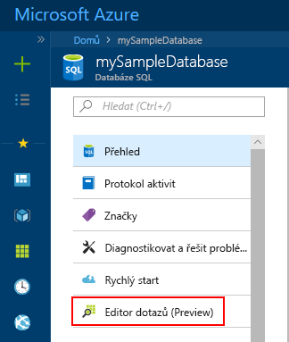
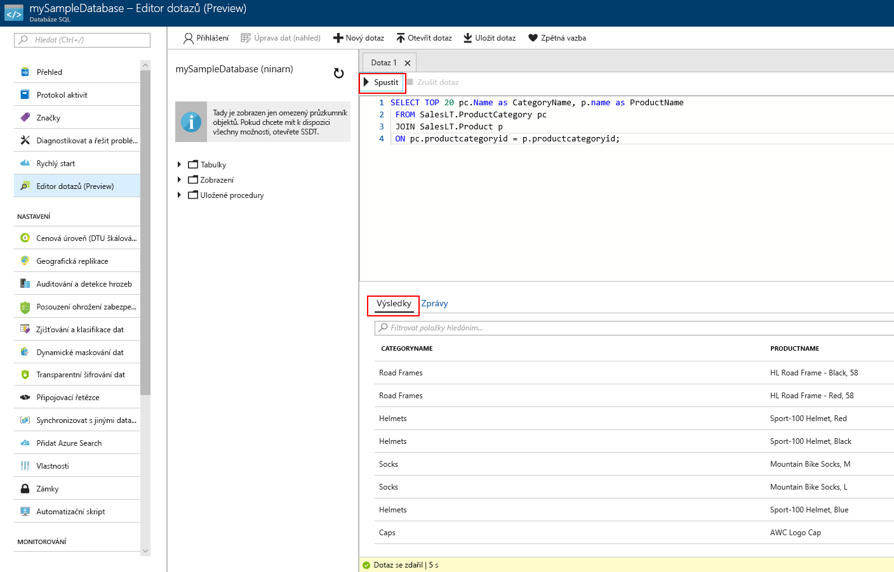

# <a name="quickstart-use-the-azure-portals-sql-query-editor-to-connect-and-query-data"></a>Rychlý start: Připojení a dotazování dat pomocí editoru dotazů SQL webu Azure portal

Editor dotazů SQL je nástroj Prohlížeč Azure portal poskytuje snadný způsob, jak spouštět dotazy SQL v Azure SQL Database nebo Azure SQL Data Warehouse. Tento rychlý start ukazuje použití editoru dotazů k připojení k SQL database a spusťte příkazy Transact-SQL k dotazování, vkládání, aktualizaci a odstraňování dat.

## <a name="prerequisites"></a>Požadavky

Pro absolvování tohoto kurzu potřebujete:

[!INCLUDE [prerequisites-create-db](../../includes/sql-database-connect-query-prerequisites-create-db-includes.md)]

> [!NOTE]
> Ujistěte se, že **povolit přístup ke službám Azure** je možnost nastavená na **ON** v nastavení brány firewall SQL serveru. Tato možnost poskytuje přístup k editoru dotazů SQL k datovým skladům a databázím.

## <a name="sign-in-the-azure-portal"></a>Přihlaste se na webu Azure portal

Přihlaste se k webu [Azure Portal](https://portal.azure.com/).

## <a name="connect-using-sql-authentication"></a>Připojení pomocí ověřování SQL

1. Vyberte **databází SQL** z nabídky na levé straně a pak vyberte **mySampleDatabase**.

2. V nabídce vlevo najděte a vyberte **editor dotazů (preview)**. **Přihlášení** se zobrazí stránka.

    

3. Z **typ autorizace** rozevírací nabídky vyberte **ověřování serveru SQL Server** a zadejte ID uživatele a heslo účtu správce serveru, který se používá k vytvoření databáze.

     

4. Vyberte **OK**.


## <a name="connect-using-azure-active-directory"></a>Připojte se pomocí Azure Active Directory

Konfigurace správce Active Directory (AD) umožňuje používat jednu identitu pro přihlášení k webu Azure portal a SQL database. Podle následujících pokynů ke konfiguraci správce AD pro SQL server.

> [!NOTE]
* Jako správci AD zatím nepodporují e-mailové účty (například outlook.com, gmail.com, yahoo.com a tak dále). Nezapomeňte vybrat uživatele vytvořené nativně v Azure AD nebo Federovaná do služby Azure AD.
* Přihlášení správce Azure AD nefunguje s účty, které mají 2-factor authentication povolena.

1. Vyberte **všechny prostředky** z nabídky na levé straně a pak vyberte váš server SQL.

2. Z SQL serveru **nastavení** nabídce vyberte možnost **správce Active Directory**.

3. Vyberte z panelu nástrojů stránky Správce AD **nastavit správce** a zvolte uživatele nebo skupiny jako správce AD.

    

4. Vyberte z panelu nástrojů stránky Správce AD **Uložit**.

5. Přejděte **mySampleDatabase** databáze a v nabídce vlevo vyberte **editor dotazů (preview)**. **Přihlášení** se zobrazí stránka. Pokud jste správce AD, potom na pravé straně v části **služby Active Directory jednotného přihlašování**, zobrazí se zpráva s informacemi o tom jste se přihlásili. 
   
6. Vyberte **OK**.


## <a name="view-data"></a>Zobrazení dat

1. Poté, co je ověřen, vložte následující příkaz SQL v editoru dotazů pro získání nejlepších 20 produktů podle kategorie.

   ```sql
    SELECT TOP 20 pc.Name as CategoryName, p.name as ProductName
    FROM SalesLT.ProductCategory pc
    JOIN SalesLT.Product p
    ON pc.productcategoryid = p.productcategoryid;
   ```

2. Na panelu nástrojů vyberte **spustit** a pak zkontrolujte výstup v **výsledky** podokně.



## <a name="insert-data"></a>Vložení dat

Pomocí následujících [vložit](https://msdn.microsoft.com/library/ms174335.aspx) příkazu Transact-SQL pro přidání nového produktu v `SalesLT.Product` tabulky.

1. Nahraďte předchozí dotaz s touto položkou.

   ```sql
   INSERT INTO [SalesLT].[Product]
           ( [Name]
           , [ProductNumber]
           , [Color]
           , [ProductCategoryID]
           , [StandardCost]
           , [ListPrice]
           , [SellStartDate]
           )
     VALUES
           ('myNewProduct'
           ,123456789
           ,'NewColor'
           ,1
           ,100
           ,100
           ,GETDATE() );
   ```


2. Vyberte **spustit** vložit nový řádek v tabulce Product. **Zprávy** podokně se zobrazí **dotaz: ovlivněných řádků: 1**.


## <a name="update-data"></a>Aktualizace dat

Pomocí následujících [aktualizace](https://msdn.microsoft.com/library/ms177523.aspx) příkazu Transact-SQL k úpravě nového produktu.

1. Nahraďte předchozí dotaz s touto položkou.

   ```sql
   UPDATE [SalesLT].[Product]
   SET [ListPrice] = 125
   WHERE Name = 'myNewProduct';
   ```

2. Vyberte **spustit** k aktualizujte zadaný řádek v tabulce Product. **Zprávy** podokně se zobrazí **dotaz: ovlivněných řádků: 1**.

## <a name="delete-data"></a>Odstranění dat

Pomocí následujících [odstranit](https://msdn.microsoft.com/library/ms189835.aspx) příkazu jazyka Transact-SQL k odstranění nového produktu.

1. Nahraďte předchozí dotaz s touto položkou:

   ```sql
   DELETE FROM [SalesLT].[Product]
   WHERE Name = 'myNewProduct';
   ```

2. Vyberte **spustit** odstranit zadaný řádek v tabulce Product. **Zprávy** podokně se zobrazí **dotaz: ovlivněných řádků: 1**.


## <a name="query-editor-considerations"></a>Požadavky editoru dotazů

Existuje několik věcí, které při práci s editorem dotazů.

* Editor dotazů k dotazování databáze systému SQL server nelze použít ve virtuální síti.

* Stisknutím klávesy F5 aktualizuje stránku editoru dotazů a dojde ke ztrátě všech dotazů se pracuje.

* Editor dotazů nepodporuje připojení k hlavní databázi.

* Časový limit 5 minut pro provádění dotazů není k dispozici.

* Editor dotazů podporuje pouze válcové geografických datových typů.

* Není dostupná podpora technologie IntelliSense pro databázové tabulky a zobrazení. Editor ale podporuje automatické dokončování v názvy, které jste už zadali.


## <a name="next-steps"></a>Další postup

Další informace o jazyku Transact-SQL podporované v Azure SQL Database najdete v tématu [rozdíly řešení příkazů jazyka Transact-SQL během migrace do služby SQL Database](sql-database-transact-sql-information.md).
