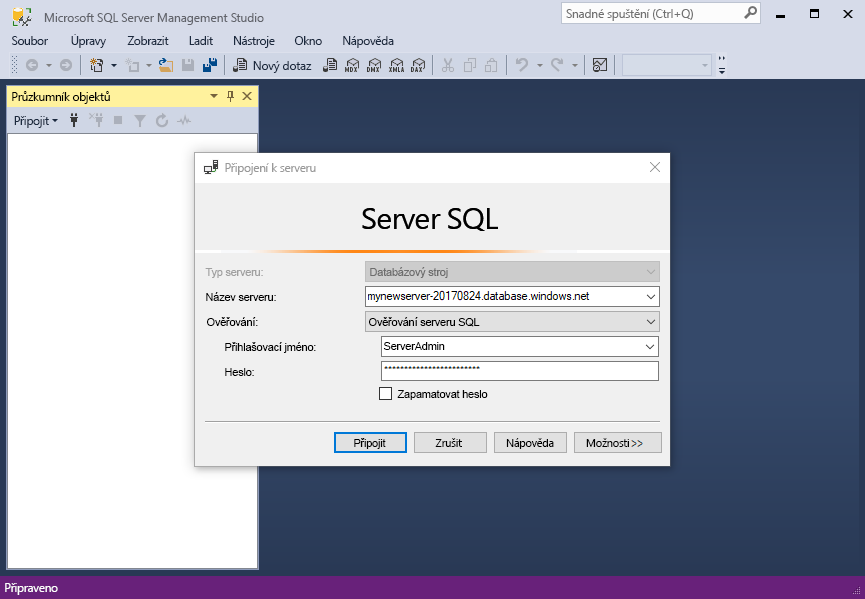
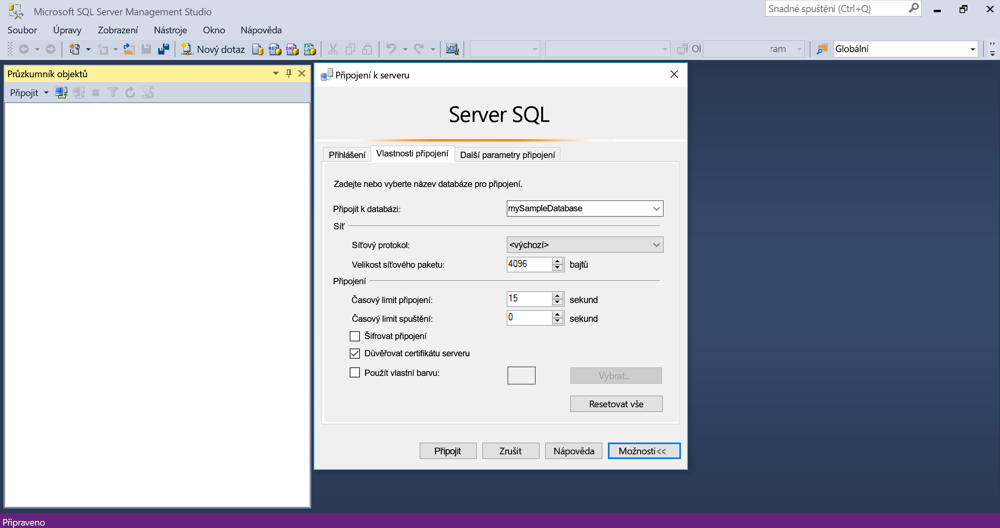
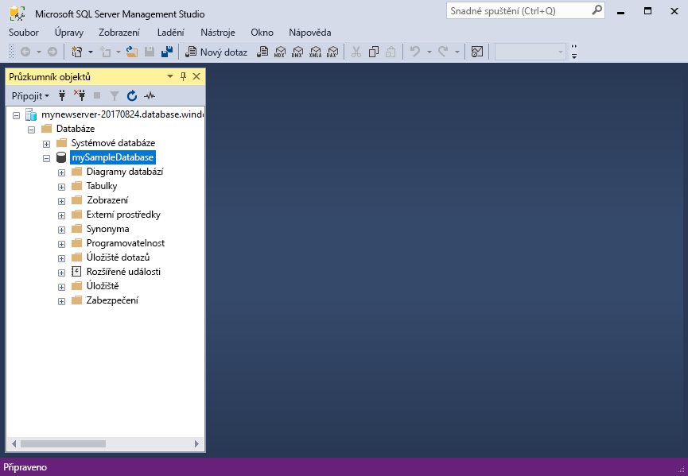

# <a name="quickstart-use-sql-server-management-studio-to-connect-and-query-an-azure-sql-database"></a>Rychlý start: Pomocí SQL Server Management Studio k připojení a dotazování Azure SQL database

V tomto rychlém startu použijete [SQL Server Management Studio] [ ssms-install-latest-84g] (SSMS) pro připojení k databázi Azure SQL. Potom spustíte příkazy jazyka Transact-SQL k dotazování, vkládání, aktualizace a odstranění dat. Použití SSMS pro správu jakékoliv infrastruktury SQL z SQL serveru do služby SQL Database pro Microsoft Windows.  

## <a name="prerequisites"></a>Požadavky

Pro absolvování tohoto kurzu potřebujete:

[!INCLUDE [prerequisites-create-db](../../includes/sql-database-connect-query-prerequisites-create-db-includes.md)]

* Pravidlo nakonfigurované brány firewall na úrovni serveru. Další informace najdete v tématu [vytvořit pravidlo brány firewall na úrovni serveru](sql-database-get-started-portal-firewall.md).

## <a name="install-the-latest-ssms"></a>Instalace nejnovější verze aplikace SSMS

Než začnete, ujistěte se, že jste nainstalovali nejnovější [SSMS][ssms-install-latest-84g]. 

## <a name="sql-server-connection-information"></a>Informace o připojení k SQL serveru

[!INCLUDE [prerequisites-server-connection-info](../../includes/sql-database-connect-query-prerequisites-server-connection-info-includes.md)]

## <a name="connect-to-your-database"></a>Připojení k databázi

V SMSS připojení k vašemu serveru Azure SQL Database. 

> [!IMPORTANT]
> Server Azure SQL Database naslouchá na portu 1433. Pro připojení k serveru služby SQL Database za podniková brána firewall, brána firewall musí mít tento port otevřít.
>

1. Otevřete aplikaci SSMS. Zobrazí se dialogové okno **Připojení k serveru**.

2. Zadejte následující informace:

   | Nastavení      | Navrhovaná hodnota    | Popis | 
   | ------------ | ------------------ | ----------- | 
   | **Typ serveru** | Databázový stroj | Povinná hodnota. |
   | **Název serveru** | Plně kvalifikovaný název serveru | Podobný: **mynewserver20170313.database.windows.net**. |
   | **Ověřování** | Ověřování SQL Serveru | Tento kurz používá ověřování SQL. |
   | **Přihlášení** | ID uživatele účtu správce serveru | ID uživatele z účtu správce serveru, který se používá k vytvoření serveru. |
   | **Heslo** | Heslo účtu správce serveru | Heslo účtu správce serveru, který se používá k vytvoření serveru. |
   ||||

     

3. Vyberte **možnosti** v **připojit k serveru** dialogové okno. V **připojit k databázi** rozevírací nabídky vyberte **mySampleDatabase**.

     

4. Vyberte **Connect** (Připojit). Otevře se okno Průzkumníka objektů. 

5. Chcete-li zobrazit objekty databáze, rozbalte **databází** a potom rozbalte **mySampleDatabase**.

     

## <a name="query-data"></a>Dotazování dat

To [vyberte](https://msdn.microsoft.com/library/ms189499.aspx) kód Transact-SQL k dotazu na top 20 produktů podle kategorie.

1. V Průzkumníku objektů klikněte pravým tlačítkem na **mySampleDatabase** a vyberte **nový dotaz**. Otevře se nové okno dotazu připojené k vaší databázi.

2. V okně dotazu vložte tento dotaz SQL.

   ```sql
   SELECT pc.Name as CategoryName, p.name as ProductName
   FROM [SalesLT].[ProductCategory] pc
   JOIN [SalesLT].[Product] p
   ON pc.productcategoryid = p.productcategoryid;
   ```

3. Na panelu nástrojů vyberte **Execute** načítat data z `Product` a `ProductCategory` tabulky.

    

## <a name="insert-data"></a>Vložení dat

To [vložit](https://msdn.microsoft.com/library/ms174335.aspx) kód jazyka Transact-SQL k vytvoření nového produktu v `SalesLT.Product` tabulky.

1. Nahraďte předchozí dotaz s touto položkou.

   ```sql
   INSERT INTO [SalesLT].[Product]
           ( [Name]
           , [ProductNumber]
           , [Color]
           , [ProductCategoryID]
           , [StandardCost]
           , [ListPrice]
           , [SellStartDate] )
     VALUES
           ('myNewProduct'
           ,123456789
           ,'NewColor'
           ,1
           ,100
           ,100
           ,GETDATE() );
   ```

2. Vyberte **Execute** vložte nový řádek v `Product` tabulky. **Zprávy** podokně se zobrazí **(1 řádek vliv)**.

## <a name="view-the-result"></a>Zobrazení výsledku

1. Nahraďte předchozí dotaz s touto položkou.

   ```sql
   SELECT * FROM [SalesLT].[Product] 
   WHERE Name='myNewProduct' 

2. Select **Execute**. The following result appears. 

   

 
## Update data

Run this [UPDATE](https://msdn.microsoft.com/library/ms177523.aspx) Transact-SQL code to modify your new product.

1. Replace the previous query with this one.

   ```sql
   UPDATE [SalesLT].[Product]
   SET [ListPrice] = 125
   WHERE Name = 'myNewProduct';
   ```

2. Vyberte **Execute** aktualizujte zadaný řádek v `Product` tabulky. **Zprávy** podokně se zobrazí **(1 řádek vliv)**.

## <a name="delete-data"></a>Odstranění dat

To [odstranit](https://msdn.microsoft.com/library/ms189835.aspx) kód Transact-SQL k odstranění nového produktu.

1. Nahraďte předchozí dotaz s touto položkou.

   ```sql
   DELETE FROM [SalesLT].[Product]
   WHERE Name = 'myNewProduct';
   ```

2. Vyberte **Execute** odstraňte zadaný řádek v `Product` tabulky. **Zprávy** podokně se zobrazí **(1 řádek vliv)**.

## <a name="next-steps"></a>Další postup

- Informace o SSMS najdete v tématu [SQL Server Management Studio](https://msdn.microsoft.com/library/ms174173.aspx).
- Informace o připojení a dotazování pomocí webu Azure Portal najdete v tématu[Připojení a dotazování pomocí editoru dotazů SQL webu Azure Portal](sql-database-connect-query-portal.md).
- Informace o připojení a dotazování pomocí Visual Studio Code najdete v tématu [Připojení a dotazování pomocí Visual Studio Code](sql-database-connect-query-vscode.md).
- Informace o připojení a dotazování pomocí .NET najdete v tématu [Připojení a dotazování pomocí .NET](sql-database-connect-query-dotnet.md).
- Informace o připojení a dotazování pomocí PHP najdete v tématu [Připojení a dotazování pomocí PHP](sql-database-connect-query-php.md).
- Informace o připojení a dotazování pomocí Node.js najdete v tématu [Připojení a dotazování pomocí Node.js](sql-database-connect-query-nodejs.md).
- Informace o připojení a dotazování pomocí Javy najdete v tématu [Připojení a dotazování pomocí Javy](sql-database-connect-query-java.md).
- Informace o připojení a dotazování pomocí Pythonu najdete v tématu [Připojení a dotazování pomocí Pythonu](sql-database-connect-query-python.md).
- Informace o připojení a dotazování pomocí Ruby najdete v tématu [Připojení a dotazování pomocí Ruby](sql-database-connect-query-ruby.md).


<!-- Article link references. -->

[ssms-install-latest-84g]: https://docs.microsoft.com/sql/ssms/sql-server-management-studio-ssms

