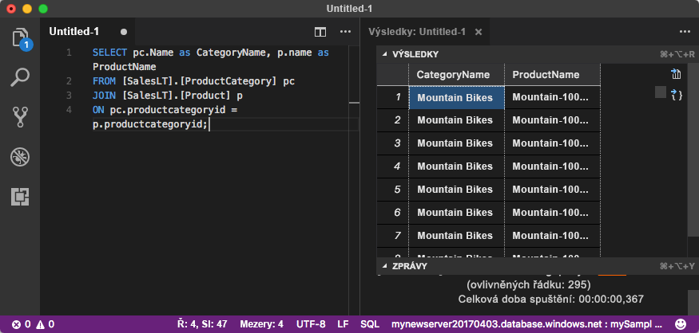

# <a name="quickstart-use-visual-studio-code-to-connect-and-query-an-azure-sql-database"></a>Rychlý start: Použití Visual Studio Code k připojení a dotazování Azure SQL Database

[Visual Studio Code](https://code.visualstudio.com/docs) je grafický editor kódu pro Linux, macOS a Windows. Podporuje rozšíření, včetně [rozšíření mssql](https://aka.ms/mssql-marketplace) pro dotazování Microsoft SQL Server, Azure SQL Database a SQL Data Warehouse. V tomto rychlém startu použijete Visual Studio Code k připojení k databázi Azure SQL a pak spusťte příkazy Transact-SQL k dotazování, vkládání, aktualizaci a odstraňování dat.

## <a name="prerequisites"></a>Požadavky

Pro absolvování tohoto kurzu potřebujete:

[!INCLUDE [prerequisites-create-db](../../includes/sql-database-connect-query-prerequisites-create-db-includes.md)]

#### <a name="install-visual-studio-code"></a>Nainstalovat editor Visual Studio Code

Ujistěte se, že máte nainstalovanou nejnovější verzi [Visual Studio Code](https://code.visualstudio.com/Download) a načtou [rozšíření mssql](https://aka.ms/mssql-marketplace). Pokyny k instalaci rozšíření mssql najdete v tématu [instalaci nástroje VS Code](https://docs.microsoft.com/sql/linux/sql-server-linux-develop-use-vscode#install-and-start-visual-studio-code) a [mssql pro Visual Studio Code ](https://marketplace.visualstudio.com/items?itemName=ms-mssql.mssql).

## <a name="configure-visual-studio-code"></a>Konfigurace sady Visual Studio Code 

### <a name="mac-os"></a>**Mac OS**
Pro macOS musíte nainstalovat OpenSSL, což je předpoklad pro.Net Core rozšíření mssql používá. Otevřete terminál a zadejte následující příkazy, abyste nainstalovali **brew** a **OpenSSL**. 

```bash
ruby -e "$(curl -fsSL https://raw.githubusercontent.com/Homebrew/install/master/install)"
brew update
brew install openssl
mkdir -p /usr/local/lib
ln -s /usr/local/opt/openssl/lib/libcrypto.1.0.0.dylib /usr/local/lib/
ln -s /usr/local/opt/openssl/lib/libssl.1.0.0.dylib /usr/local/lib/
```

### <a name="linux-ubuntu"></a>**Linux (Ubuntu)**

Není potřeba žádná zvláštní konfigurace.

### <a name="windows"></a>**Windows**

Není potřeba žádná zvláštní konfigurace.

## <a name="sql-server-connection-information"></a>Informace o připojení k SQL serveru

[!INCLUDE [prerequisites-server-connection-info](../../includes/sql-database-connect-query-prerequisites-server-connection-info-includes.md)]

## <a name="set-language-mode-to-sql"></a>Nastavení jazykového režimu na SQL

Ve Visual Studio Code, nastavte jazykový režim **SQL** k povolili příkazy mssql a technologii IntelliSense jazyka T-SQL.

1. Otevřete nové okno nástroje Visual Studio Code. 

2. Stisknutím klávesy **Ctrl**+**N**. Otevře se nový soubor ve formátu prostého textu. 

3. Vyberte **prostý Text** v pravém dolním rohu stavového řádku.

4. V **vybrat režim jazyka** rozevírací nabídky, která se otevře, vyberte **SQL**. 

## <a name="connect-to-your-database"></a>Připojení k databázi

Pomocí nástroje Visual Studio Code navažte připojení k serveru služby Azure SQL Database.

> [!IMPORTANT]
> Než budete pokračovat, ujistěte se, že máte serveru a informace, které jsou připravené na přihlašovací. Jakmile začnete zadávat informace o profilu připojení, je-li změnit váš výběr z Visual Studio Code, budete muset restartovat vytváření profilu.
>

1. Ve Visual Studio Code, stiskněte klávesu **Ctrl + Shift + P** (nebo **F1**) otevřete paletu příkazů.

2. Vyberte **MS SQL: připojit** a zvolte **Enter**.

3. Vyberte **vytvoření profilu připojení**.

4. Postupujte podle výzev a zadejte vlastnosti připojení pro nový profil. Po zadání všech hodnot, zvolte **Enter** pokračujte. 

   | Vlastnost       | Navrhovaná hodnota | Popis |
   | ------------ | ------------------ | ------------------------------------------------- | 
   | **Název serveru** | Plně kvalifikovaný název serveru | Podobný: **mynewserver20170313.database.windows.net**. |
   | **Název databáze** | mySampleDatabase | Pro připojení k databázi. |
   | **Ověřování** | Přihlášení k SQL serveru| Tento kurz používá ověřování SQL. |
   | **Uživatelské jméno** | Uživatelské jméno | Uživatelské jméno účtu správce serveru, který se používá k vytvoření serveru. |
   | **Heslo (Přihlášení SQL)** | Heslo | Heslo účtu správce serveru, který se používá k vytvoření serveru. |
   | **Uložit heslo?** | Ano nebo Ne | Vyberte **Ano** Pokud nechcete pokaždé zadávat heslo. |
   | **Zadejte název pro tento profil.** | Název profilu, jako například **mySampleProfile** | Uloženého profilu, zrychlíte připojování k dalším přihlašovacím profilům. | 

   Pokud je úspěšná, zobrazí se upozornění oznámením o vytvoření a připojení profilu.

## <a name="query-data"></a>Dotazování dat

Spusťte následující příkaz [vyberte](https://msdn.microsoft.com/library/ms189499.aspx) příkazu jazyka Transact-SQL k dotazu na top 20 produktů podle kategorie.

1. V okně editoru vložte následující dotaz SQL.

   ```sql
   SELECT pc.Name as CategoryName, p.name as ProductName
   FROM [SalesLT].[ProductCategory] pc
   JOIN [SalesLT].[Product] p
   ON pc.productcategoryid = p.productcategoryid;
   ```

2. Stisknutím klávesy **Ctrl**+**Shift**+**E** spustit dotaz a zobrazit výsledky z `Product` a `ProductCategory` tabulky.

    

## <a name="insert-data"></a>Vložení dat

Spusťte následující příkaz [vložit](https://msdn.microsoft.com/library/ms174335.aspx) příkazu Transact-SQL pro přidání nového produktu do `SalesLT.Product` tabulky.

1. Nahraďte předchozí dotaz s touto položkou.

   ```sql
   INSERT INTO [SalesLT].[Product]
           ( [Name]
           , [ProductNumber]
           , [Color]
           , [ProductCategoryID]
           , [StandardCost]
           , [ListPrice]
           , [SellStartDate]
           )
     VALUES
           ('myNewProduct'
           ,123456789
           ,'NewColor'
           ,1
           ,100
           ,100
           ,GETDATE() );
   ```

2. Stisknutím klávesy **Ctrl**+**Shift**+**E** vložte nový řádek v `Product` tabulky.

## <a name="update-data"></a>Aktualizace dat

Spusťte následující příkaz [aktualizovat](https://msdn.microsoft.com/library/ms177523.aspx) příkazů jazyka Transact-SQL. doje k aktualizaci přidaný produkt.

1. Nahraďte předchozí dotaz s touto položkou:

   ```sql
   UPDATE [SalesLT].[Product]
   SET [ListPrice] = 125
   WHERE Name = 'myNewProduct';
   ```

2. Stisknutím klávesy **Ctrl**+**Shift**+**E** aktualizujte zadaný řádek v `Product` tabulky.

## <a name="delete-data"></a>Odstranění dat

Spusťte následující příkaz [odstranit](https://docs.microsoft.com/sql/t-sql/statements/delete-transact-sql) příkazu jazyka Transact-SQL k odstranění nového produktu.

1. Nahraďte předchozí dotaz s touto položkou:

   ```sql
   DELETE FROM [SalesLT].[Product]
   WHERE Name = 'myNewProduct';
   ```

2. Stisknutím klávesy **Ctrl**+**Shift**+**E** odstraňte zadaný řádek v `Product` tabulky.

## <a name="next-steps"></a>Další postup

- Připojení a dotazování pomocí aplikace SQL Server Management Studio najdete v tématu [rychlý start: Připojení k Azure SQL Database a dotazování dat pomocí SQL Server Management Studio](sql-database-connect-query-ssms.md).
- Připojení a dotazování pomocí webu Azure portal najdete v tématu [rychlý start: Použití editoru dotazů SQL webu Azure Portal k připojení a dotazování dat](sql-database-connect-query-portal.md).
- Článek z časopisu MSDN o použití editoru Visual Studio Code najdete v blogovém příspěvku [Vytvoření databáze IDE s rozšířením MSSQL](https://msdn.microsoft.com/magazine/mt809115).
