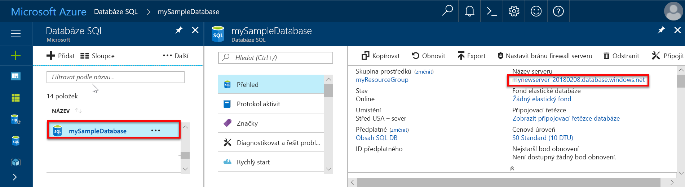

# Rychlý start: Vytvoření pravidla brány firewall na úrovni serveru pro databázi SQL na webu Azure Portal

V tomto rychlém startu se dozvíte, jak vytvořit pravidlo brány firewall na úrovni serveru pro databázi Azure SQL, abyste se k ní mohli připojit z místního prostředku.

## Požadavky

V tomto rychlém startu vyjdete z prostředků vytvořených v tomto rychlém startu: [Vytvoření Azure SQL Database na webu Azure Portal](sql-database-get-started-portal.md).

## Přihlášení k portálu Azure Portal

Přihlaste se k webu [Azure Portal](https://portal.azure.com/).

## Vytvoření pravidla brány firewall na úrovni serveru

Služba SQL Database vytvoří bránu firewall na úrovni serveru, která brání aplikacím a nástrojům, aby se připojily k serveru nebo k některé jeho databázi, pokud není vytvořené pravidlo brány firewall, které firewall otevře. Pokud se chcete připojit z IP adresy mimo Azure, vytvořte pravidlo brány firewall pro určitou IP adresu nebo rozsah adres. Postupujte podle těchto kroků a vytvořte [pravidlo brány firewall na úrovni serveru služby SQL Database](sql-database-firewall-configure.md) pro vaši IP adresu klienta a umožněte externí připojení přes bránu firewall služby SQL Database pouze pro vaši IP adresu.

> [!NOTE]
> SQL Database komunikuje přes port 1433. Pokud se pokoušíte připojit z podnikové sítě, nemusí být odchozí provoz přes port 1433 bránou firewall vaší sítě povolený. Pokud je to tak, nebudete se moct připojit k serveru Azure SQL Database, dokud vaše IT oddělení neotevře port 1433.
>

1. Po dokončení nasazení klikněte na **Databáze SQL** z nabídky na levé straně a klikněte na **mySampleDatabase** na stránce **Databáze SQL**. Otevře se stránka s přehledem pro vaši databázi, na které se zobrazí plně kvalifikovaný název serveru (například **mynewserver-20170824.database.windows.net**) a možnosti pro další konfiguraci.

2. Zkopírujte tento plně kvalifikovaný název serveru, abyste ho mohli použít pro připojení k serveru a jeho databázím v následujících rychlých startech.

   

3. Klikněte na **Nastavit bránu firewall serveru** na panelu nástrojů, jak je vidět na předchozím obrázku. Otevře se stránka **Nastavení brány firewall** pro server služby SQL Database.

   

4. Klikněte na **Přidat IP adresu klienta** na panelu nástrojů a přidejte svoji aktuální IP adresu do nového pravidla brány firewall. Pravidlo brány firewall může otevřít port 1433 pro jednu IP adresu nebo rozsah IP adres.

5. Klikněte na **Uložit**. Vytvoří se pravidlo brány firewall na úrovni serveru pro vaši aktuální IP adresu, které otevře port 1433 na logickém serveru.

6. Klikněte na **OK** a pak zavřete stránku **Nastavení brány firewall**.

Nyní se můžete z této IP adresy připojit k serveru SQL Database a jeho databázím pomocí aplikace SQL Server Management Studio nebo jiného nástroje podle vašeho výběru použitím účtu správce serveru vytvořeného dříve.

> [!IMPORTANT]
> Standardně je přístup přes bránu firewall služby SQL Database povolený pro všechny služby Azure. Kliknutím na **OFF** na této stránce provedete zákaz pro všechny služby Azure.
>

## Vyčištění prostředků

Uložte tyto prostředky, pokud chcete přejít na [Další kroky](#next-steps) a seznámit se s několika způsoby, jak se připojit k databázi a dotazovat ji. Pokud však chcete prostředky vytvořené v rámci tohoto rychlého startu odstranit, použijte následující postup.

1. Na webu Azure Portal v nabídce vlevo klikněte na **Skupiny prostředků** a pak na **myResourceGroup**.
2. Na stránce skupiny prostředků klikněte na **Odstranit**, do textového pole zadejte **myResourceGroup** a pak klikněte na **Odstranit**.

## Další kroky

- Když máte databázi, můžete se k ní [připojit a vytvářet dotazy](sql-database-connect-query.md) v některém z oblíbených nástrojů nebo jazyků, například:
  - [Připojení a dotazování pomocí SQL Server Management Studia](sql-database-connect-query-ssms.md)
  - [Připojení a dotazování pomocí Azure Data Studia](https://docs.microsoft.com/sql/azure-data-studio/quickstart-sql-database?toc=/azure/sql-database/toc.json)
- Informace o návrhu první databáze, vytváření tabulek a vkládání dat najdete v následujících kurzech:
 - [Návrh první databáze SQL Azure pomocí SSMS](sql-database-design-first-database.md)
 - [Návrh databáze SQL Azure SQL database a její připojení pomocí C# a ADO.NET](sql-database-design-first-database-csharp.md)
