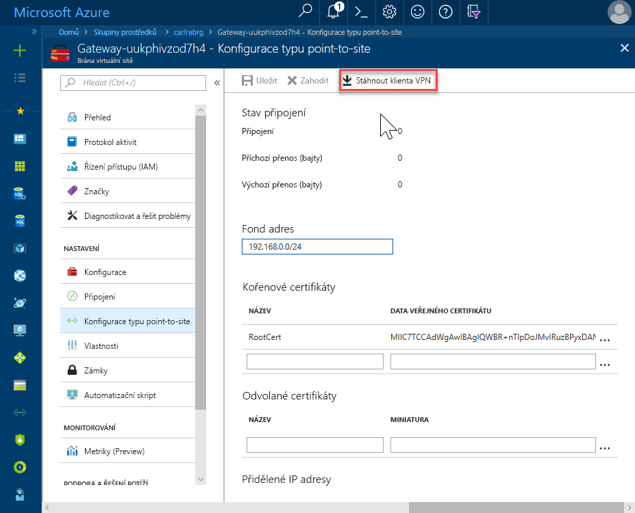
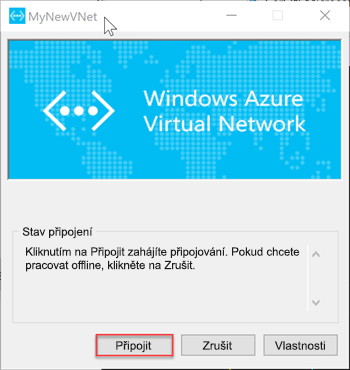

# <a name="configure-a-point-to-site-connection-to-an-azure-sql-database-managed-instance-from-on-premises"></a>Konfigurace připojení typu point-to-site k Azure SQL Database Managed Instance z místní

Tento rychlý start ukazuje, jak se připojit k Azure SQL Database Managed Instance pomocí [SQL Server Management Studio](https://docs.microsoft.com/sql/ssms/sql-server-management-studio-ssms) (SSMS) z místních klientských počítačů prostřednictvím připojení point-to-site. Informace o připojení point-to-site najdete v tématu [o Point-to-Site VPN](../vpn-gateway/point-to-site-about.md)

## <a name="prerequisites"></a>Požadavky

Tento rychlý start:

- Používá jako výchozí bod prostředky vytvořené v tomto rychlém startu: [Vytvoření spravované instance](sql-database-managed-instance-get-started.md).
- Vyžaduje prostředí PowerShell 5.1 a prostředí Azure PowerShell 5.4.2 nebo vyšší v místním klientském počítači.
- Vyžaduje nejnovější verzi [SQL Server Management Studio](https://docs.microsoft.com/sql/ssms/sql-server-management-studio-ssms) (SSMS) na místním klientském počítači

## <a name="attach-a-vpn-gateway-to-your-managed-instance-virtual-network"></a>Připojit bránu VPN k virtuální síti spravované Instance

1. Otevřete prostředí Powershell v klientském počítači místní.
2. Zkopírujte a vložte tento skript Powershellu. Tento skript připojí bránu sítě VPN do virtuální sítě Managed Instance, které jste vytvořili [vytvoříte Managed Instance](sql-database-managed-instance-get-started.md) rychlý start. Tento skript provede následující tři kroky:

   - Vytvoří a instalace certifikátů v klientském počítači
   - Vypočítá budoucí rozsah IP podsítě brány sítě VPN
   - Vytvoří podsítě GatewaySubnet
   - Nasazení šablony Azure Resource Manageru, který se připojí k podsíti VPN brány sítě VPN

     ```powershell
     $scriptUrlBase = 'https://raw.githubusercontent.com/Microsoft/sql-server-samples/master/samples/manage/azure-sql-db-managed-instance/attach-vpn-gateway'

     $parameters = @{
       subscriptionId = '<subscriptionId>'
       resourceGroupName = '<resourceGroupName>'
       virtualNetworkName = '<virtualNetworkName>'
       certificateNamePrefix  = '<certificateNamePrefix>'
       }

     Invoke-Command -ScriptBlock ([Scriptblock]::Create((iwr ($scriptUrlBase+'/attachVPNGateway.ps1?t='+ [DateTime]::Now.Ticks)).Content)) -ArgumentList $parameters, $scriptUrlBase
     ```

3. Zadejte požadované parametry v skriptu prostředí PowerShell. Hodnoty pro `<subscriptionId>`, `<resourceGroup>` a `<virtualNetworkName>` by měl odpovídat těch, které se používají v [vytvoření Managed Instance](sql-database-managed-instance-get-started.md) rychlý start. Hodnota pro `<certificateNamePrefix>` může jednat o řetězec podle vašeho výběru.

4. Spusťte skript prostředí PowerShell.

## <a name="create-a-vpn-connection-to-your-managed-instance"></a>Vytvoření připojení VPN k Managed Instance

1. Přihlaste se k webu [Azure Portal](https://portal.azure.com/).
2. Otevřete skupinu prostředků, ve které jste vytvořili bránu virtuální sítě a pak otevřete prostředku brány virtuální sítě.

      

3. Klikněte na tlačítko **KonfiguracePoint-to-site** a potom klikněte na tlačítko **stáhnout klienta VPN**.

      
4. Extrahujte soubory ze souboru zip a otevřete extrahovanou složku.
5. Přejděte do složky WindowsAmd64 a otevřít **VpnClientSetupAmd64.exe** souboru.
6. Pokud se zobrazí **Windows chráněný počítač** zprávy, klikněte na tlačítko **informace** a potom klikněte na **přesto spustit**.

    \
7. Klikněte na tlačítko **Ano** v dialogovém okně Řízení uživatelských účtů, aby bylo možné pokračovat.
8. V dialogovém okně MyNewVNet klikněte na tlačítko **Ano** instalace klienta Vpn pro MyNewVNet.

## <a name="connect-to-the-vpn-connection"></a>Připojte se k připojení k síti VPN

1. Přejděte na připojení k síti VPN v klientském počítači a klikněte na tlačítko **MyNewVNet** k navázání připojení k této virtuální síti.

      
2. Klikněte na **Připojit**.
3. V dialogovém okně MyNewVNet klikněte na tlačítko **připojit**.

      
4. Po zobrazení výzvy tohoto správce připojení potřebám zvýšená oprávnění k aktualizaci směrovací tabulku, klikněte na tlačítko **pokračovat**.
5. Klikněte na tlačítko **Ano** v dialogovém okně Řízení uživatelských účtů, aby bylo možné pokračovat.

      

   Vytvořené připojení VPN k virtuální síti spravované Instance.

## <a name="use-ssms-to-connect-to-the-managed-instance"></a>Použití SSMS k připojení k Managed Instance

1. V místním klientském počítači otevřete SQL Server Management Studio (SSMS).
2. V **připojit k serveru** dialogového okna zadejte plně kvalifikovaný **název hostitele** pro Managed Instance v **název serveru** vyberte **systému SQL Server Ověřování**, zadejte přihlašovací jméno a heslo a potom klikněte na tlačítko **připojit**.

      

Po připojení můžete zobrazit systémové a uživatelské databáze v uzlu Databáze a různé objekty v uzlech Zabezpečení, Objekty serveru, Replikace, Správa, Agent SQL Serveru a Profiler XEvent.

## <a name="next-steps"></a>Další postup

- Rychlý start ukazuje, jak připojit z virtuálního počítače Azure, najdete v článku [konfigurace připojení typu point-to-site](sql-database-managed-instance-configure-p2s.md)
- Přehled možností připojení aplikací najdete v článku o [připojení aplikací ke spravované instanci](sql-database-managed-instance-connect-app.md).
- Pokud chcete obnovit stávající databázi SQL Serveru z místní do spravované instance, můžete k migraci použít [službu Azure Database Migration Service (DMS)](../dms/tutorial-sql-server-to-managed-instance.md) a obnovit zálohu databáze nebo můžete k obnovení zálohy databáze použít [příkaz T-SQL RESTORE](sql-database-managed-instance-get-started-restore.md).
