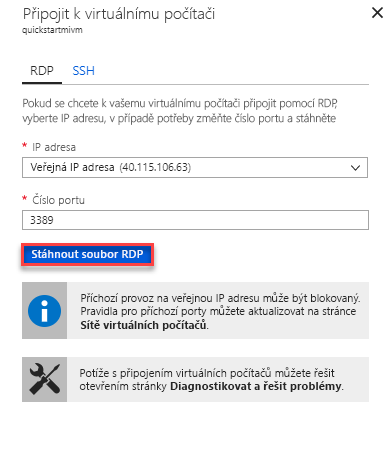

# Rychlý start: Konfigurace virtuálního počítače Azure pro připojení k Azure SQL Database Managed Instance

Tento rychlý start ukazuje, jak nakonfigurovat virtuální počítač Azure pro připojení k Azure SQL Database Managed Instance pomocí SQL Server Management Studio (SSMS). Rychlý start ukazuje, jak připojit z místních klientských počítačů pomocí připojení point-to-site, najdete v článku [konfigurace připojení typu point-to-site](sql-database-managed-instance-configure-p2s.md) 

## Požadavky

Tento rychlý start používá prostředky vytvořené v rámci [vytvoříte Managed Instance](sql-database-managed-instance-get-started.md) jako výchozí bod.

## Přihlášení k webu Azure Portal

Přihlaste se k webu [Azure Portal](https://portal.azure.com/).

## Vytvořit novou podsíť ve virtuální síti spravované Instance

Následujícím postupem se vytvoří novou podsíť ve virtuální síti spravované Instance tak, že virtuální počítač Azure se můžete připojit k Managed Instance. Podsíť Managed Instance je vyhrazen pro Managed instance. Všechny další prostředky, jako jsou virtuální počítače Azure, nemůžete vytvořit v této podsíti. 

1. Otevřete skupinu prostředků pro Managed Instance, které jste vytvořili [vytvoříte Managed Instance](sql-database-managed-instance-get-started.md) rychlý start. Výběr virtuální sítě pro Managed Instance.

   

2. Vyberte **podsítě** a pak vyberte **+ podsíť** k vytvoření nové podsítě.

   

3. Vyplňte formulář, použijte informace uvedené v této tabulce:

   | Nastavení| Navrhovaná hodnota | Popis |
   | ---------------- | ----------------- | ----------- | 
   | **Název** | Libovolné platné jméno|Platné názvy najdete v tématu [Pravidla a omezení pojmenování](https://docs.microsoft.com/azure/architecture/best-practices/naming-conventions).|
   | **Rozsah adres (blok CIDR)** | Platný rozsah | Výchozí hodnota je vhodný pro tento rychlý start.|
   | **Skupina zabezpečení sítě** | Žádný | Výchozí hodnota je vhodný pro tento rychlý start.|
   | **Směrovací tabulka** | Žádný | Výchozí hodnota je vhodný pro tento rychlý start.|
   | **Koncové body služby** | Vybraná 0 | Výchozí hodnota je vhodný pro tento rychlý start.|
   | **Delegování podsítě** | Žádný | Výchozí hodnota je vhodný pro tento rychlý start.|
 
   

4. Vyberte **OK** vytvořte tato další podsíť ve virtuální síti spravované Instance.

## Vytvoření virtuálního počítače v nové podsíti ve virtuální síti

Následující kroky ukazují, jak vytvořit virtuální počítač v nové podsíti se připojit k Managed Instance. 

## Příprava virtuálních počítačů Azure

Protože spravované Instance SQL je umístěn v privátní virtuální síť, musíte vytvořit virtuální počítač Azure nainstalovaný nástroj klienta SQL, jako je SQL Server Management Studio nebo Azure Data Studio. Tento nástroj umožňuje připojit k Managed Instance a spouštění dotazů. Tento rychlý start využívá SQL Server Management Studio.

Nejjednodušší způsob, jak vytvořit virtuální počítač klienta se všechny potřebné nástroje, je použití šablon Azure Resource Manageru.

1. Ujistěte se, že jste přihlášení k webu Azure portal na nové kartě prohlížeče. Přejděte na následující tlačítko a vytvoření virtuálního počítače klienta a nainstalujte SQL Server Management Studio:

    

2. Vyplňte formulář pomocí informací v následující tabulce:

   | Nastavení| Navrhovaná hodnota | Popis |
   | ---------------- | ----------------- | ----------- |
   | **Předplatné** | Platné předplatné | Musí být předplatné, ve kterém máte oprávnění k vytvoření nových prostředků. |
   | **Skupina prostředků** |Skupiny prostředků, kterou jste zadali v [vytvoření Managed Instance](sql-database-managed-instance-get-started.md) rychlý start.|Tato skupina prostředků musí být ten, ve kterém virtuální síť existuje.|
   | **Umístění** | Umístění pro skupinu prostředků | Tato hodnota se vyplní na základě vybrané skupiny prostředků. | 
   | **Název virtuálního počítače**  | Libovolné platné jméno | Platné názvy najdete v tématu [Pravidla a omezení pojmenování](https://docs.microsoft.com/azure/architecture/best-practices/naming-conventions).|
   |**Uživatelské jméno správce**|Libovolné platné uživatelské jméno|Platné názvy najdete v tématu [Pravidla a omezení pojmenování](https://docs.microsoft.com/azure/architecture/best-practices/naming-conventions). Nepoužívejte "serveradmin", protože to je vyhrazené serverové role. Použít toto uživatelské jméno je vždycky [připojit k virtuálnímu počítači](#connect-to-virtual-machine).| 
   |**Heslo**|Libovolné platné heslo|Heslo musí obsahovat nejméně 12 znaků a musí splňovat [zadané požadavky na složitost](../virtual-machines/windows/faq.md#what-are-the-password-requirements-when-creating-a-vm). Toto heslo se používá pokaždé, když jste [připojit k virtuálnímu počítači](#connect-to-virtual-machine).|
   | **Velikost virtuálního počítače** | Libovolné platné velikosti | Výchozí hodnota v této šabloně z **Standard_B2s** stačí pro účely tohoto rychlého startu. |
   | **Umístění**|[resourceGroup () .location].| Tato hodnota se nezmění. |
   | **Název virtuální sítě**|Umístění, které jste vybrali dříve|Informace o oblastech najdete v tématu [Oblasti služeb Azure](https://azure.microsoft.com/regions/).|
   | **Název podsítě**|Název podsítě, kterou jste vytvořili v předchozím postupu| Neklikejte podsíť, ve které jste vytvořili spravovanou instanci.|
   | **artefakty umístění** | [.properties.templateLink.uri nasazení ()] | Tato hodnota se nezmění. |
   | **token Sas umístění artefaktů** | Ponechte prázdné | Tato hodnota se nezmění. |

   

   Pokud jste použili navrhované název virtuální sítě a podsítě výchozí v [vytvoření Managed Instance](sql-database-managed-instance-get-started.md), nemusíte změnit poslední dva parametry. V opačném případě byste měli změnit tyto hodnoty na hodnoty, které jste zadali při nastavování síťového prostředí.

3. Vyberte **vyjadřuji souhlas s podmínkami a ujednáními uvedenými nahoře** zaškrtávací políčko.
4. Vyberte **nákupní** k nasazení virtuálních počítačů Azure ve vaší síti.
5. Vyberte **oznámení** ikonu k zobrazení stavu nasazení.

Nechcete pokračovat, dokud se vytvoří virtuální počítač Azure. 

## Připojení k virtuálnímu počítači

Následující kroky ukazují, jak se k nově vytvořenému virtuálnímu počítači připojit pomocí připojení ke vzdálené ploše.

1. Po dokončení nasazení přejděte k prostředku virtuálního počítače.

      

2. Vyberte **Connect** (Připojit). 
   
   S veřejnou IP adresu a port pro virtuální počítač se zobrazí formulář Remote Desktop Protocol soubor (RDP). 

     

3. Vyberte **stáhnout soubor RDP**.
 
   > [!NOTE]
   > SSH můžete také použít pro připojení k vašemu virtuálnímu počítači.

4. Zavřít **připojit k virtuálnímu počítači** formuláře.
5. Chcete-li se připojit k virtuálnímu počítači, otevřete stažený soubor protokolu RDP. 
6. Po zobrazení výzvy vyberte **připojit**. Na počítači Mac budete potřebovat klienta protokolu RDP, jako je například tento [Klient vzdálené plochy](https://itunes.apple.com/us/app/microsoft-remote-desktop/id715768417?mt=12) na Mac App Storu.

6. Zadejte uživatelské jméno a heslo, které jste zadali při vytváření virtuálního počítače a pak zvolte **OK**.

7. Při přihlášení se může zobrazit upozornění na certifikát. Zvolte **Ano** nebo **pokračovat** pokračujte s připojením.

Jste připojeni k virtuálnímu počítači v řídicím panelu Správce serveru.

## Použití SSMS k připojení k Managed Instance

1. Ve virtuálním počítači otevřete SQL Server Management Studio (SSMS).
 
   Trvá několik okamžiků otevřít, protože je potřeba dokončit konfiguraci, protože se jedná o první čas spuštění aplikace SSMS.
2. V **připojit k serveru** dialogového okna zadejte plně kvalifikovaný **název hostitele** pro Managed Instance v **název serveru** pole. Vyberte **ověřování systému SQL Server**, zadejte své uživatelské jméno a heslo a pak vyberte **připojit**.

      

Po připojení můžete zobrazit systémové a uživatelské databáze v uzlu Databáze a různé objekty v uzlech Zabezpečení, Objekty serveru, Replikace, Správa, Agent SQL Serveru a Profiler XEvent.

## Další postup

- Rychlý start ukazuje, jak připojit z místních klientských počítačů pomocí připojení point-to-site, najdete v části [konfigurace připojení typu point-to-site](sql-database-managed-instance-configure-p2s.md).
- Přehled možností připojení aplikací najdete v článku o [připojení aplikací ke spravované instanci](sql-database-managed-instance-connect-app.md).
- Obnovit existující databáze SQL serveru v místním do Managed instance, můžete použít [Azure Database Migration Service (DMS) pro migraci](../dms/tutorial-sql-server-to-managed-instance.md) nebo [příkaz T-SQL RESTORE](sql-database-managed-instance-get-started-restore.md) obnovit z záložní soubor databáze.
