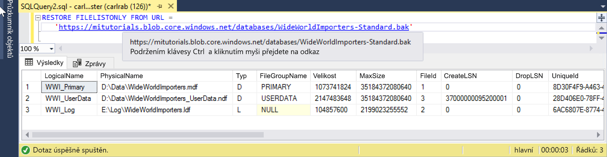

# <a name="quickstart-restore-a-database-backup-to-an-azure-sql-database-managed-instance"></a>Rychlý start: Obnovení zálohy databáze do spravované instance Azure SQL Database

V tomto rychlém startu se dozvíte, jak obnovit zálohu databáze uloženou v Azure Blob Storage do spravované instance pomocí zálohy Wide World Importers – Standard. Tato metoda s sebou nese nutný výpadek. 

> [!VIDEO https://www.youtube.com/embed/RxWYojo_Y3Q]

Kurz migrace pomocí Azure Database Migration Service (DMS) najdete v tématu věnovaném [migraci Managed Instance pomocí DMS](../dms/tutorial-sql-server-to-managed-instance.md). Diskuzi o různých metodách migrace najdete v tématu [Migrace instance SQL Serveru do Azure SQL Database Managed Instance](sql-database-managed-instance-migrate.md).

## <a name="prerequisites"></a>Požadavky

Tento rychlý start:
- Používá jako výchozí bod prostředky vytvořené v tomto rychlém startu: [Vytvoření spravované instance](sql-database-managed-instance-get-started.md).
- Vyžaduje nejnovější verzi [SQL Server Management Studia](https://docs.microsoft.com/sql/ssms/sql-server-management-studio-ssms) na místním klientském počítači.
- Vyžaduje připojení ke spravované instanci pomocí SQL Server Management Studia. Možnosti připojení najdete v těchto rychlých startech:
  - [Připojení ke spravované instanci Azure SQL Database z virtuálního počítače Azure](sql-database-managed-instance-configure-vm.md)
  - [Připojení ke spravované instanci Azure SQL Database z místního prostředí pomocí připojení Point-to-Site](sql-database-managed-instance-configure-p2s.md).
- Používá předkonfigurovaný účet Azure Blob Storage obsahující záložní soubor Wide World Importers – Standard (stažený z https://github.com/Microsoft/sql-server-samples/releases/download/wide-world-importers-v1.0/WideWorldImporters-Standard.bak).

> [!NOTE]
> Další informace o zálohování a obnovení databáze SQL Serveru pomocí služby Azure Blob Storage a sdíleného přístupového podpisu (SAS) najdete v článku o [zálohování SQL Serveru na adresu URL](sql-database-managed-instance-get-started-restore.md).

## <a name="restore-the-wide-world-importers-database-from-a-backup-file"></a>Obnovení databáze Wide World Importers ze zálohy

Pomocí aplikace SSMS podle následujících kroků obnovte ze zálohy databázi Wide World Importers do své Managed Instance.

1. Otevřete SQL Server Management Studio (SSMS) a připojte se ke spravované instanci.
2. V aplikaci SSMS otevřete nové okno dotazu.
3. Pomocí následujícího skriptu ve spravované instanci vytvořte přihlašovací údaje s využitím předkonfigurovaného účtu úložiště a klíče SAS.

   ```sql
   CREATE CREDENTIAL [https://mitutorials.blob.core.windows.net/databases] 
   WITH IDENTITY = 'SHARED ACCESS SIGNATURE'
   , SECRET = 'sv=2017-11-09&ss=bfqt&srt=sco&sp=rwdlacup&se=2028-09-06T02:52:55Z&st=2018-09-04T18:52:55Z&spr=https&sig=WOTiM%2FS4GVF%2FEEs9DGQR9Im0W%2BwndxW2CQ7%2B5fHd7Is%3D' 
   ```

    

    > [!NOTE]
    > Vždy odstraňte **?** ze začátku vygenerovaného klíče SAS.
  
3. Pomocí následující skriptu zkontrolujte platnost přihlašovacích údajů SAS a zálohy – zadejte adresu URL kontejneru se zálohou:

   ```sql
   RESTORE FILELISTONLY FROM URL = 
      'https://mitutorials.blob.core.windows.net/databases/WideWorldImporters-Standard.bak'
   ```

    

4. Pomocí následujícího skriptu obnovte ze zálohy databázi Wide World Importers – zadejte adresu URL kontejneru se zálohou:

   ```sql
   RESTORE DATABASE [Wide World Importers] FROM URL =
     'https://mitutorials.blob.core.windows.net/databases/WideWorldImporters-Standard.bak'
   ```

    

5. Pokud chcete sledovat stav obnovení, spusťte v nové relaci dotazu následující dotaz:

   ```sql
   SELECT session_id as SPID, command, a.text AS Query, start_time, percent_complete
      , dateadd(second,estimated_completion_time/1000, getdate()) as estimated_completion_time 
   FROM sys.dm_exec_requests r 
   CROSS APPLY sys.dm_exec_sql_text(r.sql_handle) a 
   WHERE r.command in ('BACKUP DATABASE','RESTORE DATABASE')`
   ```

6. Po dokončení obnovení zobrazte databázi v Průzkumníku objektů. 

## <a name="next-steps"></a>Další kroky

- Řešení potíží se zálohování na adresu URL najdete v [osvědčených postupech a řešení potíží se zálohováním SQL Serveru na adresu URL](https://docs.microsoft.com/sql/relational-databases/backup-restore/sql-server-backup-to-url-best-practices-and-troubleshooting).
- Přehled možností připojení pro aplikace najdete v článku o [připojení aplikací ke spravované instanci](sql-database-managed-instance-connect-app.md).
- Informace o dotazování pomocí některého z vašich oblíbených nástrojů nebo jazyků najdete v článku o [připojení a dotazování](sql-database-connect-query.md).
