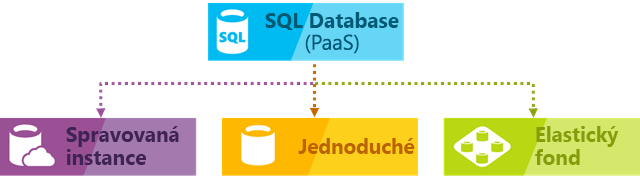

# Volba cloudového řešení systému SQL Server: Azure SQL (PaaS) Database nebo SQL Server na virtuálních počítačích Azure (IaaS)

V Azure, můžete mít svoje úlohy systému SQL Server běží v prostředí infrastruktury (IaaS) nebo jako hostované služby ([PaaS](https://azure.microsoft.com/overview/what-is-paas/)):

- [Azure SQL Database](https://azure.microsoft.com/services/sql-database/): databázový stroj A SQL, podle Enterprise edici systému SQL Server, který je optimalizovaný pro vývoj moderních aplikací. Azure SQL Database nabízí několik možností nasazení:
  - Můžete nasadit pro izolované databáze [logický server](sql-database-logical-servers.md).
  - Můžete nasadit do [elastického fondu](sql-database-elastic-pool.md) na [logický server](sql-database-logical-servers.md) ke sdílení prostředků a snížení nákladů. 
  - Můžete nasadit [Azure SQL Database Managed instance](sql-database-managed-instance.md). 
      
   Následující obrázek ukazuje tyto možnosti nasazení:

      

     > [!NOTE]
     > Azure SQL Database pomocí všech třech verzích, přidá další funkce, které nejsou k dispozici v systému SQL Server, jako jsou integrované inteligentní funkce a správa. Logický server obsahující databáze ve fondu a jeden nabízí většinu funkcí s rozsahem databáze systému SQL Server. S Azure SQL Database Managed Instance Azure SQL Database nabízí sdílené prostředky pro databáze a další funkce s oborem instance. Azure SQL Database Managed Instance podporuje migraci databáze s minimálními změn databáze. 

- [SQL Server na virtuálních počítačích Azure](https://azure.microsoft.com/services/virtual-machines/sql-server/): SQL Server nainstalovaný a hostovaný v cloudu systému Windows Server nebo Linux na virtuálních počítačích (VM) běžících v Azure, označované také jako infrastruktura jako služba (IaaS). SQL Server na virtuálních počítačích Azure je vhodný pro migraci místních databází SQL serveru a aplikace bez jakékoli změny databáze. Všechny nejnovější verze a edice systému SQL Server jsou dostupná k instalaci na virtuálním počítači IaaS. Nejdůležitější rozdíl mezi SQL Database je, že virtuální počítače SQL serveru umožňují plnou kontrolu nad databázovým strojem. Můžete zvolit při údržby nebo oprav se spustí, chcete-li změnit model obnovení simple nebo hromadně protokolované povolit rychlejší načítání méně protokolu, pozastavit nebo spustit modul, pokud je nepotřebujete, a můžete plně přizpůsobit databázovém stroji SQL serveru. Pro tento další ovládací prvek obsahuje přidané odpovědnost ke správě virtuálních počítačů.

Zjistěte, jak jednotlivé možnosti nasazení zapadají do datové platformy Microsoftu a získejte pomoc se spárováním té správné volby s požadavky vaší společnosti. Ať už je pro vás určující úspora nákladů nebo minimální režie z hlediska správy (které pro vás mají vyšší prioritu než cokoli jiného), tento článek vám může pomoci rozhodnout, jaký přístup přinese vaší firmě nejlepší výsledky z hlediska požadavků, na jejichž splnění vám nejvíc záleží.

## Datová platforma společnosti Microsoft SQL

Jednou z nejdůležitějších věcí, které je potřeba chápat, pokud se porovnávají výhody databází na Azure oproti využívání místních databází SQL Serveru, je to, že použitelné jsou všechny z nich. Datová platforma společnosti Microsoft využívá technologii SQL Serveru a zpřístupňuje ji napříč fyzickými místními počítači, prostředími privátního cloudu, prostředími privátního cloudu hostovanými třetí stranou a veřejným cloudem. SQL Server na virtuálních počítačích Azure vám umožňuje vyhovět jedinečným a rozmanitým potřebám firmy díky kombinaci místního nasazení a nasazení hostovaného v cloudu pomocí stejné sady serverových produktů, vývojových nástrojů a odborných znalosti v těchto prostředích.

   

Jak je vidět v diagramu, každou nabídku je možné charakterizovat úrovní správy, kterou nad infrastrukturou máte (na ose X), a stupněm nákladové efektivity dosahovaným konsolidací úrovně databáze a automatizace (na ose Y).

Při navrhování aplikace jsou pro hostování součásti aplikace s SQL Serverem k dispozici čtyři základní možnosti:

* SQL Server na nevirtualizovaných fyzických počítačích
* SQL Server v místních virtualizovaných počítačích (privátní cloud)
* SQL Server na virtuálním počítači Azure (veřejný cloud Microsoftu)
* Azure SQL Database (veřejný cloud Microsoftu)

V následujících oddílech se dozvíte o systému SQL Server ve veřejném cloudu Microsoftu: Azure SQL Database a SQL Server na virtuálních počítačích Azure. Kromě toho prozkoumáte obvyklé motivační faktory firem pro určení toho, která možnost je pro konkrétní aplikaci nejvhodnější.

## Bližší pohled na Azure SQL Database a SQL Server na virtuálních počítačích Azure

**Azure SQL Database** je relační databáze jako služba (DBaaS) hostovaná v cloudu Azure, která spadá do oborové kategorie *Platform-as-a-Service (PaaS)*. [SQL Database](sql-database-technical-overview.md) je postavená na standardizovaném hardwaru a softwaru, který vlastní, hostuje a spravuje Microsoft. SQL Database můžete použít integrované funkce, které vyžadují rozsáhlé konfiguraci v systému SQL Server. Při použití SQL Database platíte průběžnými platbami s možností vertikálního nebo horizontálního navyšování kapacity pro dosažení vyššího výkonu bez přerušení. Azure SQL Database je ideální prostředí pro vývoj nové aplikace v cloudu. A s [Azure SQL Database Managed Instance](sql-database-managed-instance.md), které můžete používání vlastní licence. Kromě toho tato možnost poskytuje všechny výhody PaaS služby Azure SQL Database, ale přidá funkce, které byly dříve k dispozici pouze ve virtuálních počítačích SQL. To zahrnuje nativní virtuální síť (VNet) a téměř 100 % kompatibilitu s místním SQL serverem. [Spravovaná Instance](sql-database-managed-instance.md) je ideální k místní databázi migrace do Azure s minimálními změnami vyžaduje. 

**SQL Server na virtuálních počítačích Azure** spadá do oborové kategorie *IaaS* a umožňuje vám spustit SQL Server uvnitř virtuálního počítače v cloudu. [Virtuální počítače s SQL serverem](../virtual-machines/windows/sql/virtual-machines-windows-sql-server-iaas-overview.md) spustit také na standardizovaném hardwaru, který je ve vlastnictví, hostován a spravován společností Microsoft. Při použití SQL serveru na virtuálním počítači, můžete platit – stejně jako průběžně k licenci systému SQL Server obsaženou v imagi systému SQL Server nebo jednoduše použít stávající licenci. Můžete také zastavit nebo obnovit virtuální počítač podle potřeby.

Obecně jsou tyto dvě možnosti SQL optimalizovány pro různé účely:

* **Azure SQL Database** je optimalizována pro snížení celkové náklady na správu na minimum pro zřizování a správu velkého počtu databází. Snižuje náklady na průběžnou správu, protože nemusíte spravovat žádné virtuální počítače, operační systémy nebo databázový software. Není nutné spravovat upgrady, vysokou dostupnost nebo [zálohy](sql-database-automated-backups.md). Obecně platí, že Azure SQL Database může výrazně zvýšit počet databází, které spravuje jeden IT nebo vývojářský zdroj. [Elastické fondy](sql-database-elastic-pool.md) také podporu architektury víceklientské aplikace SaaS s funkcí, včetně izolaci klientů a schopnost škálování snížit náklady na sdílení prostředků mezi databázemi. [Azure SQL Database Managed Instance](sql-database-managed-instance.md) poskytuje podporu pro funkce s oborem instance umožňuje snadnou migraci stávajících aplikací, jakož i sdílení prostředků mezi databázemi.
* **SQL Server běžící na virtuálních počítačích Azure** je optimalizovaný pro migraci stávajících aplikací do Azure nebo rozšíření stávajících místních aplikací do cloudu v hybridních nasazeních. Kromě toho lze systém SQL Server na virtuálním počítači použít k vývoji a testování tradičních aplikací systému SQL Server. V případě používání SQL Serveru na virtuálních počítačích Azure máte úplná práva pro správu pro vyhrazenou instanci SQL Serveru a cloudové virtuální počítače. Je ideální volbou v případě, že organizace už má dostupné IT zdroje pro údržbu virtuálních počítačů. Tyto schopnosti umožňují sestavit vysoce přizpůsobený systém pro plnění specifických požadavků vaší aplikace na výkon a dostupnost.

Následující tabulka shrnuje hlavní vlastnosti SQL Database a SQL Serveru na virtuálních počítačích Azure:

| | Azure SQL Database Logické servery, elastické fondy a izolované databáze | Azure SQL Database MI |Virtuální počítače Azure SQL Server |
| --- | --- | --- |---|
| **Nejvhodnější pro:** |Nové aplikace navržené pro cloud, které chcete použít nejnovější stabilní systému SQL Server funkce andhave časová omezení z hlediska vývoje a marketingu. | Nové aplikace nebo stávající místní aplikace, které chcete použít nejnovější stabilní funkcí systému SQL Server a že se migrují do cloudu s minimálními změnami.  | Existující aplikace, které vyžadují rychlou migraci do cloudu s minimálními změnami nebo žádné změny. Scénáře rychlého vývoje a testování, když si nechcete koupit hardware pro místní neprodukční SQL Server. |
|  | Týmy, které potřebují integrovanou vysokou dostupnost, možnost zotavení po havárii a možnost upgradu databáze. | Stejné jako databáze SQL. | Týmy, které můžete nakonfigurovat, správně vyladit, přizpůsobení a správa vysoké dostupnosti, zotavení po havárii a opravy pro SQL Server. Některé poskytované automatizované funkce to značně zjednodušují. | |
|  | Týmy, které nechtějí spravovat příslušný operační systém a nastavení konfigurace. | Stejné jako databáze SQL. | Budete potřebovat přizpůsobené prostředí s úplnými právy. | |
|  | Databáze o velikosti až 100 TB. | Stejné jako databáze SQL. | Instance systému SQL Server s úložištěm o velikosti až 64 TB. Instance může podporovat tolik databází, kolik je potřeba. |
| **Kompatibilita** | Podporuje většinu místních funkcí úrovni databáze. | Podporuje téměř všechny místní funkce na úrovni instance a databáze. | Podporuje všechny místních funkcí. |
| **Zdroje a prostředky:** | Nechcete využívat prostředky IT ke konfiguraci a správě základní infrastruktury, ale chcete se soustředit na aplikační vrstvu. | Stejné jako databáze SQL. | Máte některé prostředky IT ke konfiguraci a správě. Některé poskytované automatizované funkce to značně zjednodušují. |
| **Celkové náklady na vlastnictví:** | Eliminuje náklady na hardware a snižuje náklady na správu. | Stejné jako databáze SQL. | Eliminuje náklady na hardware. |
| **Kontinuita podnikových procesů:** |Kromě [funkcí infrastruktury s předdefinovanou odolnost proti chybám](sql-database-high-availability.md), Azure SQL Database nabízí funkce, jako například [automatické zálohování](sql-database-automated-backups.md), [v daném okamžiku obnovení](sql-database-recovery-using-backups.md#point-in-time-restore), [geografické obnovení](sql-database-recovery-using-backups.md#geo-restore), a [převzetí služeb při selhání skupiny a aktivní geografickou replikaci](sql-database-geo-replication-overview.md) pro zvýšení kontinuity. Další informace najdete v tématu [Databáze SQL – kontinuita podnikových procesů (přehled)](sql-database-business-continuity.md). | Stejné jako databáze SQL, jen rozšířené o uživatelem iniciované, pouze kopie zálohy jsou k dispozici. | SQL Server na virtuálních počítačích Azure umožňuje nastavit vysoce dostupné řešení s možností zotavení po havárii pro konkrétní potřeby vaší databáze. Můžete tak mít systém, který je vysoce optimalizovaný pro vaši aplikaci. Sami podle potřeby můžete otestovat a spustit převzetí služeb při selhání. Další informace najdete v tématu [Vysoká dostupnost a zotavení po havárii pro SQL Server v Azure Virtual Machines](../virtual-machines/windows/sql/virtual-machines-windows-sql-high-availability-dr.md). |
| **Hybridní cloud:** |Vaše místní aplikace mohou přistupovat k datům v Azure SQL Database. | [Implementace nativní virtuální sítě](https://docs.microsoft.com/azure/sql-database/sql-database-managed-instance-vnet-configuration) a připojení k vaší místní prostředí pomocí Azure Express Route nebo VPN Gateway. | V případě SQL Serveru na virtuálních počítačích Azure můžete mít aplikace, které běží částečně v cloudu a částečně místně. Můžete si například rozšířit místní síť a služby Active Directory Domain do cloudu přes [Azure Virtual Network](../virtual-network/virtual-networks-overview.md). Kromě toho můžete uložit místní datové soubory v úložišti Azure pomocí [datových souborů SQL Serveru v Azure](http://msdn.microsoft.com/library/dn385720.aspx). Další informace najdete v tématu [Úvod do hybridního cloudu SQL Serveru 2014](http://msdn.microsoft.com/library/dn606154.aspx). |
|  | Podporuje [transakční replikaci systému SQL Server](https://msdn.microsoft.com/library/mt589530.aspx) jako předplatitel k replikaci dat. | Replikace není podporována pro Azure SQL Database Managed Instance. | Plně podporuje [transakční replikaci systému SQL Server](https://msdn.microsoft.com/library/mt589530.aspx), [skupin dostupnosti Always On](../virtual-machines/windows/sql/virtual-machines-windows-sql-high-availability-dr.md), integrační služby a přesouvání protokolu k replikaci dat. Navíc jsou plně podporované tradiční zálohy systému SQL Server. | |
|  | | |

## Motivace firem pro zvolení Azure SQL Database nebo SQL Serveru na virtuálních počítačích Azure
### Náklady
Ať už jste začínající společnost, která nemá mnoho peněz, nebo tým v zavedené společnosti, který pracuje s limitovaným rozpočtem, je omezená výše prostředků často primárním rozhodujícím faktorem při volbě řešení pro hostování firemních databází. V tomto oddílu zjistíte základní informace o fakturaci a licencování v Azure s ohledem na tyto dvě možnosti relačních databází: SQL Database a SQL Server na virtuálních počítačích Azure. Zjistíte také, jak vypočítat celkové náklady na aplikaci.

#### Základy fakturace a licencování

V současné době **SQL Database** se prodává jako služba a je k dispozici na několika úrovních služby s různými cenami pro prostředky, které se účtují po hodinách s pevnou sazbou na základě úrovně služeb a velikost výpočetního zvolíte. S SQL Database Managed Instance můžete také přinést vlastní licenci. Další informace o používání vlastní licence (BYOL) najdete v tématu [Mobilita licencí v rámci programu Software Assurance na Azure](https://azure.microsoft.com/pricing/license-mobility/). Kromě toho se vám účtuje odchozí přenos přes internet podle běžných [sazeb za přenos dat](https://azure.microsoft.com/pricing/details/data-transfers/). Můžete dynamicky upravit úrovně služeb a vypočítat velikost tak, aby odpovídaly potřebám různých propustnosti vaší aplikace. Nejnovější informace o aktuálně podporovaných cenových úrovních služeb najdete v tématu [nákupní model založený na DTU](sql-database-service-tiers-dtu.md) a [nákupní model založený na virtuálních jádrech](sql-database-service-tiers-vcore.md). Můžete také vytvořit [elastické fondy](sql-database-elastic-pool.md) sdílení prostředků mezi různými instancemi databáze ke snížení nákladů a využití zohlednit špičky.

V případě **SQL Database** je databázový software konfigurován, opravován a upgradován automaticky společností Microsoft, což snižuje náklady na správu. Kromě toho vám [integrované funkce zálohování](sql-database-automated-backups.md) pomůžou dosáhnout výrazných úspor nákladů, hlavně v případě, že máte velký počet databází. 

V případě systému **SQL Server na virtuálních počítačích Azure** můžete použít jakoukoli image systému SQL Server poskytovanou platformou (která zahrnuje licenci) nebo použít svou vlastní licenci systému SQL Server. K dispozici jsou všechny podporované verze systému SQL Server (2008R2, 2012, 2014, 2016) a jeho edice (Developer, Express, Web, Standard, Enterprise). Kromě toho jsou k dispozici verze imagí modelu používání vlastní licence (BYOL). Pokud budete používat image poskytované v rámci Azure, budou provozní náklady záviset na velikosti virtuálního počítače a na edici systému SQL Server, kterou zvolíte. Bez ohledu na velikost virtuálního počítače nebo edici SQL serveru platíte za minutu licenční náklady na SQL Server a Windows nebo Linux Server spolu s náklady na úložiště Azure pro disky virtuálních počítačů. Možnost fakturace po minutách vám umožňuje používat SQL Server tak dlouho, jak budete potřebovat, bez nutnosti dokupovat další licence na SQL Server. Pokud jste do Azure přinést vlastní licenci systému SQL Server, bude vám účtována serveru a jenom náklady na úložiště. Další informace o používání vlastní licence (BYOL) najdete v tématu [Mobilita licencí v rámci programu Software Assurance na Azure](https://azure.microsoft.com/pricing/license-mobility/). Kromě toho se vám účtuje odchozí přenos přes internet podle běžných [sazeb za přenos dat](https://azure.microsoft.com/pricing/details/data-transfers/).

#### Výpočet celkových nákladů na aplikaci
Když začnete používat cloudovou platformu, zahrnuje náklady na provozování vaší aplikace náklady pro vývoj nových projektů a náklady na průběžnou správu a náklady na služby platformy veřejného cloudu.

**Při používání Azure SQL Database:**

- Vysoce minimalizované náklady na správu
- Náklady na vývoj omezené pro migrované aplikace
- Náklady na službu SQL Database
- Žádné nákupní náklady na hardware

**Při používání SQL Serveru na virtuálních počítačích Azure:**

- Vyšší náklady na správu
- Omezeno na žádné náklady na vývoj pro migrované aplikace
- Náklady na službu virtuálního počítače
- Náklady na licence systému SQL Server
- Žádné nákupní náklady na hardware

Další informace o cenách najdete v následujících zdrojích informací a materiálech:

* [SQL Database – ceny](https://azure.microsoft.com/pricing/details/sql-database/)
* [Virtual Machines – ceny](https://azure.microsoft.com/pricing/details/virtual-machines/) pro [SQL](https://azure.microsoft.com/pricing/details/virtual-machines/#sql) a [Windows](https://azure.microsoft.com/pricing/details/virtual-machines/#windows)
* [Cenová kalkulačka funkcí Azure](https://azure.microsoft.com/pricing/calculator/)

### Správa
Pro mnoho firem je rozhodnutí o přechodu na využívání cloudové služby nejen otázkou nízkých nákladů, ale také snížení složitosti správy. IaaS a PaaS, Microsoft spravuje základní infrastrukturu a automaticky replikuje všechna data pro zajištění zotavení po havárii, konfiguruje a upgraduje databázový software, spravuje Vyrovnávání zatížení a provádí transparentní převzetí služeb při selhání, pokud dojde Chyba serveru v rámci datového centra. 

- S **Azure SQL Database**, můžete nadále spravovat svoji databázi, ale už muset spravovat databázový stroj, operační systém serveru ani hardware.  Příklady položek, které můžete dál spravovat: databáze a přihlašovací údaje, ladění indexů nebo dotazů a auditování a zabezpečení. Kromě toho Konfigurace vysoké dostupnosti do jiného datového centra vyžaduje minimální konfiguraci a správu.
- V případě systému **SQL Server na virtuálních počítačích Azure** máte plnou kontrolu nad konfigurací operačního systému a instance systému SQL Server. V případě virtuálních počítačů je na vás, kdy se rozhodnete aktualizovat nebo upgradovat operační systém a software databáze a kdy se má nainstalovat další software, jako například antivirový program. K dispozici jsou některé automatizované funkce ke značnému zjednodušení použití dílčích oprav, zálohování a zajištění vysoké dostupnosti. Kromě toho můžete nastavovat velikost virtuálního počítače, počet disků a jejich konfigurace úložiště. Azure umožňuje měnit velikost virtuálního počítače podle potřeby. Informace najdete v tématu věnovaném [velikostem virtuálních počítačů a cloudových služeb pro Azure](../virtual-machines/windows/sizes.md). 

### Smlouvy o úrovni služeb (SLA)
Pro řadu IT oddělení je nejvyšší prioritou plnit povinnosti z hlediska garantované doby provozuschopnosti vyplývající ze Smlouvy o úrovni služeb (SLA). V této části se podíváme na to, jaká smlouva SLA se vztahuje na každou z možností hostování databáze.

Pro **SQL Database**, poskytuje Microsoft smlouvu SLA zajišťující 99,99 % dostupností. Nejnovější informace najdete v tématu věnovaném [Smlouvám o úrovni služeb (SLA)](https://azure.microsoft.com/support/legal/sla/sql-database/). 

Pro **SQL Server běžící na virtuálních počítačích Azure** poskytuje Microsoft smlouvu SLA s dostupností 99,95 %, která se vztahuje pouze na virtuální počítač. Tato smlouva SLA nepokrývá procesy (například SQL Server) běžící na virtuálním počítači a vyžaduje, abyste v rámci skupiny dostupnosti hostovali minimálně dvě instance virtuálních počítačů. Nejnovější informace najdete v tématu věnovaném smlouvám [SLA k virtuálním počítačům](https://azure.microsoft.com/support/legal/sla/virtual-machines/). Databáze vysoké dostupnosti (HA) v rámci virtuálních počítačů, musíte nakonfigurovat jednu z možností podporovaných vysokou dostupnost v systému SQL Server, jako [skupin dostupnosti Always On](https://docs.microsoft.com/sql/database-engine/availability-groups/windows/always-on-availability-groups-sql-server). Používání podporované možnosti vysoké dostupnosti neposkytuje další SLA, ale umožňuje dosáhnout více než 99.99% dostupnosti databáze.

### Čas přesunout do Azure
**Logické servery SQL Database, elastických fondů a izolované databáze** je má to pravé řešení pro cloudové aplikace, když je nejdůležitější produktivitu vývojářů a rychlou dobu uvedení na trh nová řešení. V případě programových funkcí podobných DBA jde o ideální řešení pro cloudové architekty a vývojáře, protože snižuje potřebu správy příslušného operačního systému a databáze. 

**SQL Database Managed Instance** výrazně zjednodušuje migraci stávajících aplikací do Azure SQL Database, můžete převést databázi do režimu migrované aplikace rychle uvedla na trh v Azure.

**SQL Server běžící na virtuálních počítačích Azure** je ideálním řešením, pokud vaše existující nebo nové aplikace vyžadují velké databáze nebo přístup ke všem funkcím systému SQL Server nebo Windows/Linux a chcete se vyhnout na čas a náklady na získávání nových v místním hardwaru. Je také vhodné, pokud chcete provést migraci stávajících místních aplikací a databází do Azure jako-je – v případech, kde Azure SQL Database Managed Instance není vhodné. Vzhledem k tomu, že nemusíte měnit prezentační, aplikační ani datové vrstvy, ušetříte čas a finanční prostředky z rozpočtu, které byste jinak museli vynaložit na vytvoření nové architektury existujícího řešení. Místo toho se můžete soustředit na migraci všech svých řešení do Azure a provedení některých optimalizací výkonu, která mohou být platformou Azure vyžadována. Další informace najdete v tématu [Osvědčené postupy z hlediska výkonu pro SQL Server ve službě Azure Virtual Machines](../virtual-machines/windows/sql/virtual-machines-windows-sql-performance.md).

## Další postup

* Pokud začínáte se službou SQL Database, přečtěte si téma [První Azure SQL Database](sql-database-get-started-portal.md).
* Viz [SQL Database – ceny](https://azure.microsoft.com/pricing/details/sql-database/)
* Informace o tom, jak začít s SQL Serverem na virtuálních počítačích Azure, najdete v tématu věnovaném [zřízení virtuálního počítače s SQL Serverem v Azure](../virtual-machines/windows/sql/virtual-machines-windows-portal-sql-server-provision.md).
