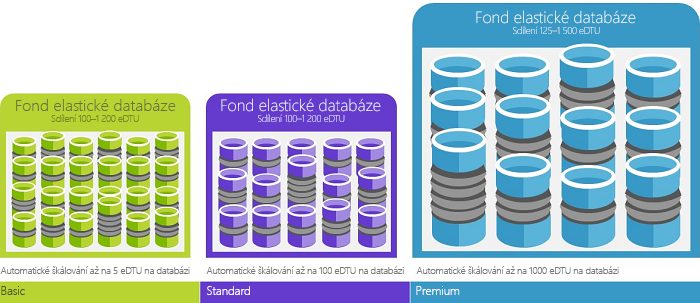

# Azure SQL Database zakoupení modely a prostředky 

Logické servery v [Azure SQL Database](sql-database-technical-overview.md) nabízí dva modely nákupu pro výpočty, úložiště a vstupně-výstupní operace prostředky: nákupní model na základě DTU a nákupní model (preview) na základě vCore. 

> [!NOTE]
> [Spravované instance](sql-database-managed-instance.md) ve službě Azure SQL Database pouze nabízejí na základě vCore nákupní model.

Následující tabulku a graf porovnání a porovnejte tyto dva modely nákupu.

> [!IMPORTANT]
> Na základě vCore nákupní model (preview), najdete v části [na základě vCore nákupní model](sql-database-service-tiers-vcore.md)

|**Nákupní model**|**Popis**|**Nejvhodnější pro**|
|---|---|---|
|Model na základě DTU|Tento model je založen na připojené měření výpočty, úložiště a vstupně-výstupní operace prostředky. Úrovně výkonu se vyjadřují v jednotkách transakcí databáze (DTU) pro samostatné databáze a jednotkách transakcí elastické databáze (eDTU) pro elastické fondy. Další informace o Dtu a Edtu najdete v tématu [co jsou Dtu a Edtu](sql-database-service-tiers.md#what-are-database-transaction-units-dtus)?|Nejvhodnější pro zákazníky, kteří chtějí možnosti jednoduchý, předem nakonfigurovaných prostředků.| 
|Model na základě virtuálních jader|Tento model můžete nezávisle škálovat výpočetní a úložnou kapacitu. Také umožňuje použít k získání úsporu nákladů Benefit hybridní Azure pro systém SQL Server.|Nejvhodnější pro zákazníky, kteří hodnota flexibilitu, řízení a průhlednost.|
||||  

## na základě vCore nákupní model (preview)

Virtuální základní představuje logický procesor nabízí s možností si vybrat mezi generací hardwaru. Nákupní model (preview) na základě vCore poskytuje flexibilitu, řízení, průhlednost spotřebu jednotlivých prostředků a snadný způsob, jak převede místní požadavků na zatížení do cloudu. Tento model umožňuje škálování výpočetní kapacity, paměť a úložiště podle jejich potřeb pracovního vytížení. V na základě vCore nákupu modelu (preview) Zákazníci můžete vybrat mezi obecné účely a obchodními úrovněmi kritické služby (preview) pro obě [jedna databáze](sql-database-single-database-scale.md) a [elastické fondy](sql-database-elastic-pool.md). 

Nákupní model (preview) na základě vCore můžete nezávisle škálovat výpočetní a úložnou kapacitu, odpovídající místní výkonu a optimalizovat ceny. Pokud vaše databáze nebo elastického fondu spotřebovává více než 300 DTU převod na vCore může snížit vaše náklady. Můžete převést pomocí rozhraní API podle volby nebo pomocí portálu Azure, nedojde k výpadku. Převod však není požadováno. Pokud nákupní model DTU splňuje vaše požadavky na výkon a business, by měly pokračovat, jeho použití. Pokud se rozhodnete převést z modelu DTU vCore-model, měli byste vybrat úroveň výkonu pomocí následující pravidlo: každý 100 DTU ve standardní vrstvě vyžaduje minimálně 1 vCore ve vrstvě obecné účely; Každý 125 DTU v úrovni Premium vyžaduje minimálně 1 vCore v kritické obchodní vrstvy.

V na základě vCore nákupu modelu (preview) se zákazníci platit pro:
- Výpočetní (úroveň služby + číslo vCores + generování hardwaru) *
- Typ a velikost úložiště, protokolu a data 
- Počet IOs **
- Zálohování úložiště (RA-GRS) ** 

\* V původní verzi public preview, logických procesorů 4 generace jsou založené na v3 Intel E5-2673 2,4 GHz procesorů (Haswell).

\*\* Verzi Preview jsou zadarmo zálohy a IOs 7 dní.

> [!IMPORTANT]
> Výpočetní, IOs, data a budou se účtovat úložiště protokolů pro databáze nebo elastického fondu. Úložiště zálohy je účtován na každou databázi. Podrobnosti o spravovaných Instance poplatky, najdete v části [Azure SQL Database spravované Instance](sql-database-managed-instance.md).
> **Omezení oblast:** nákupu modelu (preview) na základě vCore dosud nejsou k dispozici v následujících oblastech: západní Evropa, střední Francie, Spojené království – Jih, Spojené království – západ a Austrálie – jihovýchod.

## Na základě DTU nákupní model

Jednotky propustnosti databáze (DTU) představuje kombinaci měření procesoru, paměti, čte a zapisuje. Na základě DTU nákupní model nabízí sadu předkonfigurované sady výpočetní prostředky a zahrnuty úložiště na jednotce různé úrovně výkonu aplikace. Zákazníci, kteří raději jednoduchost sady předkonfigurovaná a pevných plateb každý měsíc, možná modelu na základě DTU vhodnější pro své potřeby. V na základě DTU nákupu modelu, můžete zvolit zákazníci **základní**, **standardní**, a **Premium** úrovních služeb pro obě [jedna databáze](sql-database-single-database-scale.md) a [elastické fondy](sql-database-elastic-pool.md). 

### Jaké jsou jednotky transakcí databáze (Dtu)?
Pro jednu databázi Azure SQL na úrovni výkonu specifických v rámci [vrstvy služby](sql-database-single-database-scale.md), Microsoft zaručuje úroveň prostředky pro tuto databázi (nezávisle na jakékoli jiné databáze v cloudu Azure), poskytování předvídatelný úroveň výkonu. Objem prostředků počítá se jako počet jednotky transakcí databáze nebo Dtu a je určena připojené výpočty, úložiště a vstupně-výstupní operace prostředky. Poměr mezi tyto prostředky se původně určený [OLTP srovnávacího testu zatížení](sql-database-benchmark-overview.md), navrženou Typická reálného OLTP úloh. Pokud vaše úlohy překročí množství kterýkoli z těchto prostředků, vaše propustnost je omezenému – což pomalejší výkon a vypršení časových limitů. Prostředky používané velikosti pracovní zátěže nemají vliv na jiné databáze SQL v cloudu Azure dostupné prostředky a prostředky používané další úlohy, nemá dopad na prostředky, které jsou k dispozici k vaší databázi SQL.

Počet jednotek Dtu jsou zvláště užitečné pro pochopení relativní objem prostředků mezi databází SQL Azure na úrovních různých výkonu a úrovně služeb. Například zvýší počet jednotek Dtu zvýšením úrovně výkonu databáze rovná zvýší sadu prostředků, které jsou k dispozici pro tuto databázi. Například databáze Premium P11 se 1 750 DTU nabízí 350x více DTU výpočetního výkonu než databáze Basic s 5 DTU.  

Chcete-li získat podrobnější přehled o spotřeby prostředků (DTU) vašich úloh, použijte [Azure SQL Database Query Performance Insight](sql-database-query-performance.md) na:

- Identifikujte nejčastějších dotazů podle využití procesoru a doba trvání nebo provádění počtu, který lze ladit potenciálně pro zlepšení výkonu. Například dotaz intenzivním vstupně-výstupní operace může mít užitek z použití [techniky optimalizace v paměti](sql-database-in-memory.md) lepší využití paměti k dispozici na určité služby a výkonu úrovni.
- Přejděte na podrobné informace o dotazu, zobrazit historii využití prostředků a text.
- Výkon přístupu k ladění doporučení, které se zobrazí akce prováděné [Poradce pro funkci SQL Database](sql-database-advisor.md).

Můžete změnit [DTU úrovně služeb](sql-database-service-tiers-dtu.md) kdykoli s minimálními výpadky do vaší aplikace (obvykle průměrování než čtyři sekund). Mnoha firmám a aplikacím stačí vytváření databází a nastavování výkonu na vyžádání, zejména v případě, že jsou vzorce používání relativně předvídatelné. Ale pokud vaše vzorce používání předvídatelné nejsou, může být správa nákladů a údržba obchodního modelu velmi těžká. V tomto scénáři použijete fondu elastické databáze s počtem jednotek Edtu, jež jsou sdílena mezi více databází ve fondu.

### Jaké jsou jednotky transakcí elastické databáze (Edtu)?
Spíše než poskytují vyhrazené sadu prostředků (Dtu), které nemusí být vždy potřebné pro databázi SQL, která je vždy k dispozici, můžete umístit do databáze [elastický fond](sql-database-elastic-pool.md) na databázi SQL serveru, který sdílí fond prostředků mezi Tyto databáze. Sdílené prostředky v elastickém fondu se měří elastické jednotky transakcí databáze nebo Edtu. Elastické fondy poskytují jednoduché nákladově efektivní řešení ke správě výkonnostní cíle pro více databází s široce různých a vzorce nepředvídatelné. Fondu elastické databáze zaručuje, že prostředky nemůže být využívány službou jedna databáze ve fondu, zatímco Každá databáze ve fondu zajistíte vždy obsahuje minimální množství potřebné prostředky, které jsou k dispozici. 

Fond je uveden se stanoveným počtem jednotek Edtu pro sadu ceny. V rámci elastického fondu disponují jednotlivé databáze flexibilní možností automatického škálování v rámci nakonfigurovaných mezí. Databáze v rámci větší zatížení spotřebuje další Edtu potřeby. Databáze pod světlejší zatížení budou využívat menší Edtu. Databáze s žádné zatížení bude využívat žádné Edtu. Podle zřizování prostředků pro celý fond, místo na databázi, úlohy správy jsou zjednodušená, poskytuje předvídatelný nároky pro fond.

Další eDTU lze do existujícího fondu přidat bez jakéhokoli výpadku databáze a bez jakéhokoli vlivu na databáze ve fondu. Podobně platí, že pokud již přidané eDTU nejsou potřebné, lze je z existujícího fondu kdykoli odebrat. Můžete přidat nebo odečíst databáze ve fondu nebo limit množství Edtu databázi můžete použít v případě velkého zatížení tak, aby vyhradil Edtu pro jiné databáze. Pokud databázi je předvídatelné pod využití prostředků, můžete přesunout mimo fondu a nakonfigurovat ho jako jednu databázi s velikostí předvídatelný požadované prostředky.

### Jak lze určit počet DTU potřebných pro určitou úlohu?
Pokud máte v úmyslu migrovat existující úlohu místního počítače nebo virtuálního počítače SQL Server do Azure SQL Database, můžete k odhadnutí potřebného počtu DTU použít [Kalkulačku DTU](http://dtucalculator.azurewebsites.net/). Pro existující úlohy Azure SQL Database, můžete použít [SQL databáze Query Performance Insight](sql-database-query-performance.md) porozumět vaší spotřeby prostředků databáze (Dtu) Chcete-li získat podrobnější přehled pro optimalizaci velikosti pracovní zátěže. Můžete také [sys.dm_db_ resource_stats](https://msdn.microsoft.com/library/dn800981.aspx) DMV zobrazíte spotřeby prostředků za poslední hodinu. Alternativně zobrazení katalogu [sys.resource_stats](http://msdn.microsoft.com/library/dn269979.aspx) zobrazí spotřeby prostředků za posledních 14 dní, ale v nižší přesnost průměry pět minut.

### Jak poznám, že by pro mě používání elastického fondu prostředků bylo výhodné?
Fondy jsou vhodné pro velký počet databází s konkrétními vzory využití. Tento vzor pro danou databázi je charakterizovaná průměr nízkou míru využívání s relativně málo časté využití. SQL Database automaticky vyhodnotí historické údaje používání prostředků databází na existujícím serveru SQL Database a doporučí odpovídající konfigurace fondu na webu Azure Portal. Další informace najdete v tématu [Kdy je vhodné používat elastický fond?](sql-database-elastic-pool.md)

### Co se stane, když dosáhnu Moje maximální Dtu?
Úrovně výkonu jsou kalibrován a řídí zajistit prostředky potřebné ke spuštění úlohy databáze až do maximální povolený pro vaše úroveň vrstvy a výkonu vybrané službě. Pokud vaše úlohy je stiskne jedním z omezení procesoru/Data vstupně-výstupní operace nebo protokolu vstupně-výstupní operace, nadále budete dostávat maximální úroveň prostředků, které jsou povolené, ale také pravděpodobně si všimnete latence vyšší dotazu. Tyto limity nevedou k žádným chybám, ale mohou zpomalit zpracování úlohy, pokud se zpomalení nezvýší natolik, že začne docházet k vypršení časového limitu dotazů. Pokud dostanete relací/žádosti maximální povolené souběžných uživatelů (pracovních vláken), zobrazí se explicitní chyby. V tématu [limitů prostředků Azure SQL Database]( sql-database-resource-limits.md#what-happens-when-database-resource-limits-are-reached) informace o limitů prostředků, které nesouvisí s Procesorem, pamětí, vstupně-výstupní operace dat nebo transakcí protokolu vstupně-výstupní operace.

### Korelace srovnávacího testu výsledky skutečných výkon databáze
Je důležité si uvědomit, že všechny srovnávacích testů jsou pouze reprezentativní a naznačuje výslednou. Sazby transakce dosáhnout s aplikací srovnávacího testu nesmí být stejné jako ty, které může dosáhnout s jinými aplikacemi. Testu výkonnosti se skládá z kolekce jinou transakci, které typy spouštění schéma obsahující rozsah tabulky a datové typy. Během testu výkonnosti využije stejné základní operace, které jsou společné pro všechny úlohy OLTP, nepředstavuje žádné konkrétní třídě databáze nebo aplikace. Cílem srovnávacího testu je zajistit přiměřené Průvodce relativní výkon databáze, která může být očekávána při škálování nahoru nebo dolů mezi úrovněmi výkonu. Ve skutečnosti databáze jsou různé velikosti a složitost, dojde k jiné mix úloh a bude odpovídat různými způsoby. Například aplikace náročné na vstupně-výstupní operace narazit dříve vstupně-výstupní operace prahové hodnoty nebo narazit aplikace náročná na prostředky procesoru CPU omezení dříve. Není zaručeno, že všechny konkrétní databáze bude škálovat stejným způsobem jako srovnávací test v rámci zvýšení zatížení.

Test výkonnosti a její metody jsou podrobněji popsané v níže.

### Souhrn srovnávacího testu
ASDB měří výkon směs základní databázových operací, které se vyskytují nejčastěji v online transakcí (OLTP) úlohy zpracování. I když srovnávacího testu je navržen s cloud computing v paměti, schématu databáze, pro naplnění dat a transakce byly navrženy široce reprezentativní pro základní prvky nejčastěji používané v OLTP úlohy.

### Schéma
Schéma je určena pro mít dostatek různých a složitost pro podporu širokou škálu operace. Testu výkonnosti spouští skládá z šesti tabulky databáze. V tabulkách spadají do tří kategorií: pevné velikosti, škálování a rozšiřujících se. Existují dvě tabulky pevné velikosti; tři škálování tabulky; a rostoucí jedna tabulka. Pevné velikosti tabulky obsahovat konstantní počet řádků. Škálování tabulky obsahovat mohutnost, která je úměrná výkon databáze, ale nemění během testu výkonnosti. Rostoucí tabulky je velikost jako škálování na počáteční zatížení, ale pak mohutnost změny v průběhu spuštění testu výkonnosti, jako jsou vloženy a odstranit řádky tabulky.

Schéma obsahuje směs datových typů, včetně typu integer, číselný znak a datum a čas. Schéma obsahuje primární a sekundární klíče, ale nejsou žádné cizí klíče – to znamená, že jsou žádné omezení referenční integrity mezi tabulkami.

Program generování dat generuje data pro počáteční databáze. Celé číslo a číselná data se generují s různými strategie. V některých případech se náhodně distribuují hodnoty v rozsahu. V ostatních případech sadu hodnot je náhodně permutovanou funkci zajistit, že se zachová konkrétní distribuční. Textová pole jsou generovány z vyvážené seznam slov k vytvoření realistické vypadající data.

Databáze je velikost podle "měřítko." Měřítko (zkratka jako SF) určuje mohutnost změny velikosti a rozšiřujících se tabulky. Jak je popsáno níže v části Uživatelé a Pacing, velikost databáze, počet uživatelů a maximální výkon všech škálování v poměru k sobě navzájem.

### Transakce
Úlohy se skládá z devíti typy transakcí, jak je znázorněno v následující tabulce. Každou transakci je určena pro zvýraznit konkrétní sadu systému charakteristiky v databázi modul a systému hardwaru, s vysokým kontrastem z dalších transakcí. Tento přístup usnadňuje posoudit dopad na celkový výkon různé součásti. Například "Pro čtení velkou" transakce vytváří velký počet operací čtení z disku.

| Typ transakce | Popis |
| --- | --- |
| Přečtěte si Lite |VYBRAT; v paměti; jen pro čtení |
| Střední pro čtení |VYBRAT; většinou v paměti; jen pro čtení |
| Těžký pro čtení |VYBRAT; většinou není v paměti; jen pro čtení |
| Aktualizace Lite |AKTUALIZACE; v paměti; čtení a zápis |
| Těžký aktualizace |AKTUALIZACE; většinou není v paměti; čtení a zápis |
| Vložení Lite |VLOŽIT; v paměti; čtení a zápis |
| Vložit těžký |VLOŽIT; většinou není v paměti; čtení a zápis |
| Odstranění |ODSTRANIT; směs v paměti a není v paměti; čtení a zápis |
| Těžký procesoru |VYBRAT; v paměti; relativně velké zatížení procesoru; jen pro čtení |

### Kombinace úloh
Transakce jsou náhodně vybírány ze vyvážené distribuce s následující celkové kombinaci. Celkové kombinace má pro čtení a zápis poměr přibližně 2:1.

| Typ transakce | % Kombinaci |
| --- | --- |
| Přečtěte si Lite |35 |
| Střední pro čtení |20 |
| Těžký pro čtení |5 |
| Aktualizace Lite |20 |
| Těžký aktualizace |3 |
| Vložení Lite |3 |
| Vložit těžký |2 |
| Odstranění |2 |
| Těžký procesoru |10 |

### Uživatelé a interval
Zatížení srovnávacího testu vycházejí z nástroj, který odešle transakce mezi sadu připojení k simulaci chování počet souběžných uživatelů. I když všechna připojení a transakce jsou počítače, které jsou generovány, pro jednoduchost označujeme tato připojení jako "uživatelé." I když každý uživatel pracuje nezávisle na jiných uživatelů, všichni uživatelé provádět stejné cyklus následující kroky:

1. Navázání připojení k databázi.
2. Opakujte, dokud signál, chcete-li ukončit:
   * Vyberte transakce (z náhodně vyvážené distribuce).
   * Provedení vybrané transakce a měření doby odezvy.
   * Počkejte intervalu zpoždění.
3. Zavřete připojení k databázi.
4. Ukončení.

Je náhodně vybrané intervalu zpoždění (v kroku 2c), ale s distribučním, který má v průměru 1.0 sekundu. Každý uživatel může, proto v průměru generovat maximálně jednu transakci za sekundu.

### Škálování pravidla
Počet uživatelů, je dáno velikost databáze (v jednotkách měřítko). Je jeden uživatel pro každých pět jednotky měřítko. Z důvodu intervalu zpoždění může jeden uživatel generovat maximálně jednu transakci za sekundu v průměru.

Například-měřítko 500 (SF = 500) databáze bude mít 100 uživatelů a můžete dosáhnout maximálně 100 TPS. K řízení vyšší TPS míra vyžaduje více uživatelů a větší databázi.

Následující tabulka zobrazuje počet uživatelů ve skutečnosti trvalejší pro každou úroveň a výkonu služby.

| Úroveň služby (úroveň výkonu) | Uživatelé | Velikost databáze |
| --- | --- | --- |
| Basic |5 |720 MB |
| Standard (S0) |10 |1 GB |
| Standard (S1) |20 |2.1 GB |
| Standard (S2) |50 |7.1 GB |
| Premium (P1) |100 |14 GB |
| Premium (P2) |200 |28 GB |
| Premium (P6) |800 |114 GB |

### Doba trvání měření
Platný spuštění testu výkonnosti vyžaduje stabilního stavu měření doby trvání alespoň jednu hodinu.

### Metriky
Klíčové metriky v testu výkonnosti jsou propustnost a dobu odezvy.

* Propustnost je míra nezbytné výkonu v průběhu testu. Propustnost je uvedená v transakce za jednotku předčasné, počítání všechny typy transakcí.
* Doba odezvy se rozumí míra výkonu předvídatelnost. Omezení času odezvy se liší podle třídy služeb s vyšší třídy služeb s přísnější požadavky na dobu odezvy, jak je uvedeno níže.

| Třída služby | Propustnost měr | Požadavky na dobu odezvy |
| --- | --- | --- |
| Premium |Transakce za sekundu |95. percentil v 0,5 sekund |
| Standard |Transakce za minutu |90. percentil v sekundách 1.0 |
| Basic |Transakce za hodinu |80. percentil v sekundách 2.0 |

## Další postup

- Na základě vCore nákupní model (preview), najdete v části [na základě vCore nákupní model](sql-database-service-tiers-vcore.md)
- Na základě DTU nákupní model, najdete v části [na základě DTU nákupní model](sql-database-service-tiers-dtu.md).
