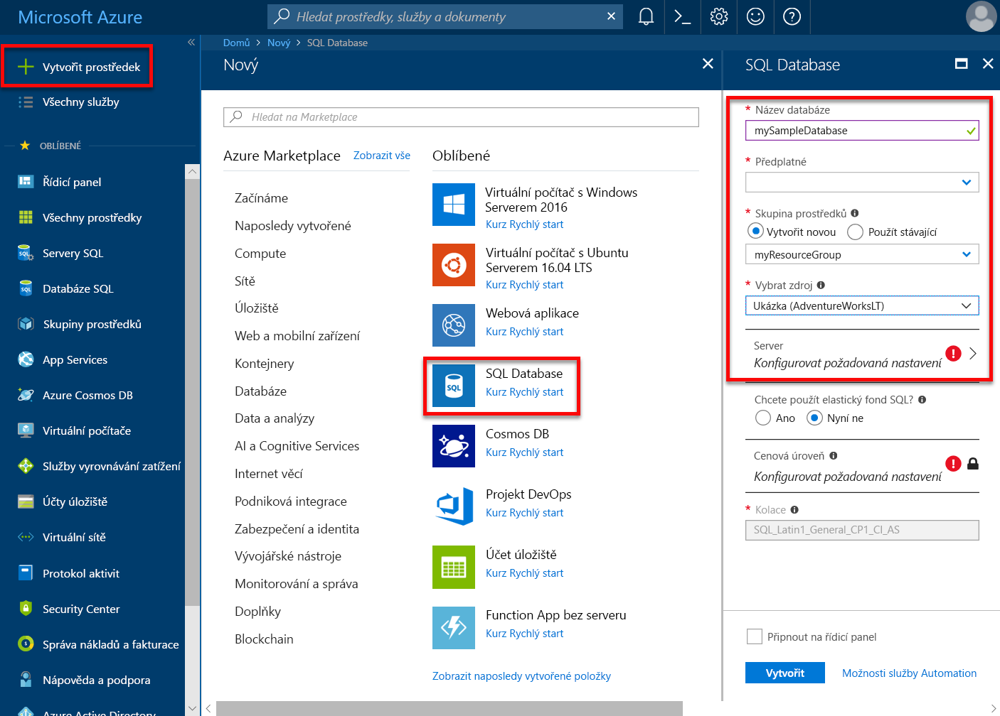
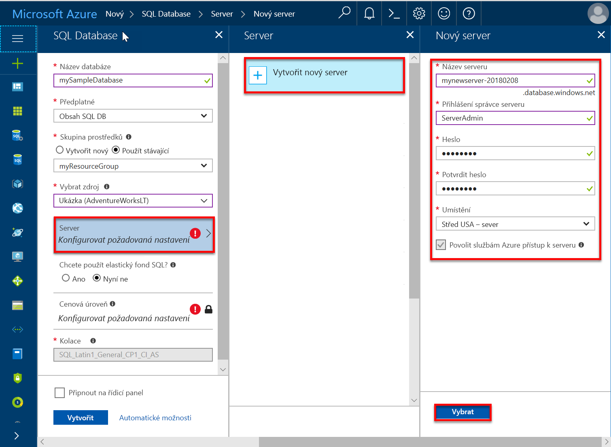
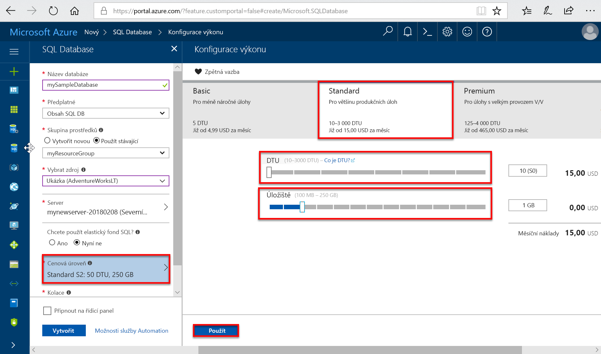
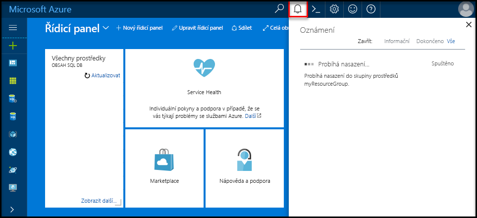
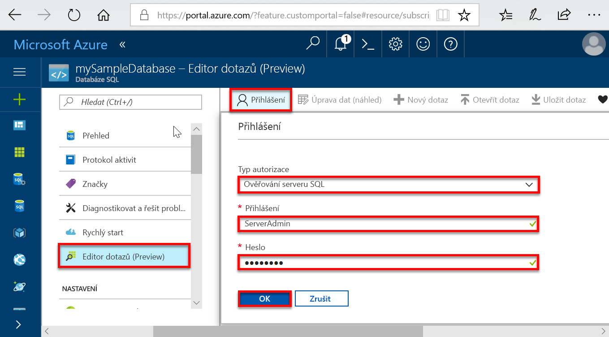
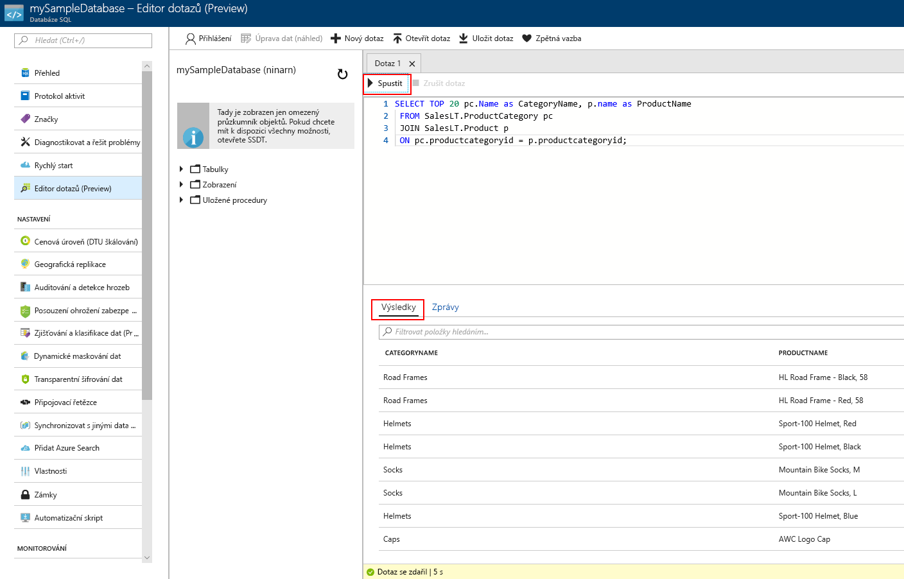

# <a name="quickstart-create-a-single-database-in-azure-sql-database-using-the-azure-portal"></a>Rychlý start: Vytvoření izolované databáze ve službě Azure SQL Database pomocí webu Azure portal

Vytváření [izolované databáze](sql-database-single-database.md) je možnost nejrychlejší a nejjednodušší nasazení pro vytvoření databáze ve službě Azure SQL Database. V tomto rychlém startu se dozvíte, jak vytvořit a potom dotazování izolované databáze pomocí webu Azure portal.

Pokud ještě nemáte předplatné Azure, [vytvořte si bezplatný účet](https://azure.microsoft.com/free/).

Pro všechny kroky v tomto rychlém startu, přihlaste se k [webu Azure portal](https://portal.azure.com/).

## <a name="create-a-single-database"></a>Vytvoření izolované databáze

Izolované databáze má definovanou sadu výpočetních, paměťových, vstupně-výstupní operace a úložiště prostředků pomocí jednoho ze dvou [zakoupení model(sql-database-purchase-models.md). Při vytvoření izolované databáze také definovat [serveru služby SQL Database](sql-database-servers.md) ho spravovat a umístěte ji v rámci [skupiny prostředků Azure](../azure-resource-manager/resource-group-overview.md) v určité oblasti.

Vytvoření izolované databáze s ukázkovými daty AdventureWorksLT:

1. V levém horním rohu webu Azure Portal vyberte **Vytvořit prostředek**.
2. Vyberte **databází** a pak vyberte **SQL Database**.
3. V **vytvořit databázi SQL** formuláři zadejte nebo vyberte následující hodnoty:

   - **Název databáze**: Zadejte *mySampleDatabase*.
   - **Předplatné**: Rozevírací seznam a vyberte správné předplatné, pokud se nezobrazí.
   - **Skupina prostředků**: Vyberte **vytvořit nový**, typ *myResourceGroup*a vyberte **OK**.
   - **Výběr zdroje**: Rozevírací seznam a vyberte **ukázka (AdventureWorksLT)**.

    >[!IMPORTANT]
    >Je nutné vybrat **ukázka (AdventureWorksLT)** dat, takže můžete postupovat podle snadno tato a další rychlé starty Azure SQL Database, která tato data použít.
  
   

4. V části **Server**vyberte **vytvořit nový**.
5. V **nový server** formuláři zadejte nebo vyberte následující hodnoty:

   - **Název serveru**: Zadejte *můjsqlserver*.
   - **Přihlašovací jméno správce serveru**: Typ *azureuser*.
   - **Heslo**: Enter *Azure1234567*.
   - **Potvrzení hesla**: Zadejte heslo znovu.
   - **Umístění**: Rozevírací seznam a vyberte jakékoli platné umístění.  

   >[!IMPORTANT]
   >Nezapomeňte si poznamenat přihlašovací jméno správce serveru a heslo, takže se můžete přihlásit k serveru a databáze pro tuto a další rychlé starty. Pokud zapomenete přihlašovací jméno nebo heslo, můžete získat přihlašovací jméno nebo heslo na **systému SQL server** stránky. Chcete-li otevřít **systému SQL server** vyberte název serveru v databázi, **přehled** stránku po vytvoření databáze.

    

6. Zvolte **Vybrat**.
7. Na **SQL Database** formuláře, vyberte **cenová úroveň**. Prozkoumejte množství Dtu a velikosti úložiště k dispozici pro jednotlivé úrovně služby.

   >[!NOTE]
   >Tento rychlý start využívá [nákupní model založený na DTU](sql-database-service-tiers-dtu.md), ale [nákupní model založený na virtuálních jádrech](sql-database-service-tiers-vcore.md) je také k dispozici.
   >[!IMPORTANT]
   >Více než 1 TB úložiště na úrovni Premium je aktuálně k dispozici ve všech oblastech s výjimkou: Velká Británie – sever, střed USA – Západ, Velká Británie South2, Čína – východ, USDoDCentral, Německo – střed, USDoDEast, USA (gov) – jihozápad, USA (gov) – jih – střed, Německo – severovýchod, Čína – sever a státní správu USA – východ. V těchto oblastech je úložiště na úrovni Premium omezeno na 1 TB. Další informace najdete v tématu [aktuálních omezení pro P11 – P15](sql-database-dtu-resource-limits-single-databases.md#single-database-limitations-of-p11-and-p15-when-the-maximum-size-greater-than-1-tb).  

8. Pro účely tohoto rychlého startu vyberte **standardní** úroveň služby a pak pomocí posuvníku vyberte **10 Dtu (S0)** a **1** GB úložiště.
9. Vyberte **Použít**.  

   

10. Na **SQL Database** formuláře, vyberte **vytvořit** k nasazení a zřizování skupiny prostředků, server a databáze.

   Nasazení trvá několik minut. Můžete vybrat **oznámení** na panelu nástrojů můžete sledovat průběh nasazení.

   

## <a name="query-the-database"></a>Dotaz na databázi

Teď, když jste vytvořili databázi, použijte integrovaný dotazovací nástroj na webu Azure Portal pro připojení k databázi a zadávat dotazy na data.

1. Na **SQL Database** stránce pro vaši databázi, vyberte **editor dotazů (preview)** v levé nabídce.

   

2. Zadejte přihlašovací údaje a vyberte **OK**.
3. Zadejte následující dotaz **editoru dotazů** podokně.

   ```sql
   SELECT TOP 20 pc.Name as CategoryName, p.name as ProductName
   FROM SalesLT.ProductCategory pc
   JOIN SalesLT.Product p
   ON pc.productcategoryid = p.productcategoryid;
   ```

4. Vyberte **spustit**a pak zkontrolujte výsledky dotazu v **výsledky** podokně.

   

5. Zavřít **editoru dotazů** stránku a vybrat **OK** po zobrazení výzvy zahoďte neuložené změny.

## <a name="clean-up-resources"></a>Vyčištění prostředků

Pokud chcete přejít na zachovat tuto skupinu prostředků, serveru databáze a izolované databáze [další kroky](#next-steps). Následující kroky ukazují, jak k připojení a dotazování databáze pomocí různých metod.

Jakmile budete hotovi, tyto prostředky používá, můžete je odstranit následujícím způsobem:

1. V nabídce vlevo na webu Azure Portal vyberte **skupiny prostředků**a pak vyberte **myResourceGroup**.
2. Na stránce skupiny prostředků, vyberte **odstranit skupinu prostředků**.
3. Zadejte *myResourceGroup* v poli a pak vyberte **odstranit**.

## <a name="next-steps"></a>Další postup

- Vytvořte pravidlo brány firewall na úrovni serveru pro připojení k izolované databáze z místní nebo vzdálené nástroje. Další informace najdete v tématu [vytvořit pravidlo brány firewall na úrovni serveru](sql-database-server-level-firewall-rule.md).
- Po vytvoření pravidla brány firewall na úrovni serveru, [připojení a dotazování](sql-database-connect-query.md) vaší databáze pomocí několika různých nástrojů a jazyků.
  - [Připojení a dotazování pomocí SQL Server Management Studia](sql-database-connect-query-ssms.md)
  - [Připojení a dotazování pomocí Azure Data Studia](https://docs.microsoft.com/sql/azure-data-studio/quickstart-sql-database?toc=/azure/sql-database/toc.json)
- Vytvoření izolované databáze pomocí Azure CLI najdete v tématu [ukázky v Azure CLI](sql-database-cli-samples.md).
- Vytvoření izolované databáze pomocí Azure Powershellu najdete v tématu [ukázky Azure Powershellu](sql-database-powershell-samples.md).
