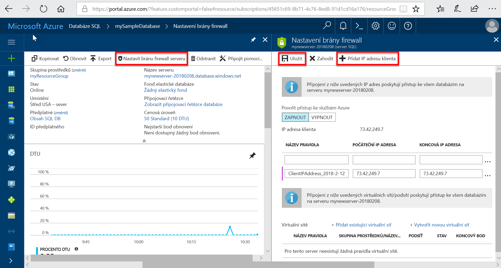

# Vytvoření a správa izolovaných databází ve službě Azure SQL Database a servery SQL Database

Můžete vytvořit a spravovat servery SQL Database a izolované databáze pomocí webu Azure portal, Powershellu, rozhraní příkazového řádku Azure, rozhraní REST API a příkazů jazyka Transact-SQL.

## Azure portal: Správa izolovaných databází a servery SQL Database

Můžete vytvořit skupinu prostředků Azure SQL database předem nebo při vytváření samotný server. Existuje několik metod pro získání nového formuláře SQL serveru tak, že vytvoříte nový SQL server nebo jako součást vytváření nové databáze.

### Vytvoření prázdné databáze SQL serveru

K vytvoření databáze SQL serveru pomocí [webu Azure portal](https://portal.azure.com), přejděte na prázdný formulář SQL server (logický server).  

### Vytvoření prázdné nebo vzorový izolované databáze SQL

Chcete-li vytvořit izolované databáze Azure SQL pomocí [webu Azure portal](https://portal.azure.com), přejděte na prázdný formulář databáze SQL a zadejte požadované informace. Můžete vytvořit skupinu prostředků Azure SQL database a serveru SQL Database předem nebo při vytváření jedné databáze samotný. Můžete vytvořit prázdnou databázi nebo vytvoření ukázkové databáze založené na Adventure Works LT.

  

> [!IMPORTANT]
> Další informace o výběru cenová úroveň pro vaši databázi, naleznete v tématu [nákupní model založený na DTU](sql-database-service-tiers-dtu.md) a [nákupní model založený na virtuálních jádrech](sql-database-service-tiers-vcore.md).

Vytvoření Managed Instance najdete v tématu [vytvoříte Managed Instance](sql-database-managed-instance-get-started.md)

## Spravovat existující server služby SQL Database

Chcete-li spravovat existující server služby SQL Database, přejděte na server pomocí několika metod – jako třeba konkrétní stránce databáze SQL, **SQL servery** stránky, nebo **všechny prostředky** stránky.

Chcete-li spravovat stávající databázi, přejděte na **databází SQL** stránky a klikněte na databázi, kterou chcete spravovat. Následující snímek obrazovky ukazuje, jak začít, nastavení brány firewall úrovni serveru pro databázi z **přehled** stránku pro databázi.

   

> [!IMPORTANT]
> Postup konfigurace vlastností výkonu u databáze, najdete v článku [nákupní model založený na DTU](sql-database-service-tiers-dtu.md) a [nákupní model založený na virtuálních jádrech](sql-database-service-tiers-vcore.md).
> [!TIP]
> Azure portal rychlém startu najdete v části [vytvořit databázi Azure SQL na webu Azure Portal](sql-database-single-database-get-started.md).

## PowerShell: Správa izolovaných databází a servery SQL Database

Pokud chcete vytvářet a spravovat servery Azure SQL Database, databáze ve fondu a jeden a brány firewall serveru SQL Database pomocí Azure Powershellu, použijte následující rutiny Powershellu. Pokud potřebujete instalaci nebo upgrade prostředí PowerShell, najdete v článku [instalace modulu Azure PowerShell](/powershell/azure/install-az-ps).

> [!TIP]
> Příklady skriptů Powershellu, najdete v části [použití Powershellu k vytvoření jedné databáze Azure SQL a nakonfigurujte pravidlo brány firewall serveru SQL Database](scripts/sql-database-create-and-configure-database-powershell.md) a [sledování a škálování SQL databáze pomocí prostředí PowerShell jednotné](scripts/sql-database-monitor-and-scale-database-powershell.md) .

| Rutina | Popis |
| --- | --- |
|[New-AzureRmSqlDatabase](/powershell/module/azurerm.sql/new-azurermsqldatabase)|Vytvoří databázi |
|[Get-AzureRmSqlDatabase](/powershell/module/azurerm.sql/get-azurermsqldatabase)|Získá jednu nebo více databází|
|[Set-AzureRmSqlDatabase](/powershell/module/azurerm.sql/set-azurermsqldatabase)|Nastaví vlastnosti pro databáze nebo přesune databázi do elastického fondu|
|[Remove-AzureRmSqlDatabase](/powershell/module/azurerm.sql/remove-azurermsqldatabase)|Odebere databázi|
|[New-AzureRmResourceGroup](/powershell/module/azurerm.resources/new-azurermresourcegroup)|Vytvoří skupinu prostředků|
|[New-AzureRmSqlServer](/powershell/module/azurerm.sql/new-azurermsqlserver)|Vytvoří server|
|[Get-AzureRmSqlServer](/powershell/module/azurerm.sql/get-azurermsqlserver)|Vrátí informace o serverech|
|[Set-AzureRmSqlServer](https://docs.microsoft.com/powershell/module/azurerm.sql/set-azurermsqlserver)|Upraví vlastnosti serveru|
|[Remove-AzureRmSqlServer](/powershell/module/azurerm.sql/remove-azurermsqlserver)|Odebere server|
|[New-AzureRmSqlServerFirewallRule](/powershell/module/azurerm.sql/new-azurermsqlserverfirewallrule)|Vytvoří pravidlo brány firewall na úrovni serveru |
|[Get-AzureRmSqlServerFirewallRule](/powershell/module/azurerm.sql/get-azurermsqlserverfirewallrule)|Získá pravidla brány firewall pro server|
|[Set-AzureRmSqlServerFirewallRule](/powershell/module/azurerm.sql/set-azurermsqlserverfirewallrule)|Upraví pravidla brány firewall na serveru|
|[Remove-AzureRmSqlServerFirewallRule](/powershell/module/azurerm.sql/remove-azurermsqlserverfirewallrule)|Odstraní pravidlo brány firewall ze serveru.|
| New-AzureRmSqlServerVirtualNetworkRule | Vytvoří [ *pravidlo virtuální sítě*](sql-database-vnet-service-endpoint-rule-overview.md)založená na podsíť, která je koncový bod služby virtuální sítě. |

## Azure CLI: Správa izolovaných databází a servery SQL Database

K vytváření a správě serveru Azure SQL, databáze a brány firewall s [rozhraní příkazového řádku Azure](/cli/azure), použijte následující [databáze SQL Azure CLI](/cli/azure/sql/db) příkazy. Rozhraní příkazového řádku můžete spustit v prohlížeči pomocí [Cloud Shellu](/azure/cloud-shell/overview) nebo [nainstalovat](/cli/azure/install-azure-cli) v systémech macOS, Linux nebo Windows. Vytváření a správa elastických fondů najdete v tématu [elastické fondy](sql-database-elastic-pool.md).

> [!TIP]
> Rychlý start Azure CLI najdete v části [vytvořit jednu databázi Azure SQL pomocí Azure CLI](sql-database-cli-samples.md). Příklad skripty rozhraní příkazového řádku Azure, najdete v části [pomocí rozhraní příkazového řádku k vytvoření jedné databáze Azure SQL a nakonfigurujte pravidlo brány firewall služby SQL Database](scripts/sql-database-create-and-configure-database-cli.md) a [pomocí rozhraní příkazového řádku pro monitorování a škálování izolovanou databázi Azure SQL](scripts/sql-database-monitor-and-scale-database-cli.md).
>

| Rutina | Popis |
| --- | --- |
|[az sql db create](/cli/azure/sql/db#az-sql-db-create) |Vytvoří databázi|
|[AZ sql db list](/cli/azure/sql/db#az-sql-db-list)|Obsahuje seznam všech databází a datových skladů na serveru, nebo všechny databáze v elastickém fondu|
|[az sql db list-editions](/cli/azure/sql/db#az-sql-db-list-editions)|Seznamy dostupnou službu cíle a omezení úložiště|
|[AZ sql db list-usages](/cli/azure/sql/db#az-sql-db-list-usages)|Vrací databáze využití|
|[AZ sql db show](/cli/azure/sql/db#az-sql-db-show)|Získá databázi ani na datový sklad|
|[az sql db update](/cli/azure/sql/db#az-sql-db-update)|Aktualizace databáze|
|[AZ sql db delete](/cli/azure/sql/db#az-sql-db-delete)|Odebere databázi|
|[az group create](/cli/azure/group#az-group-create)|Vytvoří skupinu prostředků|
|[az sql server create](/cli/azure/sql/server#az-sql-server-create)|Vytvoří server|
|[AZ sql server list](/cli/azure/sql/server#az-sql-server-list)|Vytvoří seznam serverů|
|[AZ sql server list-usages](/cli/azure/sql/server#az-sql-server-list-usages)|Vrátí použití serveru|
|[AZ sql server show](/cli/azure/sql/server#az-sql-server-show)|Získá serveru|
|[aktualizace az sql server](/cli/azure/sql/server#az-sql-server-update)|Aktualizace serveru|
|[az sql server delete](/cli/azure/sql/server#az-sql-server-delete)|Odstraní server|
|[Vytvoření az sql server firewall-rule](/cli/azure/sql/server/firewall-rule#az-sql-server-firewall-rule-create)|Vytvoří pravidlo brány firewall serveru|
|[AZ sql server firewall-rule list](/cli/azure/sql/server/firewall-rule#az-sql-server-firewall-rule-list)|Obsahuje seznam pravidel brány firewall na serveru|
|[AZ sql server firewall-rule show](/cli/azure/sql/server/firewall-rule#az-sql-server-firewall-rule-show)|Zobrazí podrobnosti pravidla brány firewall|
|[AZ sql server firewall-rule update](/cli/azure/sql/server/firewall-rule##az-sql-server-firewall-rule-update)|Aktualizuje pravidlo brány firewall|
|[AZ sql server firewall-rule delete](/cli/azure/sql/server/firewall-rule#az-sql-server-firewall-rule-delete)|Odstraní pravidlo brány firewall|

## Transact-SQL: Správa izolovaných databází a servery SQL Database

K vytváření a správě serveru Azure SQL, databáze a brány firewall pomocí příkazů jazyka Transact-SQL, použijte následující příkazy T-SQL. Můžete použít tyto příkazy pomocí webu Azure portal, [SQL Server Management Studio](/sql/ssms/use-sql-server-management-studio), [Visual Studio Code](https://code.visualstudio.com/docs), nebo jiný program, který můžete připojit k serveru Azure SQL Database a předat příkazů jazyka Transact-SQL příkazy. Elastické fondy, přečtěte si téma [elastické fondy](sql-database-elastic-pool.md).

> [!TIP]
> Rychlý start pomocí SQL Server Management Studio na Microsoft Windows, naleznete v tématu [Azure SQL Database: Použít SQL Server Management Studio k připojení a dotazování dat](sql-database-connect-query-ssms.md). Rychlý start v systému macOS, Linux nebo Windows pomocí Visual Studio Code, naleznete v tématu [Azure SQL Database: Použití Visual Studio Code k připojení a dotazování dat](sql-database-connect-query-vscode.md).
> [!IMPORTANT]
> Nejde vytvořit nebo odstranit server pomocí příkazů jazyka Transact-SQL.

| Příkaz | Popis |
| --- | --- |
|[CREATE DATABASE](https://docs.microsoft.com/sql/t-sql/statements/create-database-transact-sql?view=azuresqldb-current)|Vytvoří nové izolované databáze. Musíte být připojení k hlavní databázi, a vytvořit novou databázi.|
| [Příkaz ALTER DATABASE (Azure SQL Database)](https://docs.microsoft.com/sql/t-sql/statements/alter-database-transact-sql?view=azuresqldb-current) |Upraví databázi Azure SQL. |
|[DROP DATABASE (Transact-SQL)](/sql/t-sql/statements/drop-database-transact-sql)|Odstraní databázi.|
|[sys.database_service_objectives (Azure SQL Database)](/sql/relational-databases/system-catalog-views/sys-database-service-objectives-azure-sql-database)|Vrátí edition (úroveň služby), cíl služby (cenová úroveň) a název elastického fondu, pokud existují pro službu Azure SQL database nebo Azure SQL Data Warehouse. Pokud přihlášení k hlavní databázi na serveru Azure SQL Database, vrátí informace ve všech databázích. Pro službu Azure SQL Data Warehouse musí být připojené k hlavní databázi.|
|[Sys.dm_db_resource_stats (Azure SQL Database)](/sql/relational-databases/system-dynamic-management-views/sys-dm-db-resource-stats-azure-sql-database)| Vrátí spotřeby procesoru, vstupně-výstupní operace a paměti pro databázi Azure SQL Database. Jeden řádek existuje pro každých 15 sekund, i v případě, že neexistuje žádná aktivita v databázi.|
|[sys.resource_stats (Azure SQL Database)](/sql/relational-databases/system-catalog-views/sys-resource-stats-azure-sql-database)|Vrátí data o využití a úložiště CPU pro službu Azure SQL Database. Data se shromažďují a agregují v pětiminutovém intervalu.|
|[Sys.database_connection_stats (Azure SQL Database)](/sql/relational-databases/system-catalog-views/sys-database-connection-stats-azure-sql-database)|Obsahuje statistiku pro události připojení databáze SQL Database, nabízí přehled databáze připojení úspěchy a selhání. |
|[Sys.event_log (Azure SQL Database)](/sql/relational-databases/system-catalog-views/sys-event-log-azure-sql-database)|Vrátí úspěšná připojení databáze Azure SQL Database, selhání připojení a zablokování. Tyto informace můžete použít ke sledování nebo řešení potíží s aktivitu své databáze s využitím SQL Database.|
|[příkaz sp_set_firewall_rule (Azure SQL Database)](/sql/relational-databases/system-stored-procedures/sp-set-firewall-rule-azure-sql-database)|Vytvoří nebo aktualizuje nastavení brány firewall na úrovni serveru pro váš server SQL Database. Tuto uloženou proceduru lze pouze v hlavní databázi, a hlavní přihlášení na úrovni serveru. Pravidlo brány firewall na úrovni serveru můžete vytvořit pouze pomocí příkazů jazyka Transact-SQL po vytvoření prvního pravidla brány firewall na úrovni serveru uživatelem s oprávněními úrovně Azure|
|[Sys.firewall_rules (Azure SQL Database)](/sql/relational-databases/system-catalog-views/sys-firewall-rules-azure-sql-database)|Vrátí informace o nastavení brány firewall na úrovni serveru přidružené k Microsoft Azure SQL Database.|
|[sp_delete_firewall_rule (Azure SQL Database)](/sql/relational-databases/system-stored-procedures/sp-delete-firewall-rule-azure-sql-database)|Nastavení brány firewall na úrovni serveru odstraní z databáze SQL serveru. Tuto uloženou proceduru lze pouze v hlavní databázi, a hlavní přihlášení na úrovni serveru.|
|[sp_set_database_firewall_rule (Azure SQL Database)](/sql/relational-databases/system-stored-procedures/sp-set-database-firewall-rule-azure-sql-database)|Vytvoří nebo aktualizuje pravidla brány firewall na úrovni databáze pro Azure SQL Database nebo SQL Data Warehouse. Pravidla brány firewall databáze je možné nakonfigurovat pro hlavní databázi a uživatelských databází v SQL Database. Pravidla brány firewall databáze jsou užitečné při použití uživatelé databáze s omezením. |
|[sys.database_firewall_rules (Azure SQL Database)](/sql/relational-databases/system-catalog-views/sys-database-firewall-rules-azure-sql-database)|Vrátí informace o nastavení brány firewall na úrovni databáze, které jsou přidružené k Microsoft Azure SQL Database. |
|[sp_delete_database_firewall_rule (Azure SQL Database)](/sql/relational-databases/system-stored-procedures/sp-delete-database-firewall-rule-azure-sql-database)|Nastavení brány firewall na úrovni databáze odebere z Azure SQL Database nebo SQL Data Warehouse. |

## REST API: Správa izolovaných databází a servery SQL Database

K vytváření a správě serveru Azure SQL, databází a bran firewall, použijte tyto požadavky rozhraní REST API.

| Příkaz | Popis |
| --- | --- |
|[Servery – vytvořit nebo aktualizovat](https://docs.microsoft.com/rest/api/sql/servers/createorupdate)|Vytvoří nebo aktualizuje nový server.|
|[Servery – odstranit](https://docs.microsoft.com/rest/api/sql/servers/delete)|Odstraní systému SQL server.|
|[Servery – Get](https://docs.microsoft.com/rest/api/sql/servers/get)|Získá serveru.|
|[Servery – seznam](https://docs.microsoft.com/rest/api/sql/servers/list)|Vrátí seznam serverů v rámci předplatného.|
|[Servery – seznam podle skupin prostředků](https://docs.microsoft.com/rest/api/sql/servers/listbyresourcegroup)|Vrátí seznam serverů ve skupině prostředků.|
|[Servery – aktualizace](https://docs.microsoft.com/rest/api/sql/servers/update)|Aktualizuje existující server.|
|[Databáze – vytvořit nebo aktualizovat](https://docs.microsoft.com/rest/api/sql/databases/createorupdate)|Vytvoří novou databázi nebo aktualizuje existující databázi.|
|[Databáze – odstranit](https://docs.microsoft.com/rest/api/sql/databases/delete)|Odstraní databázi.|
|[Databáze - Get](https://docs.microsoft.com/rest/api/sql/databases/get)|Získá databázi.|
|[Databáze – seznam podle elastického fondu](https://docs.microsoft.com/rest/api/sql/databases/listbyelasticpool)|Vrátí seznam databází v elastickém fondu.|
|[Databáze – seznam serverem](https://docs.microsoft.com/rest/api/sql/databases/listbyserver)|Vrátí seznam databází na serveru.|
|[Databáze – aktualizace](https://docs.microsoft.com/rest/api/sql/databases/update)|Aktualizuje existující databázi.|
|[Pravidla – brány firewall vytvořit nebo aktualizovat](https://docs.microsoft.com/rest/api/sql/firewallrules/createorupdate)|Vytvoří nebo aktualizuje pravidla brány firewall.|
|[Pravidla brány firewall – odstranit](https://docs.microsoft.com/rest/api/sql/firewallrules/delete)|Odstraní pravidlo brány firewall.|
|[Pravidla brány firewall – Get](https://docs.microsoft.com/rest/api/sql/firewallrules/get)|Získá pravidla brány firewall.|
|[Pravidla brány firewall – seznam serverem](https://docs.microsoft.com/rest/api/sql/firewallrules/listbyserver)|Vrátí seznam pravidel brány firewall.|

## Další postup

- Další informace o migraci databáze SQL serveru do Azure najdete v tématu [migrace do služby Azure SQL Database](sql-database-single-database-migrate.md).
- Informace o podporovaných funkcích najdete v tématu [Funkce](sql-database-features.md).
