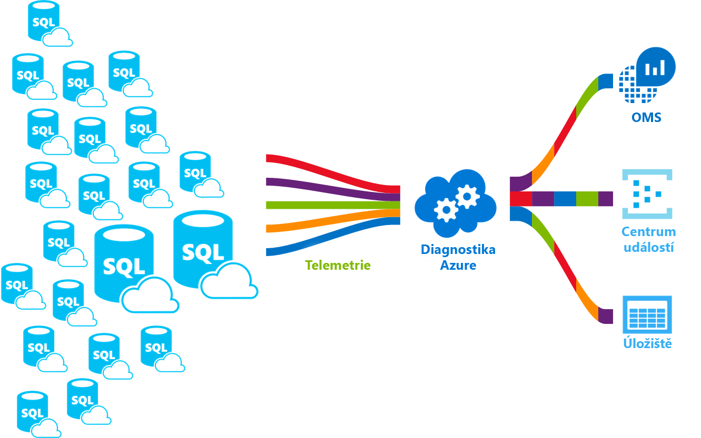

# Služba Azure SQL Database

SQL Database je spravovaná služba relačních databází pro obecné účely v Microsoft Azure, která podporuje struktury, jako jsou relační data, JSON, prostorová data a XML. SQL Database nabízí dynamicky škálovatelný výkon v rámci dva různé modely nákupu: nákupní model založený na virtuálních jádrech a nákupní model založený na DTU. SQL Database také poskytuje možnosti jako [indexy columnstore](https://docs.microsoft.com/sql/relational-databases/indexes/columnstore-indexes-overview) pro extrémní analytické analýzy a generování sestav nebo [OLTP v paměti](sql-database-in-memory.md) pro extrémní zpracování transakcí. Microsoft zajišťuje bezproblémové opravy a aktualizace základního kódu SQL a odděluje veškerou správu základní infrastruktury.

> [!NOTE]
> Glosář termínů ve službě Azure SQL Database, najdete v části [SQL Database termíny glosáře](sql-database-glossary-terms.md)

Azure SQL Database poskytuje následující možnosti nasazení databáze SQL Azure:

- Jako [izolované databáze](sql-database-single-database.md) s vlastní sadou prostředků spravovat přes server SQL Database. Izolovaná databáze je podobný [databáze s omezením](https://docs.microsoft.com/sql/relational-databases/databases/contained-databases) v systému SQL Server.
- [Elastického fondu](sql-database-elastic-pool.md), což je kolekce databází se sdílenou sadou prostředků spravovat přes server SQL Database. Izolované databáze můžete přesunout do a z elastického fondu.
- [Spravovaná instance](sql-database-managed-instance.md), což je kolekce systémových a uživatelských databází se sdílenou sadou prostředků. Managed instance je podobný instance [databázovém stroji Microsoft SQL serveru](https://docs.microsoft.com/sql/sql-server/sql-server-technical-documentation).

Následující obrázek ukazuje tyto možnosti nasazení:

SQL Database sdílí základ kódu s [databázovým strojem Microsoft SQL Serveru](https://docs.microsoft.com/sql/sql-server/sql-server-technical-documentation). V rámci strategie Microsoftu zaměřené na cloud se nové funkce SQL Serveru uvolňují nejprve do služby SQL Database a až potom do samotného SQL Serveru. Tento přístup vám poskytuje nejnovější funkce SQL Serveru bez režijních nákladů na opravy nebo aktualizace. Kromě toho umožňuje testování těchto funkcí v milionech databází. Pokud se chcete o nových funkcích dozvědět hned po jejich oznámení, podívejte se na:

- **[Plány Azure do budoucna pro službu SQL Database](https://azure.microsoft.com/roadmap/?category=databases)**:

  Místo, kde můžete zjistit, co je nového a co se chystá.

- **[Blog o Azure SQL Database](https://azure.microsoft.com/blog/topics/database)**:

  Místo, kde produktového týmu SQL serveru členy blogu o SQL Database novinkách a funkcích.

> [!IMPORTANT]
> Funkce rozdíly mezi SQL Database a SQL Server, jakož i rozdíly mezi možnostmi nasazení Azure SQL Database najdete v tématu [funkce SQL](sql-database-features.md).

SQL Database nabízí předvídatelný výkon s více typů prostředků, úrovní služeb a velikostí výpočetních, které poskytují dynamickou škálovatelnost bez výpadků, integrovanou inteligentní optimalizaci, globální škálovatelnost a dostupnost a pokročilé zabezpečení Možnosti – vše s téměř bez nutnosti jakékoli správy. Díky těmto možnostem se můžete zaměřit na rychlý vývoj aplikací a zkrácení doby dodání produktu na trh, namísto vynakládání prostředků a drahocenného času na správu virtuálních počítačů a infrastruktury. SQL Database je aktuálně v 38 datových centrech po celém světě a další datová centra se pravidelně přidávají, což vám umožňuje provozovat databázi v datovém centru ve vaší blízkosti.

## Škálovatelnost výkonu a fondy

- U izolovaných databází je každá databáze izolovaná od všech ostatních a, každý s vlastní garantováno množství výpočetních, paměťových a úložiště prostředků. SQL Database nabízí různé prostředky výpočetních, paměťových a úložiště pro různé potřeby – a umožňuje dynamicky [škálování izolované databáze prostředků](sql-database-single-database-scale.md) nahoru a dolů. [Úroveň služby hyperškálovatelného](sql-database-service-tier-hyperscale.md) (preview) pro izolované databáze umožňuje škálování až na 100 TB, rychlé zálohování a obnovení funkce.
- S elastickými fondy, můžete vytvářet nové databáze nebo přesuňte izolovaných databází do fondu zdrojů pro maximalizaci využití prostředků a ušetřit peníze - i schopnost dynamicky [škálování elastického fondu prostředků](sql-database-elastic-pool-scale.md) nahoru a dolů.
- S spravované instance každé managed instance je izolovaná od ostatních instancí mají garantované prostředky. V rámci managed instance, instance databáze sdílejí sadu prostředků – a umožňuje dynamicky [škálovat prostředky spravované instance](sql-database-managed-instance-resource-limits.md) nahoru a dolů.

Můžete sestavit svoji první aplikaci na malou izolovanou databází s nízkými náklady za měsíc v rámci úrovně služeb pro obecné účely a potom změnit úroveň služby ručně nebo prostřednictvím kódu programu kdykoli do obchodní vrstvy kritické služby podle potřeb vašeho řešení. Můžete upravit úroveň výkonu bez přerušení provozu aplikace a bez dopadu na vaše zákazníky. Dynamická škálovatelnost umožňuje databázím transparentně reagovat na rychle se měnící požadavky na prostředky a vy díky tomu platíte pouze za prostředky, které potřebujete, když je potřebujete.

Dynamická škálovatelnost se liší od automatického škálování. K automatickému škálování dochází, když se služba škáluje automaticky na základě kritérií, zatímco dynamická škálovatelnost umožňuje ruční škálování bez prostojů. Izolované databáze podporuje ruční dynamickou škálovatelnost, ale neprováděl automatické škálování. Pokud chcete *automatizovanější* prostředí, zvažte použití elastických fondů, které databázím umožňují sdílet prostředky ve fondu na základě potřeb jednotlivých databází. Existují však skripty, které můžou usnadnit automatizaci škálovatelnost pro izolované databáze. Příklad najdete v tématu [pomocí Powershellu pro monitorování a škálování izolované databáze](scripts/sql-database-monitor-and-scale-database-powershell.md).

### Nákupu modely, úrovně služeb, výpočty velikosti a množství úložiště

SQL Database nabízí dva modely nákupu:

- [Nákupní model založený na DTU](sql-database-service-tiers-dtu.md) nabízí výpočetní, paměti, vstupně-VÝSTUPNÍCH prostředků ve třech úrovních služeb pro podporu nejlehčích k těm nejnáročnějším. Výpočetní velikosti na jednotlivých úrovních poskytují různou kombinaci těchto prostředků, na které můžete přidat další prostředky úložiště.
- [Nákupní model založený na virtuálních jádrech](sql-database-service-tiers-vcore.md) umožňuje výběr počtu virtuálních jader, velikost nebo paměti a množství a rychlosti úložiště.

  > [!IMPORTANT]
  > [Úroveň služby hyperškálovatelného](sql-database-service-tier-hyperscale.md) je aktuálně ve verzi public preview. Nedoporučujeme s jakékoli produkčními úlohami v databázích hyperškálovatelného ještě. Velkokapacitní databáze nelze aktualizovat na další úrovně služeb. Pro testovací účely doporučujeme vytvořit kopii aktuální databáze a aktualizovat kopii hyperškálovatelného vrstvu služby.

### Elastické fondy pro maximalizaci využití prostředků

Řadě firem a aplikací stačí, že může vytvářet izolované databáze a nastavovat větší nebo menší výkon na vyžádání, zejména při relativně předvídatelném způsobu používání. Ale pokud vaše vzorce používání předvídatelné nejsou, může být správa nákladů a údržba obchodního modelu velmi těžká. [Elastické fondy](sql-database-elastic-pool.md) jsou navržené k řešení tohoto problému. Princip je jednoduchý. Přidělit prostředky výkonu fondu, nikoli jednotlivé databáze a budete platit pro souhrnné prostředky výkonu fondu místo za výkon izolovaných databází.

   

S elastickými fondy se nemusíte starat o zvyšování a snižování výkonu databáze s kolísajícími požadavky na prostředky. Databáze ve fondu spotřebovávají prostředky výkonu elastického fondu podle potřeby. Databáze ve fondu spotřebovávají výkon, ale nepřekračují omezení fondu, takže vaše náklady budou předvídatelné, i když využívání jednotlivých databází odhadnutelné nebude. A navíc můžete [přidávat a odebírat databáze ve fondu](sql-database-elastic-pool-manage-portal.md), škálovat aplikace od několik databází k tisícům a přitom mít rozpočet stále pod kontrolou. Můžete také řídit minimální a maximální prostředky, které mají databáze ve fondu k dispozici, a tím zajistit, že žádná databáze ve fondu nebude využívat všechny prostředky fondu a pro každou databázi ve fondu bude garantováno minimální množství prostředků. Další informace o návrhových schématech aplikací SaaS využívajících elastické fondy najdete v tématu [Návrhová schémata pro víceklientské aplikace SaaS využívající službu SQL Database](sql-database-design-patterns-multi-tenancy-saas-applications.md).

Skripty vám můžou pomoct s monitorováním a škálováním elastických fondů. Příklad najdete v tématu [Monitorování a škálování elastického fondu SQL ve službě Azure SQL Database pomocí PowerShellu](scripts/sql-database-monitor-and-scale-pool-powershell.md).

> [!IMPORTANT]
> Managed instance nepodporuje elastické fondy. Místo toho managed instance je kolekce instance databází, které sdílejí prostředky spravované instance.

### Kombinace izolovaných databází s databázemi ve fondu

Můžete kombinovat izolované databáze s elastickými fondy a rychle a snadno měnit úrovně služeb izolovaných databází a elastických fondů abyste je přizpůsobili své situaci. S výkonem a dostupností, které Azure nabízí, můžete se službou SQL Database kombinovat další služby Azure podle konkrétních potřeb vašich aplikací pro zvýšení ekonomičnosti provozu a efektivity prostředků a otevírat tak zcela nové obchodní příležitosti.

### Rozsáhlé monitorování a možnosti upozorňování

Můžete využít integrované nástroje pro [monitorování výkonu](sql-database-performance.md) a [upozorňování](sql-database-insights-alerts-portal.md) v kombinaci s hodnocením výkonu. Pomocí těchto nástrojů můžete rychle posoudit dopad vertikálního navýšení nebo snížení kapacity v závislosti na stávajících nebo předpokládaných požadavcích. Kromě toho může SQL Database [generovat metriky a diagnostické protokoly](sql-database-metrics-diag-logging.md) pro snazší monitorování. SQL Database můžete nakonfigurovat pro ukládání využití prostředků, pracovních procesů, relací a možností připojení do jednoho z těchto prostředků Azure:

- **Azure Storage**: Pro archivaci obrovských objemů telemetrických dat za nízkou cenu.
- **Azure Event Hub**: Pro integraci telemetrických dat služby SQL Database s vlastními řešeními monitorování nebo aktivními kanály
- **Azure Log Analytics**: Pro integrované řešení monitorování s generování sestav, upozorňování a snížení rizik souvisejících s možností.

    

## Možnosti dostupnosti

Dostupnost služby Azure se smlouvou o úrovní služeb [(SLA)](https://azure.microsoft.com/support/legal/sla/) dosahuje špičkové hodnoty 99,99 %, protože staví na globální síti Microsoftem spravovaných datových center. Může tedy udržet vaše aplikace v nepřetržitém provozu každý den po celý rok. Platforma Azure plně spravuje každou databázi a garantuje bez ztráty dat a vysoké procento dostupnosti data. Azure automaticky zpracovává opravy, zálohování, replikaci, detekci selhání, potenciální selhání základního hardwaru, softwaru nebo sítě, nasazování oprav chyb, převzetí služeb při selhání, upgrady databází a další úlohy údržby. Dostupnosti úrovně Standard se dosahuje oddělením výpočetní a úložné vrstvy. Premium dostupnosti se dosahuje prostřednictvím integrace výpočetní výkon a úložiště na jednom uzlu pro výkon a potom implementace technologie podobný skupin dostupnosti Always On na pozadí. Úplnou diskusi o možnosti vysoké dostupnosti služby Azure SQL Database, najdete v části [dostupnost SQL Database](sql-database-high-availability.md). Kromě toho SQL Database nabízí integrované funkce pro [provozní kontinuitu a globální škálovatelnost](sql-database-business-continuity.md), mezi které patří:

- **[Automatické zálohování](sql-database-automated-backups.md)**:

  SQL Database automaticky provádí úplné a rozdílové zálohování a zálohy transakčního protokolu databáze Azure SQL umožňuje obnovit do libovolného bodu v čase. Pro izolované databáze a databáze ve fondu můžete nakonfigurovat databázi SQL pro ukládání úplné zálohy databáze do úložiště Azure pro dlouhodobé uchovávání záloh. Pro spravované instance můžete také provádět pouze kopie zálohy pro dlouhodobé uchovávání záloh.

- **[Obnovení bodu v čase](sql-database-recovery-using-backups.md)**:

  Všechny možnosti nasazení SQL Database podporu obnovení do libovolného bodu v čase v rámci doby uchování automatických záloh pro libovolnou databázi Azure SQL.
- **[Aktivní geografická replikace](sql-database-active-geo-replication.md)**:

  Izolovaná databáze a databáze ve fondu umožňují konfigurovat až čtyři čitelné sekundární databáze ve stejné nebo v globálně distribuovaných datových center Azure.  Pokud například máte aplikaci SaaS s databází katalogu s velkým počtem souběžných transakcí jen pro čtení, použijte geografickou replikaci a umožněte globální škálovaní operací čtení a odstraňte problémová místa v hlavní databázi způsobená úlohami čtení. Pro spravované instance pomocí skupin automatického – převzetí služeb při selhání.
- **[Automatické převzetí služeb při selhání skupiny](sql-database-auto-failover-group.md)**:

  Všechny možnosti nasazení SQL Database umožňují použití skupin převzetí služeb při selhání pro povolit vysokou dostupnost a vyrovnávání zatížení v globálním měřítku, včetně transparentní geografické replikace a převzetí služeb při selhání z velké sady databází a elastických fondů, spravované instance. Skupiny převzetí služeb při selhání umožňují vytváření globálně distribuovaných aplikací SaaS s minimálními nároky na správu všech komplexní monitorování, směrování a orchestraci převzetí služeb při selhání do služby SQL Database.
- **[Zónově redundantní databáze](sql-database-high-availability.md)**:

  SQL Database umožňuje zřizování premium nebo kritické obchodní databáze nebo elastické fondy napříč několika zónami dostupnosti. Vzhledem k tomu, že tyto databáze a elastické fondy mají z důvodu zajištění vysoké dostupnosti několik redundantních replik, umístění těchto replik do několika zón dostupnosti zajistí vyšší odolnost, včetně možnosti automatického obnovení bez ztráty dat v případě selhání na úrovni datacentra.

## Integrované inteligentní funkce

Se službou SQL Database získáte integrované inteligentní funkce, které vám pomůžou výrazně snížit náklady na provoz a správu databází a maximalizovat výkon a zabezpečení aplikace. Během nepřetržitého spouštění milionů zákaznických úloh SQL Database shromažďuje a zpracovává obrovské množství telemetrických dat, přičemž zároveň plně respektuje ochranu osobních údajů zákazníků. Různé algoritmy neustále vyhodnocují telemetrická data, aby se služba mohla učit a přizpůsobovat vaší aplikaci. Na základě této analýzy služba nabízí doporučení pro vylepšení výkonu přizpůsobená pro konkrétní úlohu.

### Automatické monitorování a optimalizace výkonu

SQL Database nabízí podrobné přehledy dotazů, které potřebujete monitorovat. SQL Database zjistí aspekty vaší databáze a umožní vám přizpůsobit schéma databáze vaší úloze. SQL Database poskytuje [doporučení pro optimalizaci výkonu](sql-database-advisor.md), kde můžete zkontrolovat akce optimalizace a použít je.

Neustálé monitorování databáze je však náročný a zdlouhavý úkol, zejména při práci s mnoha databázemi. Služba [Intelligent Insights](sql-database-intelligent-insights.md) dělá tuto práci za vás pomocí automatického monitorování výkonu služby SQL Database a informuje vás o problémech se snižováním výkonu, identifikuje původní příčinu problému a poskytuje doporučení pro vylepšení výkonu, pokud je to možné.

Efektivní správa velkého počtu databází může být nemožná i se všemi dostupnými nástroji a sestavami, které SQL Database a Azure Portal nabízí. Místo ručního monitorování a optimalizace databáze můžete zvážit delegování některých akcí monitorování a optimalizace do služby SQL Database pomocí [automatické optimalizace](sql-database-automatic-tuning.md). SQL Database automaticky aplikuje doporučení a testuje a ověřuje každou z akcí optimalizace pro zajištění stálého vylepšování výkonu. Díky tomu se služba SQL Database může automaticky přizpůsobit vaší úloze řízeným a bezpečným způsobem. Automatická optimalizace znamená, že se výkon vaší databáze pečlivě monitoruje a porovnává před a po každé akci optimalizace, a pokud se výkon nezlepší, akce optimalizace se vrátí zpět.

V současné době se mnoho našich partnerů provozujících [víceklientské aplikace SaaS](sql-database-design-patterns-multi-tenancy-saas-applications.md) nad službou SQL Database spoléhá na automatickou optimalizaci výkonu pro zajištění, že jejich aplikace budou mít vždy stabilní a předvídatelný výkon. Tato funkce pro ně výrazně snižuje riziko incidentu výkonu uprostřed noci. Vzhledem k tomu, že část jejich zákazníků také používá SQL Server, můžou navíc s využitím stejných doporučení indexování získaných ze služby SQL Database pomáhat svým zákazníkům s SQL Serverem.

Ve službě [SQL Database jsou dostupné](sql-database-automatic-tuning.md) dva aspekty automatické optimalizace:

- **Automatická správa indexů**: Identifikuje indexy, které mají být přidány do databáze a indexy, které by se měly odebrat.
- **Automatická oprava plánů**: Identifikuje problematické plány a řeší problémy s výkonem plánu SQL (již brzy, aktuálně k dispozici v SQL serveru 2017).

### Adaptivní zpracování dotazů

Do služby SQL Database přidáváme také řadu funkcí pro [adaptivní zpracování dotazů](/sql/relational-databases/performance/adaptive-query-processing), včetně prokládaného spouštění funkcí s více příkazy vracejících tabulky, odezvy přidělení paměti v režimu dávky a adaptivních příkazů join v režimu dávky. Každá z těchto funkcí pro adaptivní zpracování dotazů používá podobné techniky učení a adaptace a pomáhá tak dále řešit problémy s výkonem související s historicky nezvladatelnými problémy s optimalizací dotazů.

## Pokročilé zabezpečení a dodržování předpisů

SQL Database nabízí řadu [integrovaných funkcí zabezpečení a dodržování předpisů](sql-database-security-overview.md), které vaší aplikaci pomůžou se splněním nejrůznějších požadavků na zabezpečení a dodržování předpisů.

### Advanced Threat Protection

Pokročilé datové zabezpečení je jednotný balíček pro pokročilé funkce zabezpečení SQL. Zahrnuje funkce pro zjišťování a klasifikaci citlivých dat, správu ohrožení zabezpečení databáze a detekci neobvyklých aktivit, které by pro vaši databázi mohly znamenat hrozbu. Poskytuje centrální místo pro povolování a správu těchto možností.

- [Zjišťování a klasifikace dat](sql-database-data-discovery-and-classification.md):

  Tato funkce (aktuálně ve verzi preview) poskytuje do Azure SQL Database integrované možnosti pro zjišťování, klasifikaci, označování popisky a ochranu citlivých dat ve vašich databázích. Může sloužit k poskytování přehledu o stavu klasifikace databáze a ke sledování přístupu k citlivým datům v databázi i mimo ni.
- [Posouzení ohrožení zabezpečení](sql-vulnerability-assessment.md):

  Tuto službu můžete zjistit, sledovat a umožňují náprava potenciálních ohrožení zabezpečení databáze. Poskytuje přehled o stavu zabezpečení a zahrnuje praktické kroky k vyřešení problémů se zabezpečením a zlepšení ochrany databáze.
- [Detekce hrozeb](sql-database-threat-detection.md):

  Tato funkce detekuje neobvyklé aktivity a potenciálně nebezpečné pokusy o přístup nebo zneužití vaší databáze. Nepřetržitě monitoruje podezřelé aktivity v databázi a okamžitě poskytuje výstrahy zabezpečení týkající se potenciálních ohrožení zabezpečení, útoků prostřednictvím injektáže SQL a neobvyklých vzorů přístupu k databázi. Výstrahy detekce hrozeb zadejte podrobnosti o podezřelé aktivitě a doporučení akce k prošetření a zmírnění hrozby.

### Auditování dodržování předpisů a zabezpečení

[Auditování](sql-database-auditing.md) sleduje události databáze a zapisuje je do auditu protokolu ve vašem účtu úložiště Azure. Auditování pomáhá zajistit dodržování předpisů, porozumět databázové aktivitě a získat přehled o nesrovnalostech a anomáliích, které můžou značit problémy obchodního charakteru nebo vzbuzovat podezření na narušení zabezpečení.

### Šifrování dat

SQL Database chrání vaše data zajištěním šifrování pro data přenášená data pomocí [transport layer security](https://support.microsoft.com/kb/3135244), pro data v klidovém stavu pomocí [transparentní šifrování dat](https://docs.microsoft.com/sql/relational-databases/security/encryption/transparent-data-encryption-azure-sql)a pro data použitá s [ Funkce Always encrypted](https://docs.microsoft.com/sql/relational-databases/security/encryption/always-encrypted-database-engine).

### Integrace s Azure Active Directory a vícefaktorové ověřování

SQL Database umožňuje centrálně spravovat identity uživatele databáze a dalších služeb Microsoft pomocí [integrace s Azure Active Directory](sql-database-aad-authentication.md). Tato možnost zjednodušuje správu oprávnění a zvyšuje zabezpečení. Azure Active Directory podporuje [vícefaktorové ověřování](sql-database-ssms-mfa-authentication.md) (MFA) pro zvýšení zabezpečení dat a aplikací při současné podpoře jednotného přihlašování.

### Certifikace dodržování předpisů

Služba SQL Database se účastní pravidelných auditů a byla certifikována pro řadu standardů dodržování předpisů. Další informace najdete v [Centru zabezpečení Microsoft Azure](https://azure.microsoft.com/support/trust-center/), kde také najdete nejnovější seznam [certifikátů služby SQL Database v oblasti dodržování předpisů](https://azure.microsoft.com/support/trust-center/services/).

## Snadno použitelné nástroje

SQL Database zjednodušuje a zefektivňuje vytváření a správu aplikací. SQL Database vám umožňuje soustředit se na to, v čem jste nejlepší – na vytváření skvělých aplikací. Ve službě SQL Database můžete vyvíjet a provádět správu pomocí nástrojů a dovedností, které už máte.

- **[Na webu Azure portal](https://portal.azure.com/)**:

  Webová aplikace pro správu všech služeb Azure
- **[SQL Server Management Studio](https://docs.microsoft.com/sql/ssms/download-sql-server-management-studio-ssms)**:

  Stáhnout zdarma a klientskou aplikaci pro správu jakékoliv infrastruktury SQL, od SQL serveru do služby SQL Database
- **[SQL Server Data Tools v sadě Visual Studio](https://docs.microsoft.com/sql/ssdt/download-sql-server-data-tools-ssdt)**:

  Na bezplatné klientská aplikace ke stažení pro vývoj relačních databází systému SQL Server, databáze Azure SQL, balíčků integračních služeb, datových modelů Analysis Services a sestavy služby Reporting Services.
- **[Visual Studio Code](https://code.visualstudio.com/docs)**:

  Editor kódu zdarma ke stažení, open source pro Windows, macOS a Linux, který podporuje rozšíření, včetně [rozšíření mssql](https://aka.ms/mssql-marketplace) pro dotazování Microsoft SQL Server, Azure SQL Database a SQL Data Warehouse.

SQL Database podporuje vytváření aplikací pomocí Pythonu, Javy, Node.js, PHP, Ruby a .NET v systémech MacOS, Linux a Windows. SQL Database podporuje stejné [knihovny připojení](sql-database-libraries.md) jako SQL Server.

## Spolupráce s technickým týmem SQL Serveru

- [DBA Stack Exchange](https://dba.stackexchange.com/questions/tagged/sql-server): Ptejte se správy databáze
- [Stack Overflow](http://stackoverflow.com/questions/tagged/sql-server): Ptejte se vývoj
- [Fóra na webu MSDN](https://social.msdn.microsoft.com/Forums/home?category=sqlserver): Pokládání technických dotazů
- [Zpětná vazba](https://aka.ms/sqlfeedback): Ohlašování chyb a žádosti o funkce
- [Reddit](https://www.reddit.com/r/SQLServer/): Diskuze o SQL serveru

## Další postup

- Na [stránce s cenami](https://azure.microsoft.com/pricing/details/sql-database/) najdete cenové kalkulačky a srovnání cen izolovaných databází a elastických fondů.
- Tyto rychlé starty vám pomůžou začít:

  - [Vytvoření databáze SQL na webu Azure Portal](sql-database-single-database-get-started.md)  
  - [Vytvoření databáze SQL pomocí Azure CLI](sql-database-get-started-cli.md)
  - [Vytvoření databáze SQL pomocí PowerShellu](sql-database-get-started-powershell.md)

- Řadu ukázek v Azure CLI a PowerShellu najdete tady:
  - [Ukázky v Azure CLI pro službu SQL Database](sql-database-cli-samples.md)
  - [Ukázky v Azure PowerShellu pro službu SQL Database](sql-database-powershell-samples.md)
