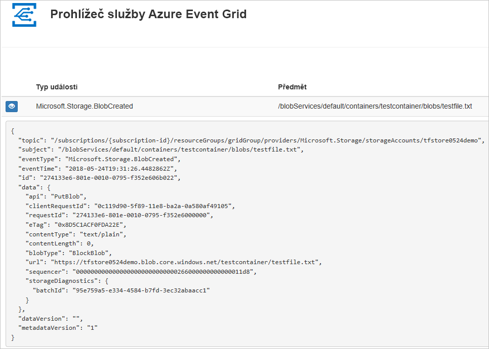
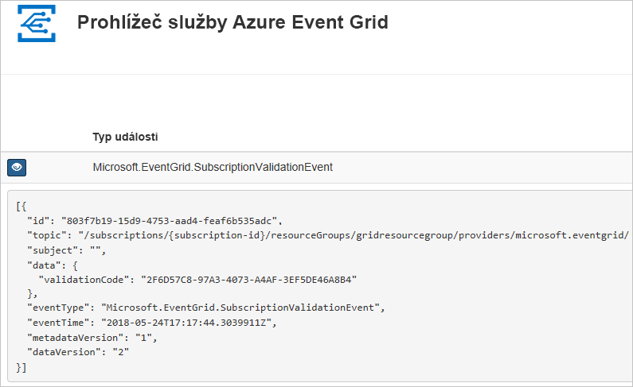

# <a name="quickstart-route-storage-events-to-web-endpoint-with-azure-cli"></a>Rychlý start: Směrování událostí úložiště na webový koncový bod pomocí rozhraní příkazového řádku Azure

Azure Event Grid je služba zpracování událostí pro cloud. V tomto článku se pomocí Azure CLI přihlásíte k odběru událostí služby Blob Storage a aktivujete událost, abyste viděli výsledek.

Obvykle odesíláte události do koncového bodu, který data události zpracuje a provede akce. Pro zjednodušení tohoto článku však budete události odesílat do webové aplikace, která shromažďuje a zobrazuje zprávy.

Po dokončení kroků popsaných v tomto článku uvidíte, že se data události odeslala do webové aplikace.




[!INCLUDE [quickstarts-free-trial-note.md](../../../includes/quickstarts-free-trial-note.md)]

[!INCLUDE [cloud-shell-try-it.md](../../../includes/cloud-shell-try-it.md)]

Pokud se rozhodnete nainstalovat a používat rozhraní příkazového řádku místně, tento článek vyžaduje, že používáte nejnovější verzi Azure CLI (2.0.24 nebo novější). Verzi zjistíte spuštěním příkazu `az --version`. Pokud potřebujete instalaci nebo upgrade, přečtěte si téma [Instalace Azure CLI](/cli/azure/install-azure-cli).

Pokud nepoužíváte Cloud Shell, musíte se nejprve přihlásit pomocí příkazu `az login`.

## <a name="create-a-resource-group"></a>Vytvoření skupiny prostředků

Témata služby Event Grid jsou prostředky Azure a musí být umístěné ve skupině prostředků Azure. Skupina prostředků je logická kolekce, ve které se nasazují a spravují prostředky Azure.

Vytvořte skupinu prostředků pomocí příkazu [az group create](/cli/azure/group#az_group_create). 

Následující příklad vytvoří skupinu prostředků `<resource_group_name>` v umístění *westcentralus*.  Nahraďte `<resource_group_name>` jedinečným názvem vaší skupiny prostředků.

```azurecli-interactive
az group create --name <resource_group_name> --location westcentralus
```

## <a name="create-a-storage-account"></a>vytvořit účet úložiště

Události služby Blob Storage jsou dostupné v účtech úložiště pro obecné účely verze 2 a v účtech Blob Storage. Účty úložiště pro **obecné účely verze 2** podporují všechny funkce ve všech službách úložiště, včetně objektů blob, souborů, front a tabulek. **Účet úložiště objektů blob** je specializovaný účet úložiště pro ukládání nestrukturovaných dat v podobě objektů blob do služby Azure Storage. Účty úložiště objektů blob jsou podobné účtům úložiště pro obecné účely a mají stejně vysokou odolnost, dostupnost, škálovatelnost a výkonnost, a navíc mají 100% konzistentnost rozhraní API pro objekty blob bloku a doplňovací objekty blob. Další informace najdete v tématu [Přehled účtu Azure Storage](../common/storage-account-overview.md).

Nahraďte `<storage_account_name>` jedinečným názvem vašeho účtu úložiště a `<resource_group_name>` skupinou prostředků, kterou jste vytvořili dříve.

```azurecli-interactive
az storage account create \
  --name <storage_account_name> \
  --location westcentralus \
  --resource-group <resource_group_name> \
  --sku Standard_LRS \
  --kind BlobStorage \
  --access-tier Hot
```

## <a name="create-a-message-endpoint"></a>Vytvoření koncového bodu zpráv

Před přihlášením k odběru tématu vytvoříme koncový bod pro zprávy události. Koncový bod obvykle provede akce na základě dat události. Pro zjednodušení tohoto rychlého startu nasadíte [předem připravenou webovou aplikaci](https://github.com/Azure-Samples/azure-event-grid-viewer), která zobrazuje zprávy události. Nasazené řešení zahrnuje plán služby App Service, webovou aplikaci App Service a zdrojový kód z GitHubu.

Nahraďte `<your-site-name>` jedinečným názvem vaší webové aplikace. Název webové aplikace musí být jedinečný, protože je součástí položky DNS.

```azurecli-interactive
sitename=<your-site-name>

az group deployment create \
  --resource-group <resource_group_name> \
  --template-uri "https://raw.githubusercontent.com/Azure-Samples/azure-event-grid-viewer/master/azuredeploy.json" \
  --parameters siteName=$sitename hostingPlanName=viewerhost
```

Dokončení nasazení může trvat několik minut. Po úspěšném nasazení si webovou aplikaci prohlédněte, abyste se ujistili, že funguje. Ve webovém prohlížeči přejděte na: `https://<your-site-name>.azurewebsites.net`

Měli byste vidět web aktuálně bez zobrazených zpráv.

[!INCLUDE [event-grid-register-provider-cli.md](../../../includes/event-grid-register-provider-cli.md)]

## <a name="subscribe-to-your-storage-account"></a>Přihlášení k odběru účtu úložiště

K odběru tématu se přihlašujete, aby služba Event Grid věděla, které události chcete sledovat a kam má tyto události odesílat. Následující příklad se přihlásí k odběru účtu úložiště, který jste vytvořili, a předá adresu URL z webové aplikace jako koncový bod pro oznámení události. Nahraďte řetězec `<event_subscription_name>` názvem odběru události. Místo `<resource_group_name>` a `<storage_account_name>` použijte hodnoty názvu skupiny prostředků a názvu účtu úložiště, které jste vytvořili dříve.

Koncový bod pro webovou aplikaci musí obsahovat příponu `/api/updates/`.

```azurecli-interactive
storageid=$(az storage account show --name <storage_account_name> --resource-group <resource_group_name> --query id --output tsv)
endpoint=https://$sitename.azurewebsites.net/api/updates

az eventgrid event-subscription create \
  --resource-id $storageid \
  --name <event_subscription_name> \
  --endpoint $endpoint
```

Podívejte se na webovou aplikaci znovu a všimněte si, že do ní byla odeslána událost ověření odběru. Vyberte ikonu oka a rozbalte data události. Služba Event Grid odešle událost ověření, aby koncový bod mohl ověřit, že data události chce přijímat. Webová aplikace obsahuje kód pro ověření odběru.



## <a name="trigger-an-event-from-blob-storage"></a>Aktivace události ze služby Blob Storage

Nyní aktivujeme událost, abychom viděli, jak služba Event Grid distribuuje zprávu do vašeho koncového bodu. Nejprve nakonfigurujeme název a klíč pro účet úložiště, vytvoříme kontejner a pak vytvoříme a nahrajeme soubor. Znovu místo `<storage_account_name>` a `<resource_group_name>` použijte hodnoty názvu účtu úložiště a názvu skupiny prostředků, které jste vytvořili dříve.

```azurecli-interactive
export AZURE_STORAGE_ACCOUNT=<storage_account_name>
export AZURE_STORAGE_ACCESS_KEY="$(az storage account keys list --account-name <storage_account_name> --resource-group <resource_group_name> --query "[0].value" --output tsv)"

az storage container create --name testcontainer

touch testfile.txt
az storage blob upload --file testfile.txt --container-name testcontainer --name testfile.txt
```

Právě jste aktivovali událost a služba Event Grid odeslala zprávu do koncového bodu, který jste nakonfigurovali při přihlášení k odběru. Podívejte se na webovou aplikaci, abyste si zobrazili událost, kterou jste právě odeslali.


```json
[{
  "topic": "/subscriptions/xxxxxxxx-xxxx-xxxx-xxxx-xxxxxxxxxxxx/resourceGroups/myrg/providers/Microsoft.Storage/storageAccounts/myblobstorageaccount",
  "subject": "/blobServices/default/containers/testcontainer/blobs/testfile.txt",
  "eventType": "Microsoft.Storage.BlobCreated",
  "eventTime": "2017-08-16T20:33:51.0595757Z",
  "id": "4d96b1d4-0001-00b3-58ce-16568c064fab",
  "data": {
    "api": "PutBlockList",
    "clientRequestId": "d65ca2e2-a168-4155-b7a4-2c925c18902f",
    "requestId": "4d96b1d4-0001-00b3-58ce-16568c000000",
    "eTag": "0x8D4E4E61AE038AD",
    "contentType": "text/plain",
    "contentLength": 0,
    "blobType": "BlockBlob",
    "url": "https://myblobstorageaccount.blob.core.windows.net/testcontainer/testblob1.txt",
    "sequencer": "00000000000000EB0000000000046199",
    "storageDiagnostics": {
      "batchId": "dffea416-b46e-4613-ac19-0371c0c5e352"
    }
  },
  "dataVersion": "",
  "metadataVersion": "1"
}]

```

## <a name="clean-up-resources"></a>Vyčištění prostředků
Pokud chcete pokračovat v práci s tímto účtem úložiště a odběru událostí, nevyčišťujte prostředky vytvořené v rámci tohoto článku. Pokud pokračovat nechcete, pomocí následujícího příkazu odstraňte prostředky, které jste v rámci tohoto článku vytvořili.

Nahraďte `<resource_group_name>` názvem skupiny prostředků, kterou jste vytvořili výše.

```azurecli-interactive
az group delete --name <resource_group_name>
```

## <a name="next-steps"></a>Další postup

Když teď víte, jak vytvářet témata a odběry událostí, zjistěte více o událostech služby Blob Storage a s čím vám služba Event Grid ještě může pomoct:

- [Reakce na události služby Blob Storage](storage-blob-event-overview.md)
- [Informace o službě Event Grid](../../event-grid/overview.md)
