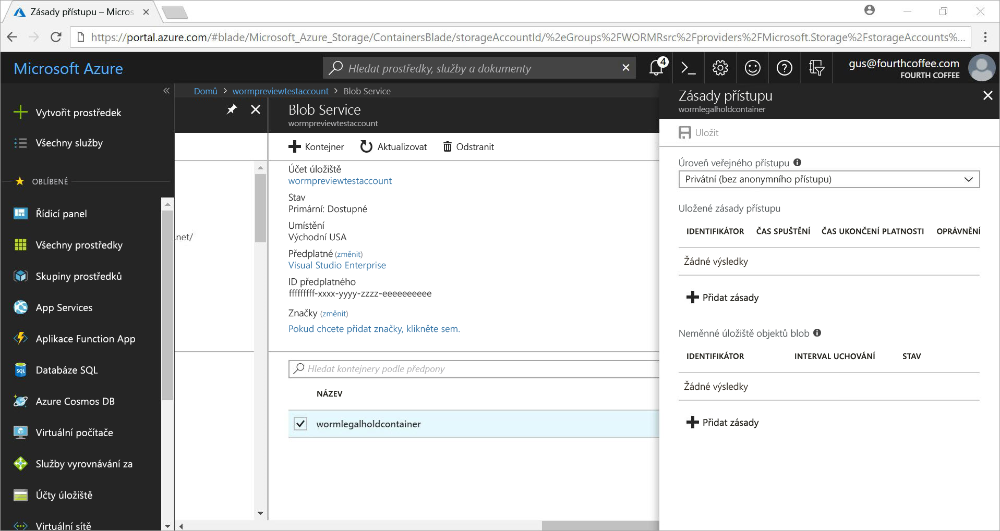
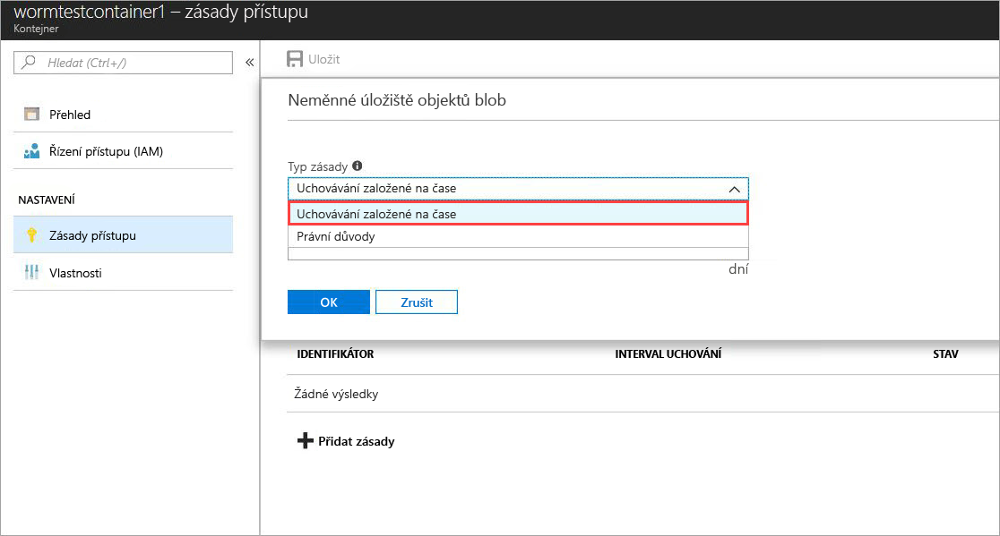
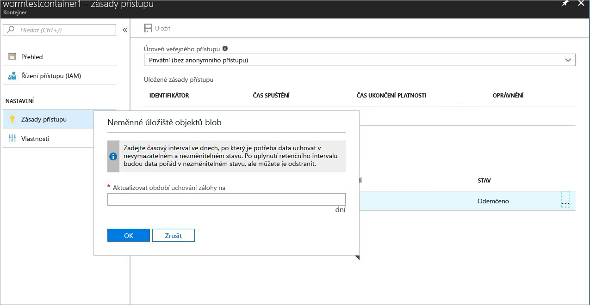
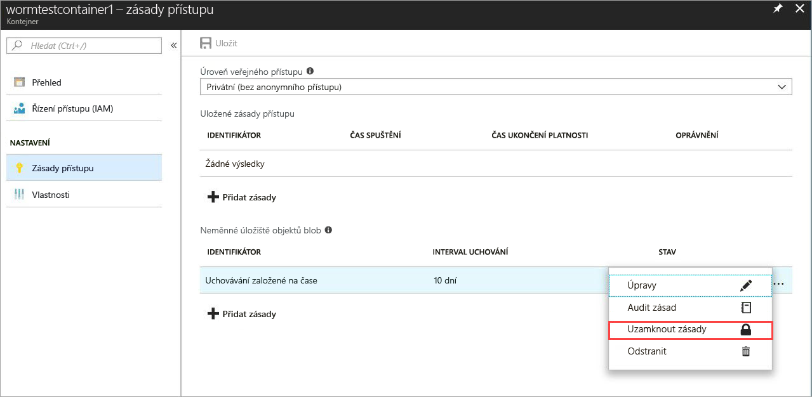
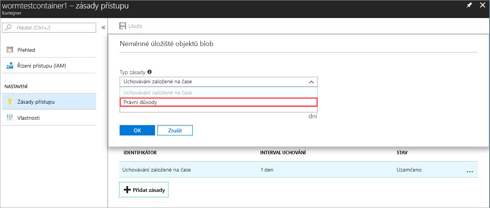
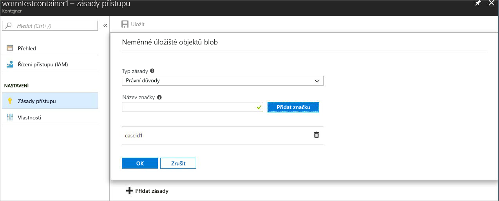

# <a name="store-business-critical-data-in-azure-blob-storage-preview"></a>Store důležitých podnikových dat ve službě Azure Blob storage (preview)

Neměnné úložiště pro úložiště objektů Blob v Azure (objekt) umožňuje uživatelům k ukládání důležitých podnikových dat ve stavu ČERV (zápis, mnoho čtení). Tento stav vytvoří data nepůjdou a neupravitelnými intervalu zadané uživatelem. Objekty BLOB nelze vytvořit a číst, ale upravit nebo odstranit po dobu trvání interval uchovávání informací.

## <a name="overview"></a>Přehled

Neměnné úložiště pomáhá finanční instituce a souvisejících oborech – zejména zprostředkovatele – aby mohla organizace – se zabezpečeně ukládat data.

Mezi typické případy použití patří:

- **Dodržování legislativních předpisů**: neměnné úložiště pro úložiště objektů Blob v Azure pomáhá 17a-4(f) adresu Sekundu organizace, 1.31(d) CFTC, FINRA a nařízení.

- **Zabezpečení dokumentu uchování**: Blob storage se zajistí, že data nelze změnit ani odstranit, každý uživatel, včetně uživatelů s oprávněním správce účtu.

- **Blokování z právních důvodů**: neměnné úložiště pro úložiště objektů Blob v Azure umožňuje ukládání citlivých informací, které je zásadní pro sporu nebo vyšetřování trestného ve stavu odolného proti požadovanou dobu.

Neměnné úložiště umožňuje:

- **Podpora zásad uchovávání informací podle času**: uživatelé nastavení zásad pro ukládání dat pro zadaný interval.

- **Podpora zásad blokování z právních důvodů**: Pokud není známý interval uchovávání informací, uživatelé mohou nastavit právních immutably ukládat data, dokud se vymazat blokování z právních důvodů.  Když je nastavené blokování z právních důvodů, objekty blob je možné vytvářet a číst, ale ne upravovat nebo odstraňovat. Každé skupiny s povinností uchování souvisí s uživatelem definované alfanumerické značku, která se používá jako identifikátor řetězce (třeba ID případu).

- **Podpora pro všechny úrovně objektu blob**: ČERV zásady platí bez ohledu na úroveň úložiště objektů Blob v Azure a použít na všech úrovních: horká, studená a archivní úrovně. Uživatelé mohou ukládat data na úrovni optimalizovaných náklady pro své úlohy při zachování dat neměnnosti.

- **Konfigurace na úrovni kontejneru**: uživatelé můžou konfigurovat zásady uchovávání informací podle času a blokování z právních důvodů značek na úrovni kontejneru. S použitím jednoduché nastavení na úrovni kontejneru, uživatelé můžou vytvářet a zamknout zásady uchovávání informací podle času; rozšíření intervaly uchovávání informací; nastavit a zrušit právních; a další. Tyto zásady platí pro všechny objekty BLOB v kontejneru, stávající i nové.

- **Podpora protokolování auditu**: každý kontejner obsahuje protokolu auditu. Zobrazuje až o pěti uchovávání informací podle času příkazy pro zásady uzamčené uchovávání informací podle času s délkou maximálně tři protokoly pro rozšíření interval uchovávání informací. Protokol pro uchovávání informací podle času, obsahuje ID uživatele, typ příkazu, časová razítka a interval uchovávání informací. Pro právních důvodů protokol obsahuje ID uživatele, typ příkazu, časová razítka a značky blokování z právních důvodů. Tento protokol se uchovávají po dobu jeho existence kontejneru, v souladu s pokyny k dodržování legislativních 17a-4(f) Sekundu. [Protokolu aktivit Azure](https://docs.microsoft.com/azure/monitoring-and-diagnostics/monitoring-overview-activity-logs) zobrazuje aktivity roviny komplexnější protokolu všechny ovládacího prvku. Zodpovídá za uživatele k ukládání těchto protokolů trvale, jak může být nezbytný pro zákonné nebo jiné účely.

Neměnné úložiště je povolené ve všech veřejných oblastech Azure.

## <a name="how-it-works"></a>Jak to funguje

Neměnné úložiště pro úložiště objektů Blob v Azure podporuje dva typy ČERV nebo neměnné zásady: uchovávání informací podle času a právních důvodů. Podrobnosti o tom, jak vytvořit tyto neměnné zásady najdete v tématu [Začínáme](#Getting-started) oddílu.

Pokud zásady uchovávání informací podle času nebo blokování z právních důvodů se použije na kontejner, všechny existující objekty BLOB přesunout do neměnný (zápisu a odstranění chráněné) stavu. Všechny nové objekty BLOB, které se nahrají do kontejneru se přesunou také k neměnného stavu.

> [!IMPORTANT]
> Zásady uchovávání informací podle času musí být *uzamčen* pro objekt blob ve neměnné (zápisu a odstranění chráněné) stavu Sekundu 17a-4(f) a dalších dodržování legislativních předpisů. Doporučujeme, abyste zamknout zásady v rozumném čase, obvykle během 24 hodin. Nedoporučujeme ale používat *odemknout* stavu jiným účelům, než krátkodobé zkušební verze funkce.

Při použití zásad uchovávání informací podle času na kontejner všechny objekty BLOB v kontejneru zůstanou v neměnného stavu po dobu trvání *efektivní* dobu uchování. Efektivní doba uchovávání informací pro stávající objekty blob se rovná rozdílu mezi časem vytvoření objektu blob a uživatelem zadaným intervalem uchovávání informací. 

Pro nové objekty blob se efektivní doba uchovávání informací rovná uživatelem zadanému intervalu uchovávání informací. Vzhledem k tomu, že uživatelé mohou změnit interval uchovávání informací, neměnné úložiště používá k výpočtu doby uchování efektivní nejnovější hodnotu Interval uchovávání informací zadané uživatelem.

> [!TIP]
> Příklad:
> 
> Uživatel vytvoří zásadu uchovávání informací podle času s intervalem uchovávání po dobu pěti let.
>
> Existující objekt blob v kontejneru, testblob1, byl vytvořen před rokem. Doba uchování efektivní testblob1 je 4 roky.
>
> Do kontejneru se nahraje nový objekt blob testblob2. Doby uchování efektivní pro tento nový objekt blob je pět let.

### <a name="legal-holds"></a>Blokování z právních důvodů

Při nastavení blokování z právních důvodů, zůstávají všechny stávající i nové objekty BLOB v neměnného stavu, dokud vymazat blokování z právních důvodů. Další informace o tom, jak sada a vymazat právních důvodů, najdete v článku [Začínáme](#Getting-started) oddílu.

Kontejner můžete mít skupiny s povinností uchování a zásadu uchovávání informací podle času ve stejnou dobu. Všechny objekty BLOB v tomto kontejneru zůstat v neměnného stavu, dokud všechny právních důvodů jsou vymazány, i v případě, že vypršela platnost jejich efektivní uchovávají. Naopak objekt blob zůstanou v neměnného stavu do vypršení platnosti doby uchování efektivní, i v případě, že byly odstraněny všechny právních důvodů.

V následující tabulce jsou uvedeny typy operace objektů blob, které jsou zakázané pro různé scénáře neměnné. Další informace najdete v tématu [rozhraní API služby Azure Blob Service](https://docs.microsoft.com/rest/api/storageservices/blob-service-rest-api) dokumentaci.

|Scénář  |Stav objektu BLOB  |Není povolena operace objektů BLOB  |
|---------|---------|---------|
|Efektivní interval uchovávání informací pro objekt blob ještě nevypršel a/nebo je nastavené blokování z právních důvodů     |Neměnné: chráněné proti odstranění i zápisu         |Delete Container, Delete Blob, Put Blob1, Put Block, Put Block List, Set Blob Metadata, Put Page, Set Blob Properties, Snapshot Blob, Incremental Copy Blob, Append Block         |
|Vypršel efektivní interval uchovávání informací pro objekt blob     |Chráněné pouze proti zápisu (operace odstranění jsou povolené)         |Put Blob, Put Block, Put Block List, Set Blob Metadata, Put Page, Set Blob Properties, Snapshot Blob, Incremental Copy Blob, Append Block         |
|Obsahuje všechny právní nezaškrtnuté a nejsou nastavené žádné zásady uchovávání informací podle času v kontejneru     |Měnitelné         |Žádný         |
|Žádné zásady ČERV vytvořena (uchovávání informací podle času nebo skupiny s povinností uchování)     |Měnitelné         |Žádný         |

> [!NOTE]
> První Put Blob a vložit seznam blokovaných a umístěte blok operace, které jsou potřebné k vytvoření objektu blob, jsou povoleny v prvních dvou scénářů v předchozí tabulce. Všechny následné operace nejsou povoleny.
>
> Neměnné úložiště je k dispozici pouze v účtech GPv2 a Blob storage. Musí být vytvořeny prostřednictvím [Azure Resource Manageru](https://docs.microsoft.com/azure/azure-resource-manager/resource-group-overview).

## <a name="pricing"></a>Ceny

Neexistuje žádné další poplatky za použití této funkce. Stejným způsobem jako regulární proměnlivých dat vychází z neměnnými daty. Podrobnosti o cenách najdete v článku [stránce s cenami služby Azure Storage](https://azure.microsoft.com/pricing/details/storage/blobs/).

### <a name="restrictions"></a>Omezení

Během období Public Preview platí následující omezení:

- *Neukládejte produkční nebo důležitá obchodní data.*
- Všechny verze preview a smlouvu NDA pro omezení platí.

## <a name="getting-started"></a>Začínáme

Nejnovější verze [webu Azure portal](http://portal.azure.com), [příkazového řádku Azure CLI 2.0](https://docs.microsoft.com/cli/azure/install-azure-cli?view=azure-cli-latest), a [prostředí Azure PowerShell](https://github.com/Azure/azure-powershell/releases/tag/Azure.Storage.v4.4.0-preview-May2018) podporují neměnné úložiště pro úložiště objektů Blob v Azure.

### <a name="azure-portal"></a>portál Azure

1. Vytvořte nový kontejner nebo vyberte stávající kontejner pro uložení objektů blob, které je potřeba zachovat v neměnném stavu.
 Kontejner se musí nacházet v účtu úložiště GPv2.
2. Vyberte **zásada přístupu** v nastavení kontejneru. Potom vyberte **přidat zásadu** pod **neměnná služba blob storage**.

    

3. Chcete-li povolit uchovávání informací podle času, vyberte **uchovávání informací podle času** z rozevírací nabídky.

    

4. Zadejte interval uchovávání informací ve dnech (minimálně je jeden den).

    

    Jak je vidět na snímku obrazovky, počáteční stav zásad je odemknuté. Může otestovat funkci s menší interval uchovávání informací a změny zásad před jej uzamknout. Uzamčení je zásadní pro dodržování předpisů jako Sekundu 17a – 4.

5. Zamkněte zásady. Klikněte pravým tlačítkem na tři tečky (**...** ), a zobrazí se následující nabídky:

    

    Vyberte **zásady uzamčení**, a stav zásad se teď zobrazí podle uzamčené. Až se zásady uzamknou, se nedá odstranit a povolí se jenom rozšíření interval uchovávání informací.

6. Chcete-li povolit právních důvodů, vyberte **přidat zásadu**. Vyberte **blokování z právních důvodů** z rozevírací nabídky.

    

7. Vytvoření skupiny s povinností uchování pomocí jedné nebo více značek.

    

### <a name="azure-cli-20"></a>Azure CLI 2.0

Nainstalujte [rozšíření rozhraní příkazového řádku Azure](http://docs.microsoft.com/cli/azure/install-azure-cli?view=azure-cli-latest) pomocí `az extension add -n storage-preview`.

Pokud již máte nainstalované rozšíření, použijte následující příkaz k povolení neměnné úložiště: `az extension update -n storage-preview`.

Tato funkce je součástí skupiny následující příkaz: `az storage container immutability-policy` a `az storage container legal-hold`. Spustit `-h` na ně podívat na příkazy.

### <a name="powershell"></a>PowerShell

[Prostředí PowerShell verze 4.4.0-preview](https://github.com/Azure/azure-powershell/releases/tag/Azure.Storage.v4.4.0-preview-May20180) podporuje neměnné úložiště.
Chcete-li tuto funkci povolit, postupujte takto:

1. Ujistěte se, že máte nejnovější verzi modulu PowerShellGet nainstalovaný: `Install-Module PowerShellGet –Repository PSGallery –Force`.
2. Odebrání jakékoli předchozí instalace Azure Powershellu.
3. Instalace AzureRM: `Install-Module AzureRM –Repository PSGallery –AllowClobber`. Azure je podobně nainstalovat z tohoto úložiště.
4. Nainstalujte rutiny roviny správy úložiště ve verzi preview: `Install-Module -Name AzureRM.Storage -AllowPrerelease -Repository PSGallery -AllowClobber`.

[Powershellu ukázkový kód](#sample-powershell-code) části dále v tomto článku znázorňuje používání funkcí.

## <a name="client-libraries"></a>Klientské knihovny

Tyto klientské knihovny podporují neměnné úložiště pro úložiště objektů Blob v Azure:

- [Klientská knihovna pro .NET verze 7.2.0-preview a novější](https://www.nuget.org/packages/Microsoft.Azure.Management.Storage/7.2.0-preview)
- [Klientské knihovny pro Node.js verze 4.0.0 a novější](https://www.npmjs.com/package/azure-arm-storage)
- [Klientská knihovna Python verze 2.0.0 verze Release Candidate, 2 a novější](https://pypi.org/project/azure-mgmt-storage/2.0.0rc1/)

## <a name="supported-values"></a>Podporované hodnoty

- Minimální interval je za jeden den. Maximální počet je 400 let.
- Maximální počet kontejnerů uzamčené neměnné zásadami pro účet úložiště je 1 000.
- Maximální počet kontejnerů pomocí nastavení skupiny s povinností uchování pro účet úložiště je 1 000.
- Pro kontejner maximálního počtu značek skupiny s povinností uchování je 10.
- Maximální délka značku blokování z právních důvodů je 23 alfanumerických znaků. Minimální délka je tři znaky.
- Pro kontejner je maximální počet povolených uchování interval rozšíření pro uzamčené neměnné zásady tři.
- Pro kontejner s uzamčené neměnné zásady uchování maximálně pět protokoly zásad uchovávání informací podle času a maximálně 10 právní zásady, které protokoly se uchovávají po dobu trvání kontejneru.

## <a name="faq"></a>Nejčastější dotazy

**Platí jenom objekty BLOB bloku, nebo pro stránky a doplňovací objekty BLOB také funkci?**

Neměnné úložiště lze použít s žádným typem objektů blob.  Ale doporučujeme používat hlavně pro objekty BLOB bloku. Na rozdíl od objekty BLOB bloku objekty BLOB stránky a doplňovací objekty BLOB se musí vytvořit mimo kontejner ČERV a poté zkopírován v. Po zkopírování těchto objektů BLOB do kontejneru ČERV, ne další *připojí* připojit jsou povoleny změny pro objekt blob stránky nebo objekt blob.

**Je pro použití této funkce potřeba vždy vytvářet nový účet úložiště?**

Neměnné úložiště můžete použít některé existující účty GPv2 nebo na nové účty úložiště, pokud je typ účtu GPv2. Tato funkce je k dispozici pouze s úložištěm objektů Blob.

**Co se stane, když se pokusím odstranit kontejner s *uzamknutou* zásadou uchovávání informací podle času nebo blokováním z právních důvodů?**

Operace odstranění kontejneru se nezdaří, pokud je alespoň jeden objekt blob se zásadami uzamčené uchovávání informací podle času nebo skupiny s povinností uchování. To platí i v případě, že data jsou [obnovitelné odstranění](storage-blob-soft-delete.md). Operace odstranění kontejneru bude úspěšná, pokud neobsahuje žádný objekt blob s aktivním intervalem uchovávání informací a pokud v něm nejsou žádná blokování z právních důvodů. Než budete moct odstranit kontejner je nutné odstranit objekty BLOB. 

**Co se stane, když se pokusím odstranit účet úložiště obsahující kontejner WORM s *uzamknutou* zásadou uchovávání informací podle času nebo blokováním z právních důvodů?**

Odstranění účtu úložiště selže, pokud obsahuje alespoň jeden kontejner WORM s blokováním z právních důvodů nebo objektem blob s aktivním intervalem uchovávání informací.  Než budete moct odstranit účet úložiště, je nutné odstranit všechny kontejnery ČERV. Informace o odstranění kontejneru najdete v předchozí otázce.

**Můžu přesouvat data mezi různými úrovněmi objektu blob (horká, studená, archivní), když je objekt blob v neměnném stavu?**

Ano, pomocí příkazu Set Blob Tier můžete přesouvat data mezi úrovněmi objektu blob, zatímco jsou data stále v neměnném stavu. Neměnné úložiště je podporována u objektů blob v horké, studené a studené úrovně.

**Co se stane, když zapomenu zaplatit a můj interval uchovávání informací ještě nevypršel?**

V případě neuhrazení zásady uchovávání informací normální data použije stanovené v podmínky a ujednání smlouvy s Microsoftem.

**Nabízíte zkušební období nebo období odkladu pouze na vyzkoušení této funkce?**

Ano. Při prvním vytvoření zásady uchovávání informací podle času je *odemknout* stavu. V tomto stavu můžete provádět požadované změny pro interval uchovávání informací, jako je například zvýšení nebo snížení a dokonce odstranit zásady. Jakmile se zásady uzamknou, zůstane uzamčen forever, brání odstranění. Navíc není možné zkrátit interval uchovávání informací, když je zásada uzamknutá. Důrazně doporučujeme používat *odemknout* pouze pro zkušební účely a zamknout zásady v období 24 hodin. Tyto postupy umožňují v souladu s Sekundu 17a-4(f) a nařízení.

**Je tato funkce dostupná v národních cloudech a cloudech pro státní správu?**

Neměnné úložiště je aktuálně dostupná jenom v oblastech Azure. Pokud vás zajímají konkrétní národních cloudů, e-mailu azurestoragefeedback@microsoft.com.

## <a name="sample-powershell-code"></a>Ukázkový kód Powershellu

Následující ukázkový skript Powershellu se pro referenci. Tento skript vytvoří nový účet úložiště a kontejner. To potom se dozvíte, jak nastavit a zrušte právních důvodů, vytvořit a zamknout zásady uchovávání informací podle času (označované také jako zásady neměnnosti) a rozšiřte interval uchovávání informací.

```powershell
$ResourceGroup = "<Enter your resource group>”
$StorageAccount = "<Enter your storage account name>"
$container = "<Enter your container name>"
$container2 = "<Enter another container name>”
$location = "<Enter the storage account location>"

# Log in to the Azure Resource Manager account
Login-AzureRMAccount
Register-AzureRmResourceProvider -ProviderNamespace "Microsoft.Storage"

# Create your Azure resource group
New-AzureRmResourceGroup -Name $ResourceGroup -Location $location

# Create your Azure storage account
New-AzureRmStorageAccount -ResourceGroupName $ResourceGroup -StorageAccountName `
    $StorageAccount -SkuName Standard_LRS -Location $location -Kind Storage

# Create a new container
New-AzureRmStorageContainer -ResourceGroupName $ResourceGroup `
    -StorageAccountName $StorageAccount -Name $container

# Create Container 2 with a storage account object
$accountObject = Get-AzureRmStorageAccount -ResourceGroupName $ResourceGroup `
    -StorageAccountName $StorageAccount
New-AzureRmStorageContainer -StorageAccount $accountObject -Name $container2

# Get a container
Get-AzureRmStorageContainer -ResourceGroupName $ResourceGroup `
    -StorageAccountName $StorageAccount -Name $container

# Get a container with an account object
$containerObject = Get-AzureRmStorageContainer -StorageAccount $accountObject -Name $container

# List containers
Get-AzureRmStorageContainer -ResourceGroupName $ResourceGroup `
    -StorageAccountName $StorageAccount

# Remove a container (add -Force to dismiss the prompt)
Remove-AzureRmStorageContainer -ResourceGroupName $ResourceGroup `
    -StorageAccountName $StorageAccount -Name $container2

# Remove a container with an account object
Remove-AzureRmStorageContainer -StorageAccount $accountObject -Name $container2

# Remove a container with a container object
$containerObject2 = Get-AzureRmStorageContainer -StorageAccount $accountObject -Name $container2
Remove-AzureRmStorageContainer -InputObject $containerObject2

# Set a legal hold
Add-AzureRmStorageContainerLegalHold -ResourceGroupName $ResourceGroup `
    -StorageAccountName $StorageAccount -Name $container -Tag tag1,tag2

# Set a legal hold with an account object
Add-AzureRmStorageContainerLegalHold -StorageAccount $accountObject -Name $container -Tag tag3

# Set a legal hold with a container object
Add-AzureRmStorageContainerLegalHold -Container $containerObject -Tag tag4,tag5

# Clear a legal hold
Remove-AzureRmStorageContainerLegalHold -ResourceGroupName $ResourceGroup `
    -StorageAccountName $StorageAccount -Name $container -Tag tag2

# Clear a legal hold with an account object
Remove-AzureRmStorageContainerLegalHold -StorageAccount $accountObject -Name $container -Tag tag3,tag5

# Clear a legal hold with a container object
Remove-AzureRmStorageContainerLegalHold -Container $containerObject -Tag tag4

# Create or update an immutability policy
## with an account name or container name

Set-AzureRmStorageContainerImmutabilityPolicy -ResourceGroupName $ResourceGroup `
    -StorageAccountName $StorageAccount -ContainerName $container -ImmutabilityPeriod 10

## with an account object
Set-AzureRmStorageContainerImmutabilityPolicy -StorageAccount $accountObject `
    -ContainerName $container -ImmutabilityPeriod 1 -Etag $policy.Etag

## with a container object
$policy = Set-AzureRmStorageContainerImmutabilityPolicy -Container `
    $containerObject -ImmutabilityPeriod 7

## with an immutability policy object
Set-AzureRmStorageContainerImmutabilityPolicy -ImmutabilityPolicy $policy -ImmutabilityPeriod 5

# Get an immutability policy
Get-AzureRmStorageContainerImmutabilityPolicy -ResourceGroupName $ResourceGroup `
    -StorageAccountName $StorageAccount -ContainerName $container

# Get an immutability policy with an account object
Get-AzureRmStorageContainerImmutabilityPolicy -StorageAccount $accountObject `
    -ContainerName $container

# Get an immutability policy with a container object
Get-AzureRmStorageContainerImmutabilityPolicy -Container $containerObject

# Lock an immutability policy (add -Force to dismiss the prompt)
## with an immutability policy object

$policy = Get-AzureRmStorageContainerImmutabilityPolicy -ResourceGroupName `
    $ResourceGroup -StorageAccountName $StorageAccount -ContainerName $container
$policy = Lock-AzureRmStorageContainerImmutabilityPolicy -ImmutabilityPolicy $policy -force

## with an account name or container name
$policy = Lock-AzureRmStorageContainerImmutabilityPolicy -ResourceGroupName `
    $ResourceGroup -StorageAccountName $StorageAccount -ContainerName $container `
    -Etag $policy.Etag

## with an account object
$policy = Lock-AzureRmStorageContainerImmutabilityPolicy -StorageAccount `
    $accountObject -ContainerName $container -Etag $policy.Etag

## with a container object
$policy = Lock-AzureRmStorageContainerImmutabilityPolicy -Container `
    $containerObject -Etag $policy.Etag -force

# Extend an immutability policy
## with an immutability policy object

$policy = Get-AzureRmStorageContainerImmutabilityPolicy -ResourceGroupName `
    $ResourceGroup -StorageAccountName $StorageAccount -ContainerName $container

$policy = Set-AzureRmStorageContainerImmutabilityPolicy -ImmutabilityPolicy `
    $policy -ImmutabilityPeriod 11 -ExtendPolicy

## with an account name or container name
$policy = Set-AzureRmStorageContainerImmutabilityPolicy -ResourceGroupName `
    $ResourceGroup -StorageAccountName $StorageAccount -ContainerName $container `
    -ImmutabilityPeriod 11 -Etag $policy.Etag -ExtendPolicy

## with an account object
$policy = Set-AzureRmStorageContainerImmutabilityPolicy -StorageAccount `
    $accountObject -ContainerName $container -ImmutabilityPeriod 12 -Etag `
    $policy.Etag -ExtendPolicy

## with a container object
$policy = Set-AzureRmStorageContainerImmutabilityPolicy -Container `
    $containerObject -ImmutabilityPeriod 13 -Etag $policy.Etag -ExtendPolicy

# Remove an immutability policy (add -Force to dismiss the prompt)
## with an immutability policy object
$policy = Get-AzureRmStorageContainerImmutabilityPolicy -ResourceGroupName `
    $ResourceGroup -StorageAccountName $StorageAccount -ContainerName $container
Remove-AzureRmStorageContainerImmutabilityPolicy -ImmutabilityPolicy $policy

## with an account name or container name
Remove-AzureRmStorageContainerImmutabilityPolicy -ResourceGroupName `
    $ResourceGroup -StorageAccountName $StorageAccount -ContainerName $container `
    -Etag $policy.Etag

## with an account object
Remove-AzureRmStorageContainerImmutabilityPolicy -StorageAccount $accountObject `
    -ContainerName $container -Etag $policy.Etag

## with a container object
Remove-AzureRmStorageContainerImmutabilityPolicy -Container $containerObject `
    -Etag $policy.Etag
    
```
