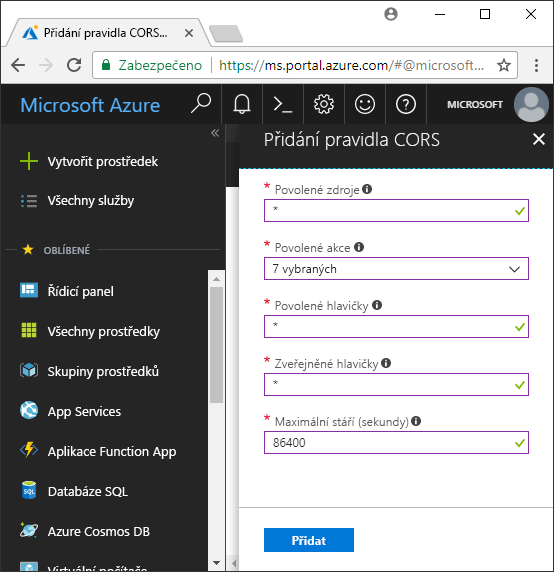

<!-- Customer intent: As a web application developer I want to interface with Azure Blob storage entirely on the client so that I can build a SPA application that is able to upload and delete files on blob storage. -->

# <a name="quickstart-upload-list-and-delete-blobs-using-javascripthtml-in-the-browser"></a>Rychlý start: Nahrávání, vypisování a odstraňování objektů blob pomocí JavaScriptu a HTML v prohlížeči
Tento rychlý start předvádí správu objektů blob z kódu spuštěného zcela v prohlížeči. Níže použitý přístup ukazuje, jak používat požadovaná bezpečnostní opatření pro zajištění chráněného přístupu k účtu úložiště objektů blob. K dokončení tohoto rychlého startu potřebujete [předplatné Azure](https://azure.microsoft.com/free/?WT.mc_id=A261C142F).

[!INCLUDE [storage-quickstart-tutorial-create-account-portal](../../../includes/storage-quickstart-tutorial-create-account-portal.md)]

## <a name="setting-up-storage-account-cors-rules"></a>Nastavení pravidel CORS pro účet úložiště 
Než vaše webová aplikace získá přístup k úložišti objektů blob z klienta, musí se účet nakonfigurovat tak, aby umožňoval [sdílení prostředků různého původu](https://docs.microsoft.com/rest/api/storageservices/cross-origin-resource-sharing--cors--support-for-the-azure-storage-services) neboli CORS. 

Vraťte se na web Azure Portal a vyberte svůj účet úložiště. Pokud chcete definovat nové pravidlo CORS, vraťte se do části **Nastavení** a klikněte na odkaz **CORS**. Pak kliknutím na tlačítko **Přidat** otevřete okno **Přidat pravidlo CORS**. Pro účely tohoto rychlého startu vytvoříte otevřené pravidlo CORS:



Následující tabulka obsahuje popis jednotlivých nastavení CORS a vysvětlení hodnot použitých k definici pravidla.

|Nastavení  |Hodnota  | Popis |
|---------|---------|---------|
| Povolené zdroje | * | Přijímá čárkami oddělený seznam domén nastavených jako přijatelné zdroje. Nastavením této hodnoty na `*` se povolí přístup k účtu úložiště ze všech domén. |
| Povolené příkazy     | delete, get, head, merge, post, options a put | Uvádí povolené příkazy HTTP, které je možné spouštět proti účtu úložiště. Pro účely tohoto rychlého startu vyberte všechny dostupné možnosti. |
| Povolené hlavičky | * | Definuje seznam hlaviček požadavku (včetně hlaviček s předponou), které účet úložiště povoluje. Nastavením této hodnoty na `*` se povolí přístup všem hlavičkám. |
| Zveřejněné hlavičky | * | Uvádí hlavičky odpovědi, které účet povoluje. Nastavením této hodnoty na `*` se účtu povolí odesílání jakýchkoli hlaviček.  |
| Maximální stáří (sekundy) | 86400 | Maximální doba, po kterou prohlížeč uchovává předběžné požadavky OPTIONS v mezipaměti. Hodnota *86400* povolí uchování v mezipaměti po celý den. |

> [!IMPORTANT]
> Abyste zajistili zabezpečený přístup, ujistěte se, že všechna nastavení použitá v produkčním prostředí zveřejňují minimální potřebnou úroveň přístupu k účtu úložiště. Zde popsaná nastavení CORS jsou vhodná pro účely rychlého startu, protože definují mírné zásady zabezpečení. Tato nastavení se však nedoporučují pro kontext skutečného světa.

Dále pomocí služby Azure Cloud Shell vytvoříte token zabezpečení.

[!INCLUDE [Open the Azure cloud shell](../../../includes/cloud-shell-try-it.md)]

## <a name="create-a-shared-access-signature"></a>Vytvoření sdíleného přístupového podpisu
Sdílený přístupový podpis (SAS) se používá v kódu spuštěném v prohlížeči k autorizaci požadavků na úložiště objektů blob. Díky použití SAS může klient autorizovat přístup k prostředkům úložiště, aniž by měl přístupový klíč nebo připojovací řetězec účtu. Další informace o SAS najdete v tématu [Použití sdílených přístupových podpisů (SAS)](../common/storage-dotnet-shared-access-signature-part-1.md).

SAS můžete vytvořit pomocí Azure CLI ve službě Azure Cloud Shell nebo pomocí Průzkumníka služby Azure Storage. Následující tabulka obsahuje popis parametrů, pro které je potřeba zadat hodnoty, aby se pomocí CLI vygeneroval SAS.

| Parametr      |Popis  | Zástupný symbol |
|----------------|-------------|-------------|
| *expiry*       | Datum vypršení platnosti přístupového tokenu ve formátu RRRR-MM-DD. Pro účely tohoto rychlého startu zadejte zítřejší datum. | *FUTURE_DATE* |
| *account-name* | Název účtu úložiště. Použijte název, který jste si poznamenali v dřívějším kroku. | *YOUR_STORAGE_ACCOUNT_NAME* |
| *account-key*  | Klíč účtu úložiště. Použijte klíč, který jste si poznamenali v dřívějším kroku. | *YOUR_STORAGE_ACCOUNT_KEY* |

Následující skript pomocí Azure CLI vytvoří SAS, který můžete předat službě objektů blob v JavaScriptu.

> [!NOTE]
> V zájmu dosažení co nejlepších výsledků odeberte před vložením příkazu do služby Azure Cloud Shell nadbytečné mezery.

```bash
az storage account generate-sas
                    --permissions racwdl
                    --resource-types sco
                    --services b
                    --expiry FUTURE_DATE
                    --account-name YOUR_STORAGE_ACCOUNT_NAME
                    --account-key YOUR_STORAGE_ACCOUNT_KEY
```
Několik hodnot uvedených za jednotlivými parametry je možná trochu nesrozumitelných. Tyto hodnoty parametrů představují první písmeno odpovídajícího oprávnění. Následující tabulka vysvětluje, odkud hodnoty pochází: 

| Parametr        | Hodnota   | Popis  |
|------------------|---------|---------|
| *permissions*    | racwdl  | Tento SAS povoluje funkce *read* (čtení), *append* (připojení), *create* (vytvoření), *write* (zápis), *delete* (odstranění) a *list* (výpis). |
| *resource-types* | sco     | Tento SAS ovlivňuje prostředky *service* (služba), *container* (kontejner) a *object* (objekt). |
| *services*       | b       | Tento SAS ovlivňuje službu *Blob* Service. |

Teď, když je SAS vygenerovaný, zkopírujte hodnotu vrácenou v konzole do svého textového editoru. Tuto hodnotu použijete v dalším kroku.

> [!IMPORTANT]
> V produkčním prostředí vždy předávejte tokeny SAS pomocí SSL. Kromě toho by se tokeny SAS měly generovat na serveru a odesílat na stránku HTML, která je předá zpět do služby Azure Blob Storage. Jedním z přístupů, které můžete zvážit, je generování tokenů SAS pomocí funkce bez serveru. Azure Portal obsahuje šablony funkcí, které zahrnují možnost generovat SAS pomocí funkce JavaScriptu.

## <a name="implement-the-html-page"></a>Implementace stránky HTML

### <a name="set-up-the-web-application"></a>Nastavení webové aplikace
Klientské knihovny služby Azure Storage pro JavaScript nebudou fungovat přímo v systému souborů a musí se obsluhovat z webového serveru. Následující kroky proto podrobně popisují použití jednoduchého místního webového serveru s Node.js.

> [!NOTE]
> V této části se dozvíte, jak vytvořit místní webový server, který vyžaduje, aby na vašem počítači bylo nainstalované Node.js. Pokud nechcete instalovat Node.js, můžete místní webový server spustit jakýmkoli jiným způsobem.

Nejprve pro svůj projekt vytvořte novou složku *azure-blobs-javascript*. Dále otevřete příkazový řádek ve složce *azure-blobs-javascript* a připravte aplikaci na instalaci modulu webového serveru zadáním následujícího příkazu:

```bash
npm init -y
```
Spuštěním příkazu *init* se přidají soubory potřebné k instalaci modulu webového serveru. Modul nainstalujete zadáním následujícího příkazu:

```bash
npm i http-server
```
Pak upravte soubor *package.json* a nahraďte existující definici *scripts* následujícím fragmentem kódu:

```javascript
"scripts": {
    "start": "http-server"
}
```
Nakonec v příkazovém řádku zadejte příkaz `npm start` a spusťte webový server:

```bash
npm start
```

### <a name="get-the-blob-storage-client-library"></a>Získání klientské knihovny pro úložiště objektů blob
[Stáhněte klientské knihovny pro JavaScript](https://aka.ms/downloadazurestoragejs), extrahujte obsah souboru zip a umístěte soubory skriptů ze složky *bundle* do složky *scripts*.

### <a name="add-the-client-script-reference-to-the-page"></a>Přidání odkazu na klientský skript do stránky
V kořenovém adresáři složky *azure-blobs-javascript* vytvořte stránku HTML a pojmenujte ji *index.html*. Po vytvoření stránky do ní přidejte následující kód.

```html
<!DOCTYPE html>
<html>
    <body>
        <button id="create-button">Create Container</button>

        <input type="file" id="fileinput" />
        <button id="upload-button">Upload</button>

        <button id="list-button">List</button>
        
        <button id="delete-button">Delete</button>
    </body>
    <script src="scripts/azure-storage.blob.min.js"></script>
    <script>
        // Blob-related code goes here
    </script>
</html>
```
Tento kód na stránku přidá následující položky:

- odkaz na soubor *scripts/azure-storage.blob.js*
- tlačítka sloužící k vytvoření kontejneru a nahrání, výpisu a odstranění objektů blob
- element *INPUT* sloužící k nahrání souboru
- zástupná hodnota pro kód specifický pro úložiště

### <a name="create-an-instance-of-blobservice"></a>Vytvoření instance třídy BlobService 
Třída [BlobService](https://azure.github.io/azure-storage-node/BlobService.html) poskytuje rozhraní pro službu Azure Blob Storage. K vytvoření instance služby je potřeba zadat název účtu úložiště a SAS vygenerovaný v předchozím kroku.

```javascript
const account = {
    name: YOUR_STORAGE_ACCOUNT_NAME,
    sas:  YOUR_SAS
};

const blobUri = 'https://' + account.name + '.blob.core.windows.net';
const blobService = AzureStorage.Blob.createBlobServiceWithSas(blobUri, account.sas);
```

### <a name="create-a-blob-container"></a>Vytvoření kontejneru objektů blob
Když máte vytvořenou službu Blob Service, můžete teď vytvořit nový kontejner, do kterého se uloží nahraný objekt blob. Metoda [createContainerIfNotExists](https://azure.github.io/azure-storage-node/BlobService.html#createContainerIfNotExists__anchor) vytvoří nový kontejner a nevrátí žádnou chybu, pokud kontejner už existuje.

```javascript
document.getElementById('create-button').addEventListener('click', () => {

    blobService.createContainerIfNotExists('mycontainer',  (error, container) => {
        if (error) {
            // Handle create container error
        } else {
            console.log(container.name);
        }
    });

});
```

### <a name="upload-a-blob"></a>Nahrání objektu blob
Pokud chcete nahrát objekt blob přes formulář HTML, získejte odkaz na vybraný soubor z elementu *INPUT*. Vybraný soubor je k dispozici prostřednictvím pole `files` elementu, jehož *type* (typ) je nastavený na *file* (soubor).

Ve skriptu můžete přidat odkaz na element HTML a předat vybraný soubor do služby Blob Service.

```javascript
document.getElementById('upload-button').addEventListener('click', () => {

    const file = document.getElementById('fileinput').files[0];

    blobService.createBlockBlobFromBrowserFile('mycontainer', 
                                                file.name, 
                                                file, 
                                                (error, result) => {
                                                    if(error) {
                                                        // Handle blob error
                                                    } else {
                                                        console.log('Upload is successful');
                                                    }
                                                });

});
```

Metoda [createBlockBlobFromBrowserFile](https://azure.github.io/azure-storage-node/BlobService.html#createBlockBlobFromBrowserFile__anchor) nahraje do kontejneru objektů blob přímo soubor prohlížeče.

### <a name="list-blobs"></a>Výpis objektů blob
Po nahrání souboru do kontejneru objektů blob můžete získat přístup k seznamu objektů blob v kontejneru pomocí metody [listBlobsSegmented](https://azure.github.io/azure-storage-node/BlobService.html#listBlobsSegmented__anchor).

```javascript
document.getElementById('list-button').addEventListener('click', () => {

    blobService.listBlobsSegmented('mycontainer', null, (error, results) => {
        if (error) {
            // Handle list blobs error
        } else {
            results.entries.forEach(blob => {
                console.log(blob.name);
            });
        }
    });
    
});
```

Metoda *listBlobsSegmented* vrátí kolekci objektů blob. Ve výchozím nastavení je objem kolekce nastavený na 5 000 objektů blob, ale tuto hodnotu si můžete nastavit podle svých potřeb. Příklad [continuationSample](https://github.com/Azure/azure-storage-node/blob/master/examples/samples/continuationsample.js#L132) ukazuje, jak pracovat s velkým množstvím objektů blob a jak klientská knihovna podporuje stránkování. 


### <a name="delete-blobs"></a>Odstranění objektů blob
Objekt blob, který jste nahráli, můžete odstranit zavoláním metody [deleteBlobIfExists](https://azure.github.io/azure-storage-node/BlobService.html#deleteBlobIfExists__anchor).

```javascript
document.getElementById('delete-button').addEventListener('click', () => {

    var blobName = YOUR_BLOB_NAME;
    blobService.deleteBlobIfExists('mycontainer', blobName, (error, result) => {
        if (error) {
            // Handle delete blob error
        } else {
            console.log('Blob deleted successfully');
        }
    });
    
});
```
> [!WARNING]
> Aby tento vzorový kód fungoval, je potřeba jako *blobName* (název objektu blob) zadat řetězcovou hodnotu.

## <a name="clean-up-resources"></a>Vyčištění prostředků
Pokud chcete vyčistit prostředky vytvořené v průběhu tohoto rychlého startu, vraťte se na [Azure Portal](https://portal.azure.com) a vyberte svůj účet úložiště. Jakmile bude vybraný, můžete účet úložiště odstranit tak, že přejdete do části **Přehled > Odstranit účet úložiště**.

## <a name="next-steps"></a>Další kroky
Prozkoumejte ukázky, ve kterých se dozvíte, jak stahovat objekty blob a hlásit stav během nahrávání souborů.

> [!div class="nextstepaction"]
> [Klientské knihovny úložiště objektů blob](https://github.com/Azure/azure-storage-node/tree/master/browser)
