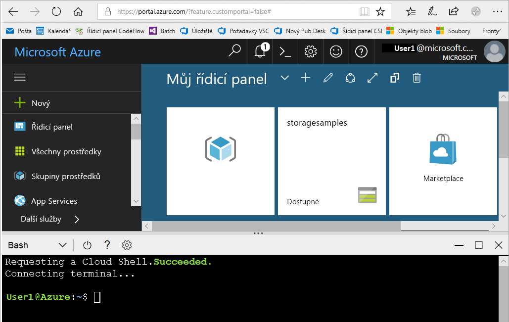

# <a name="create-a-storage-account"></a>Vytvoření účtu úložiště

V tomto rychlém startu se naučíte vytvořit účet úložiště pomocí webu [Azure Portal](https://portal.azure.com/), [Azure PowerShellu](https://docs.microsoft.com/powershell/azure/overview) nebo [Azure CLI](https://docs.microsoft.com/cli/azure?view=azure-cli-latest).  

## <a name="prerequisites"></a>Požadavky

Pokud ještě nemáte předplatné Azure, vytvořte si [bezplatný účet](https://azure.microsoft.com/free/) před tím, než začnete.

# <a name="portaltabportal"></a>[Azure Portal](#tab/portal)

Žádné.

# <a name="powershelltabpowershell"></a>[PowerShell](#tab/powershell)

Tento rychlý start vyžaduje modul Azure PowerShell verze 3.6 nebo novější. Aktuální verzi zjistíte spuštěním `Get-Module -ListAvailable AzureRM`. Pokud potřebujete instalaci nebo upgrade, přečtěte si téma [Instalace modulu Azure PowerShell](/powershell/azure/install-azurerm-ps).

# <a name="azure-clitabazure-cli"></a>[Azure CLI](#tab/azure-cli)

Pokud se chcete přihlásit k Azure s spouštět příkazy Azure CLI, máte dvě možnosti:

- Příkazy rozhraní příkazového řádku můžete spouštět na webu Azure Portal ve službě Azure Cloud Shell. 
- Můžete nainstalovat rozhraní příkazového řádku a příkazy rozhraní příkazového řádku spouštět místně.  

### <a name="use-azure-cloud-shell"></a>Použití Azure Cloud Shellu

Azure Cloud Shell je volně dostupné prostředí Bash, které můžete spustit přímo z webu Azure Portal. Má předinstalované rozhraní Azure CLI, které je nakonfigurované pro použití s vaším účtem. Klikněte na tlačítko **Cloud Shell** v nabídce v pravé horní části webu Azure Portal:

[](https://portal.azure.com)

Toto tlačítko spustí interaktivní prostředí, které můžete použít k provedení kroků v tomto rychlém startu:

[](https://portal.azure.com)

### <a name="install-the-cli-locally"></a>Místní instalace rozhraní příkazového řádku

Azure CLI můžete také nainstalovat a používat místně. Tento rychlý start vyžaduje použití Azure CLI verze 2.0.4 nebo novější. Verzi zjistíte spuštěním příkazu `az --version`. Pokud potřebujete instalaci nebo upgrade, přečtěte si téma [Instalace Azure CLI](/cli/azure/install-azure-cli). 

---

## <a name="log-in-to-azure"></a>Přihlášení k Azure

# <a name="portaltabportal"></a>[Azure Portal](#tab/portal)

Přihlaste se k webu [Azure Portal](https://portal.azure.com).

# <a name="powershelltabpowershell"></a>[PowerShell](#tab/powershell)

Přihlaste se k předplatnému Azure pomocí příkazu `Connect-AzureRmAccount` a při ověřování postupujte podle pokynů na obrazovce.

```powershell
Connect-AzureRmAccount
```

# <a name="azure-clitabazure-cli"></a>[Azure CLI](#tab/azure-cli)

Pokud chcete spustit Azure Cloud Shell, přihlaste se k webu [Azure Portal](https://portal.azure.com).

Pro přihlášení k místní instalaci rozhraní příkazového řádku spusťte přihlašovací příkaz:

```cli
az login
```

---

## <a name="create-a-storage-account"></a>vytvořit účet úložiště

Teď jste připraveni k vytvoření účtu úložiště.

Každý účet úložiště musí patřit do nějaké skupiny prostředků Azure. Skupina prostředků je logický kontejner pro seskupení služeb Azure. Při vytváření účtu úložiště máte možnost buď vytvořit novou skupinu prostředků, nebo použít některou existující skupinu prostředků. Tento rychlý start vám ukáže, jak vytvořit novou skupinu prostředků. 

Účet úložiště **Univerzální v2** poskytuje přístup ke všem službám Azure Storage: objektům blob, souborům, frontám, tabulkám a diskům. V tomto rychlém startu vytvoříte účet úložiště Univerzální v2, ale postup vytvoření libovolného typu účtu úložiště je podobný.   

# <a name="portaltabportal"></a>[Azure Portal](#tab/portal)

[!INCLUDE [storage-create-account-portal-include](../../../includes/storage-create-account-portal-include.md)]

# <a name="powershelltabpowershell"></a>[PowerShell](#tab/powershell)

Napřed vytvořte novou skupinu prostředků v PowerShellu pomocí příkazu [New-AzureRmResourceGroup](/powershell/module/azurerm.resources/new-azurermresourcegroup): 

```powershell
# put resource group in a variable so you can use the same group name going forward,
# without hardcoding it repeatedly
$resourceGroup = "storage-quickstart-resource-group"
New-AzureRmResourceGroup -Name $resourceGroup -Location $location 
```

Pokud si nejste jisti, jakou oblast máte zadat v parametru `-Location`, můžete pomocí příkazu [Get-AzureRmLocation](/powershell/module/azurerm.resources/get-azurermlocation) načíst seznam podporovaných oblastí pro vaše předplatné:

```powershell
Get-AzureRmLocation | select Location 
$location = "westus"
```

Dále vytvořte účet úložiště Univerzální v2 s místně redundantním úložištěm (LRS). Použijte příkaz [New-AzureRmStorageAccount](/powershell/module/azurerm.storage/New-AzureRmStorageAccount): 

```powershell
New-AzureRmStorageAccount -ResourceGroupName $resourceGroup `
  -Name "storagequickstart" `
  -Location $location `
  -SkuName Standard_LRS `
  -Kind StorageV2 
```

Pokud chcete vytvořit účet úložiště pro obecné účely verze 2 s využitím zónově redundantního úložiště (ZRS) (Preview), geograficky redundantního úložiště (GRS) nebo geograficky redundantního úložiště jen pro čtení (RA-GRS), nahraďte v následující tabulce parametr **SkuName** požadovanou hodnotou. 

|Možnost replikace  |Parametr SkuName  |
|---------|---------|
|Místně redundantní úložiště (LRS)     |Standard_LRS         |
|Zónově redundantní úložiště (ZRS)     |Standard_ZRS         |
|Geograficky redundantní úložiště (GRS)     |Standard_GRS         |
|Geograficky redundantní úložiště s přístupem pro čtení (RA-GRS)     |Standard_RAGRS         |

# <a name="azure-clitabazure-cli"></a>[Azure CLI](#tab/azure-cli)

Napřed vytvořte novou skupinu prostředků v Azure CLI pomocí příkazu [az group create](/cli/azure/group#az_group_create). 

```azurecli-interactive
az group create \
    --name storage-quickstart-resource-group \
    --location westus
```

Pokud si nejste jisti, jakou oblast máte zadat v parametru `--location`, můžete pomocí příkazu [az account list-locations](/cli/azure/account#az_account_list) načíst seznam podporovaných oblastí pro vaše předplatné.

```azurecli-interactive
az account list-locations \
    --query "[].{Region:name}" \
    --out table
```

Dále vytvořte účet úložiště Univerzální v2 s místně redundantním úložištěm. Použijte příkaz [az storage account create](/cli/azure/storage/account#az_storage_account_create):

```azurecli-interactive
az storage account create \
    --name storagequickstart \
    --resource-group storage-quickstart-resource-group \
    --location westus \
    --sku Standard_LRS \
    --kind StorageV2
```

Pokud chcete vytvořit účet úložiště pro obecné účely verze 2 s využitím zónově redundantního úložiště (ZRS Preview), geograficky redundantního úložiště (GRS) nebo geograficky redundantního úložiště s přístupem pro čtení (RA-GRS), nahraďte v následující tabulce parametr **sku** požadovanou hodnotou. 

|Možnost replikace  |Parametr sku  |
|---------|---------|
|Místně redundantní úložiště (LRS)     |Standard_LRS         |
|Zónově redundantní úložiště (ZRS)     |Standard_ZRS         |
|Geograficky redundantní úložiště (GRS)     |Standard_GRS         |
|Geograficky redundantní úložiště s přístupem pro čtení (RA-GRS)     |Standard_RAGRS         |

---

Další informace o dostupných možnostech replikace najdete v tématu věnovaném [možnostem replikace služby Storage](storage-redundancy.md).

## <a name="clean-up-resources"></a>Vyčištění prostředků

Pokud chcete vyčistit prostředky vytvořené v tomto rychlém startu, stačí jednoduše odstranit skupinu prostředků. Odstraněním skupiny prostředků odstraníte také přidružený účet úložiště a všechny další prostředky, které jsou k příslušné skupině prostředků přidružené.

# <a name="portaltabportal"></a>[Azure Portal](#tab/portal)

Odebrání skupiny prostředků pomocí webu Azure Portal:

1. Na webu Azure Portal rozbalením nabídky na levé straně otevřete nabídku služeb a zvolte **Skupiny prostředků**. Zobrazí se seznam skupin prostředků.
2. Vyhledejte skupinu prostředků, kterou chcete odstranit, a klikněte pravým tlačítkem na tlačítko **Další** (**...** ) na pravé straně seznamu.
3. Vyberte **Odstranit skupinu prostředků** a potvrďte tuto akci.

# <a name="powershelltabpowershell"></a>[PowerShell](#tab/powershell)

Pokud chcete odebrat skupinu prostředků a její přidružené prostředky, včetně nového účtu úložiště, použijte příkaz [Remove-AzureRmResourceGroup](/powershell/module/azurerm.resources/remove-azurermresourcegroup): 

```powershell
Remove-AzureRmResourceGroup -Name $resourceGroup
```

# <a name="azure-clitabazure-cli"></a>[Azure CLI](#tab/azure-cli)

Pokud chcete odebrat skupinu prostředků a její přidružené prostředky, včetně nového účtu úložiště, použijte příkaz [az group delete](/cli/azure/group#az_group_delete).

```azurecli-interactive
az group delete --name myResourceGroup
```

---

## <a name="next-steps"></a>Další kroky

V tomto rychlém startu jste vytvořili účet úložiště úrovně Standard pro obecné účely. Pokud chcete zjistit, jak v účtu úložiště nahrávat a stahovat objekty blob, pokračujte k rychlému startu pro úložiště objektů blob.

# <a name="portaltabportal"></a>[Azure Portal](#tab/portal)

> [!div class="nextstepaction"]
> [Práce s objekty blob pomocí webu Azure Portal](../blobs/storage-quickstart-blobs-portal.md)

# <a name="powershelltabpowershell"></a>[PowerShell](#tab/powershell)

> [!div class="nextstepaction"]
> [Práce s objekty blob pomocí PowerShellu](../blobs/storage-quickstart-blobs-powershell.md)

# <a name="azure-clitabazure-cli"></a>[Azure CLI](#tab/azure-cli)

> [!div class="nextstepaction"]
> [Práce s úložištěm objektů blob pomocí Azure CLI](../blobs/storage-quickstart-blobs-cli.md)

---
