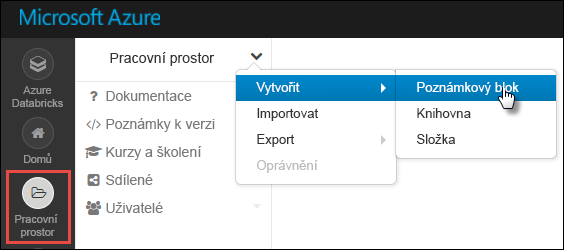
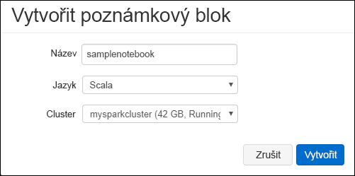

# <a name="tutorial-extract-transform-and-load-data-using-azure-databricks"></a>Kurz: Extrakce, transformace a načtení dat pomocí Azure Databricks

V tomto kurzu provedete operaci ETL (extrakce, transformace a načítání), kterou přesunete data z účtu služby Azure Storage s povolenou službou Azure Data Lake Storage Gen2 do služby Azure SQL Data Warehouse pomocí Azure Databricks.

Následující obrázek ukazuje běh aplikace:


Tento kurz se zabývá následujícími úkony:

> [!div class="checklist"]
> * Vytvoření pracovního prostoru Azure Databricks
> * Vytvoření clusteru Spark v Azure Databricks
> * Vytvoření účtu připraveného pro Azure Data Lake Storage Gen2
> * Nahrání dat do služby Azure Data Lake Store Gen2
> * Vytvoření poznámkového bloku v Azure Databricks
> * Extrahování dat ze služby Data Lake Store Gen2
> * Transformace dat v Azure Databricks
> * Načtení dat do Azure SQL Data Warehouse

Pokud ještě nemáte předplatné Azure, [vytvořte si bezplatný účet](https://azure.microsoft.com/free/) před tím, než začnete.

## <a name="prerequisites"></a>Požadavky

Pro absolvování tohoto kurzu potřebujete:

* Vytvořili jste Azure SQL Data Warehouse, vytvořili jste na serveru pravidlo firewallu a připojili jste se k serveru jako správce. Použijte postup v tématu [Rychlý start: Vytvoření Azure SQL Data Warehouse](../../sql-data-warehouse/create-data-warehouse-portal.md).
* Vytvořili jste v Azure SQL Data Warehouse hlavní databázový klíč. Použijte postup v tématu [Vytvoření hlavního databázového klíče](https://docs.microsoft.com/sql/relational-databases/security/encryption/create-a-database-master-key).
* [Vytvoření účtu Azure Data Lake Storage Gen2](quickstart-create-account.md)

## <a name="sign-in-to-the-azure-portal"></a>Přihlášení k webu Azure Portal

Přihlaste se k webu [Azure Portal](https://portal.azure.com/).

## <a name="create-an-azure-databricks-workspace"></a>Vytvoření pracovního prostoru Azure Databricks

V této části vytvoříte pomocí portálu Azure pracovní prostor služby Azure Databricks.

1. Na webu Azure Portal vyberte **Vytvořit prostředek** > **Analýza** > **Azure Databricks**.

    

2. V části **Služba Azure Databricks** zadejte hodnoty pro vytvoření pracovního prostoru Databricks.

    

    Zadejte následující hodnoty:

    |Vlastnost  |Popis  |
    |---------|---------|
    |**Název pracovního prostoru**     | Zadejte název pracovního prostoru Databricks.        |
    |**Předplatné**     | Z rozevíracího seznamu vyberte své předplatné Azure.        |
    |**Skupina prostředků**     | Určete, jestli chcete vytvořit novou skupinu prostředků, nebo použít existující. Skupina prostředků je kontejner, který obsahuje související prostředky pro řešení Azure. Další informace naleznete v tématu [Přehled skupin prostředků v Azure](../../azure-resource-manager/resource-group-overview.md). |
    |**Umístění**     | Vyberte **Západní USA 2**. Další dostupné oblasti najdete v tématu [Dostupné služby Azure podle oblastí](https://azure.microsoft.com/regions/services/).        |
    |**Cenová úroveň**     |  Zvolte úroveň **Standard** nebo **Premium**. Další informace o těchto úrovních najdete na [stránce s cenami za Databricks](https://azure.microsoft.com/pricing/details/databricks/).       |

    Vyberte **Připnout na řídicí panel** a potom vyberte **Vytvořit**.

3. Vytvoření účtu trvá několik minut. Během vytváření účtu se na pravé straně portálu zobrazí dlaždice **Odesílání nasazení pro Azure Databricks**. Možná se budete muset posunout do pravé části řídicího panelu, aby se dlaždice zobrazila. V horní části obrazovky se také zobrazí indikátor průběhu. Průběh můžete sledovat v obou oblastech.

    

## <a name="create-a-spark-cluster-in-databricks"></a>Vytvoření clusteru Spark ve službě Databricks

1. Na webu Azure Portal přejděte do pracovního prostoru Databricks, který jste vytvořili, a vyberte **Spustit pracovní prostor**.

2. Budete přesměrováni na portál Azure Databricks. Na portálu vyberte **Cluster**.

    

3. Na stránce **New cluster** (Nový cluster) zadejte hodnoty pro vytvoření clusteru.

    

    Zadejte hodnoty následujících polí a potvrďte výchozí hodnoty dalších polí:

    * Zadejte název clusteru.
    * Pro účely tohoto článku vytvořte cluster s modulem runtime verze **4.2**.
    * Nezapomeňte zaškrtnout políčko **Terminate after \_\_ minutes of inactivity** (Ukončit po __ minutách neaktivity). Zadejte dobu (v minutách), po které se má ukončit činnost clusteru, pokud se cluster nepoužívá.

    Vyberte **Vytvořit cluster**. Po spuštění clusteru můžete ke clusteru připojit poznámkové bloky a spouštět úlohy Spark.

## <a name="create-storage-account-file-system"></a>Vytvoření systému souborů v účtu úložiště

V této části nejprve vytvoříte v pracovním prostoru Azure Databricks poznámkový blok a pak spustíte fragmenty kódu, kterými nakonfigurujete účet úložiště.

1. Na portálu [Azure Portal](https://portal.azure.com) přejděte do vytvořeného pracovního prostoru Azure Databricks a vyberte **Spustit pracovní prostor**.

2. V levém podokně vyberte **Pracovní prostor**. V rozevíracím seznamu **Pracovní prostor** vyberte **Vytvořit** > **Poznámkový blok**.

    

3. V dialogovém okně **Vytvořit poznámkový blok** zadejte název poznámkového bloku. Vyberte jazyk **Scala** a vyberte cluster Spark, který jste vytvořili v předchozí části.

    

    Vyberte **Vytvořit**.

4. Do první buňky zadejte následující kód a spusťte ho:

    ```scala
    spark.conf.set("fs.azure.account.key.<ACCOUNT_NAME>.dfs.core.windows.net", "<ACCOUNT_KEY>") 
    spark.conf.set("fs.azure.createRemoteFileSystemDuringInitialization", "true")
    dbutils.fs.ls("abfs://<FILE_SYSTEM_NAME>@<ACCOUNT_NAME>.dfs.core.windows.net/")
    spark.conf.set("fs.azure.createRemoteFileSystemDuringInitialization", "false") 
    ```

    Stiskněte **SHIFT+ENTER** a spusťte kód v buňce.

    Tím vytvoříte systém souborů pro účet úložiště.

## <a name="upload-data-to-the-storage-account"></a>Nahrání dat do účtu úložiště

V dalším kroku nahrajete do účtu úložiště soubor s ukázkovými daty, abyste ho mohli později transformovat v Azure Databricks. 

> [!NOTE]
> Pokud ještě nemáte účet, který podporuje Azure Data Lake Storage Gen2, [vytvořte ho podle pokynů v rychlém startu](./quickstart-create-account.md).

1. Stáhněte si soubor s ukázkovými daty (**small_radio_json.json**) z úložiště [příkladů a sledování problémů U-SQL](https://github.com/Azure/usql/blob/master/Examples/Samples/Data/json/radiowebsite/small_radio_json.json) a poznamenejte si cestu, kam jste tento soubor uložili.

2. Potom nahrajete ukázková data do svého účtu úložiště. Způsob nahrání dat do účtu úložiště se liší podle toho, jestli máte aktivovaný hierarchický obor názvů.

    Pokud máte v účtu služby Azure Storage povolený hierarchický obor názvů, můžete k nahrání použít Azure Data Factory, distp nebo AzCopy (verze 10). Nástroj AzCopy verze 10 je v současné době k dispozici ve verzi Preview pouze pro zákazníky s verzí Preview. Pokud chcete použít AzCopy, vložte do příkazového okna následující kód:

    ```bash
    set ACCOUNT_NAME=<ACCOUNT_NAME>
    set ACCOUNT_KEY=<ACCOUNT_KEY>
    azcopy cp "<DOWNLOAD_PATH>\small_radio_json.json" https://<ACCOUNT_NAME>.dfs.core.windows.net/data --recursive 
    ```
    
## <a name="extract-data-from-azure-storage"></a>Extrahování dat z Azure Storage

Vraťte se do poznámkového bloku DataBricks a do nové buňky zadejte následující kód:

1. Do prázdné buňky určené pro kód přidejte následující fragment kódu a zástupné hodnoty nahraďte hodnotami účtu úložiště, které jste uložili v předchozí části.

    ```scala
    dbutils.widgets.text("storage_account_name", "STORAGE_ACCOUNT_NAME", "<YOUR_STORAGE_ACCOUNT_NAME>")
    dbutils.widgets.text("storage_account_access_key", "YOUR_ACCESS_KEY", "<YOUR_STORAGE_ACCOUNT_SHARED_KEY>")
    ```

    Stiskněte **SHIFT+ENTER** a spusťte kód v buňce.

2. Teď můžete ukázkový soubor JSON načíst jako datový rámec do služby Azure Databricks. Následující kód vložte do nové buňky a stiskněte **SHIFT+ENTER** (nezapomeňte nahradit hodnoty zástupných textů):

    ```scala
    val df = spark.read.json("abfs://<FILE_SYSTEM_NAME>@<ACCOUNT_NAME>.dfs.core.windows.net/data/small_radio_json.json")
    ```

3. Spuštěním následujícího kódu zobrazíte obsah datového rámce.

    ```scala
    df.show()
    ```

    Zobrazí se výstup, který bude podobný následujícímu fragmentu kódu:

    ```bash
    +---------------------+---------+---------+------+-------------+----------+---------+-------+--------------------+------+--------+-------------+---------+--------------------+------+-------------+------+
    |               artist|     auth|firstName|gender|itemInSession|  lastName|   length|  level|            location|method|    page| registration|sessionId|                song|status|           ts|userId|
    +---------------------+---------+---------+------+-------------+----------+---------+-------+--------------------+------+--------+-------------+---------+--------------------+------+-------------+------+
    | El Arrebato         |Logged In| Annalyse|     F|            2|Montgomery|234.57914| free  |  Killeen-Temple, TX|   PUT|NextSong|1384448062332|     1879|Quiero Quererte Q...|   200|1409318650332|   309|
    | Creedence Clearwa...|Logged In|   Dylann|     M|            9|    Thomas|340.87138| paid  |       Anchorage, AK|   PUT|NextSong|1400723739332|       10|        Born To Move|   200|1409318653332|    11|
    | Gorillaz            |Logged In|     Liam|     M|           11|     Watts|246.17751| paid  |New York-Newark-J...|   PUT|NextSong|1406279422332|     2047|                DARE|   200|1409318685332|   201|
    ...
    ...
    ```

Tím jste extrahovali data z Azure Data Lake Storage Gen2 do Azure Databricks.

## <a name="transform-data-in-azure-databricks"></a>Transformace dat v Azure Databricks

Nezpracovaná ukázková data **small_radio_json.json** obsahují data o posluchačích rozhlasové stanice uspořádaná do různých sloupců. V této části transformujete data tak, aby se z datové sady načetly jenom určité sloupce.

1. Z vytvořeného datového rámce napřed načtěte jenom sloupce *firstName*, *lastName*, *gender*, *location* a *level*.

    ```scala
    val specificColumnsDf = df.select("firstname", "lastname", "gender", "location", "level")
    ```

    Získáte výstup podobný následujícímu fragmentu kódu:

    ```bash
    +---------+----------+------+--------------------+-----+
    |firstname|  lastname|gender|            location|level|
    +---------+----------+------+--------------------+-----+
    | Annalyse|Montgomery|     F|  Killeen-Temple, TX| free|
    |   Dylann|    Thomas|     M|       Anchorage, AK| paid|
    |     Liam|     Watts|     M|New York-Newark-J...| paid|
    |     Tess|  Townsend|     F|Nashville-Davidso...| free|
    |  Margaux|     Smith|     F|Atlanta-Sandy Spr...| free|
    |     Alan|     Morse|     M|Chicago-Napervill...| paid|
    |Gabriella|   Shelton|     F|San Jose-Sunnyval...| free|
    |   Elijah|  Williams|     M|Detroit-Warren-De...| paid|
    |  Margaux|     Smith|     F|Atlanta-Sandy Spr...| free|
    |     Tess|  Townsend|     F|Nashville-Davidso...| free|
    |     Alan|     Morse|     M|Chicago-Napervill...| paid|
    |     Liam|     Watts|     M|New York-Newark-J...| paid|
    |     Liam|     Watts|     M|New York-Newark-J...| paid|
    |   Dylann|    Thomas|     M|       Anchorage, AK| paid|
    |     Alan|     Morse|     M|Chicago-Napervill...| paid|
    |   Elijah|  Williams|     M|Detroit-Warren-De...| paid|
    |  Margaux|     Smith|     F|Atlanta-Sandy Spr...| free|
    |     Alan|     Morse|     M|Chicago-Napervill...| paid|
    |   Dylann|    Thomas|     M|       Anchorage, AK| paid|
    |  Margaux|     Smith|     F|Atlanta-Sandy Spr...| free|
    +---------+----------+------+--------------------+-----+
    ```

2.  Teď můžete v datech sloupec **level** přejmenovat na **subscription_type**.

    ```scala
    val renamedColumnsDF = specificColumnsDf.withColumnRenamed("level", "subscription_type")
    renamedColumnsDF.show()
    ```

    Získáte výstup podobný následujícímu fragmentu kódu:

    ```bash
    +---------+----------+------+--------------------+-----------------+
    |firstname|  lastname|gender|            location|subscription_type|
    +---------+----------+------+--------------------+-----------------+
    | Annalyse|Montgomery|     F|  Killeen-Temple, TX|             free|
    |   Dylann|    Thomas|     M|       Anchorage, AK|             paid|
    |     Liam|     Watts|     M|New York-Newark-J...|             paid|
    |     Tess|  Townsend|     F|Nashville-Davidso...|             free|
    |  Margaux|     Smith|     F|Atlanta-Sandy Spr...|             free|
    |     Alan|     Morse|     M|Chicago-Napervill...|             paid|
    |Gabriella|   Shelton|     F|San Jose-Sunnyval...|             free|
    |   Elijah|  Williams|     M|Detroit-Warren-De...|             paid|
    |  Margaux|     Smith|     F|Atlanta-Sandy Spr...|             free|
    |     Tess|  Townsend|     F|Nashville-Davidso...|             free|
    |     Alan|     Morse|     M|Chicago-Napervill...|             paid|
    |     Liam|     Watts|     M|New York-Newark-J...|             paid|
    |     Liam|     Watts|     M|New York-Newark-J...|             paid|
    |   Dylann|    Thomas|     M|       Anchorage, AK|             paid|
    |     Alan|     Morse|     M|Chicago-Napervill...|             paid|
    |   Elijah|  Williams|     M|Detroit-Warren-De...|             paid|
    |  Margaux|     Smith|     F|Atlanta-Sandy Spr...|             free|
    |     Alan|     Morse|     M|Chicago-Napervill...|             paid|
    |   Dylann|    Thomas|     M|       Anchorage, AK|             paid|
    |  Margaux|     Smith|     F|Atlanta-Sandy Spr...|             free|
    +---------+----------+------+--------------------+-----------------+
    ```

## <a name="load-data-into-azure-sql-data-warehouse"></a>Načtení dat do Azure SQL Data Warehouse

V této části načtete transformovaná data do služby Azure SQL Data Warehouse. Pomocí konektoru Azure SQL Data Warehouse pro Azure Databricks můžete datový rámec nahrát přímo jako tabulku do služby Azure SQL Data Warehouse.

Už jsme si řekli, že konektor Azure SQL Data Warehouse používá k nahrávání dat mezi službami Azure Databricks a Azure SQL Data Warehouse dočasné úložiště Azure Blob Storage. Proto musíte napřed zadat konfiguraci pro připojení k účtu tohoto úložiště. Vytvoření účtu už bylo v předpokladech v úvodu tohoto článku.

1. Zadejte konfiguraci pro přístup k účtu Azure Storage z Azure Databricks.

    ```scala
    val storageURI = "<STORAGE_ACCOUNT_NAME>.dfs.core.windows.net"
    val fileSystemName = "<FILE_SYSTEM_NAME>"
    val accessKey =  "<ACCESS_KEY>"
    ```

2. Zadejte dočasnou složku, která se použije k přesunu dat mezi službami Azure Databricks a Azure SQL Data Warehouse.

    ```scala
    val tempDir = "abfs://" + fileSystemName + "@" + storageURI +"/tempDirs"
    ```

3. Spusťte následující fragment kódu, který v konfiguraci uloží přístupové klíče služby Azure Blob Storage. Tím zajistíte, že přístupový klíč nebudete muset mít v poznámkovém bloku jako obyčejný text.

    ```scala
    val acntInfo = "fs.azure.account.key."+ storageURI
    sc.hadoopConfiguration.set(acntInfo, accessKey)
    ```

4. Zadejte hodnoty pro připojení k instanci Azure SQL Data Warehouse. Vytvoření instance SQL Data Warehouse bylo v předpokladech tohoto článku.

    ```scala
    //SQL Data Warehouse related settings
    val dwDatabase = "<DATABASE NAME>"
    val dwServer = "<DATABASE SERVER NAME>" 
    val dwUser = "<USER NAME>"
    val dwPass = "<PASSWORD>"
    val dwJdbcPort =  "1433"
    val dwJdbcExtraOptions = "encrypt=true;trustServerCertificate=true;hostNameInCertificate=*.database.windows.net;loginTimeout=30;"
    val sqlDwUrl = "jdbc:sqlserver://" + dwServer + ".database.windows.net:" + dwJdbcPort + ";database=" + dwDatabase + ";user=" + dwUser+";password=" + dwPass + ";$dwJdbcExtraOptions"
    val sqlDwUrlSmall = "jdbc:sqlserver://" + dwServer + ".database.windows.net:" + dwJdbcPort + ";database=" + dwDatabase + ";user=" + dwUser+";password=" + dwPass
    ```

5. Spusťte následující fragment kódu, který načte transformovaný datový rámec **renamedColumnsDF** jako tabulku do datového skladu SQL. Tento fragment kódu vytvoří v SQL databázi tabulku s názvem **SampleTable**.

    ```scala
    spark.conf.set(
        "spark.sql.parquet.writeLegacyFormat",
        "true")
    
    renamedColumnsDF.write
        .format("com.databricks.spark.sqldw")
        .option("url", sqlDwUrlSmall) 
        .option("dbtable", "SampleTable")
        .option( "forward_spark_azure_storage_credentials","True")
        .option("tempdir", tempDir)
        .mode("overwrite")
        .save()
    ```

6. Připojte se k databázi SQL a zkontrolujte, že v ní je tabulka **SampleTable**.

    

7. Spusťte výběrový dotaz, kterým ověříte obsah tabulky. Tabulka by měla obsahovat stejná data jako datový rámec **renamedColumnsDF**.

    

## <a name="clean-up-resources"></a>Vyčištění prostředků

Po dokončení tohoto kurzu můžete cluster ukončit. Pokud to chcete udělat, v levém podokně v pracovním prostoru Azure Databricks vyberte **Clusters** (Clustery). U clusteru, který chcete ukončit, přesuňte kurzor na tři tečky pod sloupcem **Actions** (Akce) a vyberte ikonu **Terminate** (Ukončit).


Pokud cluster neukončíte ručně, zastaví se automaticky za předpokladu, že jste při vytváření clusteru zaškrtli políčko **Ukončit po __ minutách nečinnosti**. V takovém případě se cluster automaticky zastaví, pokud byl po stanovenou dobu neaktivní.

## <a name="next-steps"></a>Další kroky

V tomto kurzu jste se naučili:

> [!div class="checklist"]
> * Vytvoření pracovního prostoru Azure Databricks
> * Vytvoření clusteru Spark v Azure Databricks
> * Vytvoření účtu připraveného pro Azure Data Lake Storage Gen2
> * Nahrání dat do služby Azure Data Lake Store Gen2
> * Vytvoření poznámkového bloku v Azure Databricks
> * Extrahování dat ze služby Data Lake Store Gen2
> * Transformace dat v Azure Databricks
> * Načtení dat do Azure SQL Data Warehouse

Pokračujte dalším kurzem, ve kterém se naučíte streamovat data v reálném čase do Azure Databricks pomocí služby Azure Event Hubs.

> [!div class="nextstepaction"]
>[Streamování dat do Azure Databricks pomocí služby Event Hubs](../../azure-databricks/databricks-stream-from-eventhubs.md)
