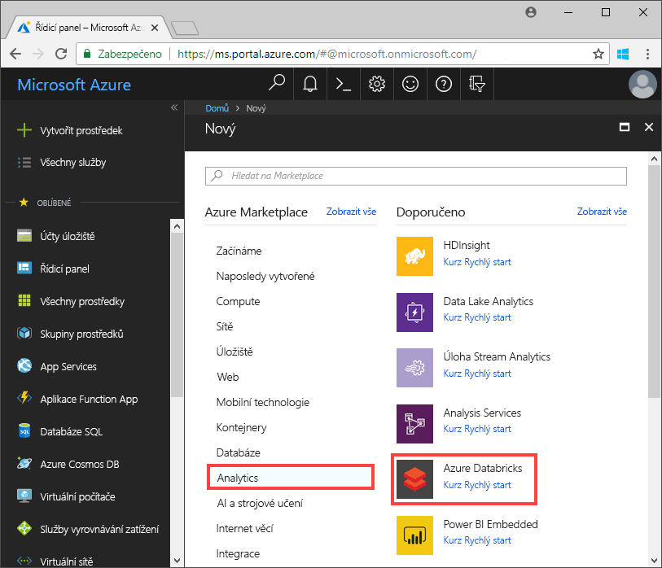
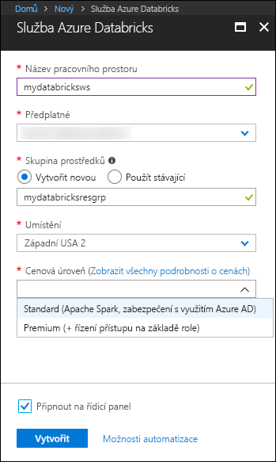
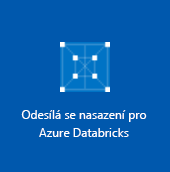
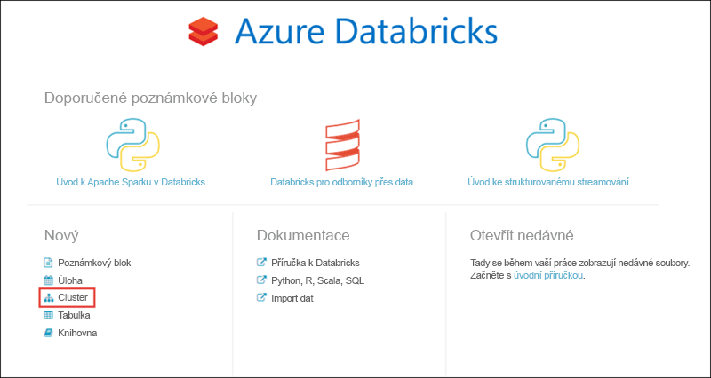
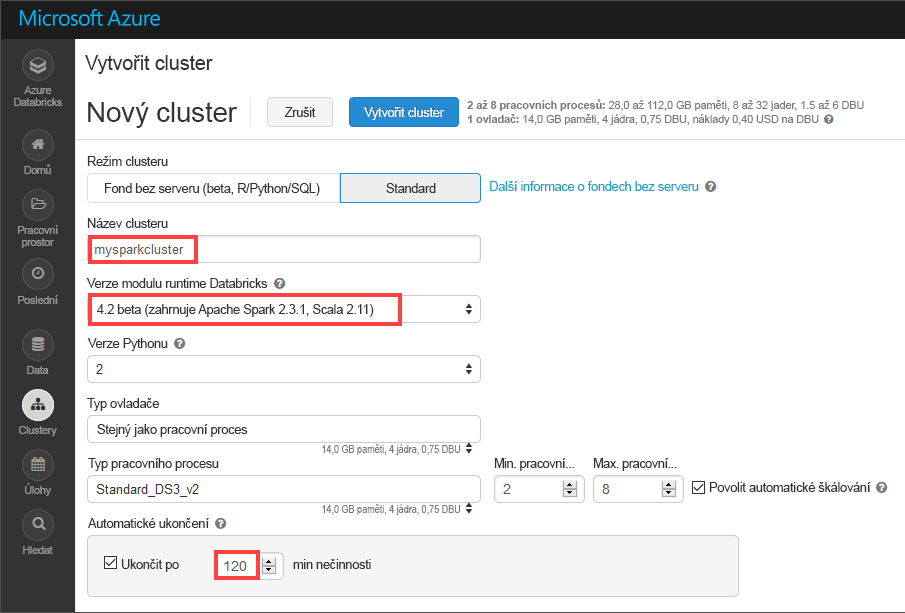
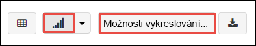
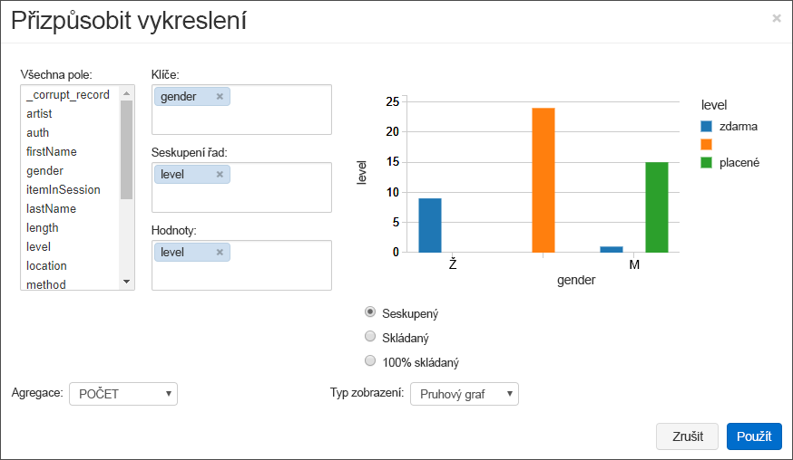
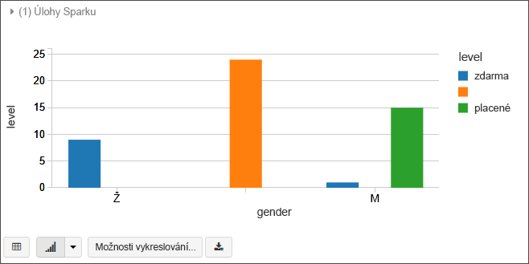
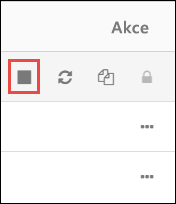

# <a name="quickstart-run-a-spark-job-on-azure-databricks-using-the-azure-portal"></a>Rychlý start: Spuštění úlohy Spark job v Azure Databricks pomocí portálu Azure

V tomto rychlém startu si ukážeme, jak použít Azure Databricks ke spuštění úlohy Apache Spark, abyste mohli analyzovat data uložená v Azure Data Lake Storage Gen2 Preview.

V úloze Spark budete analyzovat data o předplatných rozhlasové stanice, abyste získali přehled o bezplatném a placeném používání podle demografických údajů.

Pokud ještě nemáte předplatné Azure, [vytvořte si bezplatný účet](https://azure.microsoft.com/free/) před tím, než začnete.

## <a name="prerequisites"></a>Požadavky

- [Vytvoření účtu Azure Data Lake Storage Gen2](quickstart-create-account.md)

## <a name="set-aside-storage-account-configuration"></a>Odložení konfigurace účtu úložiště

> [!IMPORTANT]
> Během tohoto kurzu musíte mít přístup k názvu účtu a přístupovému klíči úložiště. Na webu Azure Portal vyberte **Všechny služby** a vyfiltrujte *úložiště*. Vyberte **Účty úložiště** a najděte účet, který jste vytvořili pro tento kurz.
>
> Z **přehledu** zkopírujte **název** účtu úložiště do textového editoru. Pak vyberte **Přístupové klíče** a zkopírujte hodnotu **key1** do textového editoru. Obě hodnoty budete potřebovat v pozdějších příkazech.

## <a name="create-an-azure-databricks-workspace"></a>Vytvoření pracovního prostoru Azure Databricks

V této části vytvoříte pomocí portálu Azure pracovní prostor služby Azure Databricks.

1. Na webu Azure Portal vyberte **Vytvořit prostředek** > **Analýza** > **Azure Databricks**. 

    

2. V části **Služba Azure Databricks** zadejte hodnoty pro vytvoření pracovního prostoru Databricks.

    

    Zadejte následující hodnoty:
     
    |Vlastnost  |Popis  |
    |---------|---------|
    |**Název pracovního prostoru**     | Zadejte název pracovního prostoru Databricks.        |
    |**Předplatné**     | Z rozevíracího seznamu vyberte své předplatné Azure.        |
    |**Skupina prostředků**     | Určete, jestli chcete vytvořit novou skupinu prostředků, nebo použít existující. Skupina prostředků je kontejner, který obsahuje související prostředky pro řešení Azure. Další informace naleznete v tématu [Přehled skupin prostředků v Azure](../../azure-resource-manager/resource-group-overview.md). |
    |**Umístění**     | Vyberte **Západní USA 2**. Další dostupné oblasti najdete v tématu [Dostupné služby Azure podle oblastí](https://azure.microsoft.com/regions/services/).        |
    |**Cenová úroveň**     |  Zvolte úroveň **Standard** nebo **Premium**. Další informace o těchto úrovních najdete na [stránce s cenami za Databricks](https://azure.microsoft.com/pricing/details/databricks/).       |

    Vyberte **Připnout na řídicí panel** a potom klikněte na **Vytvořit**.

3. Vytvoření pracovního prostoru trvá několik minut. Během vytváření pracovního prostoru se na pravé straně portálu zobrazí dlaždice **Odesílání nasazení pro Azure Databricks**. Možná se budete muset posunout do pravé části řídicího panelu, aby se dlaždice zobrazila. V horní části obrazovky se také zobrazí indikátor průběhu. Průběh můžete sledovat v obou oblastech.

    

## <a name="create-a-spark-cluster-in-databricks"></a>Vytvoření clusteru Spark ve službě Databricks

1. Na webu Azure Portal přejděte do pracovního prostoru Databricks, který jste vytvořili, a vyberte **Spustit pracovní prostor**.

2. Budete přesměrováni na portál Azure Databricks. Na portálu vyberte **Nový** > **Cluster**.

    

3. Na stránce **New cluster** (Nový cluster) zadejte hodnoty pro vytvoření clusteru.

    

    Přijměte všechny výchozí hodnoty kromě následujících:

    * Zadejte název clusteru.
    * Vytvořte cluster s modulem runtime **verze 4.2 beta**.
    * Nezapomeňte zaškrtnout políčko **Terminate after 120 minutes of inactivity** (Ukončit po 120 minutách nečinnosti). Zadejte dobu (v minutách), po které se má ukončit činnost clusteru, pokud se cluster nepoužívá.

4. Vyberte **Vytvořit cluster**. Po spuštění clusteru můžete ke clusteru připojit poznámkové bloky a spouštět úlohy Spark.

Další informace o vytváření clusterů najdete v tématu [Vytvoření clusteru Spark v Azure Databricks](https://docs.azuredatabricks.net/user-guide/clusters/create.html).

## <a name="create-storage-account-file-system"></a>Vytvoření systému souborů v účtu úložiště

V této části nejprve vytvoříte v pracovním prostoru Azure Databricks poznámkový blok a pak spustíte fragmenty kódu, kterými nakonfigurujete účet úložiště.

1. Na portálu [Azure Portal](https://portal.azure.com) přejděte do vytvořeného pracovního prostoru Azure Databricks a vyberte **Spustit pracovní prostor**.

2. V levém podokně vyberte **Pracovní prostor**. V rozevíracím seznamu **Pracovní prostor** vyberte **Vytvořit** > **Poznámkový blok**.

    

3. V dialogovém okně **Vytvořit poznámkový blok** zadejte název poznámkového bloku. Vyberte jazyk **Scala** a vyberte cluster Spark, který jste vytvořili v předchozí části.

    

    Vyberte **Vytvořit**.

4. V následujícím kódu nahraďte text **ACCOUNT_NAME** a **ACCOUNT_KEY** hodnotami názvu účtu a klíče účtu, které jste si uložili na začátku tohoto rychlého startu. Nahraďte také text **FILE_SYSTEM_NAME** názvem, který chcete použít pro systém souborů. Pak kód zadejte do první buňky.

    ```scala
    spark.conf.set("fs.azure.account.key.<ACCOUNT_NAME>.dfs.core.windows.net", "<ACCOUNT_KEY>") 
    spark.conf.set("fs.azure.createRemoteFileSystemDuringInitialization", "true")
    dbutils.fs.ls("abfs://<FILE_SYSTEM_NAME>@<ACCOUNT_NAME>.dfs.core.windows.net/")
    spark.conf.set("fs.azure.createRemoteFileSystemDuringInitialization", "false") 
    ```

    Stiskněte **SHIFT+ENTER** a spusťte kód v buňce.

    Tím vytvoříte systém souborů pro účet úložiště.

## <a name="ingest-sample-data"></a>Ingestace ukázkových dat

Než se pustíte do této části, je potřeba nejprve splnit následující požadavky:

Do buňky poznámkového bloku zadejte následující kód:

    %sh wget -P /tmp https://github.com/Azure/usql/blob/master/Examples/Samples/Data/json/radiowebsite/small_radio_json.json

V buňce stiskněte `Shift` + `Enter` a spusťte kód.

Teď do nové buňky pod touto buňkou zadejte následující kód (nahraďte **FILE_SYSTEM** a **ACCOUNT_NAME** stejnými hodnotami, které jste použili dříve):

    dbutils.fs.cp("file:///tmp/small_radio_json.json", "abfs://<FILE_SYSTEM>@<ACCOUNT_NAME>.dfs.core.windows.net/")

V buňce stiskněte `Shift` + `Enter` a spusťte kód.

## <a name="run-a-spark-sql-job"></a>Spuštění úlohy Spark SQL

Ke spuštění úlohy Spark SQL na datech použijte následující postup.

1. Spuštěním příkazu SQL vytvořte dočasnou tabulku pomocí dat z ukázkového datového souboru JSON **small_radio_json.json**. V následujícím fragmentu kódu nahraďte zástupné hodnoty názvy vašeho systému souborů a účtu úložiště. Vytvořený poznámkový blok použijte k vložení fragmentu do nové buňky kódu v poznámkovém bloku a stiskněte SHIFT+ENTER.

    ```sql
    %sql
    DROP TABLE IF EXISTS radio_sample_data;
    CREATE TABLE radio_sample_data
    USING json
    OPTIONS (
     path  "abfs://<FILE_SYSTEM_NAME>@<ACCOUNT_NAME>.dfs.core.windows.net/<PATH>/small_radio_json.json"
    )
    ```

    Po úspěšném dokončení příkazu získáte všechna data ze souboru JSON ve formátu tabulky v clusteru Databricks.

    Magický příkaz jazyka `%sql` umožňuje spustit z poznámkového bloku kód SQL, i když je poznámkový blok jiného typu. Další informace najdete v článku [Kombinování jazyků v poznámkovém bloku](https://docs.azuredatabricks.net/user-guide/notebooks/index.html#mixing-languages-in-a-notebook).

2. Podívejme se na snímek ukázkových dat JSON, abyste lépe pochopili dotaz, který spouštíte. Vložte do buňky kódu následující fragment kódu a stiskněte klávesy **SHIFT + ENTER**.

    ```sql
    %sql 
    SELECT * from radio_sample_data
    ```

3. Zobrazí se tabulkový výstup jako na následujícím snímku obrazovky (zobrazí se jenom některé sloupce):

    

    Vedle dalších podrobných informací ukázková data zachycují pohlaví posluchačů určité rozhlasové stanice (název sloupce **gender**) a to, zda mají bezplatné, nebo placené předplatné (název sloupce **level**).

4. Teď vytvoříte vizuální reprezentaci těchto dat, která bude znázorňovat, kolik uživatelů obou pohlaví má bezplatné účty a kolik je platících předplatitelů. Ve spodní části tabulkového výstupu klikněte na ikonu **Bar chart** (Pruhový graf) ikonu a potom na **Plot Options** (Možnosti grafu).

    

5. V části **Customize Plot** (Přizpůsobit graf) přetáhněte hodnoty, jak ukazuje snímek obrazovky.

    

    - V poli **Keys** (Klíče) nastavte hodnotu **gender** (Pohlaví).
    - V poli **Seskupení sérií** nastavte hodnotu **level** (Úroveň).
    - V poli **Values** (Hodnoty) nastavte hodnotu **level** (Úroveň).
    - V poli **Aggregation** (Agregace) vyberte možnost **COUNT** (Počet).

6. Klikněte na tlačítko **Použít**.

7. Výstup bude obsahovat vizuální reprezentaci znázorněnou na následujícím snímku obrazovky:

     

## <a name="clean-up-resources"></a>Vyčištění prostředků

Po dokončení článku můžete cluster ukončit. V pracovním prostoru Azure Databricks vyberte **Clusters** (Clustery) a najděte cluster, který chcete ukončit. Přesuňte kurzor na tři tečky pod sloupcem **Actions** (Akce) a vyberte ikonu **Terminate** (Ukončit).



Pokud cluster neukončíte ručně, zastaví se automaticky, jestliže jste při jeho vytvoření zaškrtli políčko **Terminate after __ minutes of inactivity** (Ukončit po __ minutách nečinnosti). Pokud jste tuto možnost nastavili, cluster se po stanovené době nečinnosti zastaví.

## <a name="next-steps"></a>Další kroky

V tomto článku jste v Azure Databricks vytvořili cluster Spark a pak jste ke spuštění úlohy Spark použili data v Data Lake Storage Gen2. Můžete si také projít článek [Zdroje dat Spark](https://docs.azuredatabricks.net/spark/latest/data-sources/index.html) a zjistit, jak do Azure Databricks importovat data z jiných zdrojů dat. V dalším článku se dozvíte, jak pomocí Azure Databricks provést operaci ETL (extrakce, transformace a načítání dat).

> [!div class="nextstepaction"]
>[Extrakce, transformace a načítání dat pomocí Azure Databricks](../../azure-databricks/databricks-extract-load-sql-data-warehouse.md)
