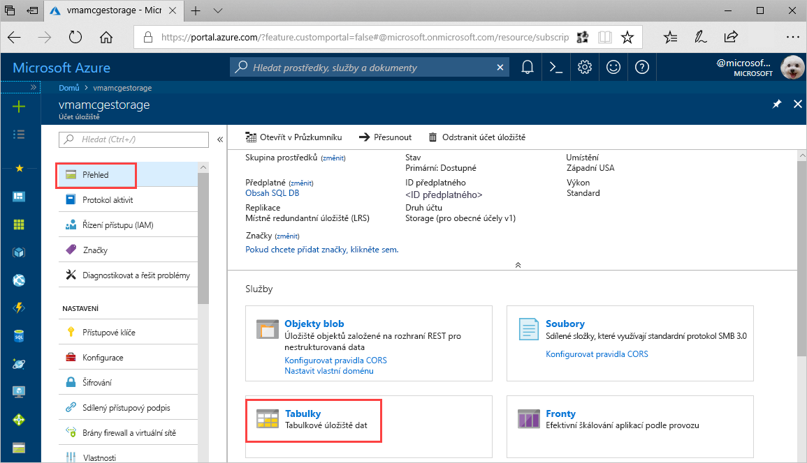
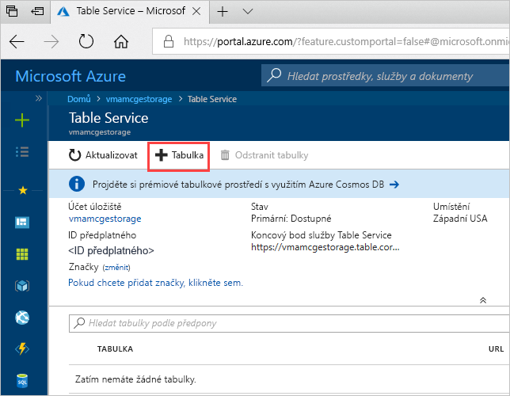
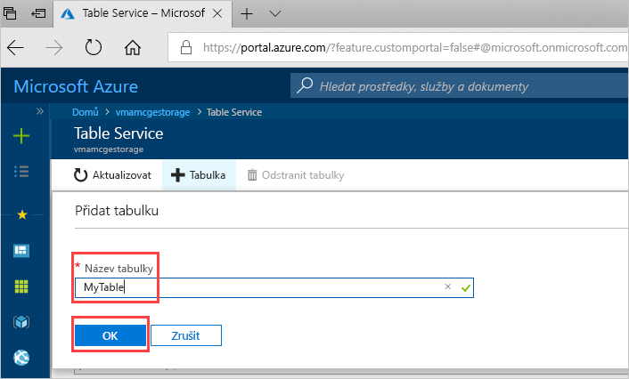

# Rychlý start: Vytvoření tabulky Azure Storage na webu Azure Portal 

Tento rychlý start ukazuje, jak na webovém portálu Azure Portal vytvářet tabulky a entity. V tomto rychlém startu se také dozvíte, jak vytvořit účet úložiště Azure.

[!INCLUDE [quickstarts-free-trial-note](../../../includes/quickstarts-free-trial-note.md)]

## Požadavky

Abyste mohli absolvovat tento rychlý start, nejprve na webu [Azure Portal](https://portal.azure.com/#create/Microsoft.StorageAccount-ARM) vytvořte účet úložiště Azure. Nápovědu k vytvoření účtu najdete v tématu [Vytvoření účtu úložiště](../common/storage-quickstart-create-account.md).

## Přidání tabulky

K vytvoření tabulky na webu Azure Portal můžete použít službu Table Service.

1. Klikněte na Přehled > Tabulky.

   

2. Klikněte na **+ Tabulka**.

   

3. Do pole **Název tabulky** zadejte název tabulky a potom klikněte na **OK**. 

   

## Další kroky

- [Pokyny pro návrh tabulek](table-storage-design-guidelines.md)