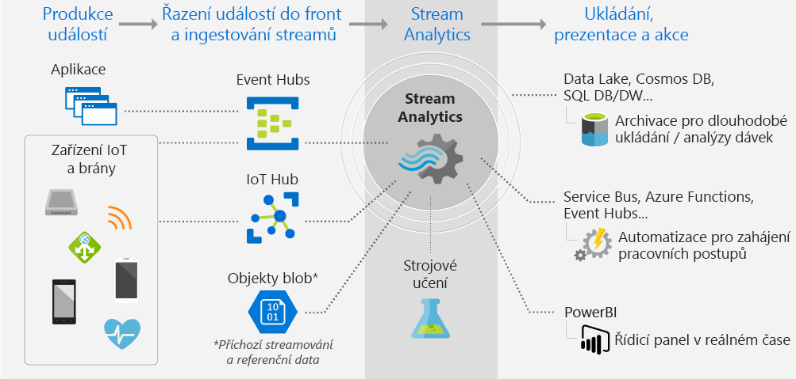
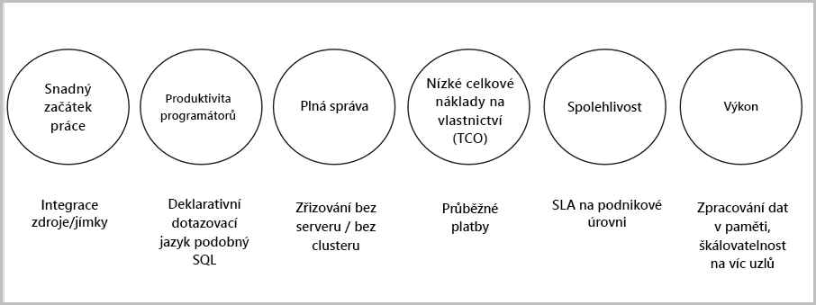

# Co je služba Stream Analytics?

Azure Stream Analytics je modul pro zpracování událostí, který umožňuje zkoumat velké objemy dat streamované ze zařízení. Příchozí data můžou pocházet ze zařízení, senzorů, webů, informačních kanálů sociálních médií, aplikací a dalších zdrojů. Podporuje také extrahování informací ze streamů, identifikování vzorů a relace. Tyto vzory potom můžete použít k aktivování dalších akcí ve směru server-klient, jako jsou upozornění nebo odesílání informací do nástrojů pro generování sestav, nebo je můžete uložit a využít později.

Toto jsou některé příklady, kdy je možné Azure Stream Analytics použít: 

* Sloučení senzoru Internetu věcí (IOT) a analýzy v reálném čase v telemetrii zařízení
* Webové protokoly/analýza navštívených webových stránek
* Geoprostorová analýza pro správu vozového parku a vozidel bez řidiče
* Vzdálené monitorování a prediktivní údržba nejcennějších prostředků
* Analýza dat z prodejen v reálném čase pro účely zjišťování anomálií a řízení zásob

## Jak funguje Stream Analytics?

Azure Stream Analytics začíná se zdrojem streamovaných dat, která se ingestují do centra událostí Azure, do centra Azure IoT Hub nebo z úložiště dat jako Azure Blob Storage. Pokud chcete streamy zkoumat, vytvoříte si úlohu Stream Analytics, která určí vstupní zdroj, který data streamuje. Úloha také určuje transformační dotaz, který definuje, jak vyhledávat data, vzory nebo relace. Transformační dotaz využívá dotazovací jazyk typu SQL, který se používá k filtrování, řazení, agregaci a připojení streamovaných dat v časovém období. Při provádění úlohy můžete upravit možnosti řazení události a dobu trvání časových období při provádění operací agregace.

Po analýze příchozích dat zadáte výstup pro transformovaná data a můžete řídit, co dělat v reakci na informace, které jste analyzovali. Můžete například provést tyto akce:

* Poslat data do monitorované fronty k aktivaci vlastních pracovních postupů ve směru server-klient
* Poslat data do řídicího panelu Power BI pro účely vizualizace v reálném čase
* Archivovat data do jiných služeb úložiště Azure

Následující obrázek ukazuje kanál Stream Analytics. Vaše úloha Stream Analytics může používat všechny vstupy a výstupy nebo vybranou sadu vstupů a výstupů. Tento obrázek ukazuje, jak se data posílají do služby Stream Analytics, jak se analyzují a posílají k dalším akcím, jako je uložení nebo prezentace:

## Klíčové funkce a výhody

Služba Azure Stream Analytics byla navržena jako snadno použitelná, flexibilní, spolehlivá a škálovatelná na libovolnou velikost úlohy. Je k dispozici ve více datových centrech i suverénních cloudech. Následující obrázek ukazuje klíčové funkce Azure Stream Analytics:

## Snadný začátek

Začít používat Azure Stream Analytics je snadné. Připojit se k více zdrojům a jímkám a vytvořit kanál od začátku do konce zabere jenom několik kliknutí. Stream Analytics se může připojit k centrům [Azure Event Hubs](https://docs.microsoft.com/azure/event-hubs/) a [Azure IoT Hub](https://docs.microsoft.com/azure/iot-hub/) a ingestovat streamovaná data. Také se může připojit ke službě [Azure Blob Storage](https://docs.microsoft.com/azure/storage/storage-introduction) a ingestovat historická data. Může kombinovat data z center událostí s dalšími zdroji dat a moduly pro zpracování. Vstup úlohy může také zahrnovat referenční data, která jsou statická nebo pomalu se měnící, a vy můžete připojit streamovaná data k těmto referenčním datům a provádět operace vyhledávání.

Stream Analytics může směrovat výstup úlohy na mnoho úložných systémů, jako [Azure Blob](https://docs.microsoft.com/azure/storage/storage-introduction), [Azure SQL Database](https://docs.microsoft.com/azure/sql-database/), [Azure Data Lake Stores](https://docs.microsoft.com/azure/data-lake-store/) nebo [Azure Cosmos DB](https://docs.microsoft.com/azure/cosmos-db/introduction). Po uložení můžete spustit dávkovou analýzu pomocí Azure HDInsight nebo poslat výstup do jiné služby, jako jsou například centra událostí, kde se využije, nebo do [Power BI](https://docs.microsoft.com/power-bi/) za účelem vizualizace v reálném čase pomocí streamovacího rozhraní API pro Power Bi.

## Produktivita programátorů

Azure Stream Analytics používá k analýze nestatických dat jednoduchý dotazovací jazyk založený na SQL, který je rozšířený o výkonná dočasná omezení. Pokud chcete definovat transformace úloh, použijete jednoduchý deklarativní [dotazovací jazyk Stream Analytics](https://msdn.microsoft.com/library/azure/dn834998.aspx), který umožňuje vytváření složitých dočasných dotazů a analýz pomocí jednoduchých konstruktorů SQL. Dotazovací jazyk Stream Analytics je konzistentní s jazykem SQL, znalost jazyka SQL stačí, abyste mohli začít vytvářet úlohy. Úlohy můžete také vytvářet pomocí vývojářských nástrojů jako Azure PowerShell, [nástroje sady Visual Studio pro Stream Analytics](stream-analytics-tools-for-visual-studio-install.md) nebo šablony Azure Resource Manageru. Použití vývojářských nástrojů umožňuje vyvíjet transformační dotazy offline a pomocí [kanálu CI/CD](stream-analytics-tools-for-visual-studio-cicd.md) odesílat úlohy do Azure. 

Dotazovací jazyk Stream Analytics nabízí širokou škálu funkcí pro analýzy a zpracování streamovaných dat. Tento dotazovací jazyk podporuje jednoduchou manipulaci s daty, agregační funkce až po komplexní geoprostorové funkce. Dotazy můžete upravit na portálu a otestovat je pomocí ukázkových dat, která se extrahují z živého streamu.

Možnosti dotazovacího jazyka můžete rozšířit definováním a vyvoláním dalších funkcí. Můžete definovat volání funkcí ve službě Azure Machine Learning a využívat výhod řešení Azure Machine Learning a integrovat javascriptové uživateli definované funkce nebo uživateli definované agregace, abyste mohli provádět složité výpočty v rámci dotazu Stream Analytics.

## S plnou správou 

Služba Azure Stream Analytics je plně spravovaná nabídka bez serveru (PaaS) v Azure. Což znamená, že nemusíte zřizovat žádný hardware nebo spravovat clustery, abyste mohli spouštět úlohy. Azure Stream Analytics plně řídí vaši úlohu, protože se stará o nastavení komplexních výpočetních clusterů v cloudu a o optimalizaci výkonu potřebnou ke spuštění úlohy. Integrace s centry Azure Event Hubs a Azure IoT Hub umožňuje úlohám ingestovat miliony událostí za sekundu, mimo jiné z připojených zařízení, záznamů o navštívených webových stránkách a souborů protokolů. Centra událostí nabízejí funkci dělení, pomocí které můžete výpočty dělit na logické kroky – ty pak můžete dělit ještě podrobněji, pokud chcete zvýšit škálovatelnost.

## Nízké celkové náklady na vlastnictví

Stream Analytics je cloudová služba, takže je optimalizovaná z hlediska nákladů. Neexistují žádné předem dané náklady, platíte jenom za [spotřebované jednotky streamování](stream-analytics-streaming-unit-consumption.md) a množství zpracovaných dat. Nevyžaduje se žádný závazek nebo zřizování clusterů. Úlohu je možné škálovat vertikálně v rámci streamovacích úloh podle obchodních potřeb. 

## Spolehlivost 

Služba Stream Analytics je spravovaná a díky tomu zaručuje zpracování událostí s 99,9% dostupností, pomáhá předcházet ztrátám dat a poskytuje obchodní kontinuitu. Další podrobnosti najdete na stránce [Smlouva SLA pro Stream Analytics](https://azure.microsoft.com/support/legal/sla/stream-analytics/v1_0/). Stream Analytics může zpracovat miliony událostí za sekundu a dokáže poskytovat výsledky s nízkou latencí.
Stream Analytics zaručuje právě jedno zpracování událostí a minimálně jedno doručení událostí. Obsahuje funkce obnovení pro případ, že by se doručení události nezdařilo. Stream Analytics může interně uchovávat stav vaší úlohy (vy můžete spustit úlohu z jejího posledního výstupu) a poskytuje opakovatelné výsledky tím, že poskytuje vždy stejné výsledky. Tato funkce služby Stream Analytics vám umožňuje vracet se v čase a při provádění analýz původních příčin zkoumat výpočty a jejich výsledky. 

## Výkon

Služba Azure Stream Analytics je optimalizovaná na vysoký výkon, může zpracovávat streamovaná data a provádět výpočty v paměti. Umožňuje vám vertikální nastavování kapacity, aby bylo možné pracovat s aplikacemi pro zpracování komplexních událostí v reálném čase. Stream Analytics podporuje výkon díky dělení. Komplexní dotaz jde paralelně rozdělit a provádět na několika uzlech pro streamování. 

## Další kroky

Teď máte přehled o službě Azure Stream Analytics. V dalším kroku se můžete do tématu ponořit hlouběji a vytvořit si svoji první úlohu Stream Analytics:

* [Vytvořit úlohu Stream Analytics pomocí webu Azure Portal](stream-analytics-quick-create-portal.md)
* [Vytvořit úlohu Stream Analytics pomocí Azure PowerShellu](stream-analytics-quick-create-powershell.md)
