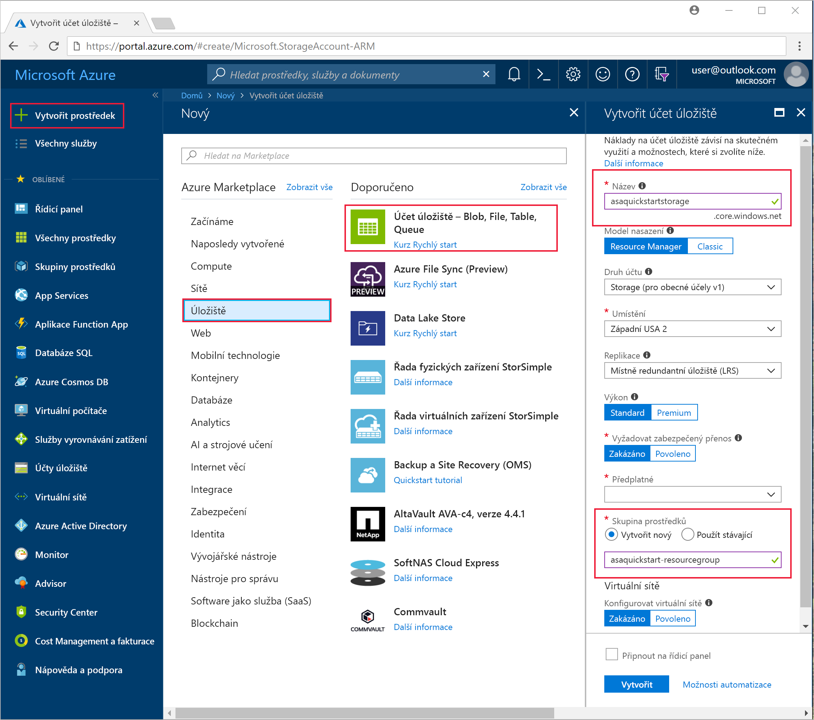
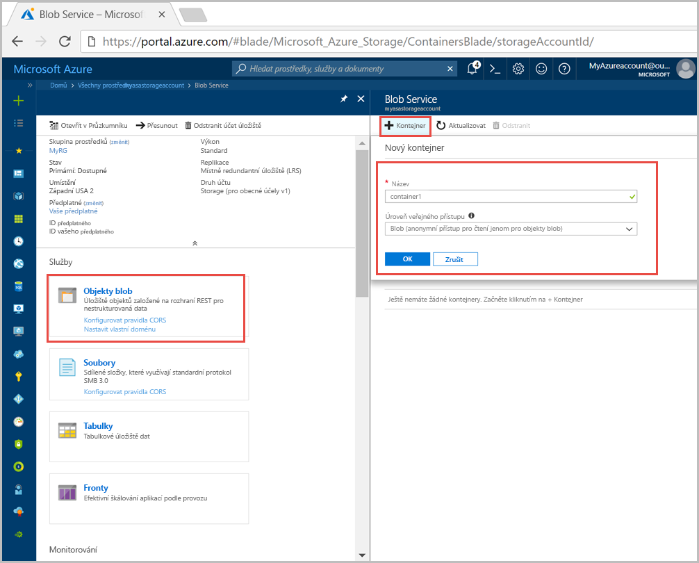
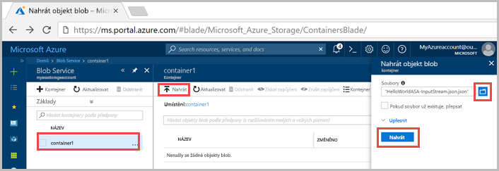
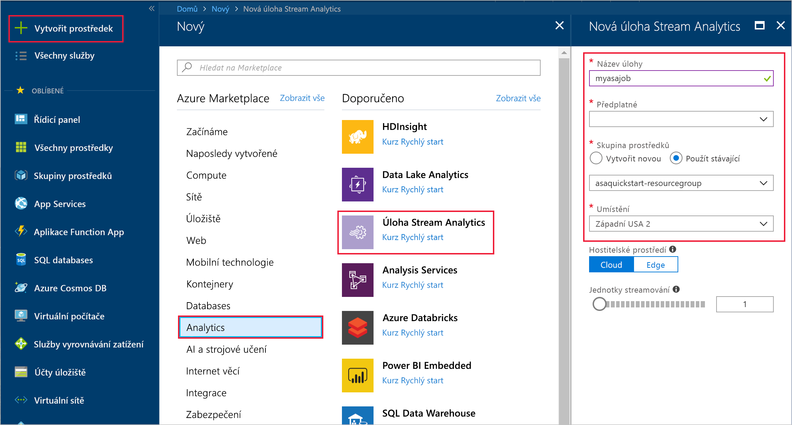
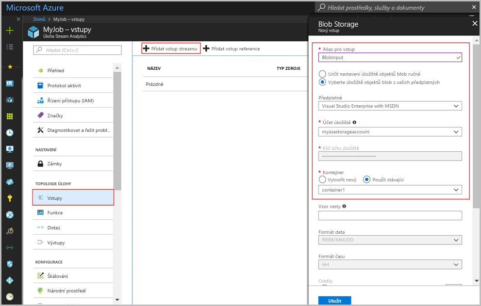
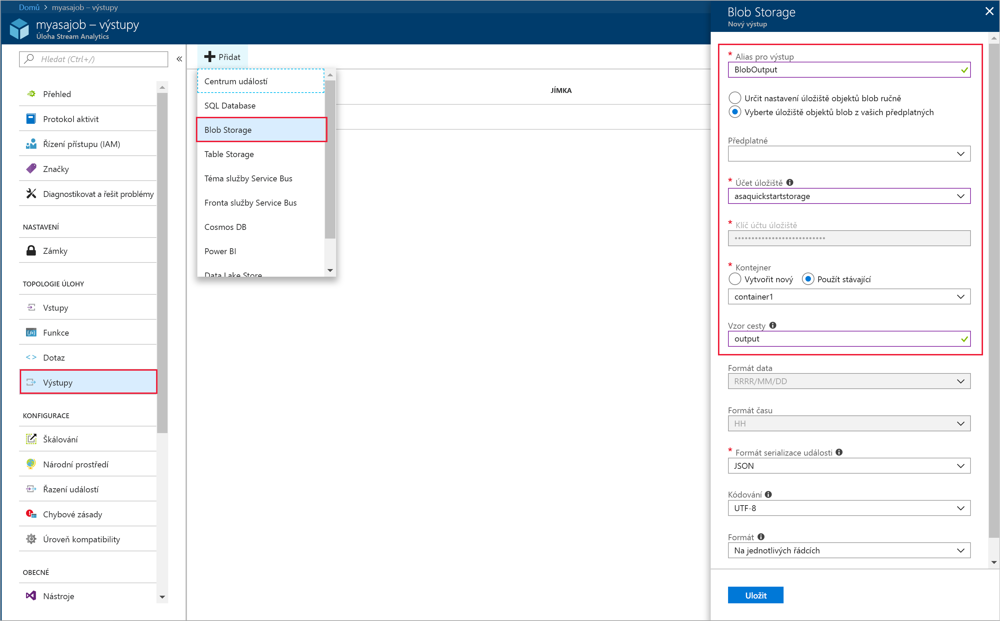
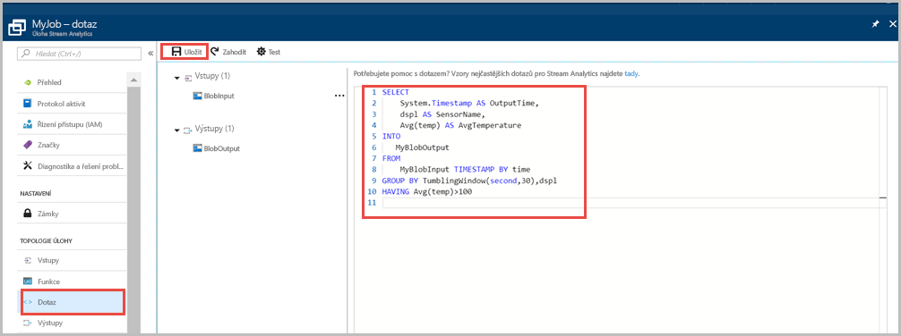
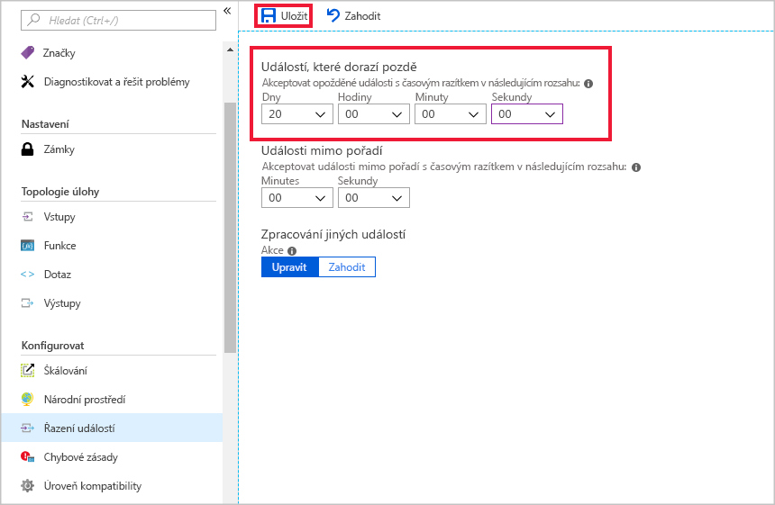
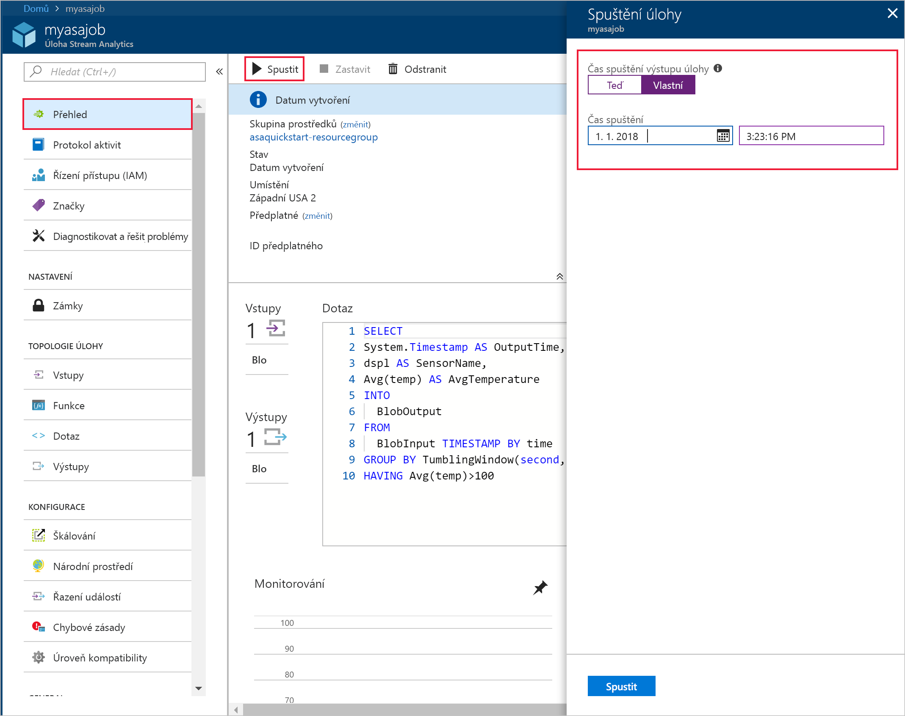
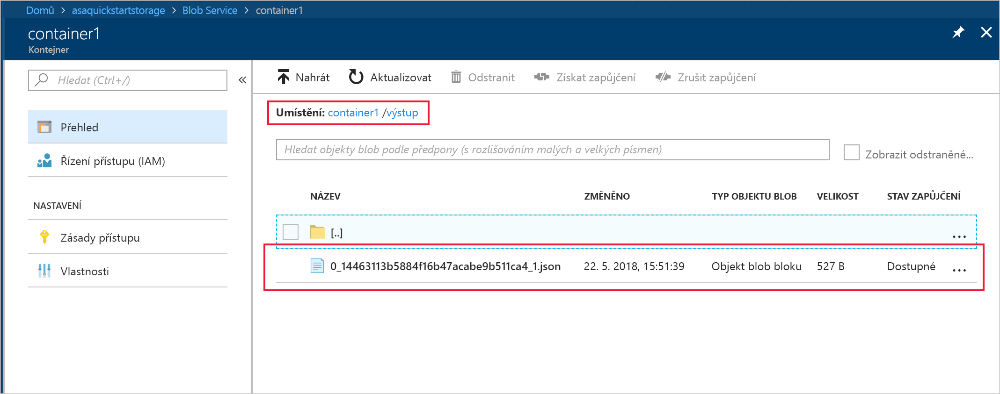

# <a name="quickstart-create-a-stream-analytics-job-by-using-the-azure-portal"></a>Rychlý start: Vytvoření úlohy Stream Analytics pomocí webu Azure Portal

V tomto rychlém startu se naučíte, jak začít vytvořením úlohy Stream Analytics. Definujete úlohu Stream Analytics, která čte vzorová data snímačů a filtruje řádky s průměrnou teplotou přesahující po každých 30 sekundách 100 stupňů. V tomto článku se dozvíte, jak přečíst data z úložiště objektů blob, transformovat je a zapsat je zpět do jiného kontejneru ve stejném úložišti. Vstupní datový soubor použitý v tomto rychlém startu obsahuje statická data, která jsou určena pouze pro ilustraci. Ve skutečném scénáři použijete pro úlohu Stream Analytics streamovaná vstupní data.

## <a name="before-you-begin"></a>Než začnete

* Pokud ještě nemáte předplatné Azure, vytvořte si [bezplatný účet](https://azure.microsoft.com/free/).

* Přihlaste se k webu [Azure Portal](https://portal.azure.com/).

## <a name="prepare-the-input-data"></a>Příprava vstupních dat

Než začnete definovat úlohu Stream Analytics, připravte si data nakonfigurovaná jako vstup pro tuto úlohu. Pomocí následujících kroků si připravte vstupní data vyžadovaná úlohou:

1. Z GitHubu si stáhněte [vzorová data snímačů](https://raw.githubusercontent.com/Azure/azure-stream-analytics/master/Samples/GettingStarted/HelloWorldASA-InputStream.json). Tato data obsahují informace ze snímačů v uvedeném formátu JSON:  

   ```json
   {
     "time": "2018-08-19T21:18:52.0000000",
     "dspl": "sensorC",
     "temp": 87,
     "hmdt": 44
   }
   ```
2. Přihlaste se k webu [Azure Portal](https://portal.azure.com/).  

3. V levém horním rohu webu Azure Portal vyberte **Vytvořit prostředek** > **Úložiště** > **Účet úložiště**. Vyplňte informace na stránce úlohy Účet úložiště a nastavte **Název** na „asaquickstartstorage“, **Umístění** na „West US 2“, **Skupinu prostředků** na „asaquickstart-resourcegroup“ (kvůli zajištění vyššího výkonu se účet úložiště hostuje ve stejné skupině prostředků jako úloha streamování). Ostatní nastavení můžou zůstat na výchozích hodnotách.  

   

4. Na stránce **Všechny prostředky** vyhledejte účet úložiště vytvořený v předchozím kroku. Otevřete stránku **Přehled** a potom dlaždici **Objekty blob**.  

5. Na stránce **Blob service** vyberte **Kontejner**, zadejte jeho **Název** (například *container1*), u možnosti **Úroveň veřejného přístupu** nastavte Privátní (bez anonymního přístupu) a vyberte **OK**.  

   

6. Přejděte do kontejneru, který jste vytvořili v předchozím kroku. Vyberte **Nahrát** a nahrajte data snímače, která jste získali v prvním kroku.  

   

## <a name="create-a-stream-analytics-job"></a>Vytvoření úlohy Stream Analytics

1. Přihlaste se k portálu Azure.

2. V levém horním rohu webu Azure Portal vyberte **Vytvořit prostředek**.  

3. V seznamu výsledků vyberte **Data + analýzy** > **Úloha Stream Analytics job**.  

4. Na stránce Úloha Stream Analytics zadejte následující informace:

   |**Nastavení**  |**Navrhovaná hodnota**  |**Popis**  |
   |---------|---------|---------|
   |Název úlohy   |  myasajob   |   Zadejte název pro identifikaci úlohy Stream Analytics. Název úlohy Stream Analytics může obsahovat jen alfanumerické znaky, spojovníky a podtržítka a musí být dlouhý 3 až 63 znaků. |
   |Předplatné  | \<Vaše předplatné\> |  Vyberte předplatné Azure, které chcete použít pro vaši úlohu. |
   |Skupina prostředků   |   asaquickstart-resourcegroup  |   Vyberte**Vytvořit nový** a zadejte název nové skupiny prostředků pro váš účet. |
   |Umístění  |  \<Vyberte oblast nejbližší vašim uživatelům.\> | Vyberte zeměpisnou polohu, kde je možné hostovat úlohu Stream Analytics. V zájmu vyššího výkonu a nižších nákladů za přenos dat zvolte umístění co nejbližší vašim uživatelům. |
   |Jednotky streamování  | 1  |   Jednotky streamování představují výpočetní prostředky nutné k provedení úlohy. Ve výchozím nastavení je tato hodnota nastavená na 1. Podrobnosti o škálování jednotek streamování najdete v článku věnovaném [principům a úpravám jednotek streamování](stream-analytics-streaming-unit-consumption.md).   |
   |Hostitelské prostředí  |  Cloud  |   Úlohy Stream Analytics můžete nasadit do cloudu nebo do hraničního zařízení. Možnost Cloud umožňuje nasazení do Azure Cloud, možnost Edge do zařízení IoT Edge. |

   

5. Umístěte úlohu do řídicího panelu zaškrtnutím políčka **Připnutí na řídicí panel** a klikněte na **Vytvořit**.  

6. V pravém horním rohu okna prohlížeče by se měla zobrazit zpráva „Probíhá nasazení“. 

## <a name="configure-input-to-the-job"></a>Konfigurace vstupu do úlohy

V této části nakonfigurujete úložiště objektů blob jako vstup do úlohy Stream Analytics. Ještě před konfigurací vstupu vytvořte účet úložiště objektů blob.  

### <a name="add-the-input"></a>Přidání vstupu 

1. Přejděte na úlohu Stream Analytics.  

2. Zvolte **Vstupy** > **Přidat vstup streamu** > **Úložiště objektů blob**.  

3. Na stránce **Úložiště objektů blob** vyplňte tyto hodnoty:

   |**Nastavení**  |**Navrhovaná hodnota**  |**Popis**  |
   |---------|---------|---------|
   |Alias vstupu  |  BlobInput   |  Zadejte název pro identifikaci vstupu úlohy.   |
   |Předplatné   |  \<Vaše předplatné\> |  Zadejte předplatné Azure vytvořeného účtu úložiště. Účet úložiště můžete využívat v rámci stejného, ale i jiného předplatného. V tomto příkladu se předpokládá, že jste účet vytvořili v rámci stejného předplatného. |
   |Účet úložiště  |  myasastorageaccount |  Vyberte nebo zadejte název účtu úložiště. Pokud jsou názvy vytvořeny v rámci stejného předplatného, zjišťují se automaticky. |
   |Kontejner  | container1 | Vyberte název kontejneru, který obsahuje ukázková data. Pokud jsou názvy vytvořeny v rámci stejného předplatného, zjišťují se automaticky. |

4. U ostatních možností ponechejte výchozí hodnoty a výběrem možnosti **Uložit** uložte nastavení.  

   
 
## <a name="configure-output-to-the-job"></a>Konfigurace výstupu do úlohy

1. Přejděte na vytvořenou úlohu Stream Analytics.  

2. Vyberte **Výstupy > Přidat > Úložiště objektů blob**.  

3. Na stránce **Úložiště objektů blob** vyplňte tyto hodnoty:

   |**Nastavení**  |**Navrhovaná hodnota**  |**Popis**  |
   |---------|---------|---------|
   |Alias pro výstup |   BlobOutput   |   Zadejte název pro identifikaci výstupu úlohy. |
   |Předplatné  |  \<Vaše předplatné\>  |  Zadejte předplatné Azure vytvořeného účtu úložiště. Účet úložiště můžete využívat v rámci stejného, ale i jiného předplatného. V tomto příkladu se předpokládá, že jste účet vytvořili v rámci stejného předplatného. |
   |Účet úložiště |  asaquickstartstorage |   Vyberte nebo zadejte název účtu úložiště. Pokud jsou názvy vytvořeny v rámci stejného předplatného, zjišťují se automaticky.       |
   |Kontejner |   container1  |  Vyberte existující kontejner, který jste vytvořili v účtu úložiště.   |
   |Vzor cesty |   output  |  Zadejte název, který bude sloužit jako cesta v rámci stávajícího kontejneru pro výstup.   |

4. U ostatních možností ponechejte výchozí hodnoty a výběrem možnosti **Uložit** uložte nastavení.  

   
 
## <a name="define-the-transformation-query"></a>Definice transformačního dotazu

1. Přejděte na vytvořenou úlohu Stream Analytics.  

2. Vyberte možnost **Dotaz** a aktualizujte dotaz tímto způsobem:  

   ```sql
   SELECT 
   System.Timestamp AS OutputTime,
   dspl AS SensorName,
   Avg(temp) AS AvgTemperature
   INTO
     BlobOutput
   FROM
     BlobInput TIMESTAMP BY time
   GROUP BY TumblingWindow(second,30),dspl
   HAVING Avg(temp)>100
   ```

3. V tomto příkladu čte dotaz data z objektu blob a zkopíruje je do nového souboru v tomto objektu. Vyberte možnost **Uložit**.  

   

## <a name="configure-late-arrival-policy"></a>Konfigurace zásad pozdního přijetí

1. Přejděte na vytvořenou úlohu Stream Analytics.

2. V části **Konfigurovat** vyberte **Řazení událostí**.

3. Nastavte možnost **Událostí, které dorazí pozdě** na hodnotu 20 dnů a vyberte **Uložit**.

   

## <a name="start-the-stream-analytics-job-and-check-the-output"></a>Spuštění úlohy Stream Analytics a kontrola výstupu

1. Vraťte se na stránku přehledu úlohy a vyberte **Spustit**.

2. V části **Spuštění úlohy** vyberte pro pole **Čas zahájení** možnost **Vlastní**. Jako datum zahájení vyberte `2018-01-24`, ale čas ponechejte beze změny. Toto datum je zvoleno, protože předchází časovému razítku události z ukázkových dat. Jakmile budete mít hotovo, vyberte **Spustit**.

   

3. Po několika minutách najděte na portálu účet úložiště a kontejner, které jste nakonfigurovali jako výstup úlohy. Vyberte výstupní cestu. Soubor výstupu teď uvidíte v kontejneru. První spuštění úlohy trvá několik minut. Potom bude úloha dál běžet s tím, jak budou data přicházet.  

   

## <a name="clean-up-resources"></a>Vyčištění prostředků

Odstraňte skupinu prostředků, úlohu streamování a všechny související prostředky, pokud je už nepotřebujete. Odstraněním úlohy se zabrání zaúčtování jednotek streamování, které daná úloha spotřebovává. Pokud plánujete používat tuto úlohu v budoucnu, můžete ji zastavit a znovu ji spustit později, až ji budete potřebovat. Pokud nebudete tuto úlohu nadále používat, odstraňte všechny prostředky vytvořené podle tohoto rychlého startu pomocí následujícího postupu:

1. V nabídce vlevo na portálu Azure Portal vyberte **Skupiny prostředků** a potom zvolte název vytvořeného prostředku.  

2. Na stránce skupiny prostředků zvolte **Odstranit**, do textového pole zadejte prostředek, který chcete odstranit, a potom vyberte **Odstranit**.

## <a name="next-steps"></a>Další kroky

V tomto rychlém startu jste pomocí webu Azure Portal nasadili jednoduchou úlohu Stream Analytics. Úlohy Stream Analytics můžete nasadit také pomocí [PowerShellu](stream-analytics-quick-create-powershell.md) a sady [Visual Studio](stream-analytics-quick-create-vs.md).

Pokud se chcete dozvědět o konfiguraci dalších vstupních zdrojů a provádění detekce v reálném čase, pokračujte na další článek:

> [!div class="nextstepaction"]
> [Zjišťování možných podvodů v reálném čase pomocí Stream Analytics](stream-analytics-real-time-fraud-detection.md)

