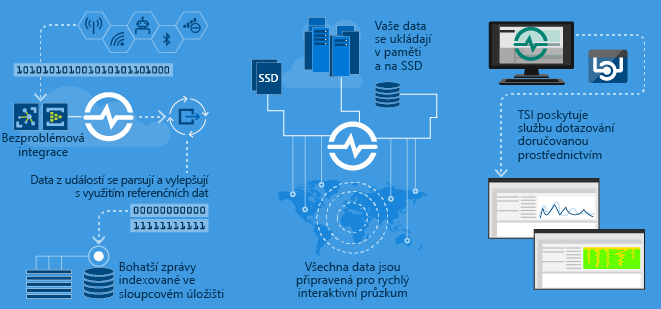
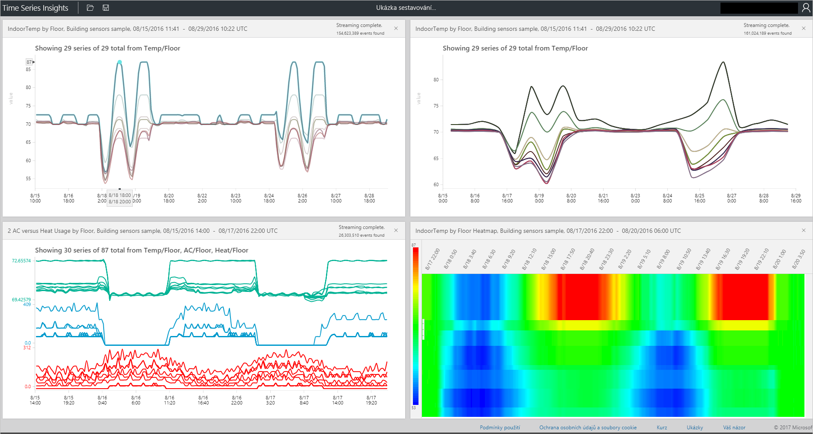

# Co je Azure Time Series Insights?

Služba Time Series Insights je určená k ukládání, vizualizaci a dotazování velkých objemů dat časových řad, jako jsou například data generovaná zařízeními IoT.  Pokud chcete ukládat, spravovat, dotazovat nebo vizualizovat data časových řad v cloudu, služba Time Series Insights je pro vás pravděpodobně to pravé.  

Služba Time Series Insights má čtyři klíčové úlohy:

- Za prvé je plně integrovaná s cloudovými bránami, jako jsou služby Azure IoT Hub a Azure Event Hubs. Snadno se připojuje k těmto zdrojům událostí a parsuje JSON ze zpráv a struktur obsahujících data v jasně uspořádaných řádcích a sloupcích. Spojuje metadata s telemetrií a indexuje vaše data ve sloupcovém úložišti.
- Za druhé služba Time Series Insights spravuje úložiště vašich dat. Aby služba zajistila neustálou snadnou dostupnost dat, ukládá vaše data v paměti a na discích SSD po dobu až 400 dnů. Na vyžádání můžete interaktivně dotazovat miliardy událostí za sekundu.
- Za třetí služba Time Series Insights poskytuje okamžitou vizualizaci prostřednictvím průzkumníka TSI.  
- Za čtvrté služba Time Series Insights poskytuje dotazovací službu, jak v průzkumníku TSI, tak prostřednictvím snadno integrovatelných rozhraní API, umožňující vkládání dat časových řad do vlastních aplikací.  

Pokud vytváříte aplikaci, ať už pro interní použití nebo pro externí zákazníky, můžete službu Time Series Insights využít jako back-end pro indexování, ukládání a agregaci dat časových řad. Nad těmito daty můžete vytvořit vlastní vizualizaci a uživatelské prostředí.  Time Series Insights zveřejňuje rozhraní API pro dotazy, která tento scénář umožňují.  

Pokud si nejste jisti, jestli jsou vaše data časovou řadou, měli byste vědět několik věcí.  Data časových řad představují změnu prostředku nebo procesu v průběhu času.  Jsou jedinečná v tom smyslu, že obsahují časové razítko a čas dává největší smysl jako osa.  Data časových řad typicky přicházejí v pořadí podle času a obvykle se zpracovávají jako vložení do databáze, a ne jako aktualizace databáze.  Vzhledem k tomu, že služba Time Series Insights zachytává a ukládá každou novou událost jako řádek, změny se měří v průběhu času, což vám umožní podívat se zpět a předvídat budoucí změny.  Ukládání, indexování, dotazování, analýza a vizualizace velkých objemů dat časových řad může být náročné.  

## Video: 

### Toto video přináší přehled služby Time Series Insights, analytické platformy IoT založené na cloudu. 

> [!VIDEO https://www.youtube.com/embed/qNc9gQTLROs]

## Primární scénáře

- Škálovatelné ukládání dat časových řad  
  - Jádrem služby Time Series Insights je databáze určená pro data časových řad.  Vzhledem k tomu, že je služba Time Series Insights škálovatelná a plně spravovaná, stará se o ukládání a správu událostí.

- Zkoumání dat téměř v reálném čase  
  - Time Series Insights nabízí průzkumníka, který vizualizuje všechna data streamovaná do prostředí.  Krátce po připojení zdroje událostí je možné v rámci služby Time Series Insights zobrazit, zkoumat a dotazovat data událostí.  Tato data jsou užitečná při ověřování, jestli zařízení vysílá data očekávaným způsobem, a monitorování stavu, produktivity a celkové efektivity prostředků IoT.  

- Analýza původních příčin a detekce anomálií
  - Time Series Insights obsahuje nástroje, jako jsou zobrazení vzorů a perspektivní zobrazení, které umožňují provádět a ukládat vícekrokové analýzy původních příčin.  Time Series Insights navíc spolupracuje se službami upozornění, jako je Azure Stream Analytics, takže můžete upozornění a detekované anomálie zobrazit téměř v reálném čase v průzkumníku Time Series Insights.  

- Porovnávání několika prostředků a webů díky globálnímu zobrazení dat časových řad streamovaných z různorodých umístění
  - K prostředí Time Series Insights můžete připojit několik zdrojů událostí.  To znamená, že můžete najednou a téměř v reálném čase zobrazit data streamovaná z několika různých umístění.  Uživatelé můžou tento přehled využít ke sdílení dat s obchodním vedením a lepší spolupráci s odborníky v jednotlivých oblastech, kteří můžou s využitím svých odborných znalostí pomoct řešit problémy, uplatňovat osvědčené postupy a sdílet poznatky.

- Vytvoření zákaznické aplikace využívající Time Series Insights 
  - Time Series Insights zveřejňuje rozhraní REST API pro dotazy, která umožňují vytvářet aplikace využívající data časových řad.

## Možnosti

- **Rychlý začátek:** Azure Time Series Insights nevyžaduje žádnou počáteční přípravu dat. Během několika minut se můžete připojit k milionům událostí ve službě Azure IoT Hub nebo v centru událostí. Po připojení můžete vizualizovat data snímačů, pracovat s nimi a rychle tak prověřit řešení IoT. S daty můžete pracovat bez psaní kódu.
Nemusíte se učit žádný nový jazyk, protože Time Series Insights poskytuje plochu pro podrobné volnotextové dotazování pro pokročilé uživatele spolu s prozkoumáváním typu ukázat a kliknout.
- **Přehledy téměř v reálném čase:** Time Series Insights může ingestovat miliony událostí snímačů za den s minutovou latencí. Time Series Insights pomáhá získat přehled o datech snímačů tím, že pomáhá zjišťovat trendy a anomálie, provádět analýzy původních příčin a vyhnout se nákladným prostojům. Díky povolení křížové korelace mezi historickými daty a daty v reálném čase pomáhá Time Series Insights odhalit skryté trendy v datech.
- **Sestavování vlastních řešení:** Vkládejte data Azure Time Series Insights do svých stávajících aplikací nebo vytvářejte nová vlastní řešení s využitím rozhraní REST API služby Time Series Insights. Můžete vytvářet přizpůsobená zobrazení a sdílet je s ostatními, aby i oni mohli zkoumat přehledy.
- **Škálovatelnost:** Služba Time Series Insights je navržená tak, aby podporovala škálování IoT. Může ingestovat 1 až 100 milionů událostí za den při výchozím rozsahu uchování 31 dnů. Můžete vizualizovat a analyzovat živé datové proudy téměř v reálném čase spolu s historickými daty. Míry uchovávání a příchozího přenosu dat se postupem času budou zvyšovat s ohledem na zvyšující se velikost podniku.

## Začínáme
Začít můžete za méně než 5 minut. 

1.  Začněte tak, že na webu Azure Portal zřídíte prostředí Time Series Insights. 
2.  Připojte zdroj událostí, jako je služba Azure IoT Hub nebo centrum událostí.  
3.  Nahrajte referenční data (toto není další služba).
4.  Během několika minut můžete data zobrazit v průzkumníku Time Series Insights.

## Průzkumník Time Series Insights
Tento diagram ukazuje příklad zobrazení dat Time Series Insights v průzkumníku: 

## Další kroky
 - [Zkoumání pomocí průzkumníka Time Series Insights v ukázkovém prostředí](./time-series-quickstart.md)
 - [Plánování vlastního prostředí Time Series Insights](time-series-insights-environment-planning.md)

