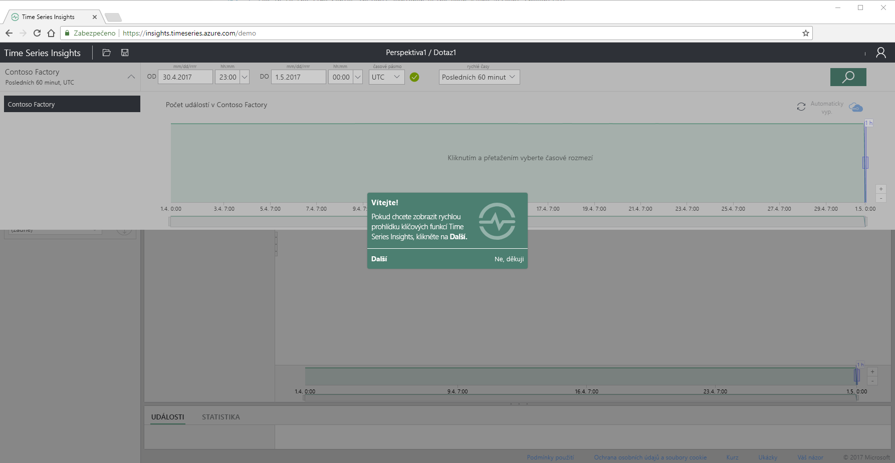
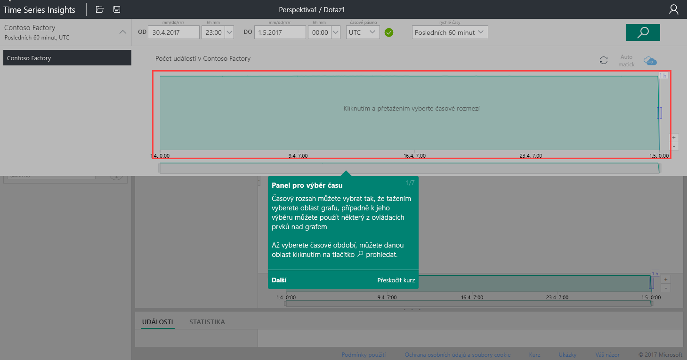
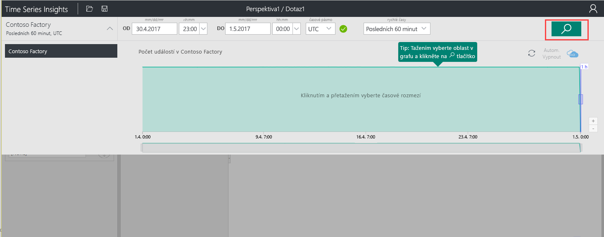
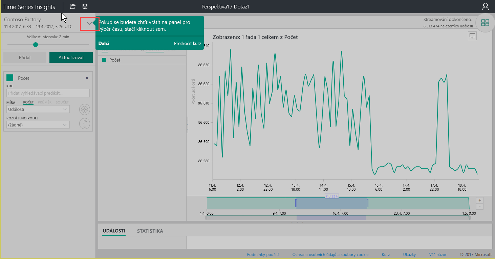
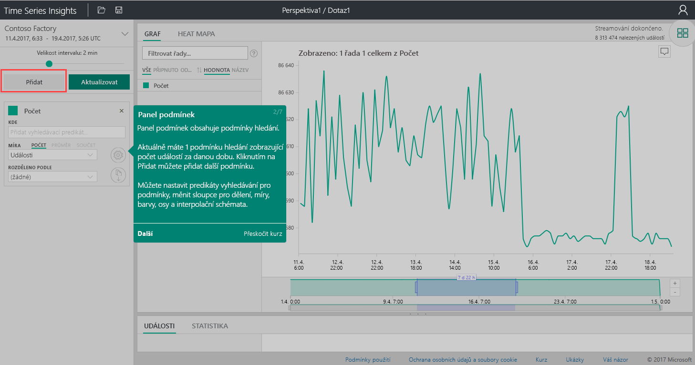
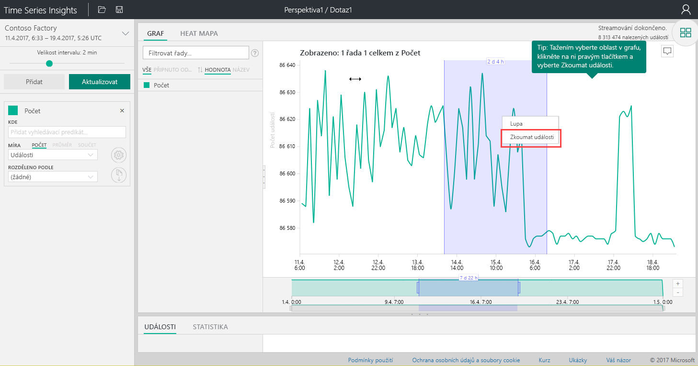
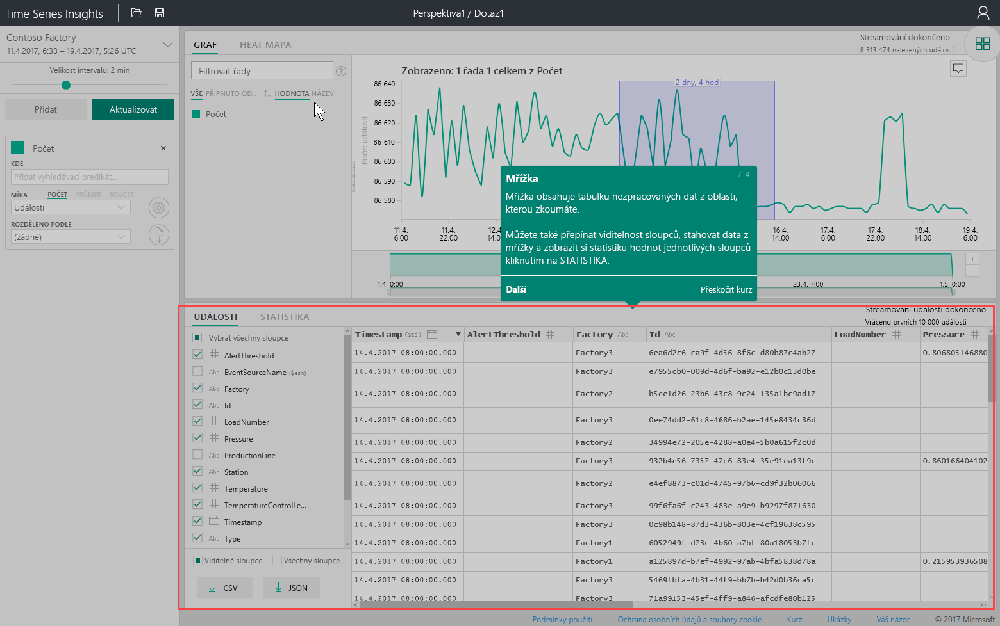
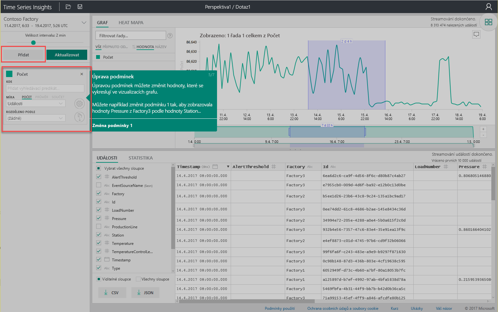
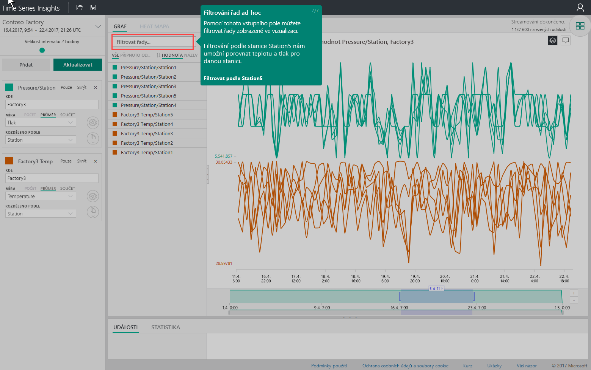

# Rychlý start: Prozkoumat službu Azure Time Series Insights

V tomto rychlém startu Průzkumníka služby Azure Time Series Insights vám pomůže začít pracovat s Time Series Insights v bezplatném ukázkovém prostředí. Prostřednictvím, se dozvíte, jak pomocí webového prohlížeče vizualizovat velké objemy IoT dat a prohlídku klíčových funkcí, které jsou teď obecně dostupná.

Azure Time Series Insights je plně spravovaná služba analýzy, ukládání a vizualizace, která zjednodušuje postupy zkoumání a analýzy miliard událostí IoT současně. Poskytuje globální přehled o datech, takže můžete rychle ověřit vaše řešení IoT a vyhnout se nákladným prostojům důležitých zařízení. Azure Time Series Insights pomáhá odhalovat skryté trendy, detekovat anomálie a provádět analýzy hlavních příčin téměř v reálném čase.

Pro větší flexibilitu, můžete přidat Azure Time Series Insights do stávající aplikace prostřednictvím jeho výkonné [rozhraní REST API](./time-series-insights-update-tsq.md) a [Klientská sada SDK](./tutorial-create-tsi-sample-spa.md). Rozhraní API slouží k uložení dotazu a využívat data časových řad v klientské aplikaci podle vašeho výběru. Klientská sada SDK můžete použít také k přidání komponenty uživatelského rozhraní do existující aplikace.

V tomto rychlém startu Průzkumníka Time Series Insights nabízí Průvodce funkcí, které jsou teď obecně dostupná.

## Příprava prostředí pro ukázku

1. Vytvoření [bezplatný účet Azure](https://azure.microsoft.com/free/?ref=microsoft.com&utm_source=microsoft.com&utm_medium=docs&utm_campaign=visualstudio) Pokud jste ještě už vytvořili.

1. V prohlížeči přejděte [všeobecné dostupnosti ukázka](https://insights.timeseries.azure.com/demo).

1. Pokud se zobrazí výzva, přihlaste se do Průzkumníka služby Time Series Insights pomocí přihlašovacích údajů k účtu Azure.

1. Zobrazí se stránka stručný přehled služby Time Series Insights. Vyberte **Další** zahajte rychlou prohlídku.

   

## Prozkoumejte ukázkovém prostředí

1. **Panel výběru času** zobrazí. Pomocí tohoto panelu vyberte časový rámec, který chcete vizualizovat.

   

1. Vyberte časový rámec a přetáhněte ho v oblasti. Potom vyberte **hledání**.

   

   Time Series Insights zobrazí vizualizaci grafu pro zadaný časový rámec. Můžete provádět různé akce v rámci spojnicový graf. Můžete filtrovat, Připnutí, řazení a zásobníku.

   Chcete vrátit **panel výběru času**, vyberte šipku dolů, jak je znázorněno:

   

1. Vyberte **přidat** v **panel podmínek** přidáte nový hledaný výraz.

   

1. V grafu můžete vybrat oblast, kliknout na ni pravým tlačítkem a vybrat **Prozkoumat události**.

   

   Zobrazí tabulky nezpracovaných dat z oblasti, že zkoumáte.

   

## Výběr a filtrování dat

1. Upravte výrazy, chcete-li změnit hodnoty v grafu. Přidejte další výraz, aby provedla vzájemná korelace různých typů hodnot.

   

1. Zadejte podmínky filtru a v **filtrovat řady** pole pro filtrování improvizovanými řad. Pro účely tohoto rychlého startu zadejte **Station5**, aby se provedla vzájemná korelace teploty a tlaku pro příslušnou stanici.

   

Po dokončení tohoto rychlého startu můžete experimentovat s ukázkovou sadou dat a vytvářet různé vizualizace.

## Další postup

Jste připraveni vytvořit vlastní prostředí Time Series Insights:
> [!div class="nextstepaction"]
> [Plánování prostředí Time Series Insights](time-series-insights-environment-planning.md)
