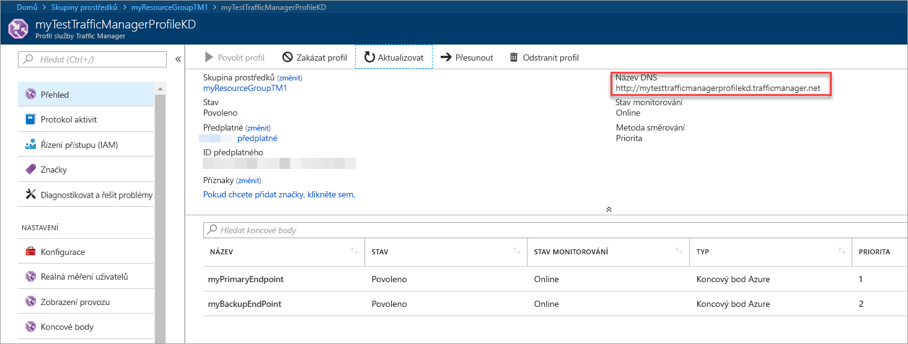
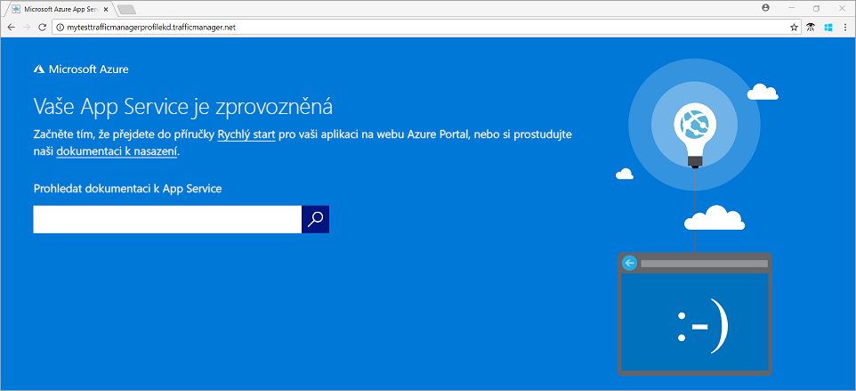

# Rychlý start: Vytvoření profilu Traffic Manageru s vysokou dostupností webové aplikace

Tento rychlý start popisuje, jak vytvořit profil služby Traffic Manager, který poskytuje vysokou dostupnost pro vaši webovou aplikaci.

V tomto rychlém startu nemusíte se věnovat čtení o dvou instancí webové aplikace. Každý z nich je spuštěna v jiné oblasti Azure. Vytvoříte profil Traffic Manageru na základě [Priorita koncového bodu](traffic-manager-routing-methods.md#priority). Profil, který bude směrovat uživatelský provoz do primární lokality spuštění webové aplikace. Traffic Manager neustále monitoruje webové aplikace. V případě, že primární lokalita není k dispozici, poskytuje automatické převzetí služeb při selhání zálohování lokality.

Pokud ještě nemáte předplatné Azure, vytvořte si teď [bezplatný účet](https://azure.microsoft.com/free/?WT.mc_id=A261C142F).

## Přihlásit se k Azure

Přihlaste se k webu [Azure Portal](https://portal.azure.com).

## Požadavky

Pro účely tohoto rychlého startu budete potřebovat dvě instance webové aplikace nasazené ve dvou různých oblastech Azure (*USA – východ* a *západní Evropa*). Každá bude sloužit jako primární server a převzetí služeb při selhání koncových bodů Traffic Manageru.

1. Na straně levého horního rohu obrazovky vyberte **vytvořit prostředek** > **webové** > **webovou aplikaci**.
2. V **webovou aplikaci**, zadejte nebo vyberte tato nastavení:

    | Nastavení | Hodnota |
    | ------- | ----- |
    | App name (Název aplikace) | Zadejte jedinečný název pro vaši webovou aplikaci.  |
    | Předplatné | Vyberte předplatné, které chcete použít pro webové aplikace. |
    | Skupina prostředků | Vyberte **vytvořit nový**a zadejte *myResourceGroupTM1*. |
    | Operační systém | Vyberte **Windows** jako operační systém. |
    | Publikování | Vyberte **kód** formátu, který chcete publikovat. |

3. Vyberte **plán služby App Service/umístění**.
4. V **plán služby App Service**vyberte **vytvořit nový**.
5. V **nový plán služby App Service**, zadejte nebo vyberte tato nastavení:

    | Nastavení | Hodnota |
    | ------- | ----- |
    | Plán služby App Service | Zadejte *myAppServicePlanEastUS*. |
    | Umístění | USA – východ |
    | Cenová úroveň | S1 Standard |

6. Vyberte **OK**.

7. V **webovou aplikaci**vyberte **vytvořit**. Když úspěšně nasadí webovou aplikaci, vytvoří výchozí webovou stránku.

8. Chcete-li vytvořit druhý web v jiné oblasti Azure, opakujte kroky 1-7 s těmito nastaveními:

    | Nastavení | Hodnota |
    | --------| ----- |
    | Název | Zadejte jedinečný název pro vaši webovou aplikaci. |
    | Předplatné | Vyberte předplatné, které chcete použít pro webové aplikace. |
    | Skupina prostředků | Vyberte **vytvořit nový**a pak zadejte *myResourceGroupTM2*. |
    | Operační systém | Vyberte **Windows** jako operační systém. |
    | Publikování | Vyberte **kód** formátu, který chcete publikovat. |
    | Plán služby App Service / umístění | Zadejte *myAppServicePlanWestEurope*. |
    | Umístění | Západní Evropa |
    | Cenová úroveň | S1 Standard |

## Vytvoření profilu Traffic Manageru

Vytvořte profil služby Traffic Manager, která směruje provoz uživatelů na základě priority koncových bodů.

1. Na straně levého horního rohu obrazovky vyberte **vytvořit prostředek** > **sítě** > **profil služby Traffic Manager**.
2. V **vytvořit profil Traffic Manageru**, zadejte nebo vyberte tato nastavení:

    | Nastavení | Hodnota |
    | --------| ----- |
    | Název | Zadejte jedinečný název pro svůj profil Traffic Manageru.|
    | Metoda směrování | Vyberte **Priority**.|
    | Předplatné | Vyberte předplatné, které chcete použít pro profil traffic Manageru. |
    | Skupina prostředků | Vyberte *myResourceGroupTM1*.|
    | Umístění |Toto nastavení se týká umístění skupiny prostředků. Nemá žádný vliv na profil Traffic Manageru, který se nasadí globálně.|

3. Vyberte **Vytvořit**.

## Přidání koncových bodů služby Traffic Manager

Přidejte web v oblasti *USA – východ* jako primární koncový bod, do kterého se bude směrovat veškerý provoz uživatelů. Přidání webu v *západní Evropa* jako koncový bod převzetí služeb při selhání. Primární koncový bod není k dispozici, provoz automaticky směruje do koncového bodu převzetí služeb při selhání.

1. Do panelu hledání na portálu zadejte název profilu Traffic Manageru, který jste vytvořili v předchozí části.
2. Vyberte profil ve výsledcích hledání.
3. V **profil služby Traffic Manager**v **nastavení** vyberte **koncové body**a pak vyberte **přidat**.
4. Zadejte nebo vyberte, tato nastavení:

    | Nastavení | Hodnota |
    | ------- | ------|
    | Typ | Vyberte **koncový bod Azure**. |
    | Název | Zadejte *myPrimaryEndpoint*. |
    | Typ cílového prostředku | Vyberte **služby App Service**. |
    | Cílový prostředek | Vyberte **vybrat aplikační službu** > **USA – východ**. |
    | Priorita | Vyberte **1**. Veškerý provoz směrován na tento koncový bod, když je v pořádku. |

    

5. Vyberte **OK**.
6. Pokud chcete vytvořit koncový bod převzetí služeb při selhání pro vaší druhé oblasti Azure, zopakujte kroky 3 a 4 s těmito nastaveními:

    | Nastavení | Hodnota |
    | ------- | ------|
    | Typ | Vyberte **koncový bod Azure**. |
    | Název | Zadejte *myFailoverEndpoint*. |
    | Typ cílového prostředku | Vyberte **služby App Service**. |
    | Cílový prostředek | Vyberte **vybrat aplikační službu** > **západní Evropa**. |
    | Priorita | Vyberte **2**. Veškerý provoz směrován na tento koncový bod převzetí služeb při selhání, pokud je primární koncový bod není v pořádku. |

7. Vyberte **OK**.

Až dokončíte přidávání dva koncové body, zobrazují se v **profil služby Traffic Manager**. Všimněte si, že se jejich stav monitorování **Online** nyní.

## Test profilu služby Traffic Manager

V této části budete zkontrolovat název domény vašeho profilu Traffic Manageru. Pokud nakonfigurujete primární koncový bod do nedostupný. Nakonec získáte v tématu, že je webová aplikace stále k dispozici. Je to proto, že Traffic Manager odesílá provoz do koncového bodu převzetí služeb při selhání.

### Zkontrolujte název DNS

1. Na panelu hledání na portálu vyhledejte název **profilu služby Traffic Manager**, který jste vytvořili v předchozí části.
2. Vyberte profil traffic Manageru. **Přehled** se zobrazí.
3. V části **Profil služby Traffic Manager** se zobrazí název DNS nově vytvořeného profilu služby Traffic Manager.
  
   

### Zobrazení služby Traffic Manager v akci

1. Ve webovém prohlížeči zadejte název DNS vašeho profilu Traffic Manageru k zobrazení výchozího webu webové aplikace.

    > [!NOTE]
    > V tomto rychlém startu scénáři směrovat všechny požadavky na primární koncový bod. Je nastavený na **Priority 1**.

    

2. Chcete-li zobrazit Traffic Manageru převzetí služeb při selhání v akci, zakažte primární lokality:
    1. Na stránce profil služby Traffic Manager z **přehled** vyberte **myPrimaryEndpoint**.
    2. V *myPrimaryEndpoint*vyberte **zakázané** > **Uložit**.
    3. Zavřít **myPrimaryEndpoint**. Všimněte si, že je stav **zakázané** nyní.
3. Zkopírujte název DNS vašeho profilu Traffic Manageru z předchozího kroku zobrazit web v nové relaci webového prohlížeče.
4. Ověřte, že je webová aplikace stále k dispozici.

Primární koncový bod není k dispozici, a proto se směrují do koncového bodu převzetí služeb při selhání.

## Vyčištění prostředků

Jakmile budete hotovi, odstranění skupiny prostředků, webové aplikace a všechny související prostředky. Pokud chcete udělat, vyberte jednotlivé položky z řídicího panelu a vyberte **odstranit** v horní části každé stránky.

## Další postup

V tomto rychlém startu jste vytvořili profil služby Traffic Manager. Umožňuje směrovat uživatelský provoz pro vysokou dostupnost webové aplikace. Další informace o směrování provozu, nadále v kurzech Traffic Manageru.

> [!div class="nextstepaction"]
> [Kurzy pro službu Traffic Manager](tutorial-traffic-manager-improve-website-response.md)