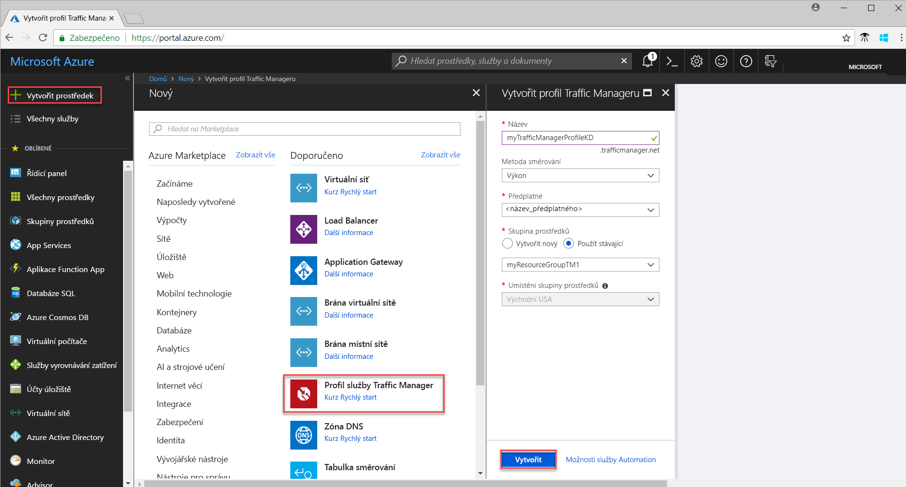
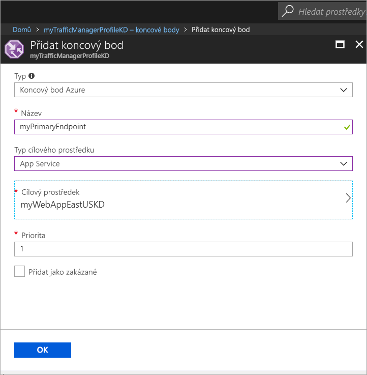

# Rychlý start: Vytvoření profilu služby Traffic Manager pro vysoce dostupnou webovou aplikaci

Tento rychlý start popisuje, jak vytvořit profil služby Traffic Manager zajišťující vysokou dostupnost webové aplikace. 

Scénář popsaný v tomto rychlém startu zahrnuje dvě instance webové aplikace spuštěné v různých oblastech Azure. Vytvoří se profil služby Traffic Manager založený na [prioritě koncových bodů](traffic-manager-routing-methods.md#priority), který pomáhá směrovat provoz uživatelů do primární lokality, ve které je aplikace spuštěná. Traffic Manager průběžně monitoruje webovou aplikaci a zajišťuje automatické převzetí služeb při selhání do záložní lokality v případě, že je primární lokalita nedostupná.

Pokud ještě nemáte předplatné Azure, vytvořte si [bezplatný účet](https://azure.microsoft.com/free/?WT.mc_id=A261C142F) před tím, než začnete.

## Přihlášení k Azure 
Přihlaste se k webu Azure Portal na adrese https://portal.azure.com.

## Požadavky
Tento rychlý start vyžaduje dvě instance webové aplikace nasazené a spuštěné v různých oblastech Azure (*USA – východ* a *Západní Evropa*). Tyto dvě instance webové aplikace slouží jako primární a záložní koncový bod pro službu Traffic Manager.

1. V levém horním rohu obrazovky vyberte **Vytvořit prostředek** > **Web** > **Webová aplikace** > **Vytvořit**.
2. V části **Webová aplikace** zadejte nebo vyberte následující informace a v případě, že není uvedeno jinak, použijte výchozí nastavení:

     | Nastavení         | Hodnota     |
     | ---              | ---  |
     | Název           | Zadejte jedinečný název vaší webové aplikace.  |
     | Skupina prostředků          | Vyberte **Nová** a zadejte *myResourceGroupTM1*. |
     | Plán služby App Service / umístění         | Vyberte **Nový**.  Jako plán služby App Service zadejte *myAppServicePlanEastUS* a pak vyberte **OK**. 
     |      Umístění  |   USA – východ        |
    |||

3. Vyberte **Vytvořit**.
4. Po úspěšném nasazení webové aplikace se vytvoří výchozí web.
5. Zopakujte kroky 1 až 3 a vytvořte druhý web v jiné oblasti Azure s použitím následujícího nastavení:

     | Nastavení         | Hodnota     |
     | ---              | ---  |
     | Název           | Zadejte jedinečný název vaší webové aplikace.  |
     | Skupina prostředků          | Vyberte **Nová** a zadejte *myResourceGroupTM2*. |
     | Plán služby App Service / umístění         | Vyberte **Nový**.  Jako plán služby App Service zadejte *myAppServicePlanWestEurope* a pak vyberte **OK**. 
     |      Umístění  |   Západní Evropa      |
    |||

## Vytvoření profilu Traffic Manageru
Vytvořte profil služby Traffic Manager, který bude směrovat provoz uživatelů na základě priority koncových bodů.

1. V levém horním rohu obrazovky vyberte **Vytvořit prostředek** > **Sítě** > **Profil služby Traffic Manager** > **Vytvořit**.
2. V části **Vytvořit profil služby Traffic Manager** zadejte nebo vyberte následující informace, u zbývajících nastavení přijměte výchozí hodnoty a pak vyberte **Vytvořit**:
    
    | Nastavení                 | Hodnota                                              |
    | ---                     | ---                                                |
    | Název                   | Tento název musí být jedinečný v rámci zóny trafficmanager.net a ve výsledcích názvu DNS **trafficmanager.net**, který slouží k přístupu k vašemu profilu služby Traffic Manager.|
    | Metoda směrování          | Jako metodu směrování vyberte **Priorita**.|
    | Předplatné            | Vyberte své předplatné.|
    | Skupina prostředků          | Vyberte **Existující** a pak vyberte *myResourceGroupTM1*.|
    |Umístění |Toto nastavení se týká umístění skupiny prostředků a nemá žádný vliv na profil Traffic Manageru, který se nasadí globálně.|
    |||
    
    
   

## Přidání koncových bodů služby Traffic Manager

Přidejte web v oblasti *USA – východ* jako primární koncový bod, do kterého se bude směrovat veškerý provoz uživatelů. Přidejte web v oblasti *Západní Evropa* jako záložní koncový bod. Když je primární koncový bod nedostupný, provoz se automaticky směruje do sekundárního koncového bodu.

1. Na panelu hledání na portálu vyhledejte název profilu služby Traffic Manager, který jste vytvořili v předchozí části, a pak tento profil služby Traffic Manager vyberte v zobrazených výsledcích.
2. V okně **Profil služby Traffic Manager** v části **Nastavení** klikněte na **Koncové body** a pak na **Přidat**.
3. Zadejte nebo vyberte následující informace, u zbývajících nastavení přijměte výchozí hodnoty a pak vyberte **OK**:

    | Nastavení                 | Hodnota                                              |
    | ---                     | ---                                                |
    | Typ                    | Koncový bod Azure                                   |
    | Název           | myPrimaryEndpoint                                        |
    | Typ cílového prostředku           | App Service                          |
    | Cílový prostředek          | **Vyberte službu App Service**, aby se zobrazil výpis webových aplikací ve stejném předplatném. V části **Prostředek** vyberte službu App Service, kterou chcete přidat jako první koncový bod. |
    | Priorita               | Vyberte **1**. Výsledkem bude, že veškerý provoz bude přicházet do tohoto koncového bodu, pokud bude v pořádku.    |
    
4. Zopakujte kroky 2 a 3 pro další koncový bod webové aplikace. Nezapomeňte ho přidat s hodnotou **Priorita** nastavenou na **2**.
5.  Po přidání se oba koncové body zobrazí v části **Profil služby Traffic Manager** a jejich stav monitorování bude **Online**.

    

## Test profilu služby Traffic Manager
V této části nejprve určíte název domény vašeho profilu služby Traffic Manager a pak se podíváte, jak Traffic Manager převezme služby při selhání do sekundárního koncového bodu, když bude primární koncový bod nedostupný.
### Určení názvu DNS
1.  Na panelu hledání na portálu vyhledejte název **profilu služby Traffic Manager**, který jste vytvořili v předchozí části. Ve výsledcích, které se zobrazí, klikněte na profil služby Traffic Manager.
2. Klikněte na **Přehled**.
3. V části **Profil služby Traffic Manager** se zobrazí název DNS nově vytvořeného profilu služby Traffic Manager.
  
   

### Zobrazení služby Traffic Manager v akci

1. Do webového prohlížeče zadejte název DNS vašeho profilu služby Traffic Manager a zobrazte výchozí web vaší webové aplikace. Ve scénáři v tomto rychlém startu se všechny požadavky směrují do primárního koncového bodu, který má nastavenou **Prioritu 1**.

2. Pokud se chcete podívat na převzetí služeb při selhání službou Traffic Manager v akci, následujícím způsobem zakažte svou primární lokalitu:
    1. Na stránce profilu služby Traffic Manager vyberte **Nastavení**>**Koncové body**>*MyPrimaryEndpoint*.
    2. V části *MyPrimaryEndpoint* vyberte **Zakázáno**. 
    3. Stav primárního koncového bodu *MyPrimaryEndpoint* teď bude **Zakázáno**.
3. Zkopírujte název DNS vašeho profilu služby Traffic Manageru z předchozího kroku a zobrazte web ve webovém prohlížeči. Když je primární koncový bod zakázaný, provoz uživatelů se směruje do sekundárního koncového bodu.

## Vyčištění prostředků
Pokud už je nepotřebujete, odstraňte skupiny prostředků, webové aplikace a všechny související prostředky. Provedete to tak, že vyberete skupiny prostředků (*myResourceGroupTM1* a *myResourceGroupTM2*) a kliknete na **Odstranit**.

## Další kroky
V tomto rychlém startu jste vytvořili profil služby Traffic Manager, který umožňuje směrovat provoz uživatelů pro zajištění vysoké dostupnosti webové aplikace. Další informace o směrování provozu najdete v kurzech pro službu Traffic Manager.

> [!div class="nextstepaction"]
> [Kurzy pro službu Traffic Manager](traffic-manager-configure-performance-routing-method.md)

