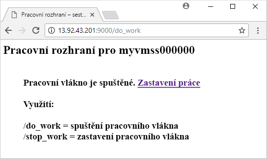

# <a name="quickstart-create-a-linux-virtual-machine-scale-set-with-an-azure-template"></a>Rychlý start: Vytvoření škálovací sady virtuálních počítačů s Linuxem pomocí šablony Azure
Škálovací sada virtuálních počítačů umožňuje nasadit a spravovat sadu identických virtuálních počítačů s automatickým škálováním. Počet virtuálních počítačů ve škálovací sadě můžete škálovat ručně nebo můžete definovat pravidla pro automatické škálování podle využití prostředků, například podle požadavků na CPU a paměť nebo podle provozu. Nástroj pro vyrovnávání zatížení Azure pak bude distribuovat provoz do instancí virtuálních počítačů ve škálovací sadě. V tomto rychlém startu vytvoříte škálovací sadu virtuálních počítačů a nasadíte ukázkovou aplikaci pomocí šablony Azure Resource Manageru.

Pokud ještě nemáte předplatné Azure, vytvořte si [bezplatný účet](https://azure.microsoft.com/free/?WT.mc_id=A261C142F) před tím, než začnete.

[!INCLUDE [cloud-shell-try-it.md](../../includes/cloud-shell-try-it.md)]

Pokud se rozhodnete nainstalovat a používat rozhraní příkazového řádku místně, musíte mít Azure CLI verze 2.0.29 nebo novější. Verzi zjistíte spuštěním příkazu `az --version`. Pokud potřebujete instalaci nebo upgrade, přečtěte si téma [Instalace Azure CLI 2.0]( /cli/azure/install-azure-cli).


## <a name="define-a-scale-set-in-a-template"></a>Definice škálovací sady v šabloně
Šablony Azure Resource Manageru umožňují nasazení skupin souvisejících prostředků. Šablony se píší ve formátu JavaScript Object Notation (JSON) a definují celé prostředí infrastruktury Azure pro vaši aplikaci. V jediné šabloně můžete vytvořit škálovací sadu virtuálních počítačů, nainstalovat aplikace a nakonfigurovat pravidla automatického škálování. Díky použití proměnných a parametrů se může tato šablona použít opakovaně k aktualizaci stávajících nebo vytvoření dalších škálovacích sad. Šablony můžete nasadit prostřednictvím webu Azure Portal, Azure CLI 2.0 nebo Azure PowerShell nebo z kanálů průběžné integrace nebo průběžného doručování (CI/CD).

Další informace o šablonách najdete v tématu [Přehled Azure Resource Manageru](https://docs.microsoft.com/azure/azure-resource-manager/resource-group-overview#template-deployment).

Pokud chcete vytvořit škálovací sadu pomocí šablony, nadefinujete odpovídající prostředky. Hlavní části typu prostředku škálovací sady virtuálních počítačů jsou následující:

| Vlastnost                     | Popis vlastnosti                                  | Příklad hodnoty v šabloně                    |
|------------------------------|----------------------------------------------------------|-------------------------------------------|
| type                         | Typ prostředku Azure, který se má vytvořit                            | Microsoft.Compute/virtualMachineScaleSets |
| jméno                         | Název škálovací sady                                       | myScaleSet                                |
| location                     | Umístění, ve kterém se škálovací sada vytvoří                     | Východ USA                                   |
| sku.name                     | Velikost virtuálního počítače pro všechny instance škálovací sady                  | Standard_A1                               |
| sku.capacity                 | Počet instancí virtuálních počítačů, které se mají zpočátku vytvořit           | 2                                         |
| upgradePolicy.mode           | Režim upgradů instance virtuálního počítače, kdy dochází ke změnám              | Automaticky                                 |
| imageReference               | Image platformy nebo vlastní image, která se použije pro instance virtuálních počítačů | Canonical Ubuntu Server 16.04-LTS         |
| osProfile.computerNamePrefix | Předpona názvu všech instancí virtuálních počítačů                     | myvmss                                    |
| osProfile.adminUsername      | Uživatelské jméno pro všechny instance virtuálních počítačů                        | azureuser                                 |
| osProfile.adminPassword      | Heslo pro všechny instance virtuálních počítačů                        | P@ssw0rd!                                 |

 Následující příklad ukazuje jádro definice prostředku škálovací sady. Pokud chcete šablonu škálovací sady upravit, můžete změnit velikost virtuálního počítače nebo počáteční kapacitu nebo použít jinou platformu nebo vlastní image.

```json
{
  "type": "Microsoft.Compute/virtualMachineScaleSets",
  "name": "myScaleSet",
  "location": "East US",
  "apiVersion": "2017-12-01",
  "sku": {
    "name": "Standard_A1",
    "capacity": "2"
  },
  "properties": {
    "upgradePolicy": {
      "mode": "Automatic"
    },
    "virtualMachineProfile": {
      "storageProfile": {
        "osDisk": {
          "caching": "ReadWrite",
          "createOption": "FromImage"
        },
        "imageReference":  {
          "publisher": "Canonical",
          "offer": "UbuntuServer",
          "sku": "16.04-LTS",
          "version": "latest"
        }
      },
      "osProfile": {
        "computerNamePrefix": "myvmss",
        "adminUsername": "azureuser",
        "adminPassword": "P@ssw0rd!"
      }
    }
  }
}
```

 Pro zkrácení ukázky není zobrazená konfigurace virtuální síťové karty. Další komponenty, například nástroj pro vyrovnávání zatížení, se také nezobrazují. Kompletní šablonu škálovací sady najdete [na konci tohoto článku](#deploy-the-template).


## <a name="add-a-sample-application"></a>Přidání ukázkové aplikace
Pokud chcete svou škálovací sadu otestovat, nainstalujte základní webovou aplikaci. Po nasazení škálovací sady můžou rozšíření virtuálního počítače zajistit konfiguraci po nasazení a úlohy automatizace, jako je instalace aplikace. Skripty si můžete stáhnout z úložiště Azure nebo z GitHubu, případně je za běhu rozšíření najdete na webu Azure Portal. Pokud chcete pro svou škálovací sadu použít rozšíření, do předchozího příkladu prostředku přidáte část *extensionProfile*. Profil rozšíření obvykle definuje následující vlastnosti:

- Typ rozšíření
- Vydavatel rozšíření
- Verze rozšíření
- Umístění konfiguračních nebo instalačních skriptů
- Příkazy, které se mají spustit na instancích virtuálních počítačů

Šablona [HTTP server s Pythonem v Linuxu](https://github.com/Azure/azure-quickstart-templates/tree/master/201-vmss-bottle-autoscale) používá rozšíření vlastních skriptů k instalaci [Bottle](http://bottlepy.org/docs/dev/), webového rozhraní založeného na jazyce Python, a jednoduchého HTTP serveru. 

Tyto dva skripty jsou definované ve vlastnosti **fileUris** - *installserver.sh* a *workserver.py*. Tyto soubory se stáhnou z GitHubu a pak se spustí příkaz *commandToExecute* ve vlastnosti `bash installserver.sh`, který nainstaluje a nakonfiguruje aplikaci:

```json
"extensionProfile": {
  "extensions": [
    {
      "name": "AppInstall",
      "properties": {
        "publisher": "Microsoft.Azure.Extensions",
        "type": "CustomScript",
        "typeHandlerVersion": "2.0",
        "autoUpgradeMinorVersion": true,
        "settings": {
          "fileUris": [
            "https://raw.githubusercontent.com/Azure/azure-quickstart-templates/master/201-vmss-bottle-autoscale/installserver.sh",
            "https://raw.githubusercontent.com/Azure/azure-quickstart-templates/master/201-vmss-bottle-autoscale/workserver.py"
          ],
          "commandToExecute": "bash installserver.sh"
        }
      }
    }
  ]
}
```


## <a name="deploy-the-template"></a>Nasazení šablony
Šablonu [HTTP server s Pythonem v Linuxu](https://github.com/Azure/azure-quickstart-templates/tree/master/201-vmss-bottle-autoscale) můžete nasadit pomocí následujícího tlačítka **Nasadit do Azure**. Toto tlačítko otevře Azure Portal, načte kompletní šablonu a zobrazí výzvu k zadání několika parametrů, jako jsou název škálovací sady, počet instancí a přihlašovací údaje správce.

[](https://portal.azure.com/#create/Microsoft.Template/uri/https%3A%2F%2Fraw.githubusercontent.com%2FAzure%2Fazure-quickstart-templates%2Fmaster%2F201-vmss-bottle-autoscale%2Fazuredeploy.json)

K instalaci HTTP serveru s Pythonem v Linuxu můžete použít také Azure CLI 2.0 s příkazem [az group deployment create](/cli/azure/group/deployment#az_group_deployment_create), jak je znázorněno níže:

```azurecli-interactive
# Create a resource group
az group create --name myResourceGroup --location EastUS

# Deploy template into resource group
az group deployment create \
    --resource-group myResourceGroup \
    --template-uri https://raw.githubusercontent.com/Azure/azure-quickstart-templates/master/201-vmss-bottle-autoscale/azuredeploy.json
```

Do zobrazených výzev zadejte název škálovací sady, počet instancí a přihlašovací údaje správce pro instance virtuálních počítačů. Vytvoření škálovací sady a podpůrných prostředků trvá několik minut.


## <a name="test-your-scale-set"></a>Test škálovací sady
Pokud chcete vidět svou škálovací sadu v akci, přejděte ve webovém prohlížeči na ukázkovou webovou aplikaci. Následujícím způsobem získejte veřejnou IP adresu nástroje pro vyrovnávání zatížení pomocí příkazu [az network public-ip list](/cli/azure/network/public-ip#show):

```azurecli-interactive
az network public-ip list \
    --resource-group myResourceGroup \
    --query [*].ipAddress -o tsv
```

Zadejte veřejnou IP adresu nástroje pro vyrovnávání zatížení do webového prohlížeče ve formátu *http://publicIpAddress:9000/do_work*. Nástroj pro vyrovnávání zatížení distribuuje provoz do jedné z vašich instancí virtuálních počítačů, jak je znázorněno v následujícím příkladu:




## <a name="clean-up-resources"></a>Vyčištění prostředků
Pokud už je nepotřebujete, můžete k odebrání skupiny prostředků, škálovací sady a všech souvisejících prostředků použít příkaz [az group delete](/cli/azure/group#az_group_delete), jak je znázorněno níže. Parametr `--no-wait` vrátí řízení na příkazový řádek bez čekání na dokončení operace. Parametr `--yes` potvrdí, že chcete prostředky odstranit, aniž by se na to zobrazoval další dotaz.

```azurecli-interactive
az group delete --name myResourceGroup --yes --no-wait
```


## <a name="next-steps"></a>Další kroky
V tomto rychlém startu jste pomocí šablony Azure vytvořili škálovací sadu s Linuxem a pomocí rozšíření vlastních skriptů jste na instance virtuálních počítačů nainstalovali základní webový server Python. Další informace najdete v kurzu věnovaném vytváření a správě škálovacích sad virtuálních počítačů Azure.

> [!div class="nextstepaction"]
> [Vytváření a správa škálovacích sad virtuálních počítačů Azure](tutorial-create-and-manage-cli.md)