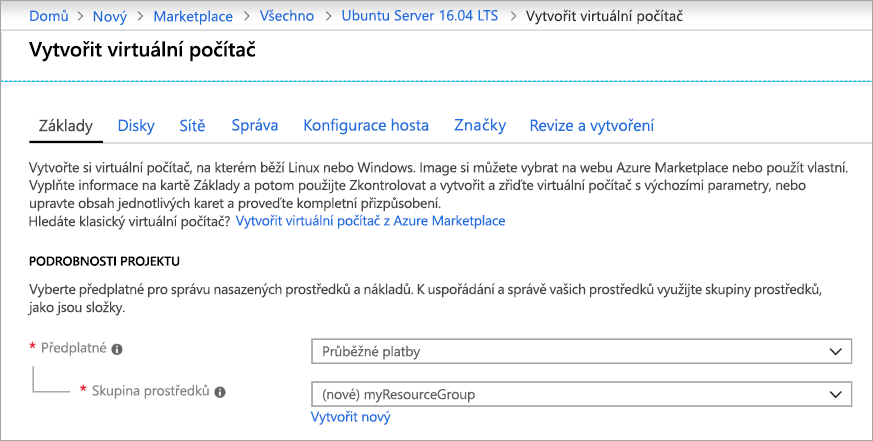
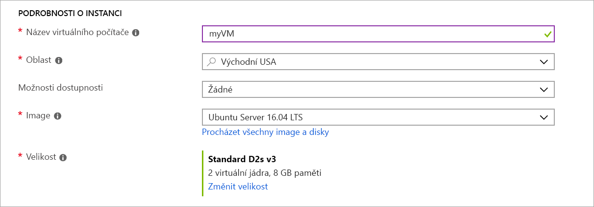
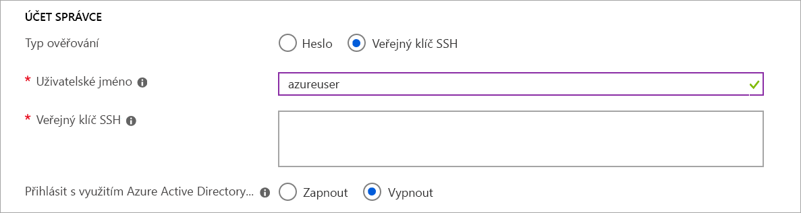
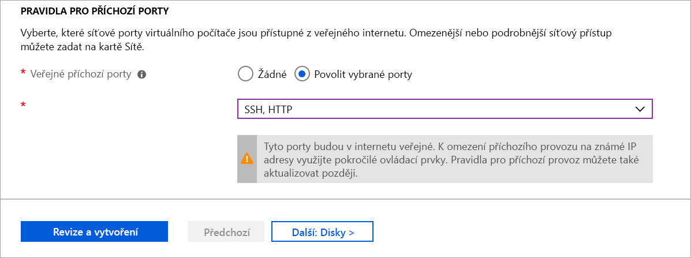
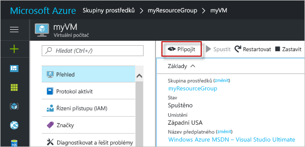

# <a name="quickstart-create-a-linux-virtual-machine-in-the-azure-portal"></a>Rychlý start: Vytvoření virtuálního počítače s Linuxem na webu Azure Portal

Virtuální počítače Azure je možné vytvářet na webu Azure Portal. Tato metoda poskytuje uživatelské rozhraní v prohlížeči, pomocí kterého můžete vytvářet virtuální počítače a jejich související prostředky. V tomto rychlém startu se dozvíte, jak pomocí webu Azure Portal nasadit do Azure virtuální počítač s Linuxem Ubuntu. Pak se k virtuálnímu počítači připojíte přes SSH a nainstalujete na něj webový server NGINX, abyste virtuální počítač viděli v akci.

Pokud ještě nemáte předplatné Azure, vytvořte si [bezplatný účet](https://azure.microsoft.com/free/?WT.mc_id=A261C142F) před tím, než začnete.

## <a name="create-ssh-key-pair"></a>Vytvoření páru klíčů SSH

K dokončení tohoto rychlého startu potřebujete pár klíčů SSH. Pokud máte existující pár klíčů SSH, můžete tento krok přeskočit.

Pokud chcete vytvořit pár klíčů SSH a přihlásit se k virtuálnímu počítači s Linuxem, spusťte v prostředí Bash následující příkaz a postupujte podle pokynů na obrazovce. Můžete použít například [Azure Cloud Shell](../../cloud-shell/overview.md) nebo [subsystém Windows pro Linux](/windows/wsl/install-win10). Výstup příkazu zahrnuje název souboru veřejného klíče. Zkopírujte obsah souboru veřejného klíče (`cat ~/.ssh/id_rsa.pub`) do schránky:

```bash
ssh-keygen -t rsa -b 2048
```

Podrobnější informace o vytváření párů klíčů SSH, včetně použití PuTTY, najdete v tématu [Jak používat klíče SSH s Windows](ssh-from-windows.md).

## <a name="log-in-to-azure"></a>Přihlášení k Azure

Přihlaste se k webu Azure Portal na adrese http://portal.azure.com.

## <a name="create-virtual-machine"></a>Vytvoření virtuálního počítače

1. V levém horním rohu webu Azure Portal zvolte **Vytvořit prostředek**.

1. Ve vyhledávacím poli nad seznamem prostředků Azure Marketplace vyhledejte a vyberte **Ubuntu Server 16.04 LTS** od společnosti Canonical a pak zvolte **Vytvořit**.

1. Přesvědčte se, že je na kartě **Základy** v části **Podrobnosti o projektu** vybrané správné předplatné a potom v části **Skupina prostředků** vyberte **Vytvořit nový**. Do automaticky otevíraného okna zadejte jako název skupiny *myResourceGroup* a potom zvolte **OK*. 

    

1. V části **Podrobnosti o instancích** jako **Název virtuálního počítače** zadejte *myVM* a u možnosti **Oblast** zvolte *USA – východ*. Zbytek ponechte ve výchozím nastavení.

    

1. V části **Účet správce** vyberte **Veřejný klíč SSH**, zadejte své uživatelské jméno a potom do textového pole vložte svůj veřejný klíč. Ve veřejném klíči odeberte počáteční a koncové prázdné znaky.

    

1. V části **Pravidla portů pro příchozí spojení** > **Veřejné příchozí porty** zvolte **Povolit vybrané porty** a potom z rozevíracího seznamu vyberte **SSH (22)** a **HTTP (80)**. 

    

1. Zbytek ponechte ve výchozím nastavení a potom v dolní části stránky vyberte tlačítko **Zkontrolovat a vytvořit**.

    
## <a name="connect-to-virtual-machine"></a>Připojení k virtuálnímu počítači

Vytvořte připojení SSH k virtuálnímu počítači.

1. Na stránce Přehled pro váš virtuální počítač vyberte tlačítko **Připojit**. 

    

2. Na stránce **Připojení k virtuálnímu počítači** ponechte výchozí výběr možností pro připojení podle názvu DNS přes port 22. V části **Přihlásit pomocí místního účtu virtuálního počítače** se zobrazí příkaz pro připojení. Kliknutím na tlačítko příkaz zkopírujte. Následující příklad ukazuje, jak vypadá příkaz pro připojení přes SSH:

    ```bash
    ssh azureuser@myvm-123abc.eastus.cloudapp.azure.com
    ```

3. Vložte příkaz pro připojení přes SSH do prostředí, jako je Azure Cloud Shell nebo Bash v Ubuntu ve Windows, a vytvořte připojení. 

## <a name="install-web-server"></a>Instalace webového serveru

Pokud se chcete podívat na virtuální počítač v akci, nainstalujte webový server NGINX. Spuštěním následujících příkazů z vaší relace SSH aktualizujte zdroje balíčku a nainstalujte nejnovější balíček NGINX:

```bash
# update packages
sudo apt-get -y update

# install NGINX
sudo apt-get -y install nginx
```

Až budete hotovi, ukončete relaci SSH příkazem `exit` a vraťte se do vlastností virtuálního počítače na webu Azure Portal.


## <a name="view-the-web-server-in-action"></a>Zobrazení webového serveru v akci

Když je teď server NGINX nainstalovaný a port 80 k virtuálnímu počítači otevřený, webový server je přístupný z internetu. Otevřete webový prohlížeč a zadejte veřejnou IP adresu virtuálního počítače. Veřejnou IP adresu najdete na stránce přehledu virtuálního počítače nebo v horní části stránky *Sítě*, kde jste přidali pravidlo portu pro příchozí provoz.


## <a name="clean-up-resources"></a>Vyčištění prostředků

Pokud už je nepotřebujete, můžete odstranit skupinu prostředků, virtuální počítač a všechny související prostředky. Provedete to tak, že vyberete skupinu prostředků pro příslušný virtuální počítač, vyberete **Odstranit** a pak potvrdíte název skupiny prostředků, kterou chcete odstranit.

## <a name="next-steps"></a>Další kroky

V tomto rychlém startu jste nasadili jednoduchý virtuální počítač, vytvořili jste skupinu zabezpečení sítě a pravidlo a nainstalovali jste základní webový server. Další informace o virtuálních počítačích Azure najdete v kurzu pro virtuální počítače s Linuxem.

> [!div class="nextstepaction"]
> [Kurzy pro virtuální počítače Azure s Linuxem](./tutorial-manage-vm.md)
