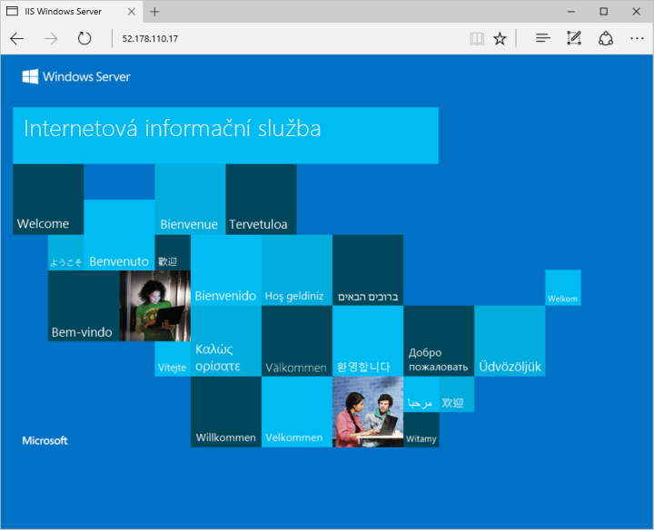

# <a name="quickstart-create-a-windows-virtual-machine-with-the-azure-cli"></a>Rychlý start: Vytvoření virtuálního počítače s Windows pomocí Azure CLI

Azure CLI slouží k vytváření a správě prostředků Azure z příkazového řádku nebo ve skriptech. V tomto rychlém startu se dozvíte, jak pomocí Azure CLI nasadit do Azure virtuální počítač s Windows Serverem 2016. Pak se k virtuálnímu počítači připojíte přes protokol RDP a nainstalujete na něj webový server služby IIS, abyste virtuální počítač viděli v akci.

Pokud ještě nemáte předplatné Azure, vytvořte si [bezplatný účet](https://azure.microsoft.com/free/?WT.mc_id=A261C142F) před tím, než začnete.

[!INCLUDE [cloud-shell-try-it.md](../../../includes/cloud-shell-try-it.md)]

Pokud se rozhodnete nainstalovat a používat rozhraní příkazového řádku místně, musíte mít Azure CLI verze 2.0.30 nebo novější. Verzi zjistíte spuštěním příkazu `az --version`. Pokud potřebujete instalaci nebo upgrade, přečtěte si téma [Instalace Azure CLI]( /cli/azure/install-azure-cli).

## <a name="create-a-resource-group"></a>Vytvoření skupiny prostředků

Vytvořte skupinu prostředků pomocí příkazu [az group create](/cli/azure/group). Skupina prostředků Azure je logický kontejner, ve kterém se nasazují a spravují prostředky Azure. Následující příklad vytvoří skupinu prostředků *myResourceGroup* v umístění *eastus*:

```azurecli-interactive
az group create --name myResourceGroup --location eastus
```

## <a name="create-virtual-machine"></a>Vytvoření virtuálního počítače

Vytvořte virtuální počítač pomocí příkazu [az vm create](/cli/azure/vm). Následující příklad vytvoří virtuální počítač *myVM*. Tento příklad používá jako uživatelské jméno správce *azureuser* a jako heslo *myPassword12*. Aktualizujte tyto hodnoty na nějaké vhodné pro vaše prostředí. Tyto hodnoty jsou potřeba při připojení k virtuálnímu počítači.

```azurecli-interactive
az vm create \
    --resource-group myResourceGroup \
    --name myVM \
    --image win2016datacenter \
    --admin-username azureuser \
    --admin-password myPassword12
```

Vytvoření virtuálního počítače a podpůrných prostředků trvá několik minut. Následující příklad ukazuje, že operace vytvoření virtuálního počítače byla úspěšná.

```azurecli-interactive
{
  "fqdns": "",
  "id": "/subscriptions/<guid>/resourceGroups/myResourceGroup/providers/Microsoft.Compute/virtualMachines/myVM",
  "location": "eastus",
  "macAddress": "00-0D-3A-23-9A-49",
  "powerState": "VM running",
  "privateIpAddress": "10.0.0.4",
  "publicIpAddress": "52.174.34.95",
  "resourceGroup": "myResourceGroup"
}
```

Poznamenejte si vlastní adresu `publicIpAddress` ve výstupu z vašeho virtuálního počítače. Tato adresa se používá pro přístup k virtuálnímu počítači v dalších krocích.

## <a name="open-port-80-for-web-traffic"></a>Otevření portu 80 pro webový provoz

Ve výchozím nastavení jsou při vytváření virtuálního počítače s Windows v Azure otevřená pouze připojení RDP. Pomocí příkazu [az vm open-port](/cli/azure/vm) otevřete port TCP 80 pro použití s webovým serverem IIS:

```azurecli-interactive
az vm open-port --port 80 --resource-group myResourceGroup --name myVM
```

## <a name="connect-to-virtual-machine"></a>Připojení k virtuálnímu počítači

Pomocí následujícího příkazu vytvořte ze svého místního počítače relaci vzdálené plochy. Nahraďte IP adresu veřejnou IP adresou vašeho virtuálního počítače. Po zobrazení výzvy zadejte přihlašovací údaje, které jste použili při vytvoření virtuálního počítače:

```powershell
mstsc /v:publicIpAddress
```

## <a name="install-web-server"></a>Instalace webového serveru

Pokud se chcete podívat na virtuální počítač v akci, nainstalujte webový server služby IIS. Ve virtuálním počítači otevřete příkazový řádek PowerShellu a spusťte následující příkaz:

```powershell
Install-WindowsFeature -name Web-Server -IncludeManagementTools
```

Jakmile budete hotovi, ukončete připojení RDP k virtuálnímu počítači.

## <a name="view-the-web-server-in-action"></a>Zobrazení webového serveru v akci

S nainstalovanou službou IIS na virtuálním počítači a nyní otevřeným portem 80 z internetu můžete použít libovolný webový prohlížeč a zobrazit výchozí úvodní stránku služby IIS. Použijte veřejnou IP adresu virtuálního počítače, kterou jste získali v předchozím kroku. Následující příklad ukazuje výchozí webovou stránku služby IIS:



## <a name="clean-up-resources"></a>Vyčištění prostředků

Pokud už je nepotřebujete, můžete k odebrání skupiny prostředků, virtuálního počítače a všech souvisejících prostředků použít příkaz [az group delete](/cli/azure/group):

```azurecli-interactive
az group delete --name myResourceGroup
```

## <a name="next-steps"></a>Další postup

V tomto rychlém startu jste nasadili jednoduchý virtuální počítač, otevřeli jste síťový port pro webový provoz a nainstalovali jste základní webový server. Další informace o virtuálních počítačích Azure najdete v kurzu pro virtuální počítače s Windows.

> [!div class="nextstepaction"]
> [Kurzy pro virtuální počítače Azure s Windows](./tutorial-manage-vm.md)
