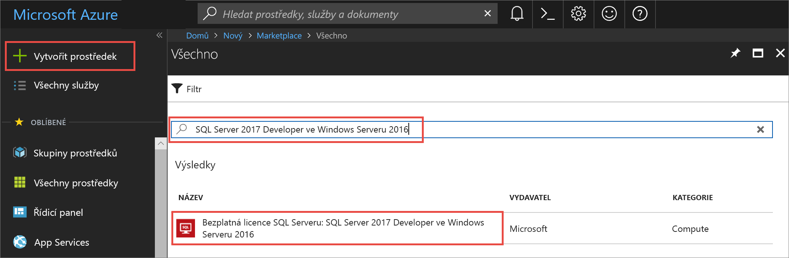

# Rychlý start: Vytvoření virtuálního počítače s Windows a SQL Serverem 2017 na webu Azure Portal

> [!div class="op_single_selector"]
> * [Windows](quickstart-sql-vm-create-portal.md)
> * [Linux](../../linux/sql/provision-sql-server-linux-virtual-machine.md)

Tento rychlý start vás provede vytvořením virtuálního počítače s SQL Serverem na webu Azure Portal.

  > [!TIP]
  > - Tento rychlý start obsahuje postup pro rychlé zřízení virtuálního počítače SQL a připojení k němu. Další informace o jiných možnostech zřizování virtuálních počítačů SQL najdete v tématu [Průvodce zřizováním virtuálních počítačů s Windows a SQL Serverem na webu Azure Portal](virtual-machines-windows-portal-sql-server-provision.md).
  > - Pokud máte dotazy k virtuálním počítačům s SQL Serverem, přečtěte si [Nejčastější dotazy](virtual-machines-windows-sql-server-iaas-faq.md).

## Získání předplatného Azure

Pokud ještě nemáte předplatné Azure, vytvořte si [bezplatný účet](https://azure.microsoft.com/free/?WT.mc_id=A261C142F) před tím, než začnete.

##  Výběr image virtuálního počítače s SQL Serverem

1. Přihlaste se k [webu Azure portal](https://portal.azure.com) pomocí svého účtu.

1. Na webu Azure Portal vyberte **Vytvořit prostředek**. 

1. Do vyhledávacího pole zadejte `SQL Server 2017 Developer on Windows Server 2016`, a stiskněte klávesu ENTER. SQL Server 2017 na Windows serveru 2016 možnost $expand 

1. Vyberte **bezplatná licence SQL serveru: SQL Server 2017 Developer ve Windows serveru 2016** bitové kopie. V tomto kurzu se používá edice Developer, protože je to plná verze SQL Serveru, která je zdarma pro účely testování vývoje. Platíte jenom náklady na provozování virtuálního počítače. Kompletní informace o cenách najdete v [doprovodných materiálech k cenám pro virtuální počítače Azure s SQL Serverem](virtual-machines-windows-sql-server-pricing-guidance.md).

   

1. Vyberte **Vytvořit**.

##  Poskytnutí základních informací

Na **Základy** kartu, zadejte následující informace:

1. V **Project Details** , vyberte své předplatné Azure a pak vyberte **vytvořit nový** vytvořit novou skupinu prostředků. Typ _SQLVM-RG_ pro název.

   

1. V části **Instance podrobnosti**:
    1. Typ _SQLVM_ pro **název virtuálního počítače**. 
    1. Vyberte umístění pro vaše **oblasti**. 
    1. Pro účely tohoto rychlého startu ponechte **možností dostupnosti** nastavena na _žádné redundance infrastruktury požadované_. Další informace o možnosti dostupnosti najdete v tématu [oblastí Azure a dostupnost](../../windows/regions-and-availability.md). 
    1. V **Image** seznamu vyberte _bezplatná licence SQL serveru: SQL Server 2017 Developer ve Windows serveru 2016_. 
    1. Zvolit **změnit velikost** pro **velikost** virtuálního počítače a vyberte **A2 základní** nabídky. Ujistěte se, že vyčistit prostředky, až budete hotovi s nimi, abyste zabránili neočekávaným poplatkům. 

   

1. V části **účet správce**, zadejte uživatelské jméno, například _azureuser_ a heslo. Heslo musí obsahovat nejméně 12 znaků a musí splňovat [zadané požadavky na složitost](../../windows/faq.md#what-are-the-password-requirements-when-creating-a-vm).

   

1. V části **příchozí pravidla portů**, zvolte **povolit vybrané porty** a pak vyberte **protokolu RDP (3389)** z rozevíracího seznamu. 

   

## Nastavení SQL Serveru

Na **nastavení systému SQL Server** kartu, nakonfigurujte následující možnosti:

1. V části **zabezpečení a sítě**vyberte _veřejné (Internet_) pro **připojení SQL** a změňte port, který se `1401` abyste se vyhnuli použití známého portu v veřejného scénáře. 
1. V části **ověřování SQL**vyberte **povolit**. Jako přihlašovací údaje pro SQL je nastavené stejné uživatelské jméno a heslo, které jste nakonfigurovali pro virtuální počítač. Použít výchozí nastavení pro **integrace Azure Key Vault** a **konfiguraci úložiště**.  

   

1. Změna dalších nastavení v případě potřeby a pak vyberte **revize + vytvořit**. 

   

## Vytvoření virtuálního počítače s SQL Serverem

Na **zkontrolujte + vytvořit** kartu, zkontrolujte souhrn a vyberte **vytvořit** k vytvoření systému SQL Server, skupinu prostředků a prostředky zadané pro tento virtuální počítač.

Nasazení můžete monitorovat z webu Azure Portal. Tlačítko **Oznámení** v horní části obrazovky zobrazuje základní stav nasazení. Nasazení může trvat několik minut. 

## Připojení k SQL Serveru

1. Na portálu vyhledejte **veřejnou IP adresu** virtuálního počítače SQL serveru v **přehled** část vlastnosti virtuálního počítače.

1. Na jiném počítači připojeném k Internetu, otevřete [SQL Server Management Studio (SSMS)](/sql/ssms/download-sql-server-management-studio-ssms).

1. V dialogovém okně **Připojit k serveru** nebo **Connect to Database Engine** (Připojit k databázovému stroji) upravte hodnotu **Název serveru**. Zadejte veřejnou IP adresu vašeho virtuálního počítače. Potom zadejte čárku a vlastní port, **1401**, který jsme zadali, když jste konfigurovali nový virtuální počítač. Například, `11.22.33.444,1401`.

1. V poli **Ověřování** vyberte **Ověřování serveru SQL Server**.

1. Do pole **Přihlášení** zadejte název platného přihlášení SQL.

1. Do pole **Heslo** zadejte heslo pro přihlášení.

1. Vyberte **Connect** (Připojit).

    

##  Vzdálené přihlášení k virtuálnímu počítači

Podle následujícího postupu se připojte k virtuálnímu počítači s SQL Serverem pomocí Vzdálené plochy:

[!INCLUDE [Connect to SQL Server VM with remote desktop](../../../../includes/virtual-machines-sql-server-remote-desktop-connect.md)]

Po připojení k virtuálnímu počítači s SQL Serverem můžete spustit SQL Server Management Studio a připojit se pomocí ověřování systému Windows se svými přihlašovacími údaji místního správce. Pokud jste povolili ověřování SQL Serveru, můžete se také připojit pomocí ověřování SQL Serveru a použít k tomu přihlašovací jméno a heslo SQL Serveru, které jste nakonfigurovali během zřizování.

Přístup k počítači vám umožňuje podle potřeb přímo měnit nastavení počítače a SQL Serveru. Můžete například nakonfigurovat nastavení brány firewall nebo změnit nastavení konfigurace SQL Serveru.

## Vyčištění prostředků

Pokud nepotřebujete, aby virtuální počítač SQL VM běžel nepřetržitě, můžete se vyhnout zbytečným poplatkům: když počítač nepoužíváte, zastavte ho. Můžete také trvale odstranit všechny prostředky přidružené k virtuálnímu počítači odstraněním příslušné skupiny prostředků na portálu. Tím trvale odstraníte i virtuální počítač, proto tento příkaz používejte opatrně. Další informace najdete v tématu [Správa prostředků Azure prostřednictvím portálu](../../../azure-resource-manager/manage-resource-groups-portal.md).

## Další postup

V tomto rychlém startu jste vytvořili virtuální počítač SQL serverem 2017 na webu Azure Portal. Další informace o tom, jak na tento nový SQL Server migrovat data, najdete v následujícím článku.

> [!div class="nextstepaction"]
> [Migrace databáze na virtuální počítač s SQL](virtual-machines-windows-migrate-sql.md)
