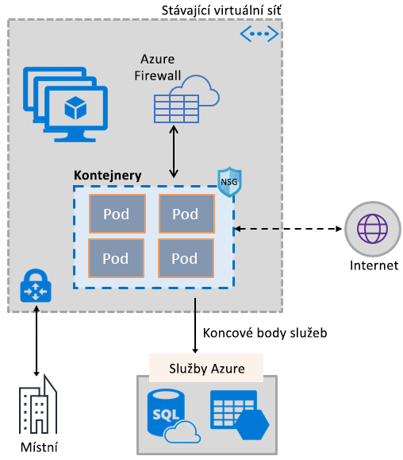
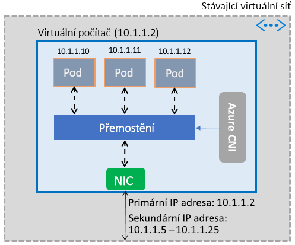

# Zprovoznění funkcí služby Azure Virtual Network v kontejnerech

Bohatou sadu síťových funkcí Azure můžete přenést do kontejnerů a přitom využít stejnou softwarově definovanou sadu síťových služeb, jaká zajišťuje virtuální počítače. Na virtuální počítač Azure se nainstaluje modul plug-in síťového rozhraní kontejneru (CNI) služby Azure Virtual Network. Tento modul plug-in přiřadí kontejnerům poskytnutým virtuálním počítačem IP adresy z virtuální sítě, připojí je k virtuální síti a propojí je přímo s jinými kontejnery a prostředky virtuální sítě. Modul plug-in nevyužívá pro připojení překryvné sítě nebo trasy a poskytuje stejný výkon jako virtuální počítače. Na vysoké úrovni poskytuje modul plug-in následující možnosti:

- IP adresa virtuální sítě se přiřadí ke každému podu, který může obsahovat jeden nebo více kontejnerů.
- Pody se můžou připojovat k partnerským virtuálním sítím a k místní infrastruktuře přes ExpressRoute nebo přes síť VPN typu site-to-site. Pody jsou také dostupné z partnerských a místních sítí.
- Pody mají přístup ke službám, jako je například Azure Storage a Azure SQL Database, které jsou chráněné koncovými body služeb virtuální sítě.
- U těchto podů je možné použít přímo skupiny zabezpečení sítě a trasy.
- Pody (stejně jako virtuální počítače) je možné umístit přímo za nástroj pro vyrovnávání zatížení, který je interní v rámci Azure nebo veřejný.
- Podům lze přiřadit veřejné IP adresy, které jsou přímo přístupné z internetu. I samotné pody mají přístup k internetu.
- Vše hladce funguje s prostředky Kubernetes, jako jsou služby, kontrolery příchozích přenosů a Kube DNS. Službu Kubernetes lze také zpřístupnit interně nebo externě prostřednictvím služby Azure Load Balancer.

Následující obrázek znázorňuje, jak modul plug-in poskytuje podům funkce služby Azure Virtual Network:

Modul plug-in podporuje platformy Linux i Windows.

## Připojení podů k virtuální síti

Pody poskytuje virtuální počítač, který je součástí virtuální sítě. Fond IP adres pro tyto pody je nakonfigurovaný jako sekundární adresy na síťovém rozhraní virtuálního počítače. Azure CNI nastaví pro pody základní síťové připojení a spravuje využití IP adres ve fondu. Když se pod objeví na virtuálním počítači, Azure CNI mu přiřadí dostupnou IP adresu z fondu a připojí pod k softwarovému přemostění ve virtuálním počítači. Když se pod ukončí, IP adresa se vrátí do fondu. Následující obrázek znázorňuje, jak se pod připojuje k virtuální síti:

## Přístup k internetu

Modul plug-in nakonfiguruje pravidla *iptables* pro překlad síťových adres (NAT) u přenosů z podů do internetu, aby podům umožnil přístup k internetu. Zdrojová IP adresa paketu se přeloží na primární IP adresu síťového rozhraní virtuálního počítače. Virtuální počítače s Windows automaticky provádějí překlad adres na základě zdroje (SNAT) u přenosů mířících mimo podsíť, ve které se virtuální počítač nachází. Obvykle se překládají všechny přenosy směřující na IP adresu mimo rozsah IP adres ve virtuální síti.

## Omezení

Modul plug-in podporuje až 250 podů na virtuální počítač a až 16 000 podů ve virtuální síti. Tato omezení se liší u [Azure Kubernetes Service](../azure-subscription-service-limits.md?toc=%2fazure%2fvirtual-network%2ftoc.json#kubernetes-service-limits).

## Použití modulu plug-in

Modul plug-in je možné používat následujícími způsoby s cílem poskytovat základní připojení virtuální sítě pro pody nebo kontejnery Dockeru:

- **Azure Kubernetes Service:** Modul plug-in je integrovaný do Azure Kubernetes Service (AKS) a je možné ho použít po výběru možnosti představující *pokročilé síťové funkce*. Pokročilé síťové funkce vám umožní nasadit cluster Kubernetes v existující nebo nové virtuální síti. Další informace o pokročilých síťových funkcích a postupu jejich nastavení najdete v tématu o [konfiguraci sítě ve službě AKS](../aks/networking-overview.md?toc=%2fazure%2fvirtual-network%2ftoc.json).
- **ACS-Engine:** ACS-Engine je nástroj, který vygeneruje šablonu Azure Resource Manageru pro nasazení clusteru Kubernetes v Azure. Podrobné pokyny najdete v tématu o [nasazení modulu plug-in v clusterech Kubernetes s ACS-Engine](deploy-container-networking.md#deploy-plug-in-for-acs-engine-kubernetes-cluster).
- **Vytvoření vlastního clusteru Kubernetes v Azure:** Modul plug-in je možné využít k poskytování základních síťových funkcí pro pody v clusterech Kubernetes, které sami nasazujete, bez nutnosti využít AKS nebo nástroje, jako je ACS-Engine. V tomto případě se modul plug-in nainstaluje a aktivuje na každém virtuálním počítači v clusteru. Podrobné pokyny najdete v tématu o [nasazení modulu plug-in v clusteru Kubernetes, který nasazujete sami](deploy-container-networking.md#deploy-plug-in-for-a-kubernetes-cluster).
- **Připojení virtuální sítě pro kontejnery Dockeru v Azure:** Modul plug-in lze použít v případech, kdy na virtuálních počítačích nechcete vytvořit cluster Kubernetes, ale kontejnery Dockeru s připojením virtuální sítě. Podrobné pokyny najdete v tématu o [nasazení modulu plug-in pro Docker](deploy-container-networking.md#deploy-plug-in-for-docker-containers).

## Další kroky

[Nasazení modulu plug-in](deploy-container-networking.md) pro clustery Kubernetes nebo kontejnery Dockeru