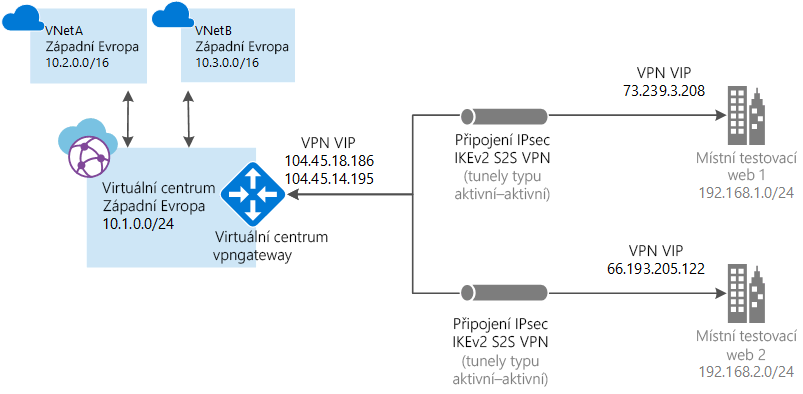

# <a name="tutorial-create-a-site-to-site-connection-using-azure-virtual-wan"></a>Kurz: Vytvoření připojení typu site-to-site pomocí služby Azure Virtual WAN

V tomto kurzu se dozvíte, jak se pomocí služby Virtual WAN připojit ke svým prostředkům v Azure přes připojení VPN IPsec/IKE (IKEv1 a IKEv2). Tento typ připojení vyžaduje místní zařízení VPN, které má přiřazenou veřejnou IP adresu. Další informace o službě Virtual WAN najdete v článku [Přehled služby Virtual WAN](virtual-wan-about.md)

> [!NOTE]
> Pokud máte hodně lokalit, doporučujeme využít k vytvoření této konfigurace [partnera pro Virtual WAN](https://aka.ms/virtualwan). Pokud se ale vyznáte ve vytváření sítí a umíte nakonfigurovat vlastní zařízení VPN, můžete tuto konfiguraci vytvořit sami.
>



V tomto kurzu se naučíte:

> [!div class="checklist"]
> * Vytvoření sítě WAN
> * Vytvoření lokality
> * Vytvoření rozbočovače
> * Připojení rozbočovače k lokalitě
> * Připojení virtuální sítě k rozbočovači
> * Stažení a použití konfigurace zařízení VPN
> * Zobrazení virtuální sítě WAN
> * Zobrazení stavu prostředků
> * Monitorování připojení

## <a name="before-you-begin"></a>Než začnete

[!INCLUDE [Before you begin](../../includes/virtual-wan-tutorial-vwan-before-include.md)]

## <a name="vnet"></a>1. Vytvoření virtuální sítě

[!INCLUDE [Create a virtual network](../../includes/virtual-wan-tutorial-vnet-include.md)]

## <a name="openvwan"></a>2. Vytvoření virtuální sítě WAN

V prohlížeči přejděte na web [Azure Portal](https://portal.azure.com) a přihlaste se pomocí svého účtu Azure.

[!INCLUDE [Create a virtual WAN](../../includes/virtual-wan-tutorial-vwan-include.md)]

## <a name="site"></a>3. Vytvoření lokality

Můžete vytvořit libovolný počet lokalit odpovídajících fyzickým umístěním. Pokud máte třeba jednu pobočku v New Yorku, jednu v Londýně a jednu v Los Angeles, vytvoříte tři oddělené lokality. Tyto lokality obsahují koncové body místních zařízení VPN. V tuto chvíli můžete pro každou lokalitu určit jenom jeden privátní adresní prostor.

1. Klikněte na síť WAN, kterou jste vytvořili. Na stránce sítě WAN v části **Architektura sítě WAN** kliknutím na **Lokality VPN** otevřete stránku Lokality VPN.
2. Na stránce **Lokality VPN** klikněte na **+Vytvořit lokalitu**.
3. Na stránce **Create site** (Vytvořit lokalitu) zadejte údaje do následujících polí:

  * **Name** (Název) – název, kterým chcete odkazovat na místní lokalitu.
  * **Public IP address** (Veřejná IP adresa) – veřejná IP adresa zařízení VPN, které se nachází v místní lokalitě.
  * **Private address space** (Privátní adresní prostor) – prostor IP adres, který se nachází v místní lokalitě. Provoz určený do tohoto adresního prostoru se přesměruje do místní lokality.
  * **Subscription** (Předplatné) – ověřte předplatné.
  * **Resource Group** (Skupina prostředků) – skupina prostředků, kterou chcete použít.
  * **Umístění**.
4. Další nastavení zobrazíte kliknutím na **Show advanced** (Zobrazit rozšířené nastavení). Výběrem možnosti **BGP** můžete povolit BGP. Tím se tato funkce povolí pro všechna připojení vytvořená pro tuto lokalitu v Azure. Můžete také zadat **Informace o zařízení** (volitelná pole). Týmu Azure to může pomoct lépe pochopit vaše prostředí a v budoucnu přidávat další možnosti optimalizace, případně vám asistovat při řešení potíží.
5. Klikněte na **Confirm** (Potvrdit).
6. Po kliknutí na **Potvrdit** se podívejte na stav na stránce Lokality VPN. Stav lokality se změní ze **Zřizování** na **Zřízeno**.

## <a name="hub"></a>4. Vytvoření rozbočovače

[!INCLUDE [Create a virtual WAN](../../includes/virtual-wan-tutorial-hub-include.md)]

## <a name="associate"></a>5. Přidružení lokalit k rozbočovači

Rozbočovače by se obecně měly přidružovat k lokalitám ve stejné oblasti jako virtuální síť.

1. Na stránce **Lokality VPN** vyberte lokalitu nebo lokality, které chcete přidružit k rozbočovači, a pak klikněte na **+ Nové přidružení k rozbočovači**.
2. Na stránce **Přidružit lokality k jednomu nebo více rozbočovačům** vyberte v rozevírací nabídce rozbočovač. Lokalitu můžete přidružit k dalším rozbočovačům kliknutím na **+ Přidat přidružení**.
3. Tady můžete také přidat konkrétní **předsdílený klíč** nebo použít výchozí.
4. Klikněte na **Confirm** (Potvrdit).
5. Stav připojení můžete zobrazit na stránce **Lokality VPN**.

## <a name="vnet"></a>6. Připojení virtuální sítě k rozbočovači

V tomto kroku vytvoříte partnerské připojení mezi rozbočovačem a určitou virtuální sítí. Uvedený postup zopakujte pro všechny virtuální sítě, které chcete připojit.

1. Na stránce vaší virtuální sítě WAN klikněte na **Připojení k virtuální síti**.
2. Na stránce připojení k virtuální síti klikněte na **+Add connection** (Přidat připojení).
3. Na stránce **Add connection** (Přidat připojení) zadejte údaje do následujících polí:

    * **Connection name** (Název připojení) – zadejte název připojení.
    * **Hubs** (Rozbočovače) – vyberte rozbočovač, který chcete k tomuto připojení přidružit.
    * **Subscription** (Předplatné) – ověřte předplatné.
    * **Virtual network** (Virtuální síť) – vyberte virtuální síť, kterou chcete připojit k tomuto rozbočovači. Virtuální síť nesmí mít existující bránu virtuální sítě.
4. Kliknutím na **OK** vytvořte partnerské propojení.

## <a name="device"></a>7. Stažení konfigurace zařízení VPN

Nakonfigurujte místní zařízení VPN pomocí konfigurace zařízení VPN.

1. Na stránce virtuální sítě WAN klikněte na **Overview** (Přehled).
2. V horní části stránky přehledu klikněte na **Download VPN configuration** (Stáhnout konfiguraci VPN). Azure vytvoří účet úložiště ve skupině prostředků microsoft-network-[umístění], kde umístění znamená umístění sítě WAN. Až tuto konfiguraci použijete ve svých zařízeních VPN, můžete tento účet úložiště odstranit.
3. Jakmile se dokončí vytváření souboru, můžete ho kliknutím na odkaz stáhnout.
4. Použijte konfiguraci ve svém zařízení VPN.

### <a name="understanding-the-vpn-device-configuration-file"></a>Vysvětlení konfiguračního souboru zařízení VPN

Konfigurační soubor zařízení obsahuje nastavení, které se má použít při konfiguraci místního zařízení VPN. Při prohlížení souboru si všimněte následujících informací:

* **vpnSiteConfiguration** – tato část udává podrobnosti o zařízení nastaveném jako lokalita, která se připojuje k virtuální síti WAN. Obsahuje název a veřejnou IP adresu zařízení pobočky.
* **vpnSiteConnections** – tato část obsahuje následující informace:

    * **Adresní prostor** virtuální sítě virtuálních rozbočovačů<br>Příklad:
 
        ```
        "AddressSpace":"10.1.0.0/24"
        ```
    * **Adresní prostor** virtuálních sítí připojených k rozbočovači<br>Příklad:

         ```
        "ConnectedSubnets":["10.2.0.0/16","10.30.0.0/16"]
         ```
    * **IP adresy** brány sítě VPN virtuálního rozbočovače. Vzhledem k tomu, že každé připojení brány sítě VPN se skládá ze 2 tunelů v konfiguraci aktivní-aktivní, uvidíte v tomto souboru uvedené obě IP adresy. V tomto příkladu vidíte pro každou lokalitu položky Instance0 a Instance1.<br>Příklad:

        ``` 
        "Instance0":"104.45.18.186"
        "Instance1":"104.45.13.195"
        ```
    * **Podrobnosti o konfiguraci připojení brány sítě VPN**, jako je protokol BGP, předsdílený klíč atd. PSK je předsdílený klíč, který se vám automaticky vygeneruje. V případě vlastního předsdíleného klíče můžete připojení upravit na stránce Overview (Přehled).
  
### <a name="example-device-configuration-file"></a>Příklad konfiguračního souboru zařízení

  ```
  { 
      "configurationVersion":{ 
         "LastUpdatedTime":"2018-07-03T18:29:49.8405161Z",
         "Version":"r403583d-9c82-4cb8-8570-1cbbcd9983b5"
      },
      "vpnSiteConfiguration":{ 
         "Name":"testsite1",
         "IPAddress":"73.239.3.208"
      },
      "vpnSiteConnections":[ 
         { 
            "hubConfiguration":{ 
               "AddressSpace":"10.1.0.0/24",
               "Region":"West Europe",
               "ConnectedSubnets":[ 
                  "10.2.0.0/16",
                  "10.30.0.0/16"
               ]
            },
            "gatewayConfiguration":{ 
               "IpAddresses":{ 
                  "Instance0":"104.45.18.186",
                  "Instance1":"104.45.13.195"
               }
            },
            "connectionConfiguration":{ 
               "IsBgpEnabled":false,
               "PSK":"bkOWe5dPPqkx0DfFE3tyuP7y3oYqAEbI",
               "IPsecParameters":{ 
                  "SADataSizeInKilobytes":102400000,
                  "SALifeTimeInSeconds":3600
               }
            }
         }
      ]
   },
   { 
      "configurationVersion":{ 
         "LastUpdatedTime":"2018-07-03T18:29:49.8405161Z",
         "Version":"1f33f891-e1ab-42b8-8d8c-c024d337bcac"
      },
      "vpnSiteConfiguration":{ 
         "Name":" testsite2",
         "IPAddress":"66.193.205.122"
      },
      "vpnSiteConnections":[ 
         { 
            "hubConfiguration":{ 
               "AddressSpace":"10.1.0.0/24",
               "Region":"West Europe"
            },
            "gatewayConfiguration":{ 
               "IpAddresses":{ 
                  "Instance0":"104.45.18.187",
                  "Instance1":"104.45.13.195"
               }
            },
            "connectionConfiguration":{ 
               "IsBgpEnabled":false,
               "PSK":"XzODPyAYQqFs4ai9WzrJour0qLzeg7Qg",
               "IPsecParameters":{ 
                  "SADataSizeInKilobytes":102400000,
                  "SALifeTimeInSeconds":3600
               }
            }
         }
      ]
   },
   { 
      "configurationVersion":{ 
         "LastUpdatedTime":"2018-07-03T18:29:49.8405161Z",
         "Version":"cd1e4a23-96bd-43a9-93b5-b51c2a945c7"
      },
      "vpnSiteConfiguration":{ 
         "Name":" testsite3",
         "IPAddress":"182.71.123.228"
      },
      "vpnSiteConnections":[ 
         { 
            "hubConfiguration":{ 
               "AddressSpace":"10.1.0.0/24",
               "Region":"West Europe"
            },
            "gatewayConfiguration":{ 
               "IpAddresses":{ 
                  "Instance0":"104.45.18.187",
                  "Instance1":"104.45.13.195"
               }
            },
            "connectionConfiguration":{ 
               "IsBgpEnabled":false,
               "PSK":"YLkSdSYd4wjjEThR3aIxaXaqNdxUwSo9",
               "IPsecParameters":{ 
                  "SADataSizeInKilobytes":102400000,
                  "SALifeTimeInSeconds":3600
               }
            }
         }
      ]
   }
  ```

### <a name="configuring-your-vpn-device"></a>Konfigurace zařízení VPN

>[!NOTE]
> Pokud pracujete s partnerským řešením pro Virtual WAN, konfigurace zařízení VPN se provede automaticky. Kontroler zařízení získá konfigurační soubor z Azure, použije ho na zařízení a tím nastaví připojení k Azure. To znamená, že nemusíte vědět, jak se zařízení VPN konfiguruje ručně.
>

Pokud potřebujete pokyny ke konfiguraci zařízení, můžete použít pokyny na [stránce se skripty konfigurace zařízení VPN](~/articles/vpn-gateway/vpn-gateway-about-vpn-devices.md#configscripts), pokud vezmete v úvahu následující upozornění:

* Pokyny na stránce zařízení VPN nejsou určené pro službu Virtual WAN, můžete ale použít hodnoty služby Virtual WAN z konfiguračního souboru a nakonfigurovat zařízení VPN ručně. 
* Skripty konfigurace zařízení ke stažení, které jsou určené pro službu VPN Gateway, pro službu Virtual WAN nefungují, protože se konfigurace liší.
* Nová služba Virtual WAN může podporovat protokol IKEv1 i IKEv2.
* Virtual WAN smí používat jenom zařízení VPN a pokyny pro zařízení založené na trasách.

## <a name="viewwan"></a>8. Zobrazení virtuální sítě WAN

1. Přejděte na virtuální síť WAN.
2. Na stránce Overview (Přehled) každý bod na mapě představuje jeden rozbočovač. Podržením ukazatele na některém z těchto bodů zobrazíte souhrn stavu rozbočovače.
3. V části Hubs and connections (Rozbočovače a připojení) můžete zjistit stav rozbočovače, lokalitu, oblast, stav připojení VPN a přijaté a odeslané bajty.

## <a name="viewhealth"></a>9. Zobrazení stavu prostředků

1. Přejděte na svoji síť WAN.
2. Na stránce sítě WAN v části **SUPPORT + Troubleshooting** (Podpora a řešení potíží) klikněte na **Health** (Stav) a prohlédněte si stav svého prostředku.

## <a name="connectmon"></a>10. Monitorování připojení

Vytvořte připojení pro monitorování komunikace mezi virtuálním počítačem Azure a vzdálenou lokalitou. Informace o tom, jak nastavit monitorování připojení, najdete v článku [Monitorování síťové komunikace](~/articles/network-watcher/connection-monitor.md). Do pole zdroje zadejte IP adresu virtuálního počítače v Azure a cílovou IP adresou je IP adresa lokality.

## <a name="cleanup"></a>11. Vyčištění prostředků

Pokud už tyto prostředky nepotřebujete, můžete k odebrání skupiny prostředků a všech prostředků, které obsahuje, použít rutinu [Remove-AzureRmResourceGroup](/powershell/module/azurerm.resources/remove-azurermresourcegroup). Položku myResourceGroup nahraďte názvem vaší skupiny prostředků a spusťte následující příkaz PowerShellu:

```azurepowershell-interactive
Remove-AzureRmResourceGroup -Name myResourceGroup -Force
```

## <a name="next-steps"></a>Další kroky

V tomto kurzu jste se naučili:

> [!div class="checklist"]
> * Vytvoření sítě WAN
> * Vytvoření lokality
> * Vytvoření rozbočovače
> * Připojení rozbočovače k lokalitě
> * Připojení virtuální sítě k rozbočovači
> * Stažení a použití konfigurace zařízení VPN
> * Zobrazení virtuální sítě WAN
> * Zobrazení stavu prostředků
> * Monitorování připojení

Další informace o službě Virtual WAN najdete v článku [Přehled služby Virtual WAN](virtual-wan-about.md).
