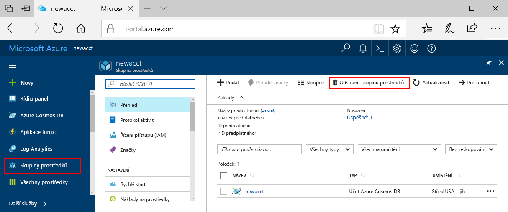

>[!IMPORTANT]
>Prostředky, které jste vytvořili, je možné použít i ke splnění požadavků v dalších kurzech a článcích s návody pro službu Azure Machine Learning. 

Pokud zde vytvořené prostředky nebudete používat, odstraňte právě vytvořené prostředky pro tento rychlý start, aby se vám za ně neúčtovaly poplatky.

1. Úplně nalevo na webu Azure Portal vyberte **Skupiny prostředků**.  
 
   

1. V seznamu vyberte skupinu prostředků, kterou jste vytvořili.

1. Vyberte **Odstranit skupinu prostředků**.

1. Zadejte název skupiny prostředků a pak vyberte **Odstranit**.

   Pokud se zobrazí chyba „Prostředek budete moct odstranit po odstranění vnořených prostředků,“ musíte nejprve odstranit všechny vnořené prostředky. Podrobnosti najdete [v této části Řešení potíží](../articles/machine-learning/desktop-workbench/known-issues-and-troubleshooting-guide.md#cant-delete-experimentation-account). 