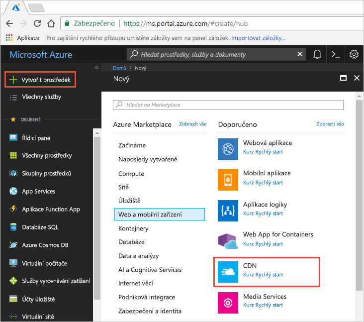
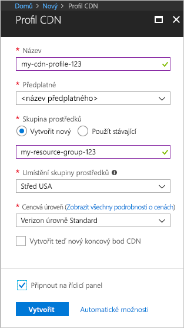

## Vytvoření nového profilu CDN

Profil CDN je kontejner pro koncové body CDN a určuje cenová úroveň.

1. Na portálu Azure, v levém horním vyberte **vytvořit prostředek**.
    
    **Nový** podokně se zobrazí.
   
2. Vyberte **Web + mobilní**, pak **CDN**.
   
    

    **Profil CDN** podokně se zobrazí.

    Použití nastavení uvedeného v tabulce podle bitovou kopii.
   
    

    | Nastavení  | Hodnota |
    | -------- | ----- |
    | **Název** | Zadejte *my-cdn profil-123* pro název profilu. Tento název musí být globálně jedinečný; Pokud se už používá, můžete zadat jiný. |
    | **Předplatné** | V rozevíracím seznamu vyberte předplatné Azure.|
    | **Skupina prostředků** | Vyberte **vytvořit nový** a zadejte *my-resource skupiny-123* pro váš název skupiny prostředků. Tento název musí být globálně jedinečný; Pokud se už používá, můžete zadat jiný. | 
    | **Umístění skupiny prostředků** | Vyberte **střed USA** z rozevíracího seznamu. |
    | **Cenová úroveň** | Vyberte **Standard Verizon** z rozevíracího seznamu. |
    | **Teď vytvořit nový koncový bod CDN** | Nechte nezaškrtnuté. |  
   
3. Vyberte **připnout na řídicí panel** k uložení profilu na řídicí panel po jejím vytvoření.
    
4. Vyberte **vytvořit** chcete vytvořit profil. 

