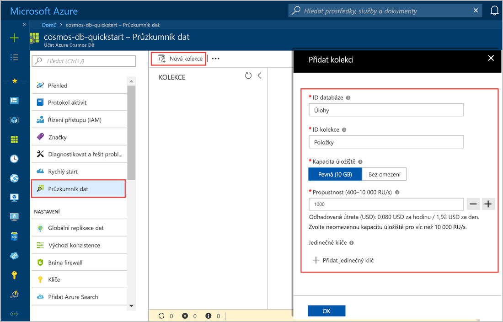

Můžete teď pomocí nástroje Průzkumník dat na webu Azure Portal k vytvoření databáze a kontejneru. 

1. Vyberte **Průzkumník dat** > **nový kontejner**. 
    
    **Přidat kontejner** úplně vpravo se zobrazí oblast, budete možná muset posunout doprava a prohlédněte si ho.

    

2. V **přidat kontejner** zadejte nastavení pro nový kontejner.

    |Nastavení|Navrhovaná hodnota|Popis
    |---|---|---|
    |**ID databáze**|Úlohy|Zadejte *ToDoList* jako název nové databáze. Názvy databází musí mít délku 1 až 255 znaků a nesmí obsahovat `/, \\, #, ?`, ani koncové mezery. Zkontrolujte **propustnosti zřídit databáze** možnost, umožňuje sdílet propustnosti zřízené do databáze ve všech kontejnerů v databázi. Tato možnost pomáhá také úspory nákladů. |
    |**Propustnost**|400|Ponechte propustnost na 400 jednotek žádostí za sekundu (RU/s). Pokud budete chtít snížit latenci, můžete propustnost později navýšit.| 
    |**ID kontejneru**|Položky|Zadejte *položky* jako název pro nový kontejner. Identifikátory kontejnerů mají stejné požadavky na znaky jako názvy databází.|
    |**Klíč oddílu**| /kategorie| Ukázku popsanou v tomto článku používá */category* jako klíč oddílu.|
    
    Kromě předchozích nastavení, můžete volitelně přidat **jedinečné klíče** pro kontejner. V tomto příkladu ponecháme toto pole prázdné. Jedinečné klíče umožňují vývojářům přidat do databáze vrstvu integrity dat. Vytvořením zásady jedinečného klíče při vytváření kontejneru zajistíte jedinečnost jedné nebo více hodnot pro klíč oddílu. Další informace najdete v článku [Jedinečné klíče ve službě Azure Cosmos DB](../articles/cosmos-db/unique-keys.md).
    
    Vyberte **OK**. Průzkumník dat zobrazí novou databázi a kontejner.