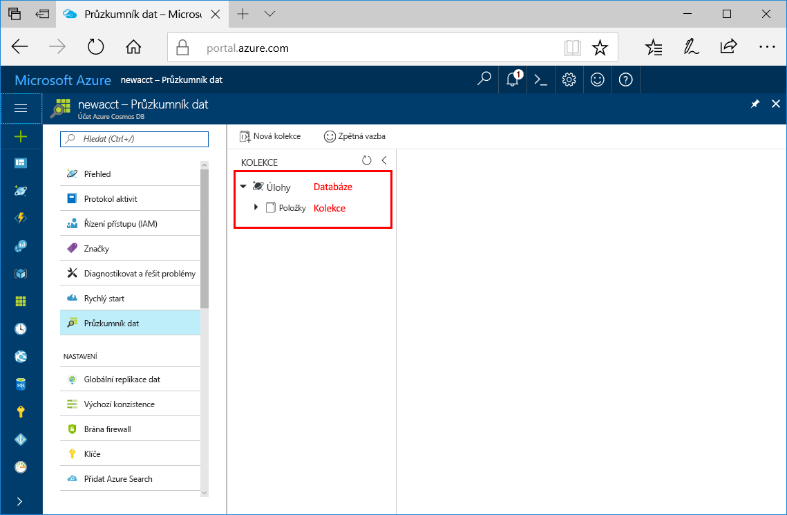

Teď můžete pomocí nástroje Průzkumník dat na webu Azure Portal vytvořit databázi a kolekci. 

1. Klikněte na **Průzkumník dat** > **Nová kolekce**. 
    
    Úplně vpravo se zobrazí oblast **Přidat kolekci**. Pokud ji nevidíte, možná se budete muset posunout doprava.

    

2. Na stránce **Přidat kolekci** zadejte nastavení pro novou kolekci.

    Nastavení|Navrhovaná hodnota|Popis
    ---|---|---
    ID databáze|Úlohy|Jako název nové databáze zadejte *Tasks*. Názvy databází musí mít délku 1 až 255 znaků a nesmí obsahovat `/, \\, #, ?`, ani koncové mezery.
    ID kolekce|Items|Jako název nové kolekce zadejte *Items*. ID kolekcí mají stejné požadavky na znaky jako názvy databází.
    Klíč oddílu| `<Your partition key>`| Zadejte klíč oddílu, jako například */UserId*.
    Propustnost|400 RU|Změňte propustnost na 400 jednotek žádostí za sekundu (RU/s). Pokud budete chtít snížit latenci, můžete propustnost později navýšit. 
    
    Kromě předchozích nastavení můžete pro kolekci volitelně přidat **Jedinečné klíče**. V tomto příkladu ponecháme toto pole prázdné. Jedinečné klíče umožňují vývojářům přidat do databáze vrstvu integrity dat. Vytvořením zásady jedinečného klíče při vytváření kolekce zajistíte jedinečnost jedné nebo více hodnot pro každý klíč oddílu. Další informace najdete v článku [Jedinečné klíče ve službě Azure Cosmos DB](../articles/cosmos-db/unique-keys.md).
    
    Klikněte na **OK**.

    Průzkumník dat zobrazí novou databázi a kolekci.

    