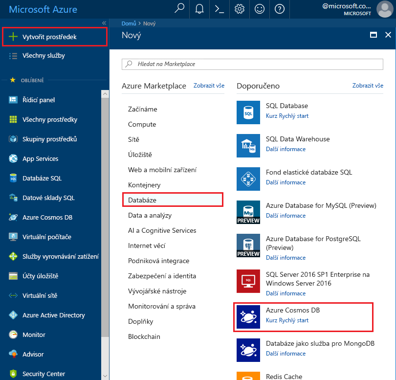
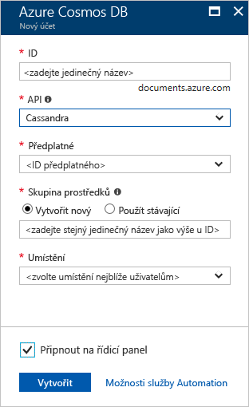

1. V novém okně prohlížeče se přihlaste k webu [Azure Portal](https://portal.azure.com/).

2. V nabídce vlevo vyberte **vytvořit prostředek**.
   
   
   
3. Na stránce **Nový** vyberte **databáze**  >  **Azure Cosmos DB**.
   
   
   
3. Na stránce **vytvořit Azure Cosmos DB účet** zadejte nastavení pro nový účet Azure Cosmos DB. 
 
    Nastavení|Hodnota|Popis
    ---|---|---
    Předplatné|Vaše předplatné|Vyberte předplatné Azure, které chcete pro tento účet služby Azure Cosmos DB použít. 
    Skupina prostředků|Vytvořit nový  Pak zadejte stejný název jako název účtu.|Vyberte, že chcete **vytvořit novou** IP adresu. Pak zadejte nový název skupiny prostředků pro váš účet. Pro jednoduchost použijte stejný název jako název vašeho účtu Azure Cosmos. 
    Account Name|Zadejte jedinečný název.|Zadejte jedinečný název, který identifikuje váš účet služby Azure Cosmos DB. Identifikátor URI vašeho účtu se *Cassandra.Cosmos.Azure.com* připojí k jedinečnému názvu účtu.  Název účtu může obsahovat jenom malá písmena, číslice a spojovníky (-) a musí mít délku 3 až 31 znaků.
    Rozhraní API|Cassandra|Rozhraní API určuje typ účtu, který se má vytvořit. Azure Cosmos DB poskytuje pět rozhraní API: Core (SQL) pro databáze dokumentů, Gremlin pro databáze grafů, MongoDB pro databáze dokumentů, tabulku Azure a Cassandra. Pro každé rozhraní API musíte vytvořit samostatný účet.   Vyberte **Cassandra**, protože v tomto rychlém startu vytváříte tabulku, která spolupracuje s rozhraní API Cassandra.   [Další informace o rozhraní API Cassandra](../articles/cosmos-db/cassandra-introduction.md)|
    Umístění|Vyberte oblast nejbližší vašim uživatelům.|Vyberte zeměpisné umístění, ve kterém chcete účet služby Azure Cosmos DB hostovat. Použijte umístění, které je vašim uživatelům nejbližší, abyste jim zajistili nejrychlejší přístup k datům.
    Režim kapacity|Zřízená propustnost nebo bez serveru|Vyberte **zřízenou propustnost** a vytvořte účet v režimu [zřízené propustnosti](../articles/cosmos-db/set-throughput.md) . Pokud chcete vytvořit účet v režimu bez [serveru](../articles/cosmos-db/serverless.md) , vyberte možnost bez **serveru** .

    Vyberte **zkontrolovat + vytvořit**. Oddíl **sítě**, **zálohování**, **šifrování** a **značky** můžete přeskočit. 

    

4. Vytvoření účtu trvá několik minut. Počkejte, až se na portálu zobrazí stránka s názory na **Blahopřejeme! Váš účet Azure Cosmos DB byl vytvořen**.

