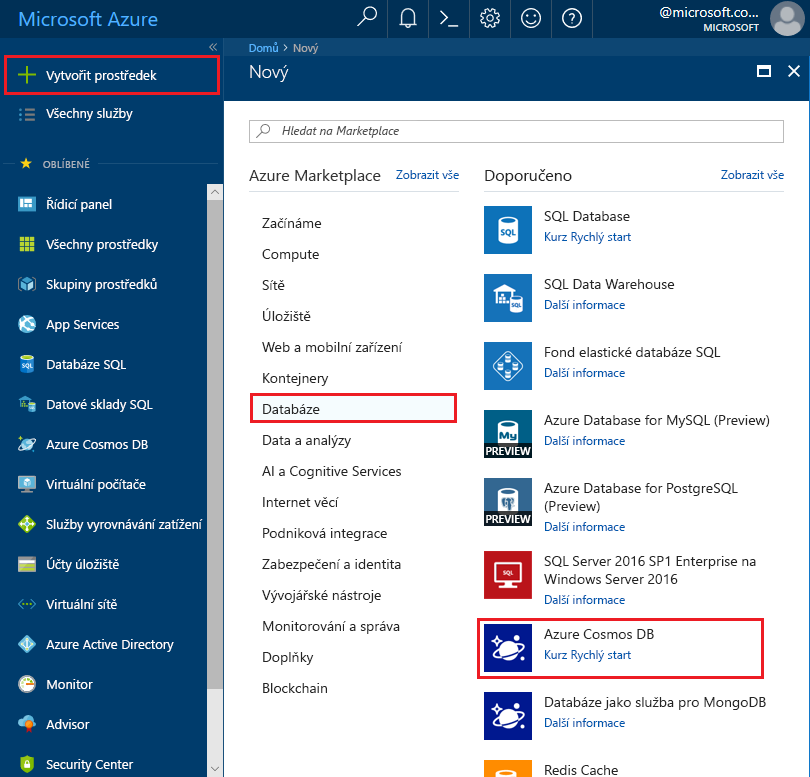
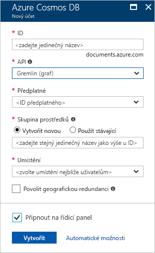
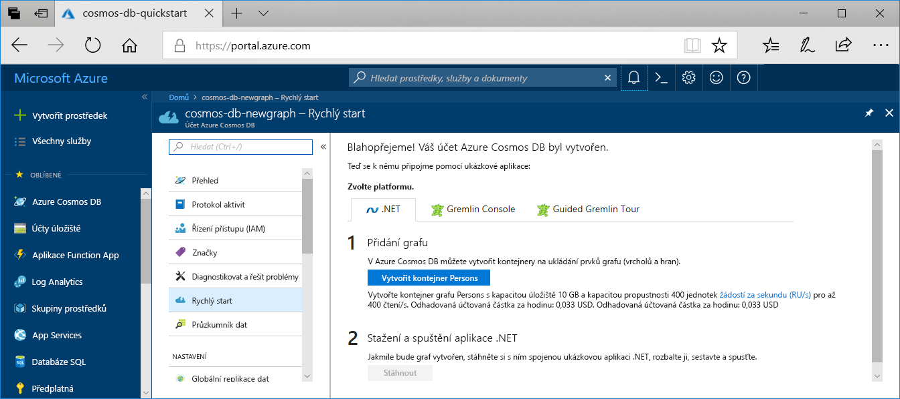

1. V novém okně prohlížeče se přihlaste k webu [Azure Portal](https://portal.azure.com/).

2. Klikněte na **Vytvořit prostředek** > **Databáze** > **Azure Cosmos DB**.
   
   

3. Na stránce **Nový účet** zadejte nastavení nového účtu služby Azure Cosmos DB. 

    Nastavení|Navrhovaná hodnota|Popis
    ---|---|---
    ID|*Zadejte jedinečný název*|Zadejte jedinečný název, který identifikuje tento účet služby Azure Cosmos DB. Jelikož je řetězec *documents.azure.com* připojený k ID, které poskytnete k vytvoření identifikátoru URI, použijte jedinečné, ale snadno rozpoznatelné ID.  Toto ID může obsahovat pouze malá písmena, číslice a znak spojovníku (-) a musí se skládat ze 3 až 50 znaků.
    Rozhraní API|Gremlin (graf)|Rozhraní API určuje typ účtu, který se má vytvořit. Azure Cosmos DB poskytuje pro splnění požadavků vaší aplikace pět rozhraní API: SQL (databáze dokumentů), Gremlin (databáze grafu), MongoDB (databáze dokumentů), Tabulka Azure a Cassandra, z nichž každé v současné době vyžaduje samostatný účet.   Vyberte **Gremlin (grafu)** vzhledem k tomu, že v tento rychlý start vytváříte graf, který je dotazovatelný pomocí syntaxe Gremlin.  [Další informace o rozhraní Graph API](../articles/cosmos-db/graph-introduction.md)
    Předplatné|*Vaše předplatné*|Vyberte předplatné Azure, které chcete pro tento účet služby Azure Cosmos DB použít. 
    Skupina prostředků|Vytvořit nový  *Pak zadejte stejnou jedinečný název, který výše uvedeného v ID*|Vyberte **vytvořit nový**, pak zadejte nový název skupiny prostředků pro váš účet. V zájmu jednoduchosti můžete použít název, který se shoduje s vaším ID.
    Umístění|*Vyberte oblast nejbližší vašim uživatelům*|Vyberte zeměpisné umístění, ve kterém chcete účet služby Azure Cosmos DB hostovat. Použijte umístění, které je vašim uživatelům nejbližší, abyste jim zajistili nejrychlejší přístup k datům.
    Povolit geografickou redundanci| Ponechte prázdné | Tím se vytvoří replikovaná verze vaší databáze ve druhé (spárované) oblasti. Ponechte toto nastavení prázdné.  
    Připnutí na řídicí panel | Vyberte | Zaškrtněte toto políčko, aby se váš nový účet databáze přidal na řídicí panel portálu, kde k němu budete mít snadný přístup.

    Poté klikněte na **Vytvořit**.

    

4. Vytvoření účtu trvá několik minut. Počkejte na portálu pro zobrazení **Blahopřejeme! Byl vytvořen účet Azure Cosmos DB** stránky.

    