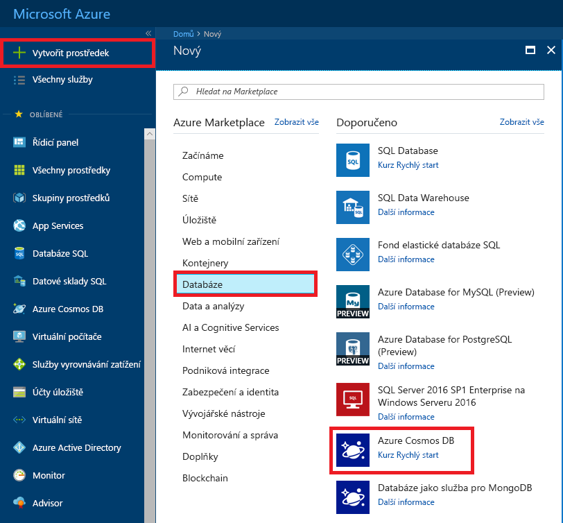
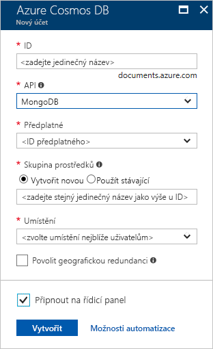
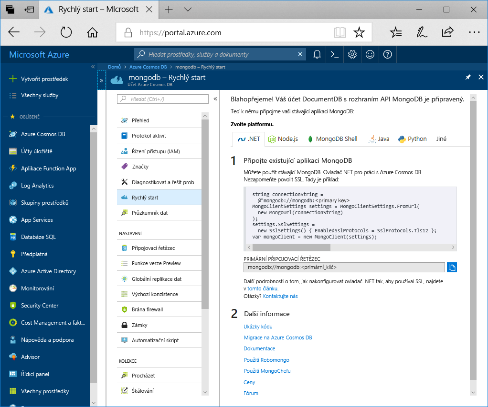

1. V novém okně se přihlaste k webu [Azure Portal](https://portal.azure.com/).
2. V levé nabídce klikněte na **Vytvořit prostředek**, pak na **Databáze** a nakonec v části **Azure Cosmos DB** klikněte na **Vytvořit**.
   
   

3. V okně **Nový účet** určete jako rozhraní API možnost **MongoDB** a zadejte požadovanou konfiguraci účtu Azure Cosmos DB.
 
    * **ID** musí být jedinečný název, který chcete používat k identifikaci svého účtu Azure Cosmos DB. Může obsahovat pouze malá písmena, číslice a znak spojovníku (-) a musí se skládat ze 3 až 50 znaků.
    * **Předplatné** je vaše předplatné Azure. Portál ho doplní za vás.
    * **Skupina prostředků** je název skupiny prostředků pro váš účet Azure Cosmos DB. Vyberte**Vytvořit nový** a zadejte název nové skupiny prostředků pro váš účet. V zájmu jednoduchosti můžete použít název, který se shoduje s vaším ID.
    * **Umístění** je zeměpisná poloha, kde se nachází vaše instance Azure Cosmos DB. Zvolte polohu co nejblíž vašim uživatelům.

    Poté klikněte na **Vytvořit**.

    

4. Vytvoření účtu trvá několik minut. Počkejte, až portál zobrazí zprávu **Blahopřejeme! Váš účet služby Azure Cosmos DB s rozhraním MongoDB API je připraven**.

    
