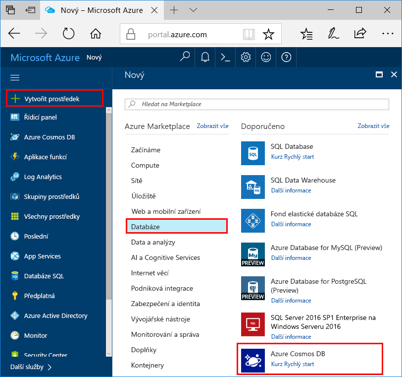
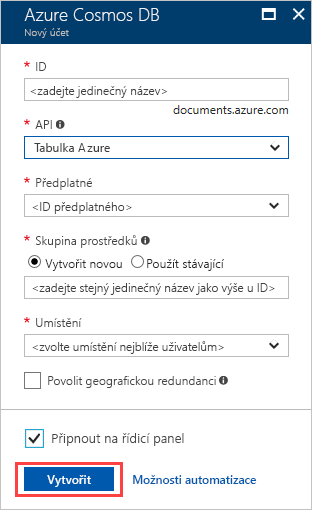
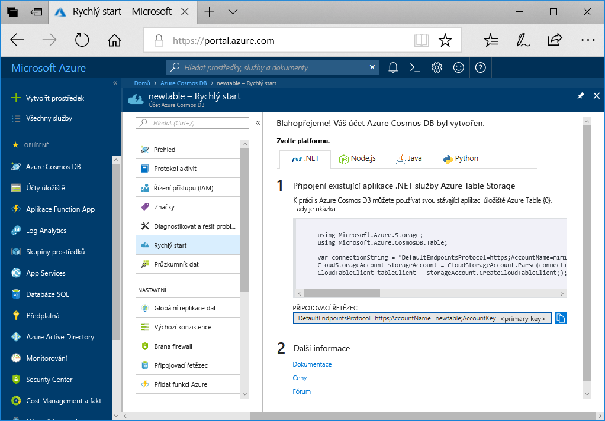

1. V novém okně prohlížeče se přihlaste k webu [Azure Portal](https://portal.azure.com/).
2. V levém navigačním podokně vyberte **vytvořit prostředek**. Vyberte **databází** a pak vyberte **služby Azure Cosmos DB**.
   
   

3. Na **vytvořit účet služby Azure Cosmos DB** zadejte nastavení pro nový účet Azure Cosmos DB:
 
    Nastavení|Hodnota|Popis
    ---|---|---
    Předplatné|Vaše předplatné|Vyberte předplatné Azure, které chcete pro tento účet služby Azure Cosmos DB použít. 
    Skupina prostředků|Vytvořit nový  Potom zadejte stejný jedinečný název, jako jste zadali v ID|Vyberte, že chcete **vytvořit novou** IP adresu. Zadejte nový název skupiny prostředků pro váš účet. Pro jednoduchost použijte stejný název jako vaše ID. 
    Název účtu|Zadejte jedinečný název.|Zadejte jedinečný název, který identifikuje váš účet služby Azure Cosmos DB.  ID můžete použít jenom malá písmena, číslice a znak spojovníku (-). Musí být dlouhý 3 až 31 znaků.
    Rozhraní API|Tabulka Azure|Rozhraní API určuje typ účtu, který se má vytvořit. Azure Cosmos DB nabízí pět rozhraní API: Core(SQL) pro databáze dokumentů, Gremlin databáze grafů, MongoDB, databáze dokumentů, tabulka Azure a Cassandra. V současné době musíte vytvořit samostatný účet pro každé rozhraní API.   Vyberte **Azure Table** vzhledem k tomu, že v tomto rychlém startu vytváříte tabulku pracující s rozhraním Table API.   [Další informace o rozhraní Table API](../articles/cosmos-db/table-introduction.md).|
    Location|Vyberte oblast nejbližší vašim uživatelům.|Vyberte zeměpisné umístění, ve kterém chcete účet služby Azure Cosmos DB hostovat. Použijte umístění co nejblíže vašim uživatelům jim zajistili nejrychlejší přístup k datům.

    Můžete nechat **geografickou redundancí** a **zapíše více oblastí** možnosti výchozí hodnoty (**zakázat**) se vyhnout poplatkům za další RU. Můžete přeskočit **sítě** a **značky** oddíly.

5. Vyberte **zkontrolovat a vytvořit**. Po dokončení ověřování vyberte **vytvořit** k vytvoření účtu. 
 
   

6. Trvá několik minut pro vytvoření účtu. Zobrazí se vám zobrazí zpráva **nasazení probíhá**. Počkejte na dokončení a potom vyberte nasazení **přejít k prostředku**.

    
