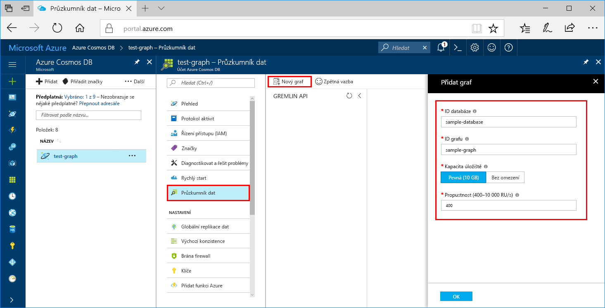

Teď můžete pomocí nástroje Průzkumník dat na webu Azure Portal vytvořit databázi grafu. 

1. Vyberte **Průzkumník dat**  >  **Nový graf**.

    Úplně vpravo se zobrazí oblast **Přidat graf**. Pokud ji nevidíte, možná se budete muset posunout doprava.

    

2. Na stránce **Přidat graf** zadejte nastavení pro nový graf.

    Nastavení|Navrhovaná hodnota|Popis
    ---|---|---
    ID databáze|sample-database|Jako název nové databáze zadejte *sample-database*. Názvy databází musí mít délku 1 až 255 znaků a nesmí obsahovat znaky `/ \ # ?` ani koncové mezery.
    Propustnost|400 RU/s|Změňte propustnost na 400 jednotek žádostí za sekundu (RU/s). Pokud budete chtít snížit latenci, můžete propustnost později navýšit.
    ID grafu|sample-graph|Jako název nové kolekce zadejte *sample-graph*. U názvů grafů platí stejné požadavky na znaky jako u ID databází.
    Partition Key (Klíč oddílu)| /pk |Všechny účty Cosmos DB potřebují ke horizontálnímu škálování klíč oddílu. Naučte se, jak vybrat vhodný klíč oddílu v [článku vytváření oddílů dat grafu](https://docs.microsoft.com/azure/cosmos-db/graph-partitioning).

3. Po vyplnění formuláře vyberte **OK**.
