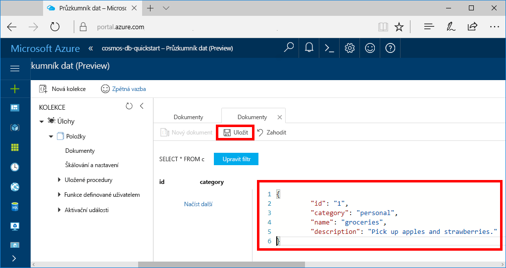

Teď můžete do nové kolekce přidávat data pomocí Průzkumníka dat.

1. V Průzkumníku dat se nová databáze zobrazí v podokně Kolekce. Rozbalte databázi **Tasks**, rozbalte kolekci **Items**, klikněte na **Dokumenty** a potom klikněte na **Nové dokumenty**. 

   
  
2. Teď do kolekce přidejte dokument s následující strukturou.

     ```json
     {
         "id": "1",
         "category": "personal",
         "name": "groceries",
         "description": "Pick up apples and strawberries.",
         "isComplete": false
     }
     ```

3. Po přidání formátu json na kartu **Dokumenty** klikněte na **Uložit**.

    

4.  Vytvořte a uložte ještě jeden dokument, ve kterém vložíte jedinečnou hodnotu pro vlastnost `id` a změníte ostatní vlastnosti podle svých potřeb. Nové dokumenty můžou mít jakoukoli strukturu, protože Azure Cosmos DB neuplatňuje pro data žádné schéma.