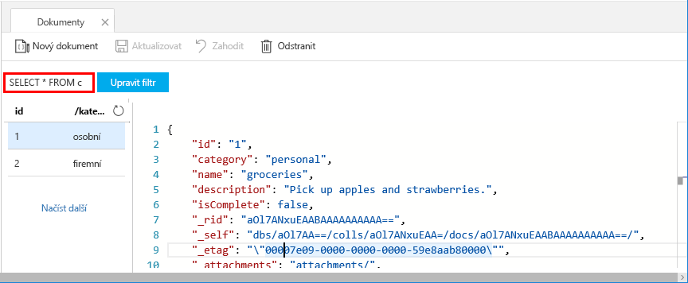
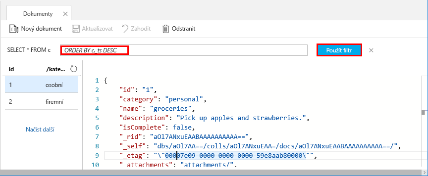

Teď můžete k načítání a filtrování dat používat dotazy v Průzkumníku dat.

1. Všimněte si, že ve výchozím nastavení je dotaz nastavený na `SELECT * FROM c`. Tento výchozí dotaz načte a zobrazí všechny dokumenty v kolekci. 

    

2. Zůstaňte na kartě **Dokumenty** a změňte dotaz tak, že kliknete na tlačítko **Upravit filtr**, do pole predikátu dotazu přidáte `ORDER BY c._ts DESC` a kliknete na **Použít filtr**.

    

Tento upravený dotaz vypíše dokumenty v sestupném pořadí na základě jejich časového razítka, takže teď je jako první uvedený váš druhý dokument. Pokud jste obeznámeni se syntaxí jazyka SQL, můžete do tohoto pole zadat jakýkoli z podporovaných [příkazů jazyka SQL](../articles/cosmos-db/sql-api-sql-query.md). 

Tím končí naše práce v Průzkumníku dat. Než se přesuneme k práci s kódem, upozorňujeme, že Průzkumník dat můžete použít také k vytváření uložených procedur, funkcí UDF a triggerů pro provádění obchodní logiky na straně serveru a také škálování propustnosti. Průzkumník dat zpřístupní všechna integrovaná programová data v rozhraních API, ale zajistí jednoduchý přístup k vašim datům na portálu Azure Portal.