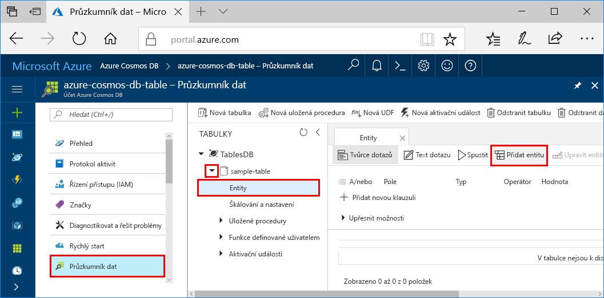
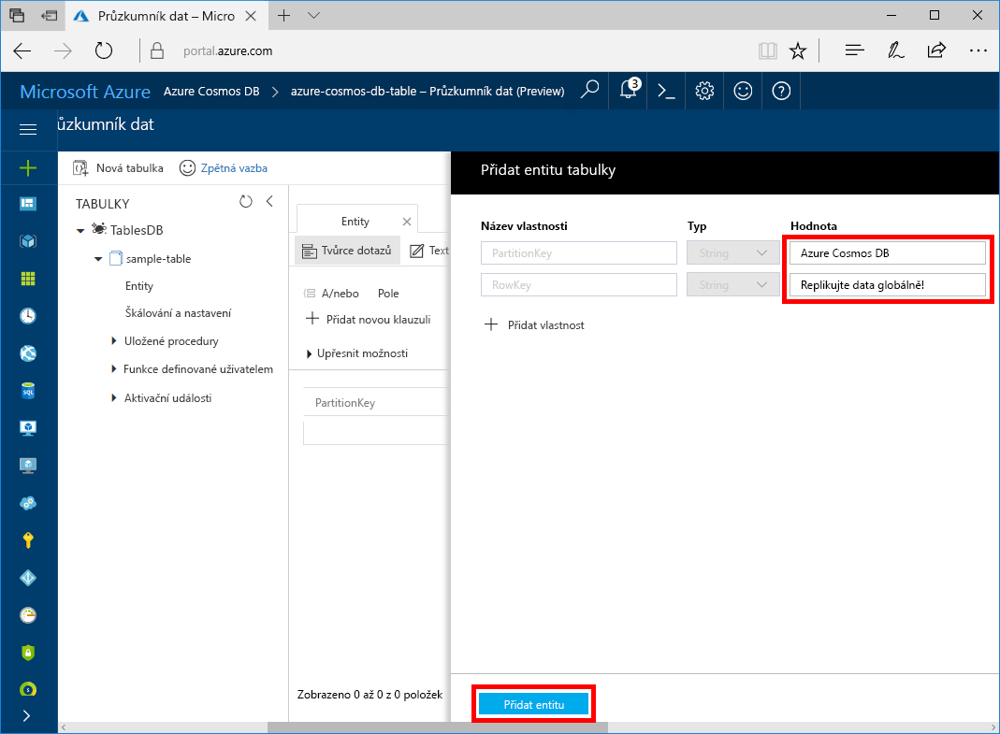

Teď můžete přidávat do nové tabulky data pomocí Průzkumníku dat.

1. V Průzkumník dat rozbalte položku **Ukázka-Table**, vyberte **entity**a pak vyberte **Přidat entitu**.

   

2. Nyní přidejte data do pole hodnota PartitionKey a do pole hodnota RowKey a vyberte **Přidat entitu**.

   
  
    Teď můžete přidat další entity do tabulky, upravit si entity nebo zadat dotazy na data v Průzkumníku dat. V Průzkumníku dat také můžete škálovat propustnost a přidat do tabulky uložené procedury, uživatelsky definované funkce a aktivační události.