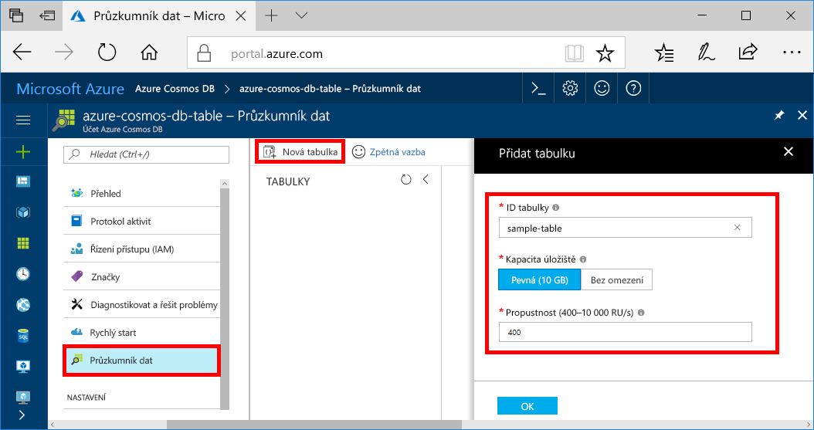
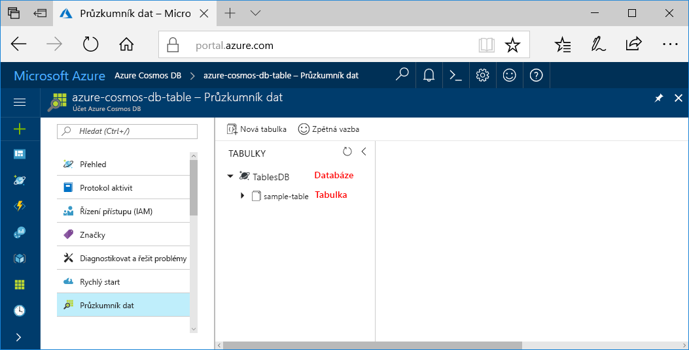

Teď můžete pomocí nástroje Průzkumník dat na webu Azure Portal vytvořit databázi a tabulku. 

1. Klikněte na **Průzkumník dat** > **Nová tabulka**. 
    
    Úplně vpravo se zobrazí oblast **Přidat tabulku**. Pokud ji nevidíte, možná se budete muset posunout doprava.

    

2. Na stránce **Přidat tabulku** zadejte nastavení pro novou tabulku.

    Nastavení|Navrhovaná hodnota|Popis
    ---|---|---
    ID tabulky|sample-table|ID vaší nové tabulky. Názvy tabulek mají stejné požadavky na znaky jako ID databází. Názvy databází musí mít délku 1 až 255 znaků a nesmí obsahovat znaky `/ \ # ?` ani koncové mezery.
    Kapacita úložiště| Pevná (10 GB)|Použijte výchozí hodnotu **Pevná (10 GB)**. Tato hodnota je kapacita úložiště databáze.
    Propustnost|400 RU/s|Změňte propustnost na 400 jednotek žádostí za sekundu (RU/s). Pokud budete chtít snížit latenci, můžete propustnost později navýšit.

    Klikněte na **OK**.

    Průzkumník dat zobrazí novou databázi a tabulku.

    