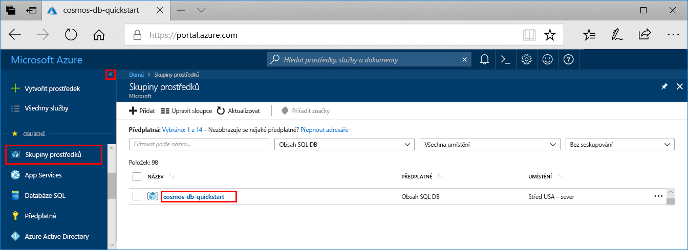
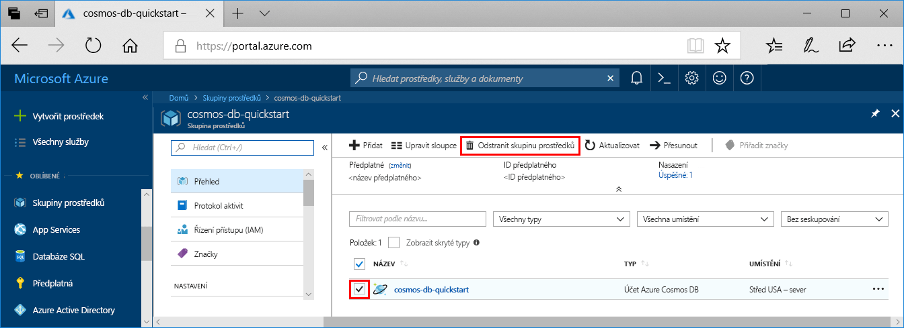

Pokud nebudete tuto aplikace nadále používat, odstraňte na základě následujícího postupu všechny prostředky vytvořené podle tohoto rychlého startu, aby se vám neúčtovaly žádné poplatky:

1. Úplně nalevo na webu Azure Portal vyberte **Skupiny prostředků** a pak vyberte skupinu prostředků, kterou jste vytvořili.  

    Pokud je nabídka vlevo sbalená, kliknutím na  ji rozbalte.

   

2. V novém okně vyberte skupinu prostředků a klikněte na **Odstranit skupinu prostředků**.

      

3. V novém okně zadejte název skupiny prostředků, kterou chcete odstranit, a pak klikněte na **Odstranit**.

