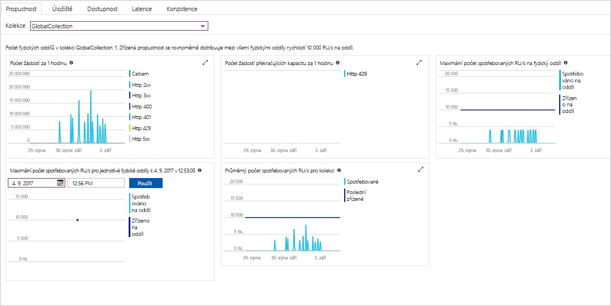

Propustnost, úložiště, dostupnost, latence a konzistence prostředků ve vašem účtu se monitorují na webu Azure Portal. Pojďme se na tyto metriky v rychlosti podívat. 

1. V navigační nabídce klikněte na **Metriky**.

   

2. Klikněte postupně na všechny karty, abyste zjistili, jaké metriky služba Azure Cosmos DB nabízí. 

    Každý graf přidružený ke [smlouvám SLA pro Azure Cosmos DB](https://azure.microsoft.com/support/legal/sla/cosmos-db/) obsahuje řádek, který ukazuje, jestli nedošlo k porušení některé ze smluv SLA. Azure Cosmos DB prostřednictvím této sady metrik zajišťuje transparentní monitorování vašich smluv SLA. 

   