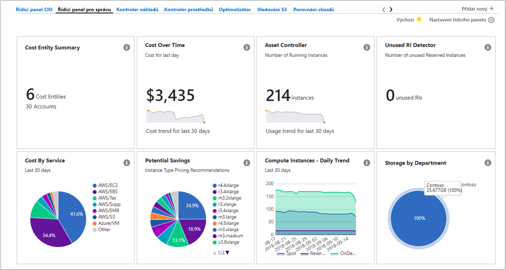
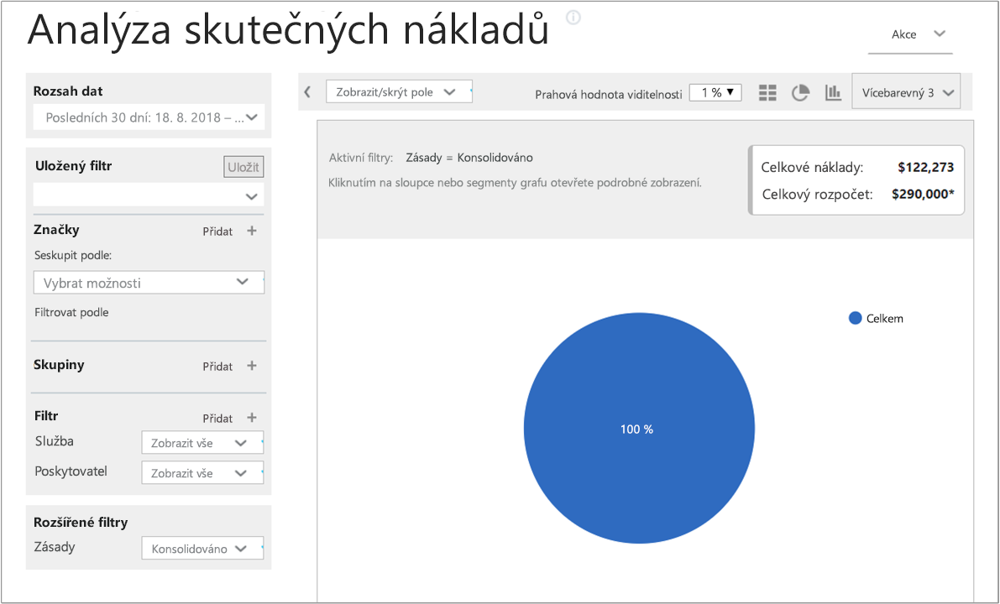
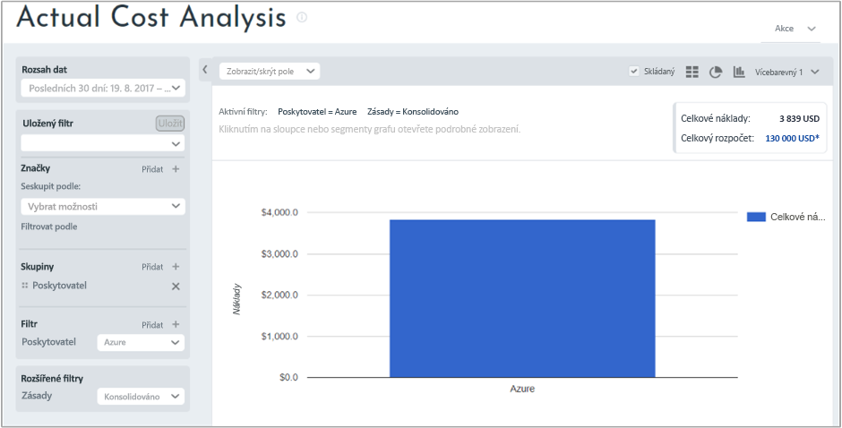
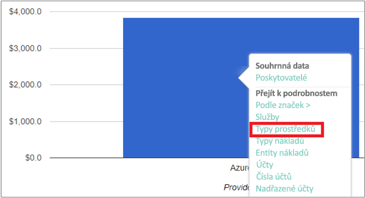
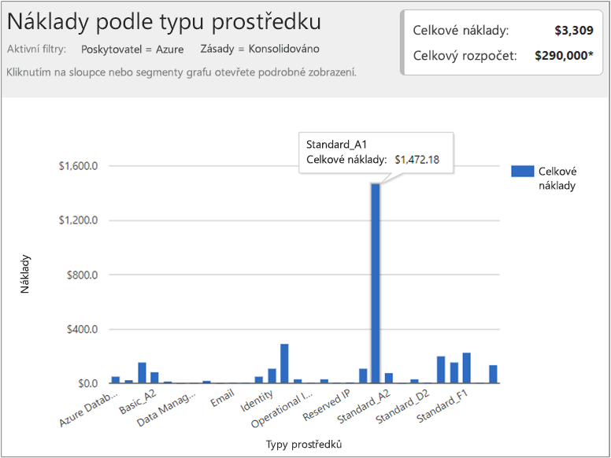

## Zobrazení informací o nákladech

Azure Cost Management by Cloudyn poskytuje přístup ke všem datům cloudových prostředků. V sestavách řídicího panelu najdete standardní i vlastní sestavy v zobrazení se záložkami. Následují příklady oblíbeného řídicího panelu a sestavy, která ukazuje okamžité informace o vašich nákladech.

V tomto příkladu řídicí panel správy ukazuje souhrnné náklady firmy Contoso napříč všemi jejími cloudovými prostředky. Contoso používá Azure, AWS a Google. Řídicí panely poskytují okamžité informace a představují rychlý způsob přechodu k sestavám.  

Pokud si nejste jisti účelem sestavy na řídicím panelu a chcete zobrazit vysvětlení, najeďte myší na symbol **i**. Kliknutím na jakoukoli sestavu na řídicím panelu zobrazíte úplnou sestavu.

Sestavy můžete zobrazit také pomocí nabídky sestav v horní části portálu. Podívejme se na náklady společnosti Contoso na prostředky Azure za posledních 30 dnů. Klikněte na **Costs** (Náklady) > **Cost Analysis** (Analýza nákladů) > **Actual Cost Analysis** (Analýza skutečných nákladů). Pokud jsou ve vaší sestavě nastavené nějaké hodnoty pro značky, skupiny nebo filtry, vymažte je.

V tomto příkladu jsou celkové náklady 122 273 USD a rozpočet je 290 000 USD.

Nyní upravíme formát sestavy a nastavíme skupiny a filtry, abychom omezili výsledky na náklady na Azure. Nastavte **Date Range** (Rozsah dat) na posledních 30 dnů. Kliknutím na symbol sloupce vpravo nahoře nastavte formát na pruhový graf a v části Skupiny vyberte **Provider** (Poskytovatel). Potom nastavte filtr **Provider** (Poskytovatel) na **Azure**.

V tomto příkladu byly celkové náklady na prostředky Azure za posledních 30 dnů 3 309 USD.

Klikněte pravým tlačítkem na pruh Provider (Azure) a rozbalte **Resource types** (Typy prostředků).

Následující obrázek ukazuje náklady na prostředky Azure účtované společnosti Contoso. Celkové náklady byly 3 309 USD. V tomto příkladu připadala přibližně polovina nákladů na virtuální počítače Standard_A1 a druhá polovina nákladů na různé služby Azure a instance virtuálních počítačů.

Klikněte pravým tlačítkem na typ prostředku a výběrem možnosti **Cost entities** (Entity nákladů) zobrazte entity nákladů a služby, které spotřebovaly tyto prostředky. Na následujícím obrázku je místně redundantní úložiště nastavené jako typ Prostředek. Contoso|Azure/úložiště spotřebovalo 15,65 USD. Technické zabezpečení| Azure Storage spotřebovalo 164,25 USD. Sdílená infrastruktura | Azure/úložiště spotřebovalo 116,58 USD. Celkové náklady za služby jsou 296 USD.

Pokud chcete zhlédnout videokurz k zobrazení informací o fakturaci cloudu, podívejte se na video [Analyzing your cloud billing data with Azure Cost Management by Cloudyn](https://youtu.be/G0pvI3iLH-Y) (Analýza informací o fakturaci cloudu pomocí služby Azure Cost Management by Cloudyn).
