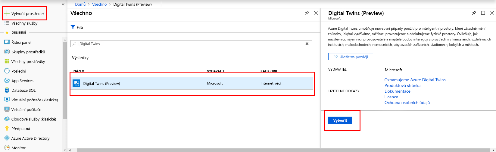
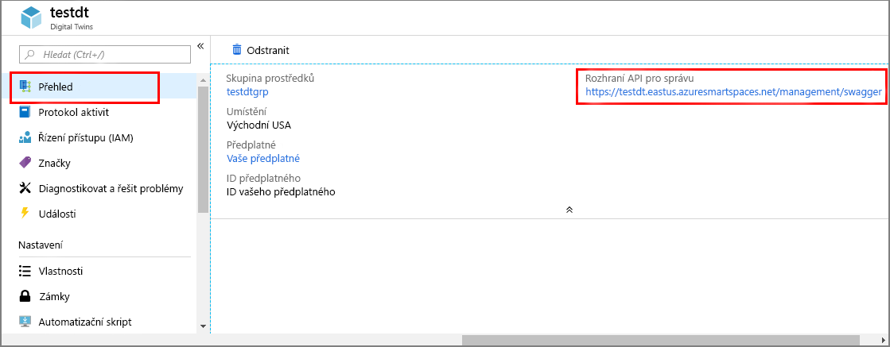

1. Přihlaste se k webu [Azure Portal](http://portal.azure.com).

1. V navigačním podokně na levé straně klikněte na **Vytvořit prostředek**. Vyhledejte *digital twins* a vyberte **Digital Twins (Preview)**. Kliknutím na **Vytvořit** zahájíte proces nasazení.

    

1. V podokně **Digital Twins** zadejte následující informace:
   * **Název prostředku:** Vytvořte jedinečný název vaší instance služby Digital Twins.
   * **Předplatné:** Vyberte předplatné, které chcete použít k vytvoření této instance služby Digital Twins. 
   * **Skupina prostředků:** Vyberte nebo vytvořte [skupinu prostředků](https://docs.microsoft.com/azure/azure-resource-manager/resource-group-overview#resource-groups) pro instanci služby Digital Twins.
   * **Umístění:** Vyberte pro zařízení nejbližší umístění.

    

1. Zkontrolujte informace o službě Digital Twins a pak klikněte na **Vytvořit**. Vytvoření instance služby Digital Twins může trvat několik minut. Průběh můžete sledovat v podokně **Oznámení**.

1. Otevřete podokno **Přehled** vaší instance služby Digital Twins. Všimněte si odkazu uvedeného v části **Rozhraní API pro správu**.

    1. Adresa URL **rozhraní API pro správu** má tento formát: **_https://yourDigitalTwinsName.yourLocation.azuresmartspaces.net/management/swagger_**. Tato adresa URL vás přesměruje na dokumentaci k rozhraní REST API služby Azure Digital Twins odpovídající vaší instanci. Informace o tom, jak číst a používat tuto dokumentaci k rozhraní API, najdete v článku [Jak používat Swagger pro službu Azure Digital Twins](../articles/digital-twins/how-to-use-swagger.md).

    1. Upravte adresu URL **rozhraní API pro správu** do tohoto formátu: **_https://yourDigitalTwinsName.yourLocation.azuresmartspaces.net/management/api/v1.0/_**. Vaše aplikace bude tuto upravenou adresu URL používat jako základní adresu URL pro přístup k vaší instanci. Zkopírujte tuto upravenou adresu URL do dočasného souboru. Budete ji potřebovat v následující části.

    