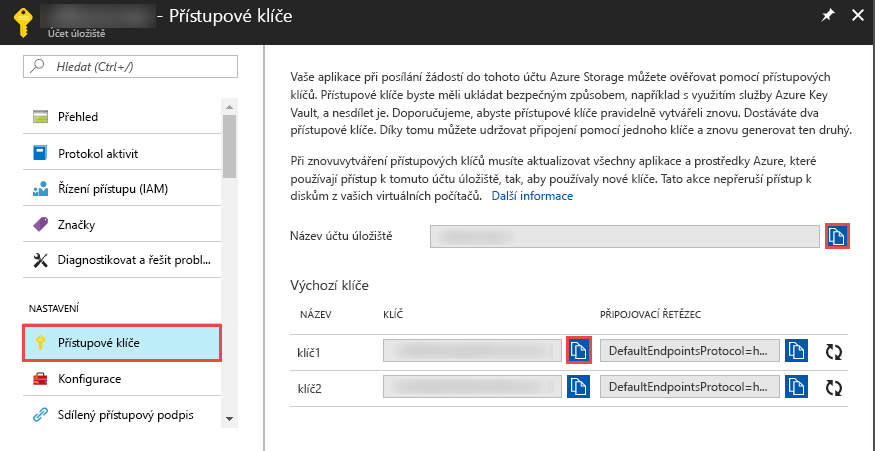

## <a name="prerequisites"></a>Požadavky

### <a name="azure-subscription"></a>Předplatné Azure
Pokud ještě nemáte předplatné Azure, vytvořte si [bezplatný účet](https://azure.microsoft.com/free/) před tím, než začnete.

### <a name="azure-roles"></a>Role Azure
Pro vytvoření instancí služby Data Factory musí být uživatelský účet, který použijete pro přihlášení k Azure, členem role *přispěvatel* nebo *vlastník* nebo *správcem* předplatného Azure. Pokud chcete zobrazit oprávnění, která máte v rámci předplatného, klikněte na [Azure Portal](https://portal.azure.com), v pravém horním rohu vyberte své uživatelské jméno, vyberte **Další možnosti** (...) a pak vyberte **Moje oprávnění**. Pokud máte přístup k několika předplatným, vyberte odpovídající předplatné.

Při vytváření a správě podřízených prostředků pro službu Data Factory, včetně datových sad, propojených služeb, kanálů, triggerů a prostředí Integration Runtime, platí následující požadavky:

- Pokud chcete vytvářet a spravovat podřízené prostředky na webu Azure Portal, je potřeba, abyste patřili do role **Přispěvatel Data Factory** na úrovni skupiny prostředků nebo vyšší.
- Pro vytváření a správu podřízených prostředků pomocí PowerShellu nebo sady SDK na úrovni prostředku nebo vyšší je dostatečná role **Přispěvatel**.

Ukázku pokynů pro přidání uživatele do role najdete v článku věnovaném [přidávání rolí](../articles/billing/billing-add-change-azure-subscription-administrator.md).

Další informace najdete v následujících článcích:

- [Role Přispěvatel Data Factory](../articles/role-based-access-control/built-in-roles.md#data-factory-contributor)
- [Role a oprávnění pro službu Azure Data Factory](../articles/data-factory/concepts-roles-permissions.md)

### <a name="azure-storage-account"></a>Účet služby Azure Storage
V tomto rychlém startu budete účet úložiště Azure (konkrétně úložiště objektů blob) pro obecné účely používat jako *zdrojové* i *cílové úložiště dat*. Pokud nemáte účet úložiště Azure pro obecné účely, přečtěte si téma [Vytvoření účtu úložiště](../articles/storage/common/storage-quickstart-create-account.md) a účet si vytvořte. 

#### <a name="get-the-storage-account-name-and-account-key"></a>Získání názvu a klíče účtu úložiště
V tomto rychlém startu budete potřebovat název a klíč svého účtu úložiště Azure. Následující postup předvádí kroky k získání názvu a klíče vašeho účtu úložiště. 

1. Ve webovém prohlížeči přejdete na [Azure Portal](https://portal.azure.com) a přihlaste se pomocí uživatelského jména a hesla Azure.
2. Vyberte **všechny služby** > **úložiště** > **účty úložiště**.
3. Na stránce **účty úložiště** vyfiltrujte váš účet úložiště (Pokud je to potřeba) a pak vyberte svůj účet úložiště. 
4.  -      *Napostrannímpanelustránkynázevúčtu>hoúčtuúložištěpřejdětenapopiseknastaveníavybertepřístupovéklíče.\<* Zobrazí se - název  *účtu>přístupové\<* klíče.

   
5. Zkopírujte do schránky hodnoty z polí **Název účtu úložiště** a **klíč1**. Vložte je do Poznámkového bloku nebo jiného editoru a uložte je. Použijete je později v tomto rychlém startu.   

#### <a name="create-a-blob-container"></a>Vytvoření kontejneru objektů blob
V této části vytvoříte v úložišti objektů blob v Azure kontejner objektů blob s názvem **adftutorial**.

1.  -   >  Na bočním panelu stránky  *názevúčtu>přístupovýmiklíčivybertepřehledyobjektůBLOB.\<*
2. Na panelu nástrojů -   *název účtu>objektyblobstránkyvyberte\<* kontejner.
3. V dialogovém okně **Nový kontejner** jako název zadejte **adftutorial** a pak vyberte **OK**. Stránka název -     *účtu>objektyBLOBseaktualizujetak,abyzahrnovalaadftutorialv\<* seznamu kontejnerů.

   

#### <a name="add-an-input-folder-and-file-for-the-blob-container"></a>Přidání vstupní složky a souboru pro kontejner objektů BLOB
V této části vytvoříte složku s názvem **input** v kontejneru, který jste právě vytvořili, a potom nahrajete do vstupní složky ukázkový soubor. Než začnete, otevřete textový editor, jako je například Poznámkový **blok**, a vytvořte soubor s názvem **EMP. txt** s následujícím obsahem:

```emp.txt
John, Doe
Jane, Doe
```

Uložte soubor do složky **C:\ADFv2QuickStartPSH** . (Pokud složka ještě neexistuje, vytvořte ji.) Pak se vraťte do Azure Portal a proveďte následující kroky:

1. Na stránce s -   *názvem účtu>objektyblob,nakterýchjsteskončili,vyberteadftutorialzaktualizovanéhoseznamukontejnerů\<* . (Pokud jste okno zavřeli nebo jste přešli na > jinou stránku, přihlaste se znovu k [Azure Portal](https://portal.azure.com) , vyberte **všechny služby služby** > úložiště**účty**úložiště, vyberte svůj účet úložiště a pak vyberte **objekty blob** . **adftutorial.** )  > 
2. Na panelu nástrojů na stránce kontejneru **adftutorial** vyberte **nahrát**.
3. Na stránce **nahrát objekt BLOB** vyberte pole **soubory** a pak vyhledejte a vyberte soubor **EMP. txt** .
4. Rozbalte nadpis **Upřesnit** . Stránka se teď zobrazí, jak je znázorněno na následujícím obrázku:

   
5. Do pole **Odeslat do složky** zadejte Input ( **vstup**).
6. Vyberte tlačítko **Nahrát**. Měli byste vidět soubor **emp.txt** a stav nahrávání v seznamu.
7. Vyberte ikonu **Zavřít** ( **X**) pro zavření stránky **nahrát objekt BLOB** .

Nechejte stránku kontejneru **adftutorial** otevřenou. Použijete ji k ověření výstupu na konci tohoto rychlého startu.