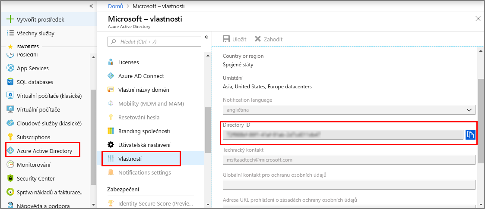
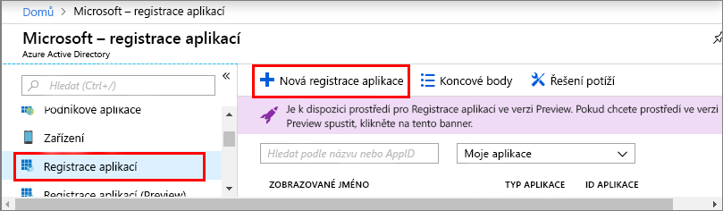
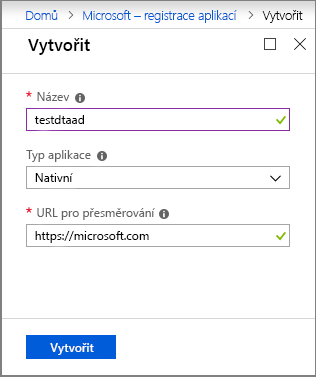
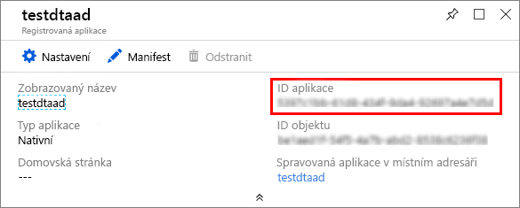

1. V [webu Azure portal](https://portal.azure.com), otevřete **Azure Active Directory** v levém podokně a pak otevřete **vlastnosti** podokně. Do dočasného souboru zkopírujte **ID adresáře**. Tuto hodnotu použijete ke konfiguraci a ukázkové aplikace v další části.

    

1. Otevřít **registrace aplikací** podokně a pak vyberte **registrace nové aplikace** tlačítko.

    

1. Zadejte popisný název pro tuto registraci aplikace v **název** pole. Zvolte **typ aplikace** jako **nativní**, a **identifikátor URI pro přesměrování** jako `https://microsoft.com`. Vyberte **Vytvořit**.

    

1. Otevřete registrovaná aplikace a zkopírujte hodnotu **ID aplikace** pole do dočasného souboru. Tato hodnota identifikuje vaši aplikaci Azure Active Directory. ID aplikace použijete ke konfiguraci ukázkovou aplikaci v následujících částech.

    

1. Otevřete podokno registrace vaší aplikace. Vyberte **nastavení** > **požadovaná oprávnění**a pak:

   a. Vyberte **přidat** v levém horním rohu otevřete **přístup přes rozhraní API přidat** podokně.

   b. Vyberte **vyberte rozhraní API** a vyhledejte **digitální dvojče Azure**. Pokud se vám toto rozhraní API nepodaří najít, vyhledejte místo toho **Azure Smart Spaces**.

   c. Vyberte **digitální dvojče Azure (Azure Service pro inteligentní mezery)** možnost a vyberte **vyberte**.

   d. Zvolte **vyberte oprávnění**. Vyberte **přístup pro čtení a zápis** delegovaná oprávnění zaškrtněte políčko a zvolte **vyberte**.

   e. Vyberte **provádí** v **přístup přes rozhraní API přidat** podokně.

   f. V **požadovaná oprávnění** podokně, vyberte **udělit oprávnění** tlačítko a přijetí potvrzení, které se zobrazí.

      
